# 概要

| IP  | 10.10.11.20 |
| --- | ----------- |


# Enumeration

## nmap

```
# Nmap 7.94SVN scan initiated Sun Jun 16 08:57:17 2024 as: nmap -vv --reason -Pn -T4 -sV -sC --version-all -A --osscan-guess -p- -oN /home/hatto/ctf/HTB/machines/Linux/Easy/Editorial/results/10.10.11.20/scans/_full_tcp_nmap.txt -oX /home/hatto/ctf/HTB/machines/Linux/Easy/Editorial/results/10.10.11.20/scans/xml/_full_tcp_nmap.xml 10.10.11.20
Increasing send delay for 10.10.11.20 from 0 to 5 due to 1284 out of 3209 dropped probes since last increase.
Increasing send delay for 10.10.11.20 from 5 to 10 due to 11 out of 14 dropped probes since last increase.
Warning: 10.10.11.20 giving up on port because retransmission cap hit (6).
Nmap scan report for 10.10.11.20
Host is up, received user-set (0.099s latency).
Scanned at 2024-06-16 08:57:17 JST for 785s
Not shown: 65518 closed tcp ports (reset)
PORT      STATE    SERVICE REASON         VERSION
22/tcp    open     ssh     syn-ack ttl 63 OpenSSH 8.9p1 Ubuntu 3ubuntu0.7 (Ubuntu Linux; protocol 2.0)
| ssh-hostkey: 
|   256 0d:ed:b2:9c:e2:53:fb:d4:c8:c1:19:6e:75:80:d8:64 (ECDSA)
| ecdsa-sha2-nistp256 AAAAE2VjZHNhLXNoYTItbmlzdHAyNTYAAAAIbmlzdHAyNTYAAABBBMApl7gtas1JLYVJ1BwP3Kpc6oXk6sp2JyCHM37ULGN+DRZ4kw2BBqO/yozkui+j1Yma1wnYsxv0oVYhjGeJavM=
|   256 0f:b9:a7:51:0e:00:d5:7b:5b:7c:5f:bf:2b:ed:53:a0 (ED25519)
|_ssh-ed25519 AAAAC3NzaC1lZDI1NTE5AAAAIMXtxiT4ZZTGZX4222Zer7f/kAWwdCWM/rGzRrGVZhYx
80/tcp    open     http    syn-ack ttl 63 nginx 1.18.0 (Ubuntu)
|_http-title: Did not follow redirect to http://editorial.htb
| http-methods: 
|_  Supported Methods: GET HEAD POST OPTIONS
|_http-server-header: nginx/1.18.0 (Ubuntu)
6784/tcp  filtered bfd-lag no-response
6815/tcp  filtered unknown no-response
8733/tcp  filtered ibus    no-response
9609/tcp  filtered unknown no-response
16883/tcp filtered unknown no-response
23194/tcp filtered unknown no-response
26976/tcp filtered unknown no-response
43131/tcp filtered unknown no-response
45283/tcp filtered unknown no-response
51161/tcp filtered unknown no-response
55231/tcp filtered unknown no-response
55934/tcp filtered unknown no-response
57678/tcp filtered unknown no-response
60041/tcp filtered unknown no-response
60144/tcp filtered unknown no-response
Aggressive OS guesses: Linux 4.15 - 5.8 (95%), Linux 5.3 - 5.4 (95%), Linux 2.6.32 (95%), Linux 5.0 - 5.5 (95%), Linux 3.1 (95%), Linux 3.2 (95%), AXIS 210A or 211 Network Camera (Linux 2.6.17) (94%), ASUS RT-N56U WAP (Linux 3.4) (93%), Linux 3.16 (93%), Linux 5.0 (93%)
No exact OS matches for host (If you know what OS is running on it, see https://nmap.org/submit/ ).
TCP/IP fingerprint:
OS:SCAN(V=7.94SVN%E=4%D=6/16%OT=22%CT=1%CU=36177%PV=Y%DS=2%DC=T%G=Y%TM=666E
OS:2D6E%P=x86_64-pc-linux-gnu)SEQ(SP=104%GCD=1%ISR=10A%TI=Z%CI=Z%TS=A)OPS(O
OS:1=M53AST11NW7%O2=M53AST11NW7%O3=M53ANNT11NW7%O4=M53AST11NW7%O5=M53AST11N
OS:W7%O6=M53AST11)WIN(W1=FE88%W2=FE88%W3=FE88%W4=FE88%W5=FE88%W6=FE88)ECN(R
OS:=Y%DF=Y%T=40%W=FAF0%O=M53ANNSNW7%CC=Y%Q=)T1(R=Y%DF=Y%T=40%S=O%A=S+%F=AS%
OS:RD=0%Q=)T2(R=N)T3(R=N)T4(R=Y%DF=Y%T=40%W=0%S=A%A=Z%F=R%O=%RD=0%Q=)T4(R=Y
OS:%DF=Y%T=40%W=0%S=O%A=Z%F=R%O=%RD=0%Q=)T5(R=Y%DF=Y%T=40%W=0%S=Z%A=O%F=AR%
OS:O=%RD=0%Q=)T5(R=Y%DF=Y%T=40%W=0%S=Z%A=S+%F=AR%O=%RD=0%Q=)T6(R=Y%DF=Y%T=4
OS:0%W=0%S=A%A=Z%F=R%O=%RD=0%Q=)T6(R=Y%DF=Y%T=40%W=0%S=O%A=Z%F=R%O=%RD=0%Q=
OS:)T7(R=Y%DF=Y%T=40%W=0%S=Z%A=O%F=AR%O=%RD=0%Q=)T7(R=Y%DF=Y%T=40%W=0%S=Z%A
OS:=S+%F=AR%O=%RD=0%Q=)U1(R=Y%DF=N%T=40%IPL=164%UN=0%RIPL=G%RID=G%RIPCK=G%R
OS:UCK=G%RUD=G)IE(R=Y%DFI=N%T=40%CD=S)

Uptime guess: 22.452 days (since Fri May 24 22:20:11 2024)
Network Distance: 2 hops
TCP Sequence Prediction: Difficulty=260 (Good luck!)
IP ID Sequence Generation: All zeros
Service Info: OS: Linux; CPE: cpe:/o:linux:linux_kernel

TRACEROUTE (using port 110/tcp)
HOP RTT      ADDRESS
1   90.28 ms 10.10.16.1
2   90.36 ms 10.10.11.20

Read data files from: /usr/bin/../share/nmap
OS and Service detection performed. Please report any incorrect results at https://nmap.org/submit/ .
# Nmap done at Sun Jun 16 09:10:22 2024 -- 1 IP address (1 host up) scanned in 785.23 seconds
```

nmapの80番ポートのスキャン結果からeditorial.htbというドメインが見つかったので/etc/hostsに追加してwebサイトにアクセスしてみる。


どうやら出版社のホームページらしい<br>出版社に連絡できるフォームを発見した


# SSRF

画像選択してPreviewボタンを押した時送信されるリクエストをBurpでキャプチャしてみた<br>パラメータの値がそのままレスポンスとして帰ってくるような挙動はしていなかったためXSSやCSRF,SSRFなどの脆弱性があると考え以下の用なリクエストを送信してみた

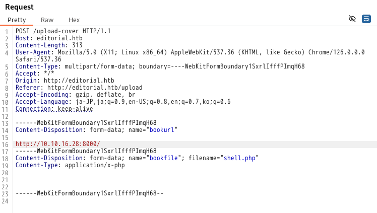

結果、pythonによるリクエストを得ることができ、SSRFの脆弱性があることがわかった

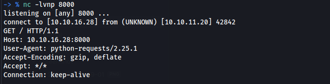
# User

SSRFが見つかった場合とりあえず内部でポートが開いている場合があるため調べてみる。
1000から順番にポート番号を変更していると
5000番ポートとそれ以外のポートとでレスポンスが違うことが分かった
5000番ポート以外だと以下のように画像ファイルのURLが返ってきている

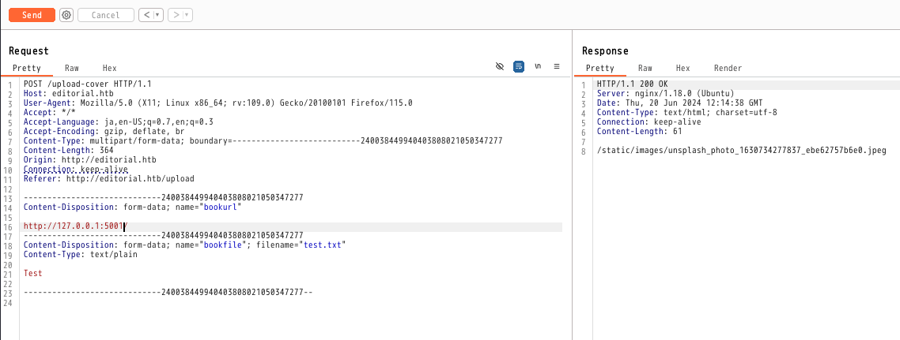

5000番ポートだと画像ファイルではなかった

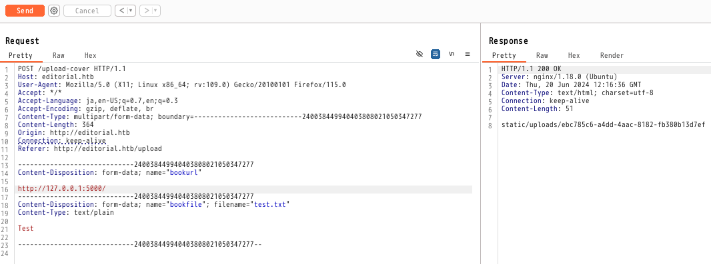

Burpにリクエストが拾われていたので見てみるとapiのレスポンスが返ってきていることが分かった。


レスポンスの内容を見てみる

```json
{"messages":[{"promotions":{"description":"Retrieve a list of all the promotions in our library.","endpoint":"/api/latest/metadata/messages/promos","methods":"GET"}},{"coupons":{"description":"Retrieve the list of coupons to use in our library.","endpoint":"/api/latest/metadata/messages/coupons","methods":"GET"}},{"new_authors":{"description":"Retrieve the welcome message sended to our new authors.","endpoint":"/api/latest/metadata/messages/authors","methods":"GET"}},{"platform_use":{"description":"Retrieve examples of how to use the platform.","endpoint":"/api/latest/metadata/messages/how_to_use_platform","methods":"GET"}}],"version":[{"changelog":{"description":"Retrieve a list of all the versions and updates of the api.","endpoint":"/api/latest/metadata/changelog","methods":"GET"}},{"latest":{"description":"Retrieve the last version of api.","endpoint":"/api/latest/metadata","methods":"GET"}}]}
```

URLの一部があるので同じ方法で以下のリクエストを送信してみる

```
http://127.0.0.1:5000/api/latest/metadata/messages/promos
http://127.0.0.1:5000/api/latest/metadata/messages/coupons
http://127.0.0.1:5000/api/latest/metadata/messages/authors
http://127.0.0.1:5000/api/latest/metadata/messages/how_to_use_platform
http://127.0.0.1:5000/api/latest/metadata/changelog
http://127.0.0.1:5000/api/latest/metadata
```

それぞれ送信していると`http://127.0.0.1:5000/api/latest/metadata/messages/authors`のリクエストでは以下のレスポンスが返ってきた

```
{"template_mail_message":"Welcome to the team! We are thrilled to have you on board and can't wait to see the incredible content you'll bring to the table.\n\nYour login credentials for our internal forum and authors site are:\nUsername: dev\nPassword: dev080217_devAPI!@\nPlease be sure to change your password as soon as possible for security purposes.\n\nDon't hesitate to reach out if you have any questions or ideas - we're always here to support you.\n\nBest regards, Editorial Tiempo Arriba Team."}
```

以下の認証情報を発見した

```
dev:dev080217_devAPI!@
```

この情報を使用してsshで接続してみる

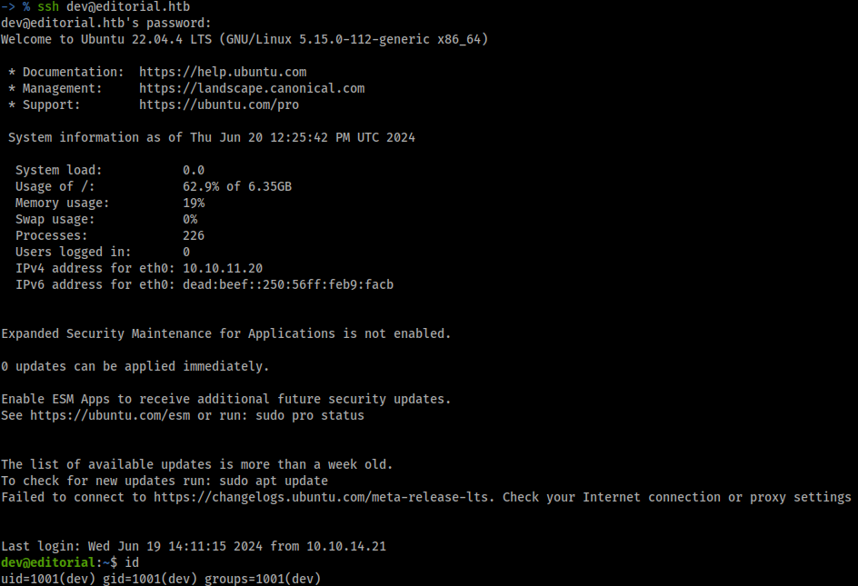

userフラグゲット

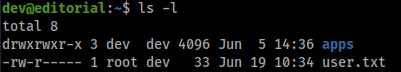
# Privilege Escalation

/homeフォルダを見てみるとprodユーザが存在することが分かった

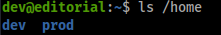

rootになる前にprodに横移動する必要がありそう
## Linpeas

いつもの用にlinpeasをダウンロードして実行する

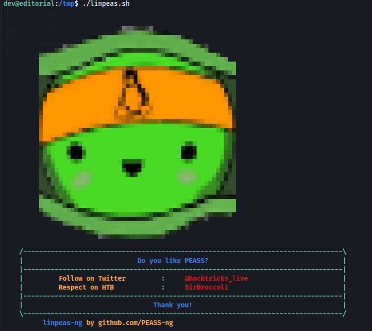

ホームディレクトリ内のappsフォルダに.gitフォルダがあった

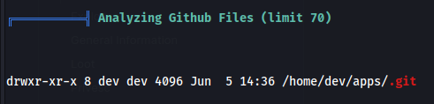
## prod

commitした履歴をみつけた

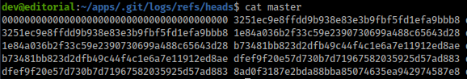

commit履歴を調べているとユーザーprodのパスワードを見つけた

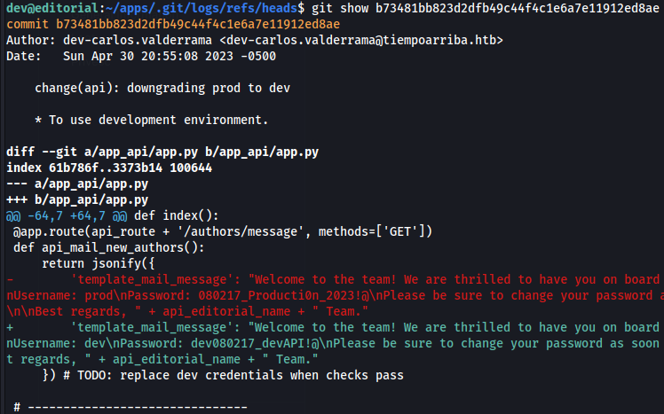

```
prod:080217_Producti0n_2023!@
```

発見した認証情報を使用してssh接続を試みる

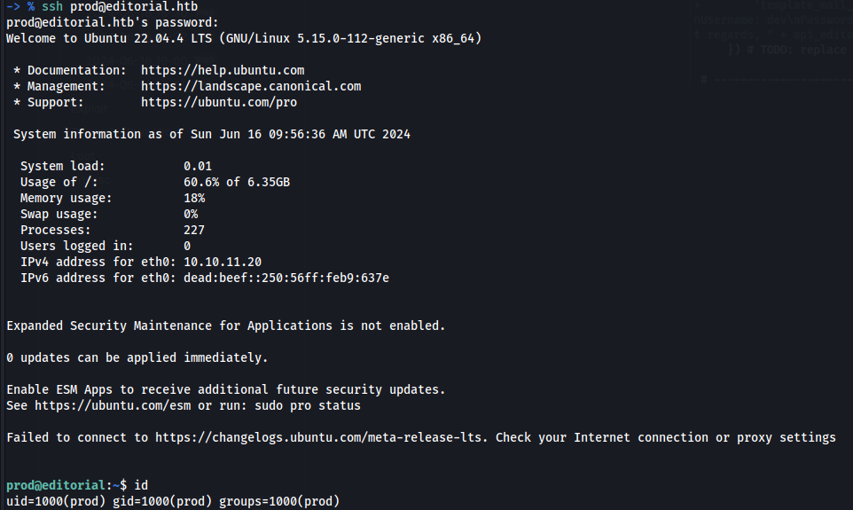

接続に成功

続いてroot権限に昇格する
## root

rootとして実行できるコマンドがあるか調べる

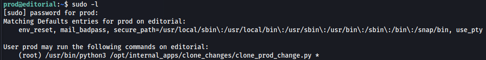

`/usr/bin/python3 /opt/internal_apps/clone_changes/clone_prod_change.py *`がroot権限で実行できることが分かった
## CVE-2022-24439

/opt/internal_apps/clone_changes/clone_prod_change.pyのソースコードを見てみる

```python
#!/usr/bin/python3

import os
import sys
from git import Repo

os.chdir('/opt/internal_apps/clone_changes')

url_to_clone = sys.argv[1]

r = Repo.init('', bare=True)
r.clone_from(url_to_clone, 'new_changes', multi_options=["-c protocol.ext.allow=always"])
```

このソースコードは現在の作業ディレクトリを `/opt/internal_apps/clone_changes` に変更し、名前なしのベアリポジトリを初期化する。その後、指定された URL (`url_to_clone`) からリモートリポジトリを `new_changes` というディレクトリにクローンする。クローンの際、`protocol.ext.allow=always` オプションを使用することでSSHなどを使用してリモートリポジトリに接続できるようになる。

このソースコードで使用しているRepoモジュールの脆弱性について調べてみると以下の記事をみつけた<br>[Remote Code Execution (RCE) Affecting gitpython package, versions 0,3.1.30](https://security.snyk.io/vuln/SNYK-PYTHON-GITPYTHON-3113858)

記事によるとclone_fromの第一引数に悪意のあるペイロードを挿入することでRCEを発火できるらしい。記事にあるペイロード/tmpにpwnというファイルを作成するペイロードをそのまま試してみる。

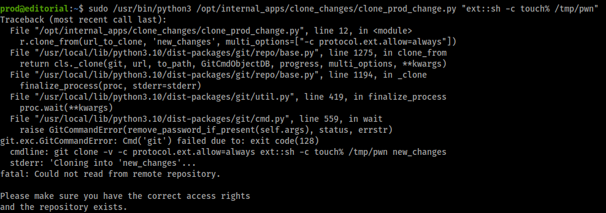

/tmpを見てみるとpwnというファイルが作られていた

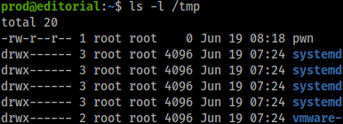

rootとして任意のコマンドを実行できることが分かったので/bin/bashにsuidを付与する

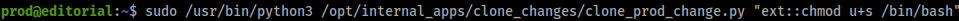

うまく付与できたか確認する

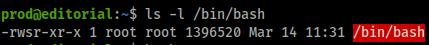

suidがしっかり付与されているので`bash -p`でbashを起動する

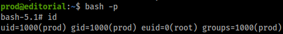

rootになれた

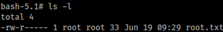

rootフラグゲット

攻略完了