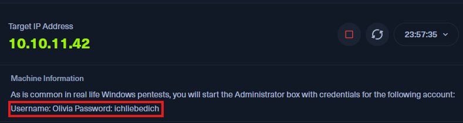
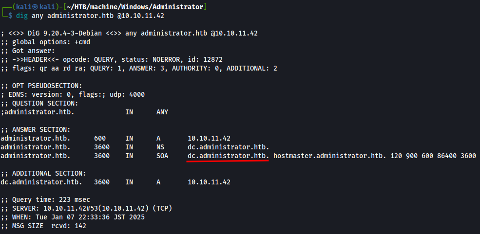
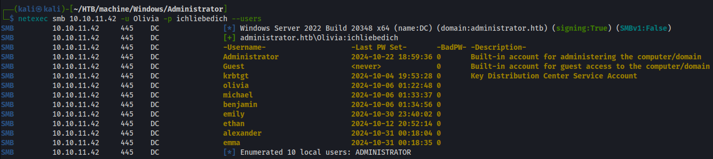
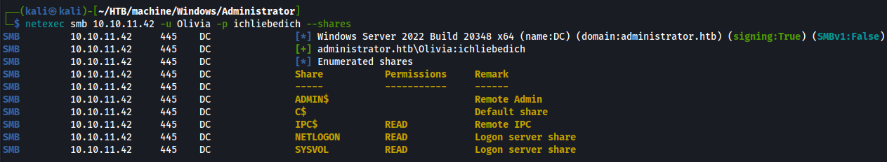
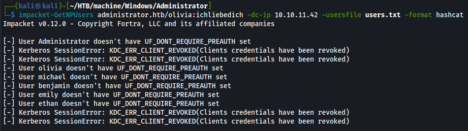
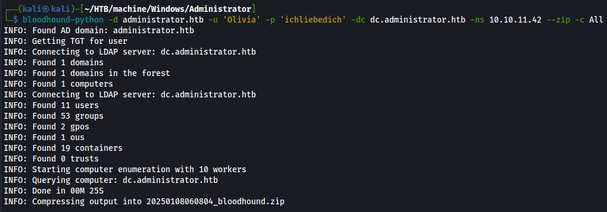

# HTB Administrator Writeup


事前に認証情報が提供されているタイプのマシンでした。



```
Olivia:ichliebedich
```

この認証情報を使って列挙をしていきます。

# Enumeration

## Nmap

```bash
┌──(kali㉿kali)-[~/HTB/machine/Windows/Administrator]
└─$ nmap -sV -sC -p- --min-rate 10000 10.10.11.42 -oN Nmap.scan
Starting Nmap 7.94SVN ( https://nmap.org ) at 2025-01-07 22:19 JST
# Nmap 7.94SVN scan initiated Mon Jan  6 19:54:53 2025 as: /usr/lib/nmap/nmap --privileged -sV -sC -p- --min-rate 10000 -oN Nmap.scan 10.10.11.42
Warning: 10.10.11.42 giving up on port because retransmission cap hit (10).
Nmap scan report for administrator.htb (10.10.11.42)
Host is up (0.16s latency).
Not shown: 65469 closed tcp ports (reset), 40 filtered tcp ports (no-response)
PORT      STATE SERVICE       VERSION
21/tcp    open  ftp           Microsoft ftpd
| ftp-syst: 
|_  SYST: Windows_NT
53/tcp    open  domain        Simple DNS Plus
88/tcp    open  kerberos-sec  Microsoft Windows Kerberos (server time: 2025-01-06 17:39:57Z)
135/tcp   open  msrpc         Microsoft Windows RPC
139/tcp   open  netbios-ssn   Microsoft Windows netbios-ssn
389/tcp   open  ldap          Microsoft Windows Active Directory LDAP (Domain: administrator.htb0., Site: Default-First-Site-Name)
445/tcp   open  microsoft-ds?
464/tcp   open  kpasswd5?
593/tcp   open  ncacn_http    Microsoft Windows RPC over HTTP 1.0
636/tcp   open  tcpwrapped
3268/tcp  open  ldap          Microsoft Windows Active Directory LDAP (Domain: administrator.htb0., Site: Default-First-Site-Name)
3269/tcp  open  tcpwrapped
5985/tcp  open  http          Microsoft HTTPAPI httpd 2.0 (SSDP/UPnP)
|_http-title: Not Found
|_http-server-header: Microsoft-HTTPAPI/2.0
9389/tcp  open  mc-nmf        .NET Message Framing
47001/tcp open  http          Microsoft HTTPAPI httpd 2.0 (SSDP/UPnP)
|_http-server-header: Microsoft-HTTPAPI/2.0
|_http-title: Not Found
49664/tcp open  msrpc         Microsoft Windows RPC
49665/tcp open  msrpc         Microsoft Windows RPC
49666/tcp open  msrpc         Microsoft Windows RPC
49667/tcp open  msrpc         Microsoft Windows RPC
49668/tcp open  msrpc         Microsoft Windows RPC
52889/tcp open  ncacn_http    Microsoft Windows RPC over HTTP 1.0
52891/tcp open  msrpc         Microsoft Windows RPC
52895/tcp open  msrpc         Microsoft Windows RPC
52917/tcp open  msrpc         Microsoft Windows RPC
52949/tcp open  msrpc         Microsoft Windows RPC
60585/tcp open  msrpc         Microsoft Windows RPC
Service Info: Host: DC; OS: Windows; CPE: cpe:/o:microsoft:windows

Host script results:
| smb2-security-mode: 
|   3:1:1: 
|_    Message signing enabled and required
| smb2-time: 
|   date: 2025-01-06T17:40:55
|_  start_date: N/A
|_clock-skew: 6h44m39s

Service detection performed. Please report any incorrect results at https://nmap.org/submit/ .
# Nmap done at Mon Jan  6 19:56:28 2025 -- 1 IP address (1 host up) scanned in 95.23 seconds
```

スキャン結果からwebサーバーが動いていないActive Directoryのドメインコントローラーであることが分かります。

ドメインを見つけたのでhostsファイルに追加します。

```
10.10.11.42	administrator.htb
```

## DNS

digでDNSの情報を取得します。



`dc.administrator.htb` をみつけたのでhostsファイルに追加します。

## SMB

事前に与えられている認証情報を使用してドメインユーザーの列挙を行います。



以下のようにuser.txtとして保存します。

```
Administrator
Guest
krbtgt
olivia
michael
benjamin
emily
ethan
alexander
emma
```

共有フォルダの列挙を行いました。



読み込み権限があります。smbclientで調べてみましたが、特に怪しいものは見つかりませんでした。

## AS-REPRoasting攻撃

ユーザーリストができたのでAS-REPRoasting攻撃で事前認証が無効化されているユーザーがいないか調べます。



今回は見つかりませんでしたが、事前認証が無効化されているとそのユーザのパスワードハッシュを取得することができます。

## Bloodhound

bloodhoundでユーザが持っている権限について調べます。




